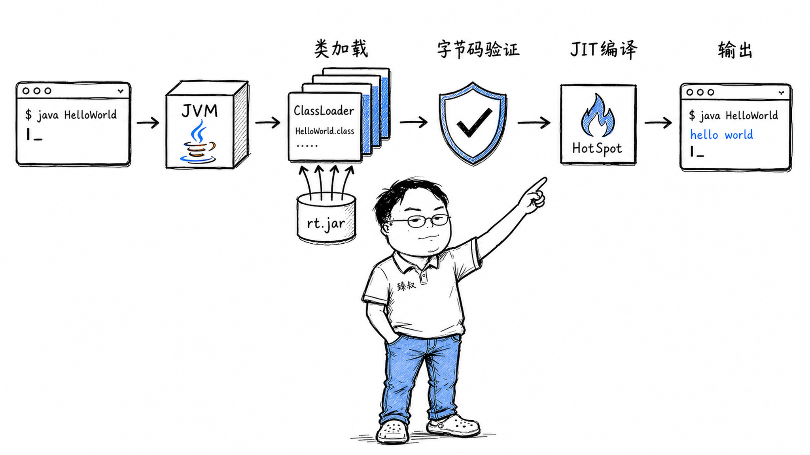

# `java HelloWorld`到屏幕打印出来——JVM到底做了什么？



你写了三行Java：

```java
public class HelloWorld {
    public static void main(String[] args) {
        System.out.println("hello world");
    }
}
```

敲下`java HelloWorld`，屏幕上出现了"hello world"。熟悉吗？太熟悉了，熟悉到你从来没想过这背后发生了什么。

但如果有人问你：JVM从收到这行命令到打印出字，中间具体做了什么？类从哪加载的？字节码什么时候变成机器码的？`System.out`这个字段是谁初始化的？

更重要的是——同样是"运行一个程序"，为什么Java需要JVM，而Go直接编译成二进制就能跑？这层"虚拟机"的抽象，到底解决了什么问题，又引入了什么代价？

## 核心结论

`java HelloWorld`背后是一条**六步链路**，每一步都在做一件具体的事：

第一步，**操作系统创建进程**——shell调用fork+execve，把JVM启动器加载到内存。
第二步，**JVM初始化运行时**——解析参数、加载核心库、向OS申请堆内存。
第三步，**类加载**——Bootstrap ClassLoader从rt.jar加载核心类，Application ClassLoader加载你的HelloWorld。
第四步，**字节码验证**——检查格式合法性、跳转目标有效性、操作数栈类型一致性。
第五步，**执行main()**——先解释执行，热点代码触发JIT编译成本地机器码。
第六步，**println到屏幕**——经过PrintStream→FileOutputStream→write()系统调用→终端驱动→屏幕渲染。

JVM和Go的本质区别在于**抽象层的位置**：Go在编译时就把所有跨平台差异处理完了，运行时是纯粹的本地机器码；JVM把跨平台差异推迟到运行时，用一层"虚拟机"在操作系统和你的代码之间做翻译。

## 深度拆解

### 第一步：操作系统创建进程

当你敲下`java HelloWorld`，shell（bash/zsh）先调用`fork()`创建一个子进程，然后`execve()`将子进程的地址空间替换为`/usr/bin/java`这个可执行文件。

此时操作系统加载的不是你的HelloWorld程序，而是**JVM的启动器**——一个用C++写的程序，负责把JVM的核心动态库（`libjvm.so`或`jvm.dll`）加载进来并初始化。

你的HelloWorld.class文件此刻还躺在硬盘上，JVM还不知道它的存在。

### 第二步：JVM初始化运行时

java启动器做三件事：

**解析命令行参数**——`-classpath`告诉JVM去哪里找你的类文件，`-Xmx512m`设置最大堆内存，`-Xms256m`设置初始堆内存，最后的`HelloWorld`是要执行的主类名。

**定位并加载JVM核心库**——在`JAVA_HOME/lib`目录下找到`libjvm.so`（HotSpot JVM的核心），通过`dlopen()`加载到进程地址空间。

**向操作系统申请堆内存**——根据`-Xms`参数，调用`mmap()`或`malloc()`向OS申请一大块内存作为Java堆。这块内存的回收由JVM的GC管理，不由OS管理。

### 第三步：类加载——不是一次性全加载

这是JVM最精妙的设计之一。类加载是**懒加载**的——用到谁才加载谁，不是你指定的所有类一次性全部加载。

加载过程是**双亲委派模型**：

**Bootstrap ClassLoader**（C++实现，JVM内置）先加载核心类：`java.lang.Object`、`java.lang.String`、`java.lang.System`。这些类是JVM运行的基础，必须最先加载。

**Extension ClassLoader**加载扩展库（`java.ext.dirs`目录下的jar包）。

**Application ClassLoader**加载你的classpath下的类——包括你的`HelloWorld.class`。

双亲委派的核心规则：收到类加载请求时，先委托给父加载器。父加载器加载不了，自己才加载。这保证了`java.lang.String`永远由Bootstrap加载，不会被你在classpath上放一个同名的假String类替换掉——**安全性从类加载层就开始保障**。

### 第四步：字节码验证——JVM的"安检"

类加载进来不是直接就用。JVM先做**字节码验证（Bytecode Verifier）**：

- 检查文件格式——magic number是否为`0xCAFEBABE`，版本号是否兼容
- 检查跳转指令——所有分支目标必须在方法体内，不能跳到别的方法的代码
- 检查操作数栈——不能在空栈上pop，不能把int当对象引用用
- 检查类型一致性——方法的参数类型和返回类型必须匹配

验证通过后进入**准备阶段**：为静态变量分配内存并赋零值。注意是零值，不是你写的初始值——`static int x = 42`在此阶段x被设为0，42是在后面的"初始化"阶段才赋的。

### 第五步：执行main()——从解释到编译

JVM调用`HelloWorld.main(String[])`。

HotSpot JVM默认是**混合模式**：先**解释执行**字节码，同时收集"热点"信息。

为什么要先解释？因为JIT编译本身有成本——编译一段代码需要时间，如果这段代码只执行一次，编译的开销比解释执行还大。所以JVM的策略是：**先解释着跑，观察哪些代码被频繁执行**（默认调用次数超过C1编译器的阈值，约10000次），再触发JIT编译。

JIT编译器把热点代码的字节码编译成**本地机器码**——x86的mov、add、jmp。编译后的机器码缓存在CodeCache中，下次执行同一段代码时直接跑机器码，不用再解释。

这就是为什么**Java越跑越快**——刚启动时全是解释执行，慢；跑一段时间后热点代码都被JIT编译了，速度逼近C/C++。

这也是为什么Java服务通常需要**预热**——刚启动时压测性能很差，跑几分钟让JIT编译完成后性能才上来。如果你做基准测试，不预热就测，结果完全不可信。

### 第六步：println到屏幕的旅程

`System.out`是一个`PrintStream`对象。但它是谁初始化的？答案是：JVM在初始化`java.lang.System`类时，在静态初始化块中创建了`System.out`、`System.err`和`System.in`三个标准流。

`println("hello world")`的调用链：

最终触发了`write()`系统调用——把字符串写入**fd=1（标准输出）**。操作系统内核收到`write(1, ...)`，找到fd=1对应的终端设备，终端驱动把字符渲染到你的屏幕上。

从`System.out.println`到屏幕显示，穿越了Java API层→JNI层→C标准库层→内核系统调用层→终端驱动层。一句"hello world"的旅程，比你想象的长得多。

### JVM vs Go：抽象层的位置之争

理解了JVM的六步链路，再来看Go的`go run hello.go`，差异就很清楚了：

**Go在编译时做了JVM在运行时做的事。** Go编译器把源代码直接编译成目标平台的本地机器码（ELF格式），运行时不需要虚拟机，不需要类加载，不需要JIT。

| 维度 | Java (JVM) | Go (静态编译) |
|------|-----------|--------------|
| 编译产物 | 字节码（.class） | 本地机器码（ELF） |
| 运行时依赖 | 需要JVM | 不需要 |
| 启动速度 | 慢（类加载+预热） | 快（直接执行） |
| 跨平台 | 字节码跨平台 | 需要交叉编译 |
| 运行时优化 | JIT持续优化 | 编译时优化（不能动态调整） |
| 内存管理 | GC（分代+并发） | GC（并发三色标记） |

JVM的抽象让你"一次编译到处运行"——同一个.class文件可以在Linux、Windows、macOS上跑。代价是启动慢、内存占用大、需要预热。

Go的静态编译让你启动快、部署简单（一个二进制文件搞定）。代价是跨平台需要交叉编译，运行时不能根据实际负载动态优化代码。

**没有对错，只有trade-off。** 需要跨平台部署、长时间运行的服务，JVM的JIT优化在长期运行中收益越大。需要快速启动、低内存占用的场景（CLI工具、Serverless函数），Go的静态编译更合适。

## 实战要点

### 工程落地

1. **诊断启动慢看GC日志和类加载日志**。`-verbose:class`打印类加载顺序，`-Xlog:gc*`打印GC日志。如果启动加载了上万个类，考虑用CDS（Class Data Sharing）或AppCDS预归档常用类。

2. **JIT编译日志用`-XX:+PrintCompilation`**。能看到哪些方法被编译了、编译用了多长时间。如果关键方法一直没被编译，可能是因为调用次数没达到阈值——可以调低`-XX:CompileThreshold`。

3. **GraalVM原生镜像**。如果启动速度是硬需求（如Serverless），可以用GraalVM的`native-image`工具把Java应用AOT编译成原生二进制——启动时间从秒级降到毫秒级。代价是失去JIT的运行时优化能力，且编译时需要做封闭世界分析。

### 臻叔踩坑笔记

1. **类路径冲突导致ClassNotFoundException**：两个jar包里有同一个类的不同版本，JVM加载了错误的那个。触发条件是依赖树里有传递依赖冲突。规避方法：用`mvn dependency:tree`或`gradle dependencies`排查冲突，用`<exclusions>`排除冲突依赖。

2. **JIT编译导致性能抖动**：方法刚被JIT编译时有一个短暂的停顿（编译发生在安全点）。触发条件是高QPS服务在大流量下突然出现毛刺。规避方法：用`-XX:+CompileThreshold`降低阈值让编译提前发生（在低峰期），或用JFR（Java Flight Recorder）分析编译停顿。

3. **预热不足导致压测结果失真**：刚启动就压测，JIT还没编译热点代码，QPS只有稳定后的30%。触发条件是基准测试前不做预热。规避方法：压测前先跑几分钟低流量预热，用`-XX:+PrintCompilation`确认热点方法已编译后再开始正式压测。

4. **System.out.println在高并发下成为瓶颈**：`System.out`是同步的（内部有synchronized锁），高并发下大量println会导致线程阻塞。触发条件是用`System.out.println`做日志输出且并发量高。规避方法：生产环境用异步日志框架（Log4j2 Async Logger、Logback AsyncAppender），不要直接用`System.out`。

5. **双亲委派被打破导致安全风险**：自定义ClassLoader不委派给父加载器，导致核心类被替换。触发条件是写了自定义ClassLoader且重写了loadClass方法但没有调用super.loadClass。规避方法：重写`findClass`而不是`loadClass`，让双亲委派机制自动工作。

### 一句话总结

> JVM的存在证明了计算机科学里一条铁律：加一层抽象解决一个问题，但引入一个新问题。字节码让你"一次编译到处运行"，代价是启动慢和预热开销。这层抽象的价值取决于你的场景——没有最好的方案，只有最合适的trade-off。
