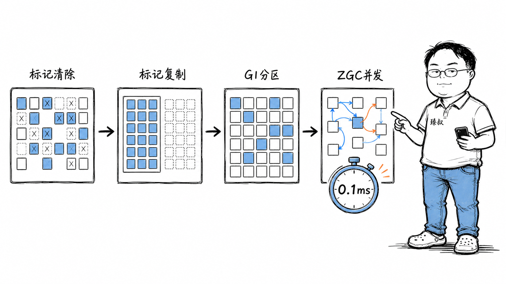

# JVM的GC——它怎么知道一块内存可以回收了？

你写`String s = new String("hello"); s = null;`——你声明了不再需要这块内存。

但这不是GC回收它的方式。GC不看你有没有把引用设成null——它靠的是**"从GC Roots可达的对象活，不可达的回收"**。

问题是：怎么高效判断"可达"？怎么在回收时不让程序停顿？G1和ZGC为什么能把暂停时间从秒级降到亚毫秒级？

更实际的问题：你的Java服务每Full GC一次就停顿2秒，用户超时告警。你调了`-Xmx`，调了新生代比例，都不管用。你不理解GC的内部机制，就只能在StackOverflow上瞎试参数。

## 核心结论

GC的核心是一个**图遍历问题**——从GC Roots出发，遍历对象引用图。能遍历到的对象是"活的"，遍历不到的是"垃圾"。

四代GC算法的演进，本质上是在解决**两个矛盾的优化目标**：回收得快（吞吐量高）和暂停时间短（延迟低）。

**标记-清除**：标记垃圾然后直接清除。快但有内存碎片。
**标记-复制**：把活对象搬到另一半空间，旧空间一次性清空。无碎片但浪费50%内存。
**G1**：把堆分成Region，每次只回收垃圾最多的Region。可设定暂停时间目标。
**ZGC**：着色指针+读屏障，标记和回收与应用程序并行运行。暂停时间亚毫秒级。

## 深度拆解

### GC Roots：遍历的起点

GC从哪些对象开始遍历？**GC Roots**——不是所有对象都是Roots，只有以下几类：

- **栈上的局部变量**——当前正在执行的方法中引用的对象
- **静态变量**——类的static字段引用的对象
- **JNI引用**——通过JNI传递给本地代码的对象
- **活跃线程**——Thread对象本身
- **同步锁持有的对象**——synchronized锁住的对象

从GC Roots出发，沿着引用链遍历。遍历到的对象标记为"活"，遍历不到的标记为"垃圾"。

### 标记-清除：最基础但有问题

**标记阶段**：从GC Roots遍历对象图，标记所有可达对象。
**清除阶段**：遍历整个堆，回收未被标记的对象。

问题：清除后内存空间不连续——大量小碎片。分配大对象时找不到连续空间，即使总空闲内存足够。

### 标记-复制：解决碎片

内存分两块——活跃空间和空白空间。GC时把所有活对象搬到空白空间，旧空间一次性清空。

搬完后所有活对象连续排列，没有碎片。但代价是**浪费50%内存**——任何时候只有一半空间可用。

**这就是JVM新生代用复制算法的原因**——新生代大部分对象朝生夕灭（98%以上是垃圾），GC时只需复制少量存活对象，复制成本很低。而且不需要50%的空间——HotSpot的新生代分Eden + 2个Survivor（S0/S1），比例为8:1:1，浪费只有10%。

### 分代假设：GC的基石

**分代假设**是几乎所有现代GC的基础：

- **弱代假设**：绝大多数对象活很短时间就变成垃圾（临时变量、中间结果）
- **强代假设**：熬过多次GC的对象倾向于活很久（配置对象、缓存、连接池）

基于这个假设，JVM把堆分为**新生代（Young Generation）**和**老年代（Old Generation）**：

- 新生代用复制算法——大部分是垃圾，复制少量存活对象很快
- 老年代用标记-清除或标记-整理——存活率高，复制成本大

对象先在新生代分配。熬过一次Minor GC进入Survivor区。熬过多次Minor GC（默认15次）晋升到老年代。

**但分代假设不是永远成立。** 如果你的程序产生大量长生命周期的大对象（如大缓存），它们会在新生代放不下直接进入老年代，导致老年代膨胀，Full GC频繁。

### G1：可预测的暂停时间

G1（Garbage First）把堆划分为相同大小的**Region**（1-32MB）。每个Region可以是Eden、Survivor、Old或Humongous（大对象区）。

G1维护每个Region的"垃圾量"统计。GC时**优先回收垃圾最多的Region**（Garbage First）——用最少的工作回收最多的空间。

G1的核心卖点是**可设定的暂停时间目标**：`-XX:MaxGCPauseMillis=200`。G1在目标时间内做尽可能多的回收工作，做不完的留到下次。这不是"保证200ms以内"——而是"尽力而为"。

### ZGC：亚毫秒级暂停

ZGC的核心创新是**着色指针（Colored Pointers）**和**读屏障（Read Barrier）**。

**着色指针**：在64位指针中借出几位作为元数据标志位（Marked0、Marked1、Remapped）。指针本身携带了对象的GC状态信息。

**读屏障**：每次通过引用读取对象时，JVM检查指针的标志位。如果发现对象正在被移动（指针颜色不匹配），读屏障**就地修复指针**——指向新地址。

这意味着ZGC可以在应用程序运行的同时移动对象——不需要暂停应用线程来搬移内存。标记、转移、重定位都是并发的。

代价是：读屏障在每次对象引用读取时都有微小开销（约1-4%性能损失），且需要更多的内存（着色指针占用了地址空间）。

### Go的GC对比

Go的GC是**并发三色标记+写屏障**，没有分代。它追求低暂停但放弃了分代假设——所有对象平等对待。

Go GC的暂停时间通常在1ms以内，但吞吐量不如Java的G1（因为不分代，每次GC要扫描全堆）。Go选择了"简单+低延迟"而非"高吞吐"。

如果给Go设计更高效的GC，可以从ZGC借鉴：着色指针减少写屏障开销、分代减少扫描范围。但Go的哲学是简单——增加复杂度需要非常充分的理由。

## 实战要点

### 工程落地

1. **选择GC算法看场景**。JDK 8默认Parallel GC（高吞吐，暂停长）；JDK 9+默认G1（平衡吞吐和延迟）；低延迟场景（交易系统）用ZGC（JDK 15+生产可用）。

2. **GC日志是诊断的金矿**。`-Xlog:gc*:file=gc.log`开启详细GC日志。用GCEasy（gceasy.io）或GCViewer分析——看吞吐量、平均暂停、最大暂停、Full GC频率。

3. **避免Full GC的三条原则**：不要创建过多大对象（直接进老年代）；Survivor区不要太小（对象过早晋升）；老年代留足够余量（别让老年代满了才GC）。

### 臻叔踩坑笔记

1. **System.gc()不是建议而是命令**：某些JVM实现中`System.gc()`会触发Full GC。触发条件是代码中显式调用了`System.gc()`或第三方库调用了。规避方法：`-XX:+DisableExplicitGC`禁用显式GC调用。

2. **大对象直接进老年代导致Full GC频繁**：大于`-XX:PretenureSizeThreshold`的对象直接在老年代分配。如果频繁创建大数组（如大缓存），老年代很快满。触发条件是大量大对象分配。规避方法：调大PretenureSizeThreshold让中等对象进新生代，或用堆外内存。

3. **元空间溢出**：Java 8+用Metaspace替代永久代，存储类元数据。动态生成大量类（如CGLIB代理、Groovy脚本）会导致Metaspace满。触发条件是框架大量使用动态代理。规避方法：`-XX:MaxMetaspaceSize=256m`设置上限，监控类加载数量。

4. **ZGC的内存开销**：ZGC的着色指针需要额外的地址空间，实际内存开销比G1大约10-15%。触发条件是内存紧张的系统上用ZGC。规避方法：评估内存余量是否够用，不够则用G1。

5. **G1的Humongous对象导致混合GC效率低**：大于Region一半大小的对象被分配为Humongous对象，占用整个Region。大量Humongous对象导致Region碎片化。触发条件是频繁分配大字节数组。规避方法：调大Region大小（`-XX:G1HeapRegionSize`），或减少大对象分配。

### 一句话总结

> GC的历史是从"垃圾回收"到"垃圾管理"的演进。早期在意"能收回多少"，当代在意的是"用户够流畅吗"。从追求极致回收率到保证应用体验——这个转换在几乎所有分布式系统设计中反复出现：最终一致vs强一致、允许丢帧的视频vs精确的数据库事务——都是"结果的质量"vs"用户的体验"之间的取舍。
