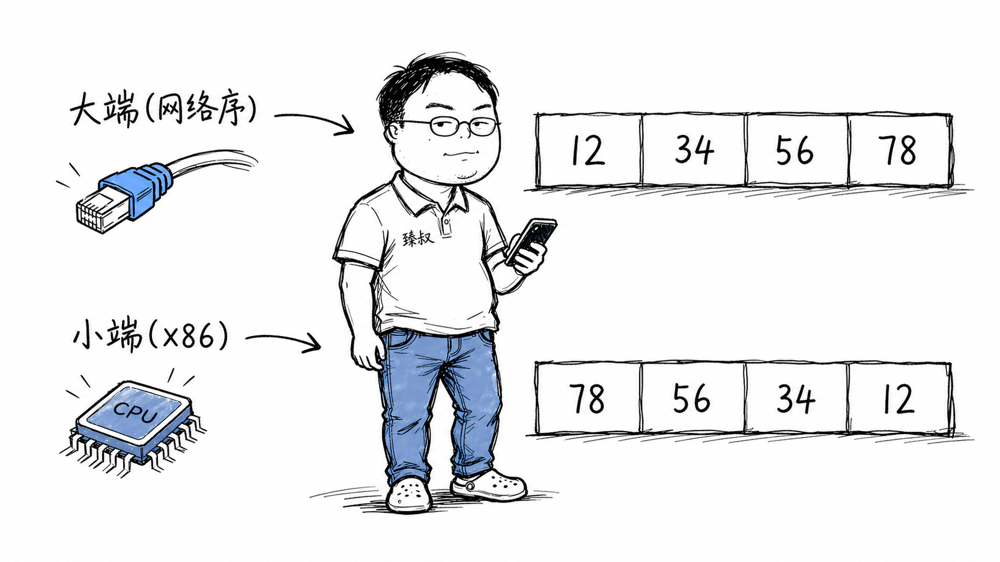

# 大小端序：字节序存储差异与网络字节序统一标准



---

> 📌 **关注「程序员臻叔」，获取更多硬核技术干货**


---

"大端"和"小端"——每个程序员都听过，但绝大多数时候不需要关心。Java/Python/Go的运行时自动处理了端序，你写`int x = 0x12345678`，怎么存的你不用管。

但一旦你开始写网络协议的序列化代码、读二进制文件、或跟C结构体的内存布局打交道——**端序突然蹦出来咬你一口**。

数据从一台小端机器发到一台大端机器，如果没做端序转换，`0x12345678`就变成了`0x78563412`。排查这种bug极度痛苦——数据看起来"有值"但完全不对。

## 核心结论

端序（Endianness）是指**多字节数据在内存中的字节排列顺序**：

**大端（Big Endian）**：最高有效字节在最低地址。和人类阅读顺序一致——`0x12345678`在内存中是`12 34 56 78`。网络协议用大端（称为"网络字节序"）。

**小端（Little Endian）**：最低有效字节在最低地址。`0x12345678`在内存中是`78 56 34 12`。x86/x86-64是小端。

为什么只在特定场景烦你？因为大多数时候你活在**端序透明的抽象层**——编译器/虚拟机/解释器帮你处理了。一旦跨过序列化边界进入"原始字节"的领地，你就必须自己处理端序。

## 深度拆解

### 什么是端序？

一个32位整数`0x12345678`占4个字节。在内存中的排列方式取决于CPU的端序：

**大端（高位在前）**：
```
地址:  0x00    0x01    0x02    0x03
内容:   12      34      56      78
```

你从左到右读就是"12 34 56 78"——和写`0x12345678`的顺序完全一致。人类友好。

**小端（低位在前）**：
```
地址:  0x00    0x01    0x02    0x03
内容:   78      56      34      12
```

看起来"反了"——但CPU选择小端有实际理由：

- **低字节在低地址，取低8位直接读第一个字节**，不需要偏移
- **类型转换零成本**：`int`转`short`直接截断高字节，地址不变
- **算术运算从低位到高位**，小端布局让进位传播方向和地址增长方向一致

### 网络字节序为什么是大端？

TCP/IP协议族诞生于1960-70年代的ARPANET。当时很多大型机（IBM 360系列）是大端的。网络协议的设计者选择大端作为"网络字节序"，原因是：

1. **大端对人工分析协议头部友好**——Wireshark里读十六进制dump，大端数据和协议文档中的字段顺序一致
2. **历史遗产**——几十年的RFC标准都以大端定义头部格式，改不动了

所以你在代码中处理网络协议时，必须用`htonl()`（host to network long）和`ntohl()`（network to host long）做转换。在小端机器上这两个函数做字节翻转，在大端机器上是空操作。

### 什么时候端序会咬你？

**场景1：网络协议序列化。** 你定义了一个协议头部：

```c
struct Header {
    uint32_t magic;     // 0x12345678
    uint16_t version;   // 0x0102
    uint16_t length;    // 0x0304
};
```

在x86小端机器上，直接`send(sock, &header, sizeof(header))`发出去——接收方如果也是小端，没问题。但如果接收方是大端（如某些ARM/PowerPC），数据全乱了。

正确做法：每个字段单独用`htonl/htons`转换后再发送。或者用Protocol Buffers/FlatBuffers等序列化框架——它们内部处理了端序。

**场景2：读取二进制文件。** PNG文件的头部前8字节是`89 50 4E 47 0D 0A 1A 0A`——这是固定的magic number，与端序无关（每个字节独立）。但PNG文件中的32位宽高字段是大端存储的。你在小端机器上`fread(&width, 4, 1, fp)`读到的是字节翻转的值。

**场景3：C结构体内存布局。** 不同端序的CPU上，结构体中bit field的排列顺序不同。这在驱动开发中是个常见坑——寄存器的bit定义在大端和小端CPU上映射到不同的bit位。

### 为什么不统一？

**已经统一了——在大多数应用层。** Java的字节码、JSON、XML、Protocol Buffers都明确定义了端序（或用文本格式绕过端序问题）。你写Web应用、微服务通信，端序几乎不会出现。

但在**底层协议和二进制格式**中，端序已经是标准的一部分——TCP头部、ELF文件格式、USB描述符都有固定的端序。改端序意味着打破几十年的兼容性。这已经无关技术，纯粹是**生态惯性**。

ARM架构有一个特殊能力——它可以**运行时切换端序**（Bi-endian）。但实际操作系统中很少用这个能力——因为所有库和驱动都假定了特定端序，切换会导致混乱。

## 实战要点

### 工程落地

1. **跨平台代码用`htonl/ntohl`处理网络数据**。永远不要假设"大家都是小端"。即使你现在只跑在x86上，将来可能移植到ARM服务器。

2. **序列化框架自动处理端序**。Protocol Buffers用varint编码（小端，变长），FlatBuffers支持选择端序。用框架而不是手动拼接字节。

3. **调试端序问题用十六进制dump**。`xxd`或`hexdump -C`查看原始字节。如果你期望`12 34 56 78`但看到`78 56 34 12`——端序搞反了。

### 臻叔踩坑笔记

1. **`htons`返回值直接当int用导致截断**：`htons`返回`uint16_t`，如果你赋值给`int`变量再`send`，在高字节可能有垃圾值。触发条件是类型转换不当。规避方法：用正确的类型，不要隐式转换。

2. **位域在不同编译器/端序下布局不同**：C的bit field在GCC和MSVC下的排列规则不同，且受端序影响。触发条件是跨平台共享包含位域的结构体。规避方法：不用位域，改用显式的位操作（`|`和`&`）。

3. **`union`类型双关导致端序依赖**：`union { uint32_t i; uint8_t b[4]; }`用来拆分int的字节——结果依赖端序。触发条件是用union做类型双关。规避方法：用显式的移位操作`((x >> 24) & 0xFF)`替代union，移位操作与端序无关。

4. **mmap映射文件后直接强转结构体指针**：`struct Header *h = mmap(...)`在小端机器上读大端文件——字段值全错。触发条件是文件端序与机器端序不一致。规避方法：逐字段用`ntohl`转换，或用支持端序声明的序列化格式。

5. **Java的`ByteBuffer`默认是大端**：`ByteBuffer.allocate(4).putInt(0x12345678)`得到的是大端字节序。如果你的C代码期望小端，会读到错误值。触发条件是Java和C之间的二进制通信。规避方法：`ByteBuffer.order(ByteOrder.LITTLE_ENDIAN)`明确指定端序。

### 一句话总结

> 端序问题的真正教训是理解你所处的抽象层。在Java/Python/Go里，你活在字节序透明的世界。一旦跨过序列化、协议栈或直接内存操作的边界，你就进入了"原始字节"的领地，每下一层，你就要为上一层视为"不须关心"的事负责。

---

### 🎯 觉得有帮助？关注「程序员臻叔」


---
