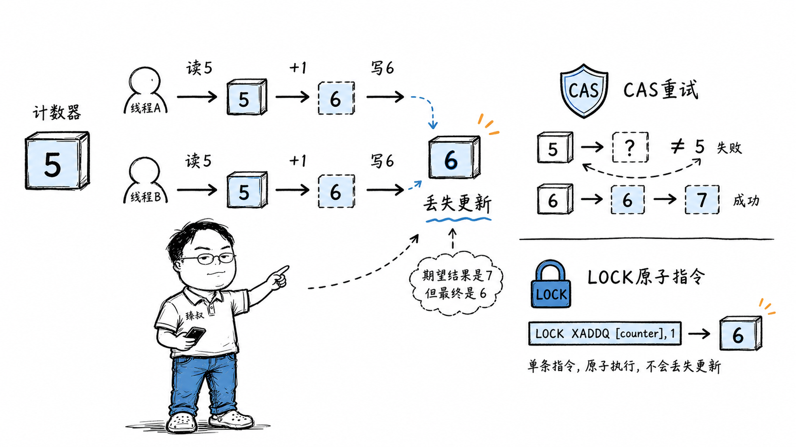

# 并发安全与CAS：无锁编程的原子操作原理与ABA问题



---

> 📌 **关注「程序员臻叔」，获取更多硬核技术干货**


---

Java里`counter++`不是原子操作——这个结论你知道。

但如果你被问到：Java字节码的`getfield` + `iadd` + `putfield`三条指令到底怎么导致了不安全？`AtomicInteger`的CAS又是怎么保证原子性的？Go的`sync/atomic`为什么比Java的CAS更高效？Python有GIL为什么还是不安全？

如果你只能回答"因为不是原子的"——你错过了真正重要的部分：**不同语言的并发模型，是不同的"共享内存安全契约"。**

## 核心结论

`counter++`不安全是因为它在底层是**三条独立指令**——读、算、写。线程A读了值还没写回时被切走，线程B也读了同一个旧值，两人各加1，结果只加了1。

三种解法走了三条完全不同的路：

**Java的AtomicInteger（CAS）**：在写回前检查"值还是我读到的那个吗"，不是就重试。需要循环，高竞争下重试开销大。
**Go的sync/atomic（LOCK指令）**：用CPU的`LOCK XADDQ`指令，一条指令完成读-改-写，不需要循环。更高效。
**Python的GIL**：同一时刻只执行一个线程的字节码——看似解决了竞争，但`counter += 1`跨多条字节码指令时仍可被抢断。

理解这些差异的核心在于**每种方案在哪个抽象层级接收硬件的原子性保证**。

## 深度拆解

### 问题的根源：三条指令的缝隙

`counter++`在Java字节码层面是四条指令：

```
getfield #counter    // 从堆读取counter当前值到操作数栈
iconst_1             // 常量1入栈
iadd                 // 两个栈顶值相加
putfield #counter    // 把结果写回堆
```

线程A执行了前三行后（读到5，算出6），`putfield`前被暂停。线程B在这期间也执行了完整的四条指令（读到5，算出6，写入6）。然后A恢复，把自己的6写入——覆盖了B刚写入的6。

**正确结果应该是7（两人各加1），但只加了1。** 这叫**Lost Update（丢失更新）**。

关键在于**读和写之间存在时间窗口**。在这个窗口内，如果有其他线程修改了同一个变量，你的写入就会覆盖它的修改。

CPU层面更底层——`getfield`被编译成`mov`（从内存读到寄存器），`iadd`变成`add`（寄存器内加法），`putfield`变成`mov`（寄存器写回内存）。三条CPU指令，load → add → store，中间任何一条之后都可能被中断。

### Java的解法：CAS（比较并交换）

`AtomicInteger.incrementAndGet()`的实现：

```java
public final int incrementAndGet() {
    int current, next;
    do {
        current = get();           // 读当前值
        next = current + 1;        // 算新值
    } while (!compareAndSet(current, next));  // CAS：如果值还是current就写入next，否则重试
    return next;
}
```

CAS的语义是："我认为这个变量现在的值是current。如果是对的，就把它改成next。如果不对（说明有人在我读取后修改了），就告诉我失败了，我重新来。"

底层是CPU的`cmpxchg`指令 + `LOCK`前缀：

```asm
lock cmpxchg [counter], new_value
```

`LOCK`前缀保证这条指令在执行期间锁定缓存行（或总线），其他CPU核心不能同时修改这个内存地址。`cmpxchg`比较内存值和期望值，相等则写入新值，不等则设置ZF标志位表示失败。

**CAS的优势是无锁**——线程不会阻塞睡眠，失败就重试。在低竞争场景下几乎没有开销。

**CAS的劣势是高竞争下的活锁**——100个线程同时CAS同一个变量，99个失败重试，CPU空转。这比加锁还慢。

### Go的解法：LOCK XADDQ

Go的`sync/atomic.AddInt64(&counter, 1)`被编译成单条汇编指令：

```asm
lock xaddq [counter], 1
```

`XADDQ`是"交换并加"——它把内存中的值加上操作数，同时返回加之前的旧值。整条指令被`LOCK`前缀保证原子性。

**Go不需要CAS循环**——一条指令完成读-改-写，不可能被中断。比Java的CAS少了一个"比较+重试"的循环。

这就是为什么Go的原子计数在高竞争场景下比Java的AtomicInteger更高效——没有重试开销。

### Python的GIL：一个虚假的安全感

Python有GIL（全局解释器锁）——同一时刻只有一个线程能执行Python字节码。很多人以为有了GIL就不用管线程安全了。

**但GIL只保护字节码级别的原子性，不保护多条字节码之间的间隔。**

`counter += 1`在Python字节码中是：

```
LOAD_FAST    counter    # 读counter到栈
LOAD_CONST   1          # 常量1入栈
INPLACE_ADD             # 栈顶相加
STORE_FAST   counter    # 结果写回counter
```

四条字节码。GIL可能在任何两条字节码之间释放——比如`LOAD_FAST`之后、`STORE_FAST`之前。如果此时另一个线程拿走GIL修改了counter，就会发生丢失更新。

**GIL的存在让Python多线程不能真正并行CPU任务，但并不自动保证线程安全。** 你仍然需要用`threading.Lock`或`asyncio.Lock`保护共享变量的修改。

### synchronized vs Atomic：什么时候用哪个？

`synchronized`是悲观锁——假设一定有竞争，直接加锁。线程获取锁失败时被挂起（进入内核态睡眠），唤醒时再调度。

`AtomicInteger`是乐观锁（CAS）——假设大多数时候没有竞争，先操作，写回时检查。失败就重试。

| 维度 | synchronized | AtomicInteger (CAS) |
|------|-------------|-------------------|
| 策略 | 悲观 | 乐观 |
| 低竞争 | 有锁开销（系统调用） | 几乎无开销 |
| 高竞争 | 线程排队等待，无空转 | 大量重试，CPU空转 |
| 适用场景 | 写多读少、竞争激烈 | 读多写少、竞争温和 |

**经验法则**：竞争温和用Atomic，竞争激烈用synchronized（或ReentrantLock）。但"温和"和"激烈"的界限需要压测确定——不要凭感觉。

## 实战要点

### 工程落地

1. **Java 8+的LongAdder比AtomicLong更适合高竞争计数**。LongAdder把一个值拆成多个Cell，不同线程操作不同Cell（减少竞争），读取时求和。在高并发计数场景（如统计QPS），LongAdder比AtomicLong快几倍到几十倍。

2. **Go中`atomic.Value`适合读多写少的配置热更新**。`atomic.Value.Store()`和`Load()`是无锁的，适合配置信息的热更新——读多写极少。比`sync.RWMutex`更轻量。

3. **分布式场景下CAS需要分布式锁**。单机的CAS只在本进程内有效。多台机器操作同一个数据库行时，需要用数据库的`SELECT ... FOR UPDATE`或Redis的`SETNX`实现分布式锁。

### 臻叔踩坑笔记

1. **CAS的ABA问题**：线程A读到值是A，线程B把A改成B再改回A。线程A的CAS检查"还是A吗"——是的，CAS成功。但中间的B变化被忽略了。触发条件是值从A→B→A的循环变化。规避方法：用`AtomicStampedReference`——每次修改附带一个版本号，CAS同时检查值和版本号。

2. **synchronized锁的不是代码块而是对象**：`synchronized(this)`锁的是当前对象实例。两个不同的实例各自有自己的锁，互不影响。触发条件是期望跨实例互斥但用了实例锁。规避方法：用`static synchronized`锁Class对象（全局锁），或用专门的锁对象。

3. **Go的atomic操作有对齐要求**：`atomic.AddInt64`要求被操作的int64地址是8字节对齐的。在32位平台上，结构体中的int64字段可能不是8字节对齐的——atomic操作会panic。触发条件是32位平台上对结构体字段做atomic操作。规避方法：用`atomic.Int64`类型（Go 1.19+），它保证对齐。

4. **Python的GIL让多线程CPU密集型任务比单线程更慢**：GIL导致同一时刻只有一个线程执行Python字节码，线程切换开销反而让总时间变长。触发条件是Python多线程做CPU密集型计算。规避方法：CPU密集型用`multiprocessing`（多进程绕GIL），或用C扩展（numpy在C层面释放GIL）。

5. **Java的volatile不保证原子性**：`volatile`只保证可见性（一个线程写入后其他线程立即可见）和有序性（禁止指令重排），不保证原子性。`volatile int counter; counter++`仍然不安全——`++`是读-改-写三步操作，volatile不保证这三步的原子性。规避方法：用`AtomicInteger`或`synchronized`。

### 一句话总结

> 线程安全的关键是选择你的程序在哪个抽象层级接收来自硬件的原子性保证。CPU保证单条LOCK前缀指令的原子性，但保证不了你的业务模型（金额只减不增、到零停）。理解硬件的原子性保证，意味着在它之上构建你业务需要的安全保证，而不是用它代替锁。

---

### 🎯 觉得有帮助？关注「程序员臻叔」


---
