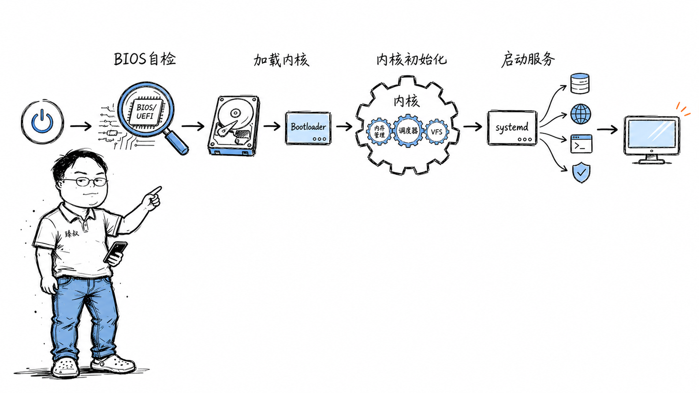

# 按下电源键到桌面出现——CPU在这3秒内执行的指令序列是什么？

你每天按几十次开机键。屏幕一黑一亮，桌面就出来了，整个过程不到3秒。

但你有没有想过：在这3秒里，CPU到底在干什么？它不是"在启动"——它在逐条执行指令，每一条都有明确的地址、明确的输入输出。如果你能把这些指令一条条列出来，你就真正理解了"计算机是怎么活过来的"。

更实际的问题：你的电脑最近开机变慢了，从3秒变成了15秒。是哪里慢了？是硬盘老化？是BIOS设置不对？还是某个驱动在内核阶段卡住了？如果你不了解启动的四个阶段，你连排查方向都没有。

## 核心结论

开机不是"啪一下就亮了"。它是一场**四棒接力赛**，每一棒只做一件事，做完就把控制权交给下一棒：

第一棒，**BIOS/UEFI固件**——检查硬件是否活着，找到启动设备。
第二棒，**Bootloader**——从启动设备找到操作系统内核，加载到内存。
第三棒，**内核初始化**——搭建内存管理、调度器、文件系统等一切基础设施。
第四棒，**用户态启动**——systemd按依赖关系拉起所有服务，最终显示桌面。

四棒之间是**严格的链式依赖**——任何一棒出错，整条链断裂，后面的全部跑不起来。而且这个链条不只是"执行顺序"，它还是一条**信任链**：每一棒都只信任上一棒交给它的东西，不信任任何未经验证的代码。

## 深度拆解

### 第一棒：BIOS/UEFI——硬件自检与固件接力

按下电源键的那一刻，CPU还没有开始干活。

主板上的一块小芯片——芯片组中的**电源管理单元**——先收到信号，给CPU供电并释放Reset信号。CPU"醒来"后，它的**程序计数器（PC）**被硬件强制指向一个固定地址。在x86架构下是`0xFFFFFFF0`，位于BIOS/UEFI固件芯片的顶部16字节区域。

这是CPU出生后执行的第一条指令。注意，此刻内存还没初始化，硬盘还没检测到，GPU还没点亮——CPU唯一能访问的存储，是主板上一块小小的SPI Flash芯片，里面装着固件代码。

固件做的第一件事是**POST（Power-On Self-Test，开机自检）**：

- 初始化CPU寄存器，设置基本的工作模式
- **内存训练**——这是最耗时的步骤。DDR4/DDR5内存需要校准信号时序，逐根 DIMM 测试，确定每个内存通道的最优延迟参数。这一步就能花掉1-2秒
- 枚举PCIe总线上的设备——显卡、网卡、NVMe控制器，每一个都要协商链路速率
- 初始化USB控制器，确保键盘鼠标可用

如果内存检测失败，你听到的是"滴滴"蜂鸣声。这是固件在没有任何显示设备可用的情况下，唯一能跟你"说话"的方式。不同模式的蜂鸣码代表不同故障——一长三短通常是显卡问题，连续短叫是内存问题。

POST完成后，固件要找启动设备。

**传统BIOS模式**下，它读硬盘的第0扇区（512字节的MBR）到内存地址`0x7C00`，然后跳转过去。但这512字节放不下完整的操作系统加载器——它只是一个"二级加载器"，负责找到并加载真正的GRUB或systemd-boot。

**UEFI模式**更现代——它理解FAT32文件系统，直接从EFI系统分区找到`.efi`文件执行。不需要"512字节引导扇区"这种历史包袱，也不限制启动设备必须是硬盘的第一个扇区。

UEFI还带来了两个重要特性：**Secure Boot**（只执行被可信CA签名的引导程序，防止rootkit篡改启动链）和**GPT分区表**（突破MBR的2TB限制）。

### 第二棒：Bootloader——找到操作系统并加载

Bootloader的核心任务只有一个：**把内核映像加载到内存，设置好启动参数，然后跳过去。**

以GRUB为例，它的启动是分阶段的：

第一阶段（`boot.img`）在MBR或EFI分区中，只有446字节，唯一任务是加载第二阶段。第二阶段（`core.img`）理解文件系统，能找到内核映像文件（如`/boot/vmlinuz-5.15.0`）和initramfs。

GRUB还会显示那个让你选择启动项的菜单。如果你装了双系统，GRUB负责让你在Linux和Windows之间选。

加载内核时，GRUB会传入**内核命令行参数**——这些参数直接影响内核的行为。比如`root=/dev/sda1`告诉内核根文件系统在哪个分区，`quiet`减少启动日志输出，`nomodeset`禁用KMS（内核模式设置），让显卡用基本VESA模式。

还有一个关键角色：**initramfs**（initramfs以前叫initrd）。它是根文件系统挂载之前的"临时根"。为什么需要它？因为内核需要驱动程序才能访问硬盘上的根文件系统，但驱动程序在根文件系统上——**鸡生蛋问题**。initramfs把必要的驱动打包成一个小型临时文件系统，内核先挂载它，用它加载真正的根文件系统驱动，然后再切换过去。

### 第三棒：内核初始化——操作系统的"开机自检"

内核映像被加载到内存后，第一件事是**解压自己**——是的，内核映像是压缩过的，以减少Bootloader加载的时间。解压完成后，内核从`start_kernel()`开始执行。

这是一个漫长的初始化过程，大致顺序是：

1. **初始化中断描述符表（IDT）**——CPU需要知道"收到中断信号时，该跳到哪段代码处理"。没有IDT，CPU连一个硬件中断都响应不了
2. **初始化内存管理子系统**——建立页表、初始化slab分配器。从此刻起，内核有了自己的内存管理能力
3. **初始化调度器**——创建0号进程（idle进程），设置时钟中断，从此CPU可以调度任务了
4. **初始化VFS（虚拟文件系统层）**——为挂载根文件系统做准备
5. **挂载initramfs**——执行initramfs中的`/init`脚本，加载存储驱动
6. **挂载真正的根文件系统**——切换根目录（pivot_root），从此内核"住"在了真正的文件系统上

最后，内核执行第一个用户态进程——**init（或systemd）**。它的PID永远是1，是所有用户态进程的祖先。PID 1如果退出了，内核会panic——整个系统直接崩溃。

### 第四棒：用户态启动——服务编排与桌面

systemd读取配置文件，按依赖关系启动服务。这个阶段是开机时间最可控的部分——你慢就慢在这里。

systemd的启动是**并行**的，不是老式SysV init的串行。它会分析服务之间的依赖关系图，把没有依赖关系的服务同时启动。但有些服务必须串行——比如网络服务依赖网络栈先就绪，显示管理器依赖图形驱动先加载。

典型的启动链条：

你看到的桌面，是这个流程的最后一步——前面三步你全都错过了。

### 为什么开机不能"一瞬间"？

理解了四棒接力，你就明白了：开机慢不是"软件慢"，是每一棒都在初始化**真实硬件**，而硬件初始化有物理时间成本。

- **内存训练**：DDR5需要逐根DIMM校准信号完整性，不能跳过
- **PCIe链路训练**：GPU、NVMe需要协商链路速率（Gen4 x16需要协商16条通道的信号质量）
- **存储设备初始化**：SSD的FTL需要加载，HDD的马盘需要转起来
- **Secure Boot验证**：每一步都要验签，验签需要计算哈希，哈希需要时间

"快速启动"功能（Windows的Fast Startup、Linux的`systemd-hibernate`）本质上是在**跳过第三棒和第四棒**——把内核状态和内存内容直接从硬盘恢复，不需要重新初始化。代价是：硬件状态可能不一致（比如你换了内存条），从休眠恢复后可能出问题。

## 实战要点

### 工程落地

1. **诊断开机慢用`systemd-analyze`**。`systemd-analyze time`看总时间，`systemd-analyze blame`看每个服务花了多久，`systemd-analyze critical-chain`看关键路径。大部分情况你会发现自己装的某个服务（比如Docker、MySQL）拖慢了启动。

2. **内核启动日志看`dmesg`**。如果内核阶段卡住，`dmesg`的时间戳能帮你定位是哪个驱动初始化慢。`dmesg | grep -i "wait\|timeout\|delay"`快速找异常。

3. **UEFI vs Legacy BIOS要统一**。如果你的硬盘是GPT分区表，必须用UEFI模式启动；如果是MBR分区表，必须用Legacy BIOS。混用会导致"找不到启动设备"。

### 臻叔踩坑笔记

1. **initramfs缺少RAID驱动→内核panic**：内核加载了但找不到根文件系统，报`VFS: Unable to mount root fs`。触发条件是换了存储控制器或RAID卡但没更新initramfs。规避方法：换硬件后用`dracut --force`或`update-initramfs -u`重新生成initramfs。

2. **Secure Boot阻止第三方内核模块加载**：自己编译的内核模块没有签名，`dmesg`报`Lockdown: modprobe: unsigned module loading is restricted`。触发条件是在启用了Secure Boot的系统上加载DKMS模块（如NVIDIA驱动）。规避方法：用`mokutil`注册机器自己的密钥并签名模块，或者临时关闭Secure Boot（但会降低安全性）。

3. **systemd服务依赖循环导致启动卡死**：服务A依赖B，B依赖C，C依赖A——systemd检测到循环后要么卡住等待，要么跳过所有服务。触发条件是手动编辑了service文件的`After=`和`Requires=`导致循环。规避方法：用`systemd-analyze verify`检查服务文件语法和依赖关系。

4. **Fast Boot跳过USB初始化→BIOS里键盘不能用**：某些主板开了Fast Boot后跳过USB控制器初始化，进BIOS设置时键盘无响应。触发条件是开启了Fast Boot且使用USB键盘。规避方法：在BIOS中关闭Fast Boot，或使用PS/2接口键盘（老式但可靠）。

5. **双系统时间不一致**：Linux把硬件时钟当作UTC，Windows当作本地时间。双系统切换后时间差8小时。触发条件是同一台机器装了Linux和Windows双系统。规避方法：在Linux中设置`timedatectl set-local-rtc 1`让Linux也用本地时间（不推荐，可能导致DST问题），或在Windows中设置注册表让Windows用UTC。

### 一句话总结

> 开机不是"啪一下就亮了"——它是四个接力选手各跑一棒，每一棒都在为下一棒铺设跑道。任何一棒出错，整条链断裂。理解这四棒，你就理解了从硬件到软件的全部启动链路。
