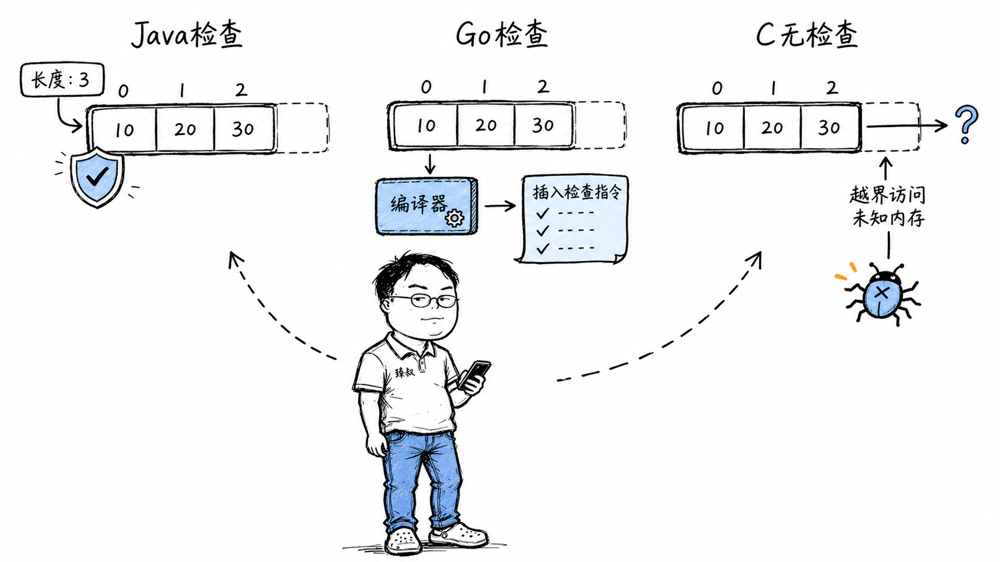

# 数组越界：缓冲区溢出原理与C语言内存安全防护



---

> 📌 **关注「程序员臻叔」，获取更多硬核技术干货**


---

你写Java时数组越界了——JVM抛出一个清晰干净的`ArrayIndexOutOfBoundsException`，附带完整堆栈跟踪，精确到哪一行。

你写Python时越界了——`IndexError: list index out of range`。

Go直接`panic: runtime error: index out of range`，程序退出。

然后老前辈说："C语言里，数组越界不一定会报错。有时它崩、有时不崩还'正常'跑、有时它默默改了别人变量的值然后你排查一整天。"

C语言并非"不好"。不同语言对内存暴露的层次不同，而每一种选择背后，都是**安全与性能的权衡**。

## 核心结论

同样一个`arr[30]`（数组只有10个元素），不同语言的反应完全不同，原因在于**数组在内存中的布局**和**运行时是否插入检查**：

**Java**：数组对象有元数据（记录长度），JVM在每次访问时强制检查越界——安全但每次访问多一次比较。
**Go**：数组没有运行时元数据，但编译器在每次访问前插入了边界检查指令——和Java一样安全，但编译器可以智能消除确定安全的检查（BCE）。
**C**：数组名就是指针，越界就是"从指针地址偏移一段距离然后读"——没有检查，没有元数据，纯粹的指针运算。快但危险。

这不关乎"谁更先进"，关键在于**"花多少运行时开销换取多大的安全保证"**。

## 深度拆解

### Java：有元数据，强制检查

每个Java数组对象在堆内存中的布局是：

```
[对象头（Mark Word + Klass指针）] [数组长度（4字节int）] [arr[0] ... arr[n-1]]
```

数组长度就存在对象头之后。当JVM执行`arr[30]`时，它先从对象头取出数组长度10，然后判断30 >= 10 → 抛`ArrayIndexOutOfBoundsException`。

这个检查是**字节码指令内置的**——`aaload`（引用类型数组读取）和`iaload`（int类型数组读取）指令的实现里就包含了边界检查。JVM标准规定必须做，你不能通过编译选项关掉。

代价：每次数组访问多一次比较指令。对于密集的数组遍历（比如`for (int i = 0; i < arr.length; i++)`），JIT编译器会做**循环边界检查消除（Range Check Elimination）**——如果循环变量在循环体内没有被修改，且终止条件是`i < arr.length`，JIT可以证明所有访问都不会越界，把检查去掉。

### Go：编译器插检查，但可以消除

`[10]int`在编译后的二进制里就是10个连续的8字节整数，共80字节。数组长度10只在编译时存在，**运行时不存在**。

但Go的编译器在每次数组访问前**自动插入了边界检查指令**：

```asm
CMP index, 10    // 比较索引和数组长度
JAE panic        // 如果索引 >= 长度，跳转到panic
```

在某些场景下，Go做**BCE（Bounds Check Elimination，边界检查消除）**。比如：

```go
for i := 0; i < len(arr); i++ {
    _ = arr[i]  // 编译器能证明 i < len(arr)，检查被消除
}
```

Go编译器在编译时做静态分析，如果它能证明索引永远在合法范围内，就不插入检查指令。这使得Go的数组访问在安全场景下可以和C一样快。

### C：什么都没有

`int arr[10]`在栈上分配10个连续的4字节int，共40字节。数组名`arr`只是一个**指针**——指向首元素地址。

**没有任何地方存储"这个数组有多长"。**

`arr[30]`被编译器翻译成：取`arr`的地址 + 30 × sizeof(int) = `arr`地址 + 120字节，然后读那个地址的内容。

至于那个地址里是什么——可能是同一栈帧里另一个变量的值，可能是返回地址（改了它就能做栈溢出攻击），可能是未映射的内存（一读就段错误）。**没有报错不意味着它"被允许"，只是没有人检查。**

C的哲学是"相信程序员不会越界"。代价是当你越界了，后果完全不可预测——可能正常运行（碰巧那块内存没被用），可能崩溃（段错误），可能被攻击（缓冲区溢出）。

这就是为什么C/C++程序中缓冲区溢出是最常见的安全漏洞之一——Heartbleed、Stagefright都是因为数组越界读取了不该读的内存。

### 越界的后果：从无害到灾难

C语言中数组越界的后果，取决于越界访问到的内存是什么：

**场景1：读到同栈帧的变量。** `int arr[10]; arr[10] = 42;`——arr[10]的地址恰好是arr后面的一个变量。你默默改了它的值，程序可能继续正常运行但结果不对。这种bug极难排查——程序不崩溃，只是偶尔输出错误结果。

**场景2：读到返回地址。** 如果arr在栈上，越界写入可以覆盖函数的返回地址。攻击者精心构造输入，让返回地址指向自己的shellcode——这就是经典的**栈缓冲区溢出攻击**。现代编译器用Stack Canary（在返回地址前放一个随机值，函数返回前检查是否被改）来防御。

**场景3：读到未映射内存。** 越界访问的地址恰好不在任何映射区域内，MMU触发段错误。这是"幸运"的情况——程序立刻崩溃，你能马上发现问题。

### 为什么不统一加检查？

因为检查有成本。在性能极致的场景（操作系统内核、高性能网络栈、游戏引擎），每次数组访问多一次比较和分支跳转，累积起来是可观的开销。

Java的`ArrayList.get()`比C的裸数组访问慢约2-3倍（在不考虑JIT优化的情况下），其中边界检查贡献了一部分开销。

Go的BCE是"两全其美"的尝试——在能静态证明安全时消除检查，不能证明时保留检查。但BCE不是万能的，对于动态索引（如`arr[someFunction()]`），编译器无法静态分析，必须保留检查。

## 实战要点

### 工程落地

1. **Java中用数组而非ArrayList追求性能时，注意JIT是否消除了检查**。简单的`for (int i = 0; i < arr.length; i++)`循环JIT通常能消除检查。但如果循环体内调用了可能修改`i`的方法，JIT无法消除。

2. **Go中用`-gcflags="-B"`关闭边界检查只在极端性能场景**。默认开着的边界检查开销通常只有1-2%，关闭它换来的性能提升不值得安全风险。

3. **C/C++用AddressSanitizer（ASan）检测越界**。编译时加`-fsanitize=address`，运行时ASan会在越界访问时立即报错（包括栈越界和堆越界），代价是性能下降2-3倍。只在测试环境开启。

### 臻叔踩坑笔记

1. **Java的`-XX:+EliminateAllocations`不是边界检查消除**：很多人混淆了"分配消除"和"边界检查消除"。前者是逃逸分析相关的优化（避免在堆上分配对象），后者是循环范围内的检查消除。两者是独立的JIT优化。

2. **Go的BCE对map访问无效**：`m[key]`的边界检查不会被消除——map的key是动态的，编译器无法静态证明key存在。但Go的map访问返回零值而不是panic（除非用`m[key]`的comma-ok形式且不检查ok）。

3. **C的`strcpy`比`strncpy`危险得多**：`strcpy(dst, src)`不检查长度，如果src比dst长就溢出。`strncpy(dst, src, n)`限制最多拷贝n字节。但`strncpy`自身也有坑——如果src比n短，dst剩余部分被填零（浪费性能）；如果src等于n，dst不以'\0'结尾（后续读取越界）。规避方法：用`snprintf`或`strlcpy`。

4. **Go slice的cap和len不同导致越界行为不一致**：`s := make([]int, 5, 10)`，`s[7]`会panic（越界len），但`s = s[:8]; s[7] = 42`不会（在cap范围内扩展后合法）。触发条件是混淆slice的len和cap。规避方法：理解slice的底层结构——`{ptr, len, cap}`，只有`len`以内的索引是合法的。

5. **C++的`std::vector::operator[]`不做检查，`at()`做检查**：`v[30]`和`v.at(30)`的行为不同——前者是未定义行为（可能越界访问），后者抛`std::out_of_range`异常。触发条件是用`[]`访问可能越界的索引。规避方法：不确定边界时用`at()`，确定安全时用`[]`。

### 一句话总结

> 数组不只是数据容器，它是一个被包裹了不同层级安全协议的内存块。包裹层级越高，越安全但越慢；包裹层级越低，越快但越危险。选择哪种语言，就是在选择"花多少运行时开销换取多大的'不可能犯这类错'的保证"。

---

### 🎯 觉得有帮助？关注「程序员臻叔」


---
