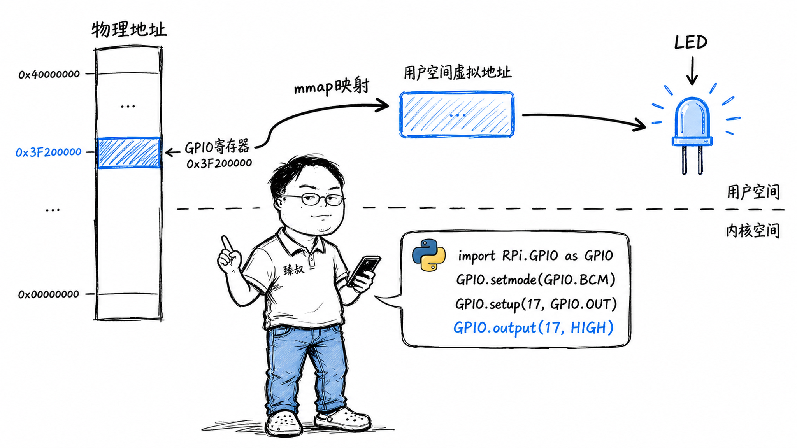

# 树莓派上用Python操作LED——为什么能碰到硬件？



你在树莓派上写`GPIO.output(17, GPIO.HIGH)`——LED亮了。

但在MacBook上写同样代码——"无GPIO设备"错误。同样Python、同一行代码，树莓派能控制物理硬件，普通电脑不行。

**本质区别在哪？** 不在Python，不在操作系统——在于**CPU的物理内存地址空间里，有没有一块区域映射到了硬件控制器的寄存器**。这个概念叫**内存映射I/O（Memory-Mapped I/O）**，它是理解所有硬件控制的基础。

## 核心结论

树莓派能操作硬件的原因是：它的CPU（Broadcom SoC）把GPIO控制器的寄存器**映射到了物理地址空间**的一个固定位置（如`0x3F200000`）。向这个地址写1，对应的GPIO引脚就输出高电平——LED亮。写0，引脚输出低电平——LED灭。

普通电脑不能操作硬件的原因是：x86主板上的GPIO控制器被ACPI/BIOS隐藏，由内核驱动管理，**不在用户态可见的地址空间中**。

内存映射I/O的核心思想是：**CPU不区分"访问内存"和"访问硬件"**——两者都是读写某个物理地址。不同之处在于，有些地址连着DRAM芯片（普通内存），有些地址连着硬件控制器（I/O设备）。

## 深度拆解

### 内存映射I/O：CPU眼中的世界

CPU只做一件事：读写地址。当CPU执行`mov [0x3F20001C], 0x01`时，它不知道这个地址连着什么——可能是内存条上的一个DRAM单元，也可能是GPIO控制器的某个寄存器。

**内存控制器（MMU）根据物理地址决定路由**：

当CPU访问`0x3F20001C`时，内存控制器发现这个地址不在DRAM范围内，而是映射到GPIO控制器——它把写操作转发给GPIO控制器。GPIO控制器收到`0x01`，把GPIO 17的输出寄存器设为高电平。

这就是"内存映射I/O"——**I/O设备的寄存器被映射到CPU的物理地址空间中，CPU用普通的内存读写指令操作硬件**。

### 树莓派上Python怎么操作GPIO

RPi.GPIO库的实现链路：

关键一步是`mmap()`——它把`/dev/mem`（物理内存的设备文件）的一部分映射到用户空间的虚拟地址。映射完成后，用户程序读写这个虚拟地址，实际上就是在读写物理地址`0x3F200000`处的GPIO寄存器。

**为什么不需要系统调用就能操作硬件？** 因为mmap之后，虚拟地址到物理地址的映射由MMU硬件完成。用户程序用普通的`mov`指令读写虚拟地址，MMU自动翻译到物理地址——不需要陷入内核态。

### GPIO寄存器：硬件的"控制面板"

树莓派的GPIO控制器有多个寄存器，每个控制不同的功能：

| 寄存器 | 地址偏移 | 功能 |
|--------|---------|------|
| GPFSEL1 | 0x04 | 功能选择（输入/输出/复用功能） |
| GPSET0 | 0x1C | 设置输出高电平 |
| GPCLR0 | 0x28 | 设置输出低电平 |
| GPLEV0 | 0x34 | 读取当前电平 |

要让GPIO 17闪烁，你需要：

1. 向GPFSEL1写入特定值，把GPIO 17设为输出模式
2. 向GPSET0的bit 17写1，引脚输出高电平（LED亮）
3. 等待一段时间
4. 向GPCLR0的bit 17写1，引脚输出低电平（LED灭）
5. 重复

每个操作就是一次内存写入——向特定地址写特定值。

### 为什么普通电脑不行？

普通x86主板的GPIO控制器**不暴露在用户态可见的地址空间中**。它被ACPI（高级配置与电源接口）管理，由内核的GPIO驱动统一控制。

Intel/AMD的SoC（System on Chip）确实有GPIO控制器，也确实是内存映射的——但内核会保护这些地址，用户态程序不能直接mmap。你只能通过内核提供的接口（如Linux的sysfs：`/sys/class/gpio/`或新的`/dev/gpiochipX`）间接操作。

**这是有意为之的安全设计**。如果用户态程序能直接操作硬件寄存器，任何程序都能：
- 修改GPU的帧缓冲，直接在屏幕上画东西（绕过窗口系统）
- 读取网卡的数据，直接抓取所有网络包（绕过操作系统权限）
- 修改磁盘控制器参数，直接破坏数据

**操作系统的核心职责之一就是隔离**——让用户态程序只能通过系统调用访问硬件，不能直接碰。

树莓派之所以"开放"，是因为它是**教育用途的设备**——暴露硬件地址是有意的设计，让学习者能直接操作硬件。生产环境的服务器不会这样做。

### sysfs vs 直接内存映射

树莓派上有两种操作GPIO的方式：

**sysfs接口**（已弃用但仍可用）：
```bash
echo 17 > /sys/class/gpio/export
echo out > /sys/class/gpio/gpio17/direction
echo 1 > /sys/class/gpio/gpio17/value
```

每次写文件 → 系统调用 → 内核检查权限 → 内核操作GPIO寄存器。安全但慢——每次操作约1-2毫秒。

**直接内存映射**（RPi.GPIO的方式）：
mmap之后直接读写寄存器。快——每次操作约1-2微秒，比sysfs快1000倍。

实时应用（如驱动舵机、PWM信号）需要微秒级精度，必须用直接映射。但代价是失去了内核的安全隔离——你写错了地址，可能让整个系统崩溃。

## 实战要点

### 工程落地

1. **生产环境用内核接口不用直接映射**。Linux的`/dev/gpiochipX`（libgpiod）是现代GPIO接口——安全、有权限控制、支持中断。直接mmap`/dev/mem`只在嵌入式和教育场景用。

2. **操作硬件寄存器要用volatile**。C语言中操作mmap后的地址必须用`volatile`指针——防止编译器优化掉"看起来没用的"读写操作。编译器不知道这个地址连着硬件，可能把"写1再读"优化成"直接返回1"。

3. **理解地址映射链路**。用户态虚拟地址 → 内核页表翻译 → 物理地址 → 内存控制器路由 → 硬件寄存器。这条链路的每一环都可能出问题——权限不足（mmap失败）、地址错误（段错误）、路由不对（写到DRAM而不是外设）。

### 臻叔踩坑笔记

1. **mmap /dev/mem需要root权限**：普通用户无法mmap物理内存。触发条件是RPi.GPIO以非root用户运行。规避方法：将用户加入`gpio`组（`usermod -aG gpio username`），或用`sudo`运行。

2. **寄存器地址在不同树莓派型号上不同**：Pi 3的GPIO基地址是`0x3F200000`，Pi 4是`0xFE200000`。触发条件是代码在Pi 4上运行但硬编码了Pi 3的地址。规避方法：从设备树（`/proc/device-tree/soc/ranges`）动态读取基地址，而不是硬编码。

3. **volatile缺失导致编译器优化掉寄存器操作**：C代码中`*(uint32_t*)0x3F20001C = 1;`如果不加volatile，编译器可能认为这个赋值"没用"（因为没有后续读取）而优化掉。触发条件是O2/O3优化级别下不加volatile。规避方法：`*(volatile uint32_t*)0x3F20001C = 1;`。

4. **GPIO复用功能冲突**：GPIO 14/15同时是UART的TX/RX。如果你把它们设为输出模式驱动LED，UART就不能用了。触发条件是不了解引脚的复用功能。规避方法：查阅树莓派引脚图，避开有特殊功能的引脚。

5. **中断处理在用户态延迟不可控**：通过sysfs的`/sys/class/gpio/gpioX/edge`监听GPIO中断，从硬件中断到用户态通知有数十微秒到毫秒级延迟（经过内核中断处理→事件通知→用户态poll）。触发条件是需要微秒级中断响应。规避方法：在内核态写驱动处理中断，或用FPGA/微控制器做实时处理。

### 一句话总结

> 同样Python代码，树莓派能碰硬件、普通电脑不能——关键不在Python，在操作系统给了你的进程物理内存的哪部分可见。树莓派有意暴露GPIO地址空间；普通电脑刻意隐藏。理解程序的"物理内存可见范围"是理解虚拟内存、内存隔离、嵌入式开发的根本性思想。
