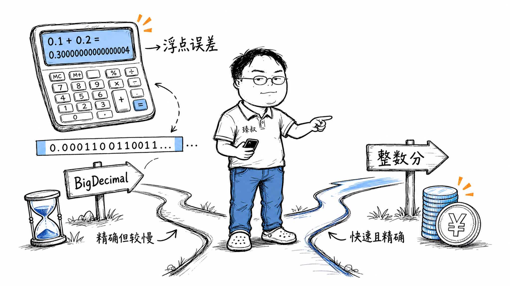

# 0.1+0.2≠0.3——设计金融系统时，浮点数该不该碰？



打开任何语言的REPL，敲`0.1 + 0.2`：

- Java返回`0.30000000000000004`
- Python返回`0.30000000000000004`
- JavaScript也一样

这不是bug。这是**IEEE 754浮点数标准**的特性——而且是"不是bug的特性"。

但如果你在写一个金融交易系统，`0.1 + 0.2`的不精确会让你**损失真金白银**。想象一下：你计算手续费时多收了0.0000004元，一天一亿笔交易，每天差40块钱。一年差14600块。更可怕的是对账时——你的系统和银行的对账单差了0.01元，排查一整天找不到原因。

## 核心结论

浮点数精度问题的根因是：**二进制无法精确表示大多数十进制小数**。这不是实现缺陷，是数学原理决定的——就像十进制无法精确表示1/3一样。

金融系统的三种解法各有取舍：

**BigDecimal**：精确，但比double慢一个数量级。适合需要精确小数运算的场景。
**整数"分"方案**：所有金额以"分"为单位存储为整数。快、无误差，但乘除法（如税率计算）需要注意舍入。
**定点数**：用整数加固定小数位数。精度可控，性能和复杂度居中。

绝大多数交易所核心系统用**整数"分"方案**——不是因为它最精确，而是因为它最快且足够精确。

## 深度拆解

### 为什么0.1+0.2不等于0.3？

在十进制中，1/3 = 0.333333...是无限循环小数。同理，在二进制中，1/10 = 0.0001100110011...也是**无限循环**。

当我们用`double`（IEEE 754双精度：1位符号 + 11位指数 + 52位尾数）存储0.1时，它被"裁剪"了——存储的是它能表示的**最近似值**：

```
实际存储的 0.1 ≈ 0.1000000000000000055511151231257827021181583...
```

0.2同理——也是近似值。两个近似值相加 = 结果的近似值 ≠ 0.3的近似值。

这不是"浮点数不准确"——浮点数对它能表示的值是精确的。问题是**它不能精确表示所有十进制小数**。就像你的尺子刻度是毫米，你能量到1mm的精度但量不到1/3mm——不是尺子坏了，是刻度系统的固有分辨率限制。

### IEEE 754的精妙设计

IEEE 754不是随便设计的——它是在"精度范围"和"表示范围"之间做了精心权衡：

- `double`能表示从±4.9×10^-324到±1.8×10^308的数——范围极大
- 在[1, 2]区间内，相邻两个数的间距是2^-52 ≈ 2.22×10^-16——精度足够大部分科学计算
- 但在[10^15, 10^16]区间内，相邻两个数的间距变成了1——你甚至无法区分1000000000000001和1000000000000002

**浮点数的精度不是固定的——它随着数值增大而降低。** 这意味着大金额的精度更差。如果你存一个100亿的金额，double的精度只能保证到小数点后6位左右。

### 金融系统的三种方案

**方案一：BigDecimal（精确十进制）**

BigDecimal内部用`BigInteger`存储未缩放的值，用一个int存储标度（小数位数）。`0.1`被精确存储为"未缩放值=1，标度=1"——即1×10^-1。

```java
BigDecimal a = new BigDecimal("0.1");  // 必须用String构造
BigDecimal b = new BigDecimal("0.2");
a.add(b);  // 精确得到0.3
```

**坑1**：`new BigDecimal(0.1)`——用double构造，0.1的double近似值被传进去，BigDecimal忠实地存储了那个近似值。必须用`new BigDecimal("0.1")`字符串构造。

**坑2**：除法。`new BigDecimal("1").divide(new BigDecimal("3"))`——1/3是无限循环小数，BigDecimal会抛`ArithmeticException`。必须指定舍入模式和精度：`divide(new BigDecimal("3"), 10, RoundingMode.HALF_UP)`。

**坑3**：性能。BigDecimal的运算比double慢10-100倍，因为每次运算都涉及对象创建和大整数计算。在高频交易系统中，这个开销不可接受。

**方案二：整数"分"方案**

所有金额以"分"为单位存储为`long`。10.99元存为`1099L`。

```java
long price1 = 1099;  // 10.99元
long price2 = 2099;  // 20.99元
long total = price1 + price2;  // 3198，即31.98元——精确
```

加法、减法、比较——全部是整数运算，无误差，极快。

**坑在乘除法**。计算"10.99元 × 8.5%税率"：

```java
long price = 1099;  // 10.99元
double rate = 0.085; // 税率
long tax = (long)(price * rate);  // 93，即0.93元
```

这里`price * rate`是long乘以double，结果转回long时发生截断。0.085本身的浮点近似误差会被带入。正确做法：

```java
// 税率也用整数表示：8.5% = 85/1000
long taxRate = 85;      // 千分之85
long tax = price * taxRate / 1000;  // 1099 * 85 / 1000 = 93
```

全程整数运算，无浮点误差。但要注意运算顺序——先乘后除（`price * rate / 1000`），如果先除后乘（`rate / 1000 * price`）会丢失精度。

**方案三：定点数**

用一个整数存储值，另一个字段记录小数位数。比如"值=109900，小数位=4"表示10.9900。

数据库里的`DECIMAL(18,4)`就是定点数——18位总精度，4位小数。MySQL内部用二进制存储，运算在数据库层完成。

定点数的优势是精度可控——你明确知道有多少位小数。劣势是运算比纯整数复杂，且不同小数位数的定点数之间运算需要先对齐。

| 方案 | 精度 | 性能 | 复杂度 | 适用场景 |
|------|------|------|--------|---------|
| double | ~15位有效数字 | 最快 | 最低 | 图形、科学计算 |
| BigDecimal | 任意精度 | 慢10-100x | 中 | 复杂金融建模 |
| 整数"分" | 精确到分 | 极快 | 低 | 支付核心系统 |
| 定点数 | 可控 | 中 | 中 | 数据库存储 |

## 实战要点

### 工程落地

1. **支付核心用整数"分"，复杂计算用BigDecimal**。下单、支付、退款等核心链路用long分，保证无误差和极高性能。利率衍生品定价等复杂场景用BigDecimal保证精度。两者之间通过明确的转换规则衔接。

2. **数据库用DECIMAL不用FLOAT/DOUBLE**。MySQL的`DECIMAL(18,2)`精确存储两位小数。如果用DOUBLE，1.99可能存成1.989999999999999——导出对账时你会发现差了0.01。

3. **舍入规则要全局统一且文档化**。"四舍五入"看似简单，但Java的`RoundingMode.HALF_UP`和Python的`round()`行为不同（Python用银行家舍入法HALF_EVEN）。金融系统必须明确指定舍入模式，且所有系统使用同一种。

### 臻叔踩坑笔记

1. **JSON传输浮点数导致精度丢失**：后端用BigDecimal计算好`0.1`，序列化成JSON传给前端，前端用JavaScript的`JSON.parse`解析后变成了`0.1000000000000000055511151231257827021181583`。触发条件是BigDecimal序列化为JSON的number类型。规避方法：BigDecimal序列化为String类型（`@JsonSerialize(using = ToStringSerializer.class)`），前端按字符串处理。

2. **跨币种汇率计算精度丢失**：1 USD = 7.2456 CNY，100 USD × 7.2456 = 724.56 CNY。如果汇率用double存储，乘法结果可能有微小误差。触发条件是涉及汇率的跨境支付。规避方法：汇率也用整数表示（如72456/10000），全程整数运算。

3. **BigDecimal的equals和compareTo行为不同**：`new BigDecimal("1.0").equals(new BigDecimal("1.00"))`返回false（标度不同），但`compareTo`返回0。触发条件是用equals比较BigDecimal。规避方法：金额比较永远用`compareTo`，不用`equals`。

4. **累计舍入误差**：100笔交易每笔收0.005元手续费，四舍五入后每笔收0.01元，总计1.00元。但实际应收0.50元。触发条件是小金额大量累加。规避方法：采用"累计后舍入"策略，或用ROUND_HALF_EVEN（银行家舍入）让正负误差概率均等。

5. **并发场景下BigDecimal的不可变性开销**：BigDecimal是不可变对象，每次运算创建新对象。高并发下大量临时BigDecimal对象增加GC压力。触发条件是高频交易系统用BigDecimal。规避方法：热路径用long分计算，最终结果转BigDecimal输出。

### 一句话总结

> 浮点数的精度问题不是数学错误——是"精度-速度"的系统级权衡。IEEE 754被设计成能用单一硬件指令完成double加法（1个时钟周期），代价是"不是精确表示所有实数"。所有工程决策的本质，都是在约束下选择你的非妥协项。金融选精确性，游戏选速度——没有对错，只有场景。
