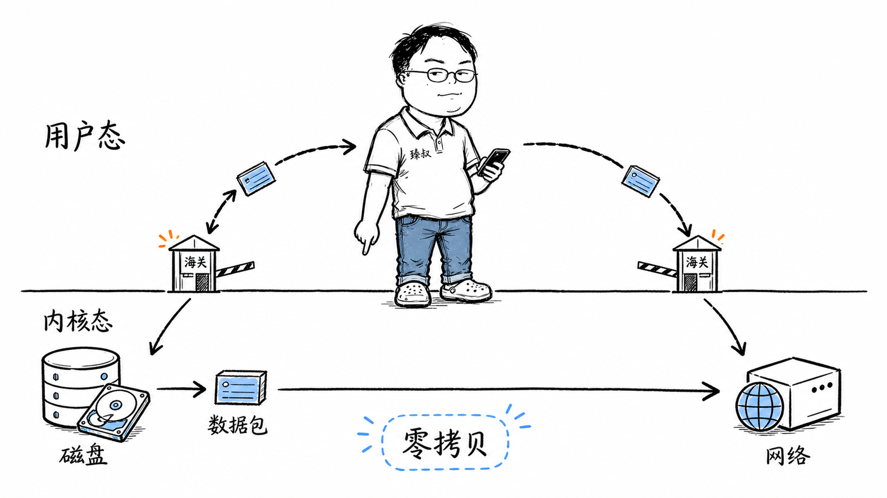

# 一次`read()`系统调用——从用户态到内核态到底发生了什么？



你写：

```java
byte[] buf = new byte[1024];
new FileInputStream("data.txt").read(buf);
```

这行代码帮你从磁盘读了一个文件。看起来再普通不过。

但"读文件"不是一个动作——它是**一次跨越两个世界的旅程**：从用户态到内核态，再回来。而且这个"出入境"比你想象的贵得多。

更实际的问题：Kafka为什么能轻松做到百万级TPS？核心优化之一就是**零拷贝（sendfile）**——它跳过了用户态和内核态之间的数据复制。如果你不理解系统调用的开销，你就理解不了为什么零拷贝能快几十倍。

## 核心结论

一次`read()`系统调用经过五个阶段，每个阶段都有开销：

第一步，**用户态→内核态切换**——CPU保存寄存器、切换栈、切换CPL权限级别。开销约几百纳秒。
第二步，**内核处理**——从fd找到文件对象，走VFS层，分发到具体文件系统驱动。
第三步，**磁盘IO**——如果数据不在Page Cache中，发起DMA传输从磁盘读数据。开销毫秒级。
第四步，**数据复制**——`copy_to_user()`把数据从内核空间拷贝到用户空间。开销和读取量成正比。
第五步，**内核态→用户态返回**——恢复寄存器，切回Ring 3。

"贵"在两个地方：**上下文切换**（每次出入境的安检开销）和**数据拷贝**（数据在内核和用户之间搬运）。零拷贝优化的本质，就是干掉第四步的数据拷贝。

## 深度拆解

### 第一步：触发系统调用——"出入境"的安检

Java的`FileInputStream.read()`经过几层JVM封装（FileInputStream → FileDescriptor → native方法），最终调用C标准库的`read()`函数。

C标准库通过CPU指令——在x86-64上是**`syscall`**——触发从用户态到内核态的切换。

这个切换本身就不便宜。CPU要做以下事情：

- 把当前用户态的寄存器状态（RIP、RSP、RFLAGS）保存到内核栈上
- 把栈指针从用户栈切换到内核栈（每个线程有自己的内核栈）
- 把CPU的CPL从Ring 3（用户态）切换到Ring 0（内核态）
- 跳转到内核的系统调用入口（`entry_SYSCALL_64`）

这不是"调用一个函数"那么简单——函数调用只需要保存返回地址和部分寄存器。系统调用要切换**权限级别**，这涉及CPU的安全检查机制。

### 第二步：内核处理——找到数据在哪

内核的`sys_read()`被调用后，要找到你要读的数据在哪：

VFS（虚拟文件系统）是Linux的一个抽象层——无论你的文件在ext4还是NFS上，`read()`的接口都一样。VFS根据文件的inode找到对应的文件系统驱动，调用驱动的读取函数。

### 第三步：磁盘IO——DMA搬运工

如果数据不在内核的**Page Cache**中（缓存未命中），文件系统驱动要构造一个磁盘IO请求。

这个请求经过块设备层 → IO调度器（合并相邻请求、排序以减少磁盘寻道）→ NVMe/SATA驱动。

驱动用**DMA（直接内存访问）**把磁盘数据搬到内存。关键点：**这一过程CPU不参与**。DMA控制器自己完成数据传输，CPU在这期间可以去干别的。

DMA完成后，磁盘控制器向CPU发一个**硬件中断**。CPU收到中断，执行中断处理程序，把等待这个IO的进程标记为"可运行"。

如果数据在Page Cache中（缓存命中），这一步完全跳过——直接从内存到内存的复制。这就是为什么第二次读同一个文件比第一次快得多。

### 第四步：数据复制——"安检后的转运"

数据已经在内核的Page Cache里了。但用户程序要的是数据在**用户态内存**中——你传进来的`buf`数组在用户空间。

内核做最后一次复制：用**`copy_to_user()`**把数据从内核空间拷贝到用户态的`buf`中。

这一步为什么不能省？因为内核空间和用户空间是**内存隔离**的。内核的Page Cache在内核地址空间，用户程序不能直接访问——这是操作系统安全的基石。`copy_to_user()`在拷贝的同时做安全检查（目标地址确实是用户空间合法地址，不是内核地址）。

你读100MB的数据，这100MB就从内核内存复制到了用户内存。搬运本身不贵（内存拷贝速度约10GB/s），但累加起来不可忽略——尤其在零拷贝优化的场景下。

### 第五步：返回用户态

`syscall`指令执行完毕，CPU从内核栈恢复之前保存的用户态寄存器，CPL切回Ring 3，栈指针切回用户栈，继续执行用户程序的下一条指令。

一次"读文件"的总开销 = **上下文切换（~几百纳秒）+ 磁盘IO（如果未命中缓存，毫秒级）+ 数据复制（和读取量成正比）**。

### 零拷贝：干掉第四步

传统数据传输流程（从磁盘读文件再发到网络）：

数据在内核和用户之间来回了**两次**拷贝，四次上下文切换（read + write各两次）。

**sendfile零拷贝**：

`sendfile()`系统调用直接在内核内完成"从文件到Socket"的传输——数据**完全不经过用户空间**。四次上下文切换变成两次，两次数据拷贝变成零次（数据始终在内核空间）。

Kafka大量使用sendfile——消费者读取消息时，Broker直接把日志文件的内容从Page Cache送到网卡，不经过JVM。这就是Kafka高吞吐的核心秘密之一。

**mmap**是另一种零拷贝方案——把文件映射到用户空间内存，用户程序直接读写映射区域，内核自动管理Page Cache的同步。RocketMQ用mmap读写消息文件。

| 方案 | 上下文切换 | 数据拷贝 | 适用场景 |
|------|-----------|---------|---------|
| 传统read+write | 4次 | 2次 | 通用 |
| sendfile | 2次 | 0次 | 文件→网络 |
| mmap+write | 4次 | 1次 | 文件→用户处理→网络 |

## 实战要点

### 工程落地

1. **高吞吐IO场景优先考虑零拷贝**。Kafka用sendfile，RocketMQ用mmap，Nginx用sendfile——所有高性能IO框架都在减少数据拷贝。如果你的服务在大规模传输文件，检查是否用到了零拷贝。

2. **Page Cache是你的朋友**。Linux内核会自动把最近读过的文件数据缓存在Page Cache中。第二次读同一个文件时数据已经在内存里，不需要磁盘IO。对于日志分析类应用，确保文件能放进Page Cache（别让总文件大小超过物理内存太多）。

3. **io_uring是下一代IO**。Linux 5.1引入的io_uring用共享环形缓冲区替代了系统调用——用户程序把IO请求写到环形队列，内核消费并写回结果，全程不需要上下文切换。性能比传统epoll+read/write高数倍。

### 臻叔踩坑笔记

1. **小数据频繁read导致系统调用开销占比过高**：每次读4字节，但每次系统调用的固定开销是几百纳秒——数据读取本身可能只要几纳秒。触发条件是大量小read调用。规避方法：用缓冲读取（BufferedReader），一次性读大块到用户缓冲区，再从缓冲区逐个取。

2. **sendfile在大文件场景下阻塞事件循环**：sendfile是同步调用，传输大文件时会阻塞调用线程。触发条件是在异步框架（Netty）中用sendfile传输大文件。规避方法：用分块sendfile（每次传输1MB），或在独立线程池执行。

3. **mmap映射大文件导致虚拟地址空间耗尽**：mmap映射的文件占用虚拟地址空间。映射太多大文件会导致地址空间不足（64位下虽不常见但并非不可能）。触发条件是大量文件同时mmap。规避方法：用完及时munmap，或用madvise告诉内核哪些页面可以回收。

4. **Direct I/O绕过Page Cache但性能反而下降**：`O_DIRECT`标志跳过Page Cache直接读写磁盘。如果你的数据本来就在Page Cache中（热数据），用Direct I/O反而更慢。触发条件是盲目使用O_DIRECT"优化"IO。规避方法：只在数据库等自管缓存的场景用Direct I/O，普通应用让内核管Page Cache。

5. **NFS上的sendfile可能不生效**：sendfile要求源文件支持splice操作，NFS等网络文件系统可能不支持。触发条件是在NFS挂载目录上用sendfile。规避方法：检测文件系统类型，NFS回退到传统read+write。

### 一句话总结

> 系统调用的代价不是它做了什么，而是每次"越境"的安检开销。用户态和内核态的隔离是安全的基石——但安全有成本。高性能IO的几乎所有优化——零拷贝、IO多路复用、io_uring——本质上都在做同一件事：减少"出入境"的次数和每次入境的开销。
