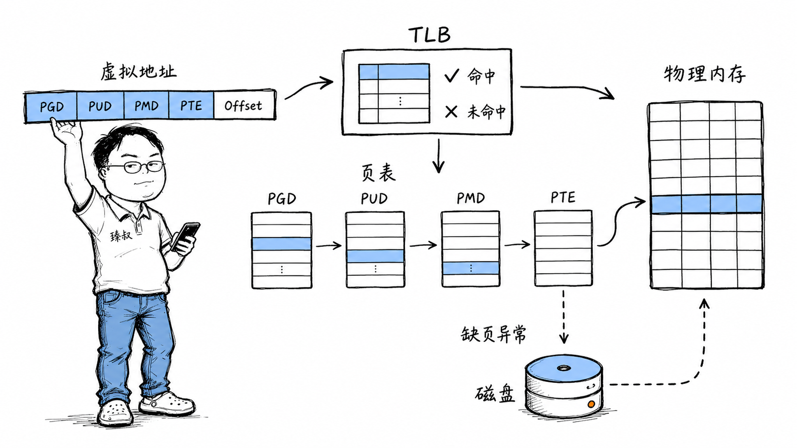

# 虚拟内存：进程地址空间、页表映射与缺页中断机制

---

> 📌 **关注「程序员臻叔」，获取更多硬核技术干货**

---

你在一个16GB内存的电脑上打开50个Chrome标签页、两个IDE、一个Docker、一堆后台服务。每个进程都以为自己是这台电脑上唯一的住户，拥有2^48 ≈ 256TB的地址空间。它们互相看不见，永远碰不到对方的"地盘"。

这个幻象叫**虚拟内存**——操作系统的基石之一。

但它是怎么实现的？更实际的问题：你的服务从进程A切换到进程B后，前几百次内存访问特别慢，之后才恢复正常。为什么？因为TLB在切换时被全部刷掉了。理解虚拟内存，你才能理解为什么上下文切换真的"贵"。

## 核心结论

虚拟内存是一个**翻译层**——把进程看到的"虚拟地址"翻译成物理内存上的"真实地址"。这个翻译由三件事协作完成：

第一，**页表**：每个进程一张映射表，记录"虚拟页→物理页"的对应关系。
第二，**TLB**——CPU内部的页表缓存，避免每次翻译都走完整的四级页表查找。
第三，**缺页处理**。当访问的虚拟地址对应的物理页不在内存中时，内核介入，从磁盘加载或分配新页。

这三者中，TLB是性能的关键。TLB命中只要1纳秒，TLB未命中要走四次内存访问——慢几十倍。而进程切换会刷掉整个TLB，这就是上下文切换"贵"的深层原因。

## 深度拆解

### 页表：一张巨大的映射表

每个进程有自己的**页表（Page Table）**。在64位Linux上，虚拟地址的48位被切成5段：4个9位段 + 1个12位段。

翻译过程是一次"四级查目录"：

四级页表，四次内存访问——"查一次地址"本身就是在内存里"散步"。如果每次内存访问都要走四级页表，CPU的大部分时间都花在查表上了。这显然不可接受。

### TLB：拯救性能的关键缓存

CPU内部有一个小缓存——**TLB（Translation Lookaside Buffer，翻译后备缓冲区）**。它存储最近翻译过的虚拟地址→物理地址的映射。

CPU翻译地址时先查TLB：

- **TLB命中** → 1个CPU周期（<1ns）直接拿到物理地址
- **TLB未命中** → 走完整的四级页表翻译 → 慢几十倍到上百倍

TLB很小——现代CPU的L1 TLB通常只有64-128个表项，L2 TLB有几千个。这意味着如果你的代码访问的内存页跨度大（比如随机访问几百个不同的4KB页），TLB会频繁未命中。

**这就是为什么顺序访问数组比随机访问链表快得多**——数组元素在连续内存上，访问下一个元素时TLB大概率命中；链表节点分散在堆各处，每次跳转都可能TLB miss。

### 上下文切换：TLB的灾难

这是虚拟内存对性能影响最直接的场景。

CPU从进程A切换到进程B时，操作系统把CR3寄存器指向B的页表——**A的TLB映射瞬间全部失效**（因为B的虚拟地址对应完全不同的物理地址，A的映射对B毫无意义）。

B开始执行时，每次内存访问都在TLB miss——要走完整的四级页表翻译。直到B的"热"页面被重新加载到TLB中，B的执行效率才恢复正常。这个"预热"过程通常需要执行几千到几万条指令。

**这就是上下文切换真正贵的原因**：切换后TLB失效导致的性能惩罚，远不止保存寄存器那点开销。

现代CPU有**PCID（Process Context Identifier）**技术——在TLB表项中标记所属进程的ID，切换时不需要刷掉所有TLB，只切换到目标进程的表项。这大大减轻了上下文切换的TLB惩罚。

### 缺页异常：幻象的幕后维修

当你访问一个有效虚拟地址、但它对应的物理页不在内存中时，MMU触发**缺页异常（Page Fault）**。

CPU暂停当前指令 → 跳转到内核的缺页处理程序 → 内核判断原因：

**次要缺页（Minor Fault）**：虚拟地址有效，物理页还没分配。内核分配一个物理页，更新页表，重新执行指令。这是最常见的——你`malloc`了内存但还没写入，第一次写入触发次要缺页。

**主要缺页（Major Fault）**：虚拟地址有效，但数据在磁盘的swap区或内存映射文件中。内核要把数据从磁盘读进内存，更新页表。这比次要缺页慢几个数量级。

**无效缺页（Invalid Fault）**：虚拟地址不属于当前进程的地址空间。内核向进程发送SIGSEGV信号——你看到的`Segmentation fault`。

从进程的角度看，它完全不知道缺页发生过。它的指令只是执行得**稍微慢了一点**。虚拟内存的"幻象"完美维持——进程永远觉得自己拥有连续的、独占的地址空间，内核在底下偷偷搬运物理页面。

### 内存映射文件：mmap的原理

`mmap()`把一个文件映射到进程的虚拟地址空间。映射后，你读写这段虚拟地址就是在读写文件——内核自动处理Page Cache的同步。

第一次访问映射区域时触发缺页——内核把文件对应页的数据从磁盘加载到Page Cache，更新页表指向这个物理页。后续访问如果命中Page Cache就直接访问，不命中再触发缺页。

mmap的优势是**省去了read()的copy_to_user开销**——数据在Page Cache中，用户程序直接通过虚拟地址访问，不需要内核到用户的拷贝。

## 实战要点

### 工程落地

1. **数据布局影响TLB命中率**。遍历一个`int[10000][10000]`的二维数组，按行遍历（`a[i][j]`）比按列遍历（`a[j][i]`）快几倍——因为行遍历的内存访问是连续的，TLB和Cache命中率高。这就是"数据局部性"原则。

2. **大页（Huge Pages）减少TLB压力**。默认页大小4KB，一个1GB的内存映射需要26万个页表项，TLB装不下。用2MB大页，同样的映射只需512个页表项，TLB命中率大幅提升。数据库（Oracle、MySQL）和高性能应用常用大页。

3. **避免过度使用swap**。当物理内存不足时，内核把不活跃的页面换出到磁盘的swap区。访问被换出的页面会触发主要缺页——从磁盘读回，比内存访问慢10000倍。监控`vmstat`的`si`/`so`列，如果swap活动频繁说明内存不够。

### 臻叔踩坑笔记

1. **malloc返回的内存第一次访问时变慢**：`malloc`只分配虚拟地址空间，不分配物理内存。第一次写入触发缺页，内核才分配物理页。触发条件是大量malloc后立即遍历初始化。表现是第一遍遍历比后续遍历慢很多。规避方法：如果需要确定性延迟，用`mlock()`预先把内存锁定在物理页中。

2. **大页配置不当导致内存浪费**：大页是2MB一个单位，如果你只需要100KB也要占2MB。触发条件是大量小对象用大页。规避方法：评估对象大小和数量，大页适合大对象或大量连续数据。

3. **NUMA架构下的跨节点访问**：多路CPU服务器上，每个CPU有自己的本地内存节点。如果进程被调度到CPU 0但分配的内存在CPU 1的本地节点上，每次访问都要跨NUMA节点，延迟增加30-50%。规避方法：用`numactl --interleave=all`或`numactl --cpunodebind=0 --membind=0`绑定CPU和内存节点。

4. **Copy-on-Write导致内存使用突变**：`fork()`后父子进程共享内存页（标记为只读），一方写入时触发COW缺页，内核复制页面。触发条件是fork后子进程大量写入共享内存。表现是fork后内存使用突然飙升。规避方法：避免fork后大量写操作，或用`vfork()`（共享地址空间但有其他限制）。

5. **内存碎片导致大块分配失败**：物理内存碎片化后，即使总空闲内存足够，也找不到连续的物理页满足大块分配请求。触发条件是长期运行的服务频繁分配释放不同大小的内存块。规避方法：内核的compaction机制会自动整理碎片，必要时可以`echo 1 > /proc/sys/vm/compact_memory`触发手动整理。

### 一句话总结

> 虚拟内存是计算机科学史上最成功的抽象之一。它把一个物理上碎片化、多租户共享、容量有限的物理内存，伪装成每个进程独享的、连续的、无限的地址空间。让每个进程活在自己的美好幻觉中，内核在底下收拾烂摊子。

---

### 🎯 觉得有帮助？关注「程序员臻叔」

---
