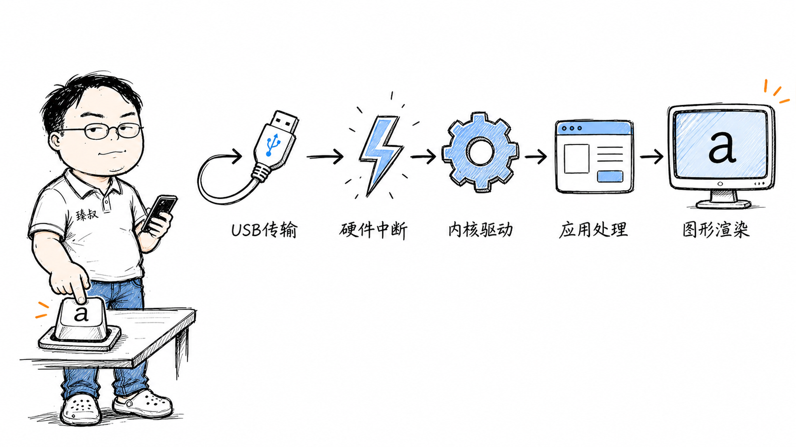

# 键盘输入链路：从硬件中断到字符显示的完整数据通路



---

> 📌 **关注「程序员臻叔」，获取更多硬核技术干货**


---

你敲下键盘上的"A"键。不到5毫秒，屏幕上出现了"a"。

感觉是瞬间的。但在这5毫秒内，信号经过了**机械开关 → USB协议栈 → 中断控制器 → CPU中断处理 → 内核驱动层 → 输入子系统 → 图形栈**——每一步都可以出问题。

如果你的键盘突然失灵，或者某个键偶尔不响应，问题出在哪一层？如果你只能说"键盘发信号给电脑，电脑显示出来"，那你漏掉了最精彩的90%——也失去了排查能力。

## 核心结论

一次按键从物理触发到屏幕显示，经过**六个阶段**，每个阶段有不同的延迟和故障特征：

1. **机械层**（0-0.1ms）：物理触点闭合，键盘MCU检测矩阵
2. **USB传输层**（0.1-0.5ms）：HID报告通过USB总线传输到主机
3. **中断层**（0.5-1ms）：USB控制器发中断，CPU切换到内核态处理
4. **内核驱动层**（1-2ms）：USB驱动解析HID报告，交给input子系统
5. **应用层**（2-4ms）：终端/编辑器接收事件，处理字符
6. **图形层**（4-5ms）：GPU渲染字符到帧缓冲，显示器显示

几乎所有交互式系统都遵循这个模型——触摸屏、鼠标、手柄只是换了输入设备，信号链路的架构完全一样。

## 深度拆解

### 第一拍：机械到电信号（0-0.1ms）

按键物理按下时，键盘内部的薄膜触点闭合。键盘的微控制器（一颗小ARM芯片）通过**扫描矩阵**检测哪个键被按下了。

键盘的按键排成行列矩阵——比如10行×20列覆盖200个键。MCU逐行扫描，检测哪一列有信号。行列交叉点就是被按下的键。

MCU确定"是A键"后，还需要做**消抖（Debounce）**——机械触点闭合时会有几毫秒的抖动（信号在通断之间快速跳变）。MCU等待抖动稳定后确认按键状态。

如果你用的是机械键盘，每个键轴下有独立的开关，但扫描原理类似。机械键盘的优势是触感好、寿命长，但信号链路和薄膜键盘没有本质区别。

### 第二拍：USB HID报告（0.1-0.5ms）

键盘MCU构造一个**USB HID报告**——8字节的标准格式：

```
[修饰键状态] [保留] [按键码1] [按键码2] [按键码3] [按键码4] [按键码5] [按键码6]
```

A键的按键码是`0x04`。这个报告通过USB总线发送给主机。USB总线是串行的——数据一位一位传输，但速度极快（USB 3.0 5Gbps）。

**这里有一个有趣的细节**：USB HID报告最多同时报告6个按键（上面报告格式中有6个按键码字段）。这就是**N-Key Rollover**限制——普通USB键盘最多同时按6个键不冲突。如果你需要更多（游戏场景），需要用支持NKRO的键盘，它用不同的报告格式。

### 第三拍：硬件中断（0.5-1ms）

USB控制器收到HID报告后，向**中断控制器（APIC）**发送中断信号。CPU收到IRQ → 暂停当前执行的程序 → 切换到内核态 → 执行USB驱动的中断处理程序。

中断处理程序从USB控制器的缓冲区读取HID报告，将其放入内核的输入事件队列。这个过程非常快——中断处理程序的设计原则是"做最少的事，尽快返回"。

**为什么不能在中断处理程序中直接处理按键？** 因为中断处理程序运行在中断上下文中，不能睡眠、不能调度。复杂的处理（如判断按键映射、发送给应用）必须延迟到软中断或工作队列中执行。

### 第四拍：内核输入子系统（1-2ms）

Linux内核的**input子系统**是所有输入设备的统一抽象层。USB键盘驱动把原始的HID报告转换为标准的`input_event`：

```c
struct input_event {
    struct timeval time;  // 时间戳
    __u16 type;           // 事件类型（EV_KEY）
    __u16 code;           // 按键码（KEY_A = 30）
    __s32 value;          // 1=按下, 0=释放, 2=重复
};
```

input子系统通过**evdev**接口把事件传递给用户态。X11或Wayland的输入模块从`/dev/input/eventX`读取这些事件。

**按键映射在这里发生**——scan code到keycode的映射、键盘布局（QWERTY/DVORAK）、修饰键组合（Shift+A = 大写A）。X11使用XKB（X Keyboard Extension）处理这些映射。

### 第五拍：应用处理（2-4ms）

X11服务器把按键事件送给**焦点窗口**——你当前正在使用的终端、编辑器或浏览器。

终端模拟器收到按键事件后，判断是普通字符还是控制字符。普通字符'a'被写入**伪终端（PTY）**——一个连接终端模拟器和shell的管道。shell的readline库从PTY读取字符，在终端中显示出来。

如果是在编辑器中（如VS Code），按键事件经过Electron框架的输入处理 → CodeMirror编辑器组件 → 文档模型更新 → 触发重绘。

### 第六拍：图形渲染（4-5ms）

应用通知图形栈需要重绘。渲染流程：

1. 应用计算字符的glyph（字形位图）——从字体文件中查找'a'对应的像素图案
2. 通过图形API（OpenGL/Vulkan/Metal）将glyph渲染到帧缓冲
3. GPU合成多个图层（应用窗口、桌面背景、鼠标光标）
4. 合成的帧通过显示接口（HDMI/DP）发送到显示器
5. 显示器刷新——你看到了'a'

显示器刷新率决定了最后一环的延迟。60Hz显示器每16.7ms刷新一次——你按下的那一刻如果恰好错过了一个刷新周期，就要等下一个。这就是高刷新率显示器（144Hz/240Hz）感觉"更跟手"的原因，刷新间隔更短，显示延迟更低。

### 5毫秒里发生了什么

```
0.0ms  机械触点闭合，MCU扫描矩阵
0.1ms  MCU消抖完成，构造HID报告
0.2ms  USB传输HID报告到主机
0.5ms  USB控制器发中断，CPU切换内核态
0.8ms  中断处理程序读取报告，放入队列
1.0ms  input子系统转换为input_event
1.5ms  evdev传递到X11/Wayland
2.0ms  X11映射按键，送给焦点窗口
2.5ms  终端/编辑器接收并处理字符
3.5ms  通知图形栈重绘
4.0ms  GPU渲染glyph到帧缓冲
4.5ms  显示器刷新显示
5.0ms  你看到了'a'
```

## 实战要点

### 工程落地

1. **排查键盘问题分层定位**。BIOS里能用→硬件和固件没问题。Grub菜单能用→内核驱动没问题。进桌面后失灵→X11/Wayland配置问题。某个应用里失灵→应用层配置问题。

2. **`evtest`工具直接读input事件**。`evtest /dev/input/event3`可以看到内核层收到的事件——如果evtest能看到按键但应用没反应，问题在X11或应用层。

3. **输入延迟优化**。游戏场景下用Raw Input（绕过X11直接读evdev）减少延迟。禁用键盘消抖（如果键盘支持）减少0.1ms。用高刷新率显示器减少显示延迟。

### 臻叔踩坑笔记

1. **USB键盘在BIOS中失灵**：某些USB控制器在BIOS阶段还没初始化完成，USB键盘不可用。触发条件是开机时需要按Del/F2进BIOS但键盘无响应。规避方法：在BIOS中开启"Legacy USB Support"或"Fast Boot"相关的USB初始化选项。

2. **键位映射混乱**：X11的XKB配置出错导致按键映射到错误字符。触发条件是修改了XKB布局或安装了多个输入法。规避方法：`setxkbmap -query`查看当前布局，`setxkbmap us`重置为US布局。

3. **PTY缓冲区满导致终端卡住**：大量输出填满PTY缓冲区时，shell写入会阻塞。触发条件是程序输出极大量文本（如`cat /dev/urandom`）。规避方法：用`Ctrl+S`暂停输出（XOFF），`Ctrl+Q`恢复（XON）。

4. **Wayland下evdev权限问题**：Wayland不允许应用直接读取`/dev/input/eventX`（安全限制）。触发条件是游戏或工具需要Raw Input但Wayland拒绝。规避方法：用`libinput`接口，或在XWayland兼容模式下运行。

5. **蓝牙键盘延迟高且偶尔丢键**：蓝牙协议的连接间隔（Connection Interval）导致延迟——默认7.5ms-4s。触发条件是蓝牙键盘在快速输入时丢键。规避方法：在蓝牙设置中调低连接间隔（需要键盘支持），或用2.4G无线（专用接收器延迟更低）。

### 一句话总结

> 一次按键的6个环节揭示了交互式计算的全部核心流程：物理信号 → 硬件中断 → 内核驱动 → 用户态服务 → 图形合成 → 显示输出。几乎没有任何交互系统能跳过这6层——触摸、鼠标、手柄都可以用同一个模型解释。

---

### 🎯 觉得有帮助？关注「程序员臻叔」


---
