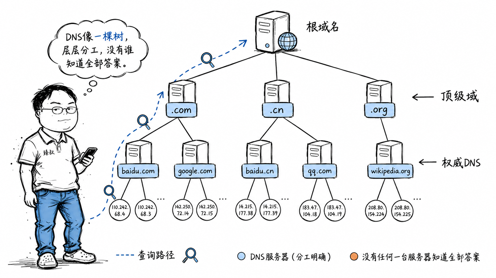

# DNS解析系统：分层域名解析架构与缓存策略



---

> 📌 **关注「程序员臻叔」，获取更多硬核技术干货**


---

全球有13组根DNS服务器（实际是数百台机器用Anycast共享13个IP），它们管理着整个互联网的"通讯录"。每天处理万亿次查询，几乎从不出错。但你想过没有——如果根DNS真的全挂了，互联网会怎样？

2016年10月21日，美国东海岸的Dyn DNS遭受了大规模DDoS攻击，Twitter、Netflix、PayPal、GitHub等大量网站无法访问。这只是一家的DNS出问题，就瘫痪了半个美国互联网。DNS是互联网最底层、最关键的基础设施之一，但它同时又是最"古老"的——1983年设计，至今核心协议几乎没变。

## 核心结论

DNS的设计是一个**分布式层级缓存系统**的教科书案例：

1. **层级结构**：根DNS → 顶级域DNS（.com/.net/.cn）→ 权威DNS（baidu.com的DNS）——每一层只管自己那一段
2. **分布式缓存**：浏览器、操作系统、本地DNS、各级DNS服务器都有缓存——99%的查询不需要走到根
3. **递归+迭代**：客户端递归（"你帮我找到答案"），DNS服务器迭代（"我不知道，但你去问那个人"）
4. **TTL控制**：每个记录都有生存时间，过期了就重新查——在"缓存命中率"和"数据新鲜度"之间做平衡

如果根DNS真的全挂了？**短期（几小时内）几乎没人感知**——因为各级缓存还在。但如果持续24小时以上，TTL较短的记录开始过期，越来越多域名解析失败，互联网逐渐"失忆"。

## 深度拆解

### DNS的三层架构

**根DNS**不存任何域名的具体IP，它只存一张表："`.com`的TLD服务器地址列表在哪"。同理，TLD服务器也不存具体IP，只存"baidu.com的权威DNS服务器地址在哪"。只有权威DNS才存最终的A记录（域名→IP）。

这种设计的好处是**负载分担**：根DNS只需要回答".com在哪"这种问题，不需要记住baidu.com的IP。全球数亿个域名的查询压力被层层分摊。

### 一次完整的DNS解析过程

以你的电脑第一次访问`www.baidu.com`为例：

看起来要问三四层，但实际上每层都有缓存。99%的情况下，LDNS已经有缓存了，直接返回，整个过程<5ms。只有缓存全部过期时，才需要完整走一遍递归查询。

### 为什么根DNS只有13个IP

DNS默认用UDP，UDP包如果超过512字节会被截断。一个DNS响应包里，根DNS要返回所有TLD服务器的地址记录（A记录和AAAA记录），13组根服务器×每组的地址信息≈刚好能塞进512字节的UDP包。

但实际上远不止13台机器——每组IP背后用**Anycast**技术，同一个IP在全球多个数据中心广播。你查询`198.41.0.4`（a.root-servers.net），BGP路由会把你导向物理上最近的那个节点。所以13个IP后面实际是超过1000台服务器。

### DNS记录类型

| 类型 | 名称 | 用途 | 示例 |
|------|------|------|------|
| A | 地址记录 | 域名→IPv4 | www.example.com → 93.184.216.34 |
| AAAA | IPv6地址 | 域名→IPv6 | www.example.com → 2606:2800:220:1:: |
| CNAME | 别名 | 域名→另一个域名 | cdn.example.com → example.cdn.net |
| MX | 邮件交换 | 指定邮件服务器 | example.com → mail.example.com (优先级10) |
| NS | 域名服务器 | 指定谁来解析此域名 | example.com → ns1.dnspod.net |
| TXT | 文本记录 | 任意文本（SPF/验证） | "v=spf1 include:_spf.google.com ~all" |
| SRV | 服务记录 | 指定服务的端口和主机 | _sip._tcp.example.com → 5060 sip.example.com |

CNAME是最容易被滥用的记录类型。它把一个域名指向另一个域名，造成**多次查询**：

CNAME链过深会显著增加DNS延迟。建议CNAME层级不超过2层。

### TTL：缓存的生命线

每条DNS记录都有一个TTL（Time To Live），告诉缓存服务器"这个记录可以存多久"。

TTL是DNS管理的核心工具：

- **TTL长（如86400秒=24小时）**：缓存命中率高，DNS服务器压力小，但域名切换IP时用户要等很久才生效
- **TTL短（如60秒）**：切换IP很快生效，但DNS查询量大，缓存命中率低

**机房切换的标准操作**：
1. 提前24小时把TTL改到60秒
2. 等旧的24小时TTL缓存全部过期
3. 切换IP（修改权威DNS的A记录）
4. 60秒内全球DNS缓存全部刷新
5. 确认稳定后，把TTL改回3600秒

### DNS的脆弱性与加固

DNS协议本身设计于1983年，有几个先天缺陷：

**缺陷一：明文传输**。DNS查询和响应都是明文UDP包，中间人可以查看、篡改。你在咖啡馆连了恶意WiFi，它可以把你访问bank.com的DNS响应改成钓鱼网站的IP。

加固方案：
- **DoH（DNS over HTTPS）**：用HTTPS加密DNS查询，走443端口，中间人无法区分DNS流量和普通HTTPS流量
- **DoT（DNS over TLS）**：用TLS加密DNS查询，走853端口
- **DNSSEC**：给DNS响应加数字签名，防止篡改（但不加密内容）

**缺陷二：UDP无状态，易被伪造**。攻击者可以伪造DNS响应——在真正的DNS服务器回复之前，发一个伪造的响应给LDNS，LDNS可能接受这个假响应并缓存。这就是**DNS缓存投毒（DNS Cache Poisoning）**。

2008年的Kaminsky漏洞就是利用这个缺陷：攻击者大量发查询请求，同时狂发伪造的响应，赌一个能被LDNS接受并缓存。DNSSEC和源端口随机化是主要防御手段。

**缺陷三：单点故障**。如果你的域名只有一组权威DNS，那组DNS挂了，你的域名就解析不了。解法：至少配置两组不同供应商的权威DNS。

### 实际延迟分析

```
场景1：浏览器缓存命中
延迟：< 1ms

场景2：OS缓存命中  
延迟：1-5ms

场景3：LDNS缓存命中
延迟：5-20ms（加上到LDNS的网络延迟）

场景4：LDNS缓存未命中，需要递归查询
延迟：50-300ms（取决于各级DNS的响应速度）

场景5：LDNS缓存未命中 + 跨地域
延迟：200-500ms（如果权威DNS在海外）
```

大型互联网公司会用**HTTPDNS**绕过运营商LDNS——App直接通过HTTP接口向自建DNS服务查询，避免运营商DNS劫持、解析慢、调度不准等问题。

## 实战要点

### 工程落地

**DNS监控**：线上故障排查时，先确认是不是DNS的问题：

```bash
# 递归查询，走完整链路
dig www.baidu.com

# 查询指定DNS服务器
dig @8.8.8.8 www.baidu.com

# 查询NS记录（看权威DNS在哪）
dig NS baidu.com

# 追踪完整解析链路
dig +trace www.baidu.com

# 看TTL
dig www.baidu.com +noall +answer
```

**多DNS供应商**：配置至少2个不同供应商的权威DNS。一个挂了另一个顶上。

**HTTPDNS**：移动端App用HTTP接口直接查DNS，绕过运营商LDNS。阿里云HTTPDNS、腾讯云HTTPDNS都提供这类服务，解决运营商DNS劫持和调度不准的问题。

### 臻叔踩坑笔记

1. **CNAME链过深**：CDN域名经常CNAME到CDN供应商域名，再CNAME到具体节点域名，链路太长导致DNS解析慢。建议监控CNAME层级，控制在2层以内

2. **TTL设置不当**：TTL=86400（24小时），切换IP后用户一天都看不到新版本。TTL=60，DNS查询量暴增。经验值：稳定的静态服务TTL=3600（1小时），需要频繁切换的TTL=60-300

3. **DNS缓存不一致**：不同DNS服务器的缓存过期时间不同步。你改了IP，有的用户1分钟就生效，有的用户1小时才生效。解法：切换前提前降低TTL，等旧TTL过期后再切

4. **运营商DNS劫持**：某些运营商会劫持NXDOMAIN（域名不存在）响应，返回自己的广告页面IP。你的用户输入一个拼错的域名，看到的是运营商的广告。解法：App端用HTTPDNS，Web端启用DNSSEC或DoH

5. **DNS预解析反而变慢**：页面里`dns-prefetch`了太多域名，浏览器并发DNS查询数量有限（Chrome通常6-10个），反而拖慢了关键资源的DNS解析。解法：只预解析首屏关键资源的域名

### 一句话总结

> DNS是互联网的"通讯录"——通过层级划分、分布式缓存、递归迭代，让全球数十亿设备在毫秒级完成域名到IP的翻译。它的设计简洁到近乎简陋，但这种简洁让它跑了40年还在用。脆弱？是的。但加了DNSSEC、DoH、Anycast这些补丁后，它依然是互联网最可靠的基础设施之一。


---

### 🎯 觉得有帮助？关注「程序员臻叔」


---
