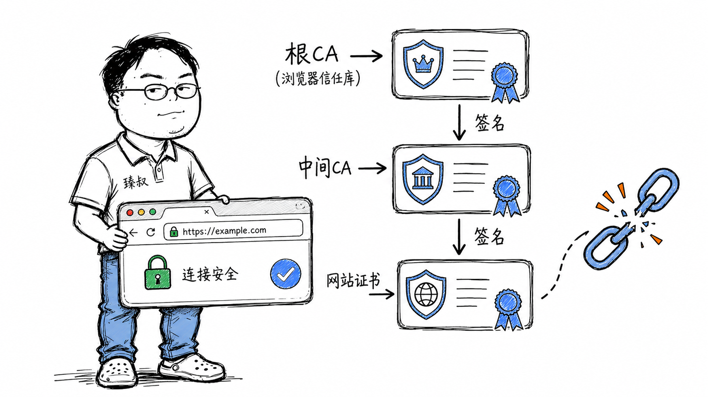

# HTTPS的"锁"图标——浏览器怎么验证这个网站是真的？证书链到底在验什么？



你打开银行网站，地址栏有个小锁图标。你信任这个网站，因为浏览器信任它。但浏览器凭什么信任它？因为证书。证书凭什么可信？因为CA签了名。CA凭什么可信？因为更上一级CA签了名。那最顶级的CA凭什么可信？因为——浏览器/操作系统厂商把它们预装进了信任列表。

这条信任链的尽头，是一组预装的根证书。如果有人能往这个列表里塞一个假CA，整个互联网的信任体系就崩了。这不是假设——2011年，它真的发生过。

## 核心结论

HTTPS的身份验证机制基于**证书链（Certificate Chain）**：

1. **根CA（Root CA）**——预装在操作系统/浏览器中，是信任的"源头"
2. **中间CA（Intermediate CA）**——根CA签发的子CA，负责给网站签发证书
3. **网站证书（Leaf Certificate）**——网站实际使用的证书

验证过程是**逐级验签**：用根CA的公钥验中间CA的签名→用中间CA的公钥验网站证书的签名。如果任何一级签名验证失败，浏览器就报警。

这个体系的基石是**非对称加密**：CA用自己的私钥给证书签名，浏览器用CA的公钥验签。私钥泄露=信任崩塌。

## 深度拆解

### 证书里到底有什么

一张X.509证书，本质是一个结构化的数据文件，包含：

```text
Certificate:
    Version: 3
    Serial Number: 04:8a:1b:2c:3d:4e:5f:60
    Signature Algorithm: sha256WithRSAEncryption
    
    Issuer:                          ← 谁签发的这个证书
        C=US, O=DigiCert Inc, CN=DigiCert TLS RSA SHA256 2020 CA1
    
    Validity:                        ← 有效期
        Not Before: Jan 15 00:00:00 2026 GMT
        Not After:  Feb 15 23:59:59 2027 GMT
    
    Subject:                         ← 证书持有者信息
        C=CN, ST=Beijing, O=Baidu, CN=www.baidu.com
    
    Subject Public Key Info:         ← 持有者的公钥
        Public Key Algorithm: rsaEncryption
        RSA Public Key: (2048 bit)
            Modulus: AB:CD:EF:01:23:45...
            Exponent: 65537
    
    Extensions:                      ← 扩展信息
        X509v3 Subject Alternative Name:   ← 这个证书对哪些域名有效
            DNS:www.baidu.com, DNS:baidu.com, DNS:*.bdstatic.com
        X509v3 Key Usage: Digital Signature, Key Encipherment
        X509v3 Extended Key Usage: TLS Web Server Authentication
    
    Signature Algorithm: sha256WithRSAEncryption   ← CA的签名
    Signature: 5a:b3:c7:d1:e8:f2:...               ← 签名值
```

最关键的字段是**Subject（域名）**、**公钥**和**签名**：

- 域名告诉浏览器"这张证书是给www.baidu.com的"
- 公钥让浏览器可以和服务器做密钥协商
- 签名让浏览器验证"这张证书确实是被CA签发的，没被篡改"

### 证书链验证过程

当浏览器收到服务器证书时，验证步骤：

为什么要用中间CA，不直接用根CA签发所有证书？

**安全隔离**。根CA的私钥是最核心的资产，放在离线保险库里，极少使用。日常签发证书由中间CA完成。如果中间CA被攻破，只需要吊销这个中间CA，用根CA重新签发一个新的——影响范围可控。如果根CA被攻破，所有由它签发的证书都不可信了。

### 签名是怎么生成的

CA签发证书的过程：

这个过程的安全性基于一个数学前提：RSA签名只有持有私钥的人才能生成，但任何人都可以用公钥验证。CA的私钥不泄露，签名就不可能被伪造。

### 2011年DigiNotar事件——信任链的崩塌

2011年7月，荷兰CA机构DigiNotar被黑客入侵。攻击者获取了DigiNotar的私钥，伪造了包括`*.google.com`、`*.skype.com`、`*.cia.gov`在内的500多个虚假证书。

利用伪造的`*.google.com`证书，攻击者在伊朗实施了中间人攻击——30万伊朗用户的Gmail流量被截获，包括登录凭证和邮件内容。

事件的后果：

1. 微软、Mozilla、Google紧急将DigiNotar从信任列表中移除
2. DigiNotar的所有证书（包括合法签发的）全部失效
3. DigiNotar公司破产清算

这说明了一个残酷的事实：**整个HTTPS信任体系的安全性，等于最弱的那个CA的安全性**。全球有数百个CA，任何一个被攻破，都可以伪造任何域名的证书。你的银行网站再安全，如果某个你从没听过的CA被攻破了，攻击者照样能伪造你银行的证书。

### 证书透明度（Certificate Transparency）

为了应对"CA偷偷签发假证书"的问题，Google推出了**证书透明度（CT）**机制：

- 所有CA签发的证书必须提交到公开的CT日志中
- 任何人都可以查询某个域名被签发了哪些证书
- 如果你的域名出现了你不知道的证书——说明有CA未经你授权签发了

```bash
# 查询baidu.com的所有已签发证书
curl "https://crt.sh/?q=baidu.com&output=json" | jq '.[] | {issuer: .issuer_name, not_before: .not_before}' | head -20
```

Chrome要求所有证书必须包含CT日志记录，否则不信任。这让"偷偷签发假证书"变得几乎不可能——日志是公开的，全世界都能看到。

### 证书吊销——出了问题怎么撤回

如果证书的私钥泄露了，或者CA误发了证书，怎么撤回？

**CRL（Certificate Revocation List）**：CA维护一个吊销列表，浏览器下载这个列表检查。问题：列表越来越大，更新不及时。

**OCSP（Online Certificate Status Protocol）**：浏览器实时向CA查询证书是否被吊销。问题：增加了每次连接的延迟，还泄露了用户访问了哪些网站（CA知道你在查哪个证书）。

**OCSP Stapling**：服务器在TLS握手时主动带上OCSP响应，省去浏览器查询。这是目前推荐的做法，但需要服务器配置支持。

实际上，大多数浏览器对证书吊销的检查并不严格——CRL/OCSP查询太慢了，用户等不起。Chrome用的是**CRLSets**——Google维护的一份紧急吊销列表，只包含高严重性证书的吊销信息，体积小、更新快。其他证书的吊销状态浏览器根本不查。

## 实战要点

### 工程落地

**证书申请与部署**：

```bash
# 用Let's Encrypt免费申请证书（自动续期）
certbot certonly --webroot -w /var/www/html -d example.com

# 查看证书信息
openssl x509 -in cert.pem -text -noout

# 检查证书链是否完整
openssl s_client -connect example.com:443 -showcerts 2>/dev/null | grep -E "depth|verify"

# 验证证书域名匹配
echo | openssl s_client -connect example.com:443 2>/dev/null | openssl x509 -noout -subject -issuer
```

**Nginx配置证书链**：

```nginx
server {
    listen 443 ssl;
    server_name example.com;
    
    # 必须包含完整证书链：网站证书 + 中间CA证书
    ssl_certificate /etc/ssl/fullchain.pem;  # 网站证书+中间CA
    ssl_certificate_key /etc/ssl/privkey.pem; # 网站私钥
    
    # OCSP Stapling
    ssl_stapling on;
    ssl_stapling_verify on;
    ssl_trusted_certificate /etc/ssl/chain.pem;
}
```

如果你只配置了网站证书而没有中间CA证书，部分浏览器可能信任（因为它缓存了中间CA），但有些浏览器会报错——"证书链不完整"。这是部署HTTPS最常见的坑。

### 臻叔踩坑笔记

1. **证书链不完整**：服务器只配了网站证书，没配中间CA证书。Android旧版、某些编程语言（如Python的requests库）会报SSL错误。解法：`fullchain.pem`包含网站证书+中间CA证书，而不是只有网站证书

2. **证书域名不匹配**：证书是给`example.com`的，但你访问的是`www.example.com`。SAN（Subject Alternative Name）字段里必须包含所有要使用的域名。通配符证书`*.example.com`只覆盖一级子域名，不覆盖`a.b.example.com`

3. **证书过期未续**：Let's Encrypt证书90天过期，如果没配自动续期，某天网站突然打不开了。解法：`certbot renew`加入cron定时任务，或用`certbot --deploy-hook`在续期后自动reload Nginx

4. **HTTP降级攻击**：用户输入`example.com`，浏览器先尝试HTTP。攻击者在网络层劫持HTTP响应，不让它升级到HTTPS。解法：配置HSTS（`Strict-Transport-Security: max-age=31536000; includeSubDomains; preload`），让浏览器记住"这个域名永远用HTTPS"

5. **混合内容警告**：HTTPS页面里引用了HTTP资源（图片、JS），浏览器会在控制台警告并阻止加载。解法：所有资源用相对路径或HTTPS绝对路径，或用CSP（Content-Security-Policy）自动升级HTTP为HTTPS

### 一句话总结

> HTTPS证书链的本质是"信任传递"——你信任浏览器预装的根CA，根CA信任它签发的中间CA，中间CA信任它签发的网站证书。每一级信任都建立在数字签名之上。但这套体系的脆弱性在于：任何一个CA被攻破，整个信任链都可能被伪造。证书透明度和HSTS是在原始设计之上打的两块关键补丁。
