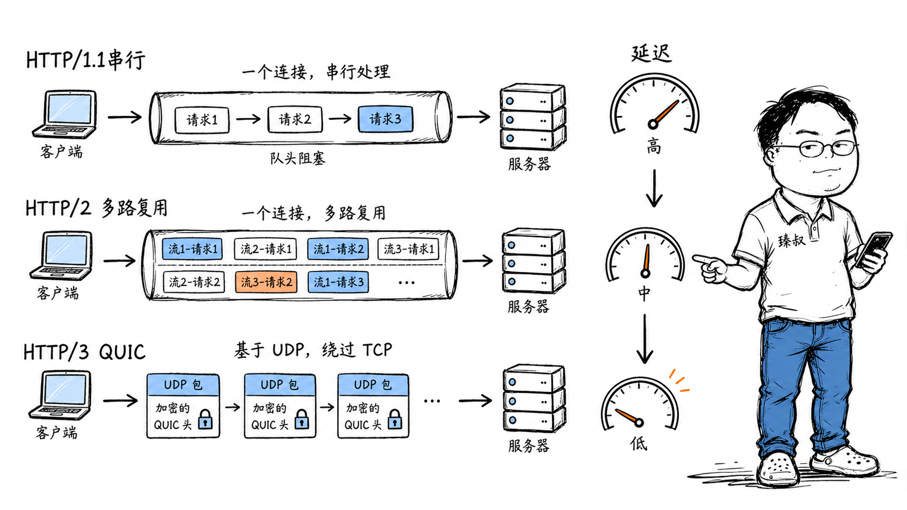

# HTTP/1.1 → HTTP/2 → HTTP/3——每一代在解决什么问题？队头阻塞是怎么被消灭的？



你打开一个现代网页，浏览器同时加载着HTML、CSS、十几张图片、几个JS文件。你可能觉得这很正常——但HTTP/1.1时代，这是不可能的。浏览器只能对同一域名开6个并发连接，多出来的请求排队等。你想加载20张图片？要么分批，要么放在不同域名下。

HTTP从1.1到2再到3，每一代都在解决前一代的"队头阻塞"问题。但有趣的是，每次解决一层，问题就往下一层转移——从应用层移到TCP层，再从TCP层移到传输层。三代协议的进化史，就是一部"把瓶颈往下推"的斗争史。

## 核心结论

HTTP三代协议的核心矛盾始终是**多路复用 vs 队头阻塞**：

1. **HTTP/1.1**：一个连接一次只能处理一个请求。队头阻塞在**应用层**——前面的请求没回来，后面的请求不能发
2. **HTTP/2**：一个连接可以并行跑多个流。但底层是TCP——一个流的包丢了，TCP层阻塞所有流。队头阻塞转移到了**TCP层**
3. **HTTP/3**：不用TCP了，用QUIC（基于UDP）。每个流独立做丢包检测和重传。队头阻塞在**传输层被消灭**

代价是什么？每代协议都在增加复杂度。HTTP/1.1你用`curl`就能调试，HTTP/2需要专门工具，HTTP/3连很多防火墙都不认识。

## 深度拆解

### HTTP/1.1：管道也没救成的应用层队头阻塞

HTTP/1.0时代，每个请求都要开一个新TCP连接，用完关闭。一个页面有20个资源，就要建20次TCP+TLS连接——光握手就要几十个RTT。

HTTP/1.1引入了两个关键特性：

**Keep-Alive（持久连接）**：TCP连接用完不关，下一个请求复用。省掉了重复握手的开销。

**Pipelining（管道化）**：客户端可以连续发多个请求，不需要等前一个的响应。服务器按顺序返回响应。

但管道化几乎没人用。为什么？

而且管道化要求服务器**严格按顺序返回响应**——不能先回B再回A。这意味着如果第一个请求触发了慢查询（数据库卡了500ms），后面所有请求都要等500ms。

浏览器厂商的实际做法是：**不用管道化，改用多连接并发**。Chrome对同一域名最多开6个TCP连接，6不够就分域名（`cdn1.example.com`、`cdn2.example.com`）——这叫**域名分片（Domain Sharding）**。

但每个TCP连接都要握手、TLS协商，6个连接就是6倍的开销。在移动端（RTT高），这个开销尤其痛。

### HTTP/2：多路复用解决了应用层阻塞，但TCP层冒出来了

HTTP/2（2015年标准化）的核心改变：**一个TCP连接上并行跑多个流（Stream）**。

```text
HTTP/2 多路复用：
客户端在一个连接上同时发送：
  Stream 1: GET /index.html
  Stream 3: GET /style.css  
  Stream 5: GET /image.jpg

服务器可以乱序返回：
  Stream 5 的数据帧先回来了
  Stream 1 的数据帧随后
  Stream 3 的数据帧最后

接收方按Stream ID重组，每个流独立。
```

这是怎么做到的？HTTP/2把每个请求/响应拆成**二进制帧（Frame）**，每个帧标记属于哪个流。发送方在连接上交替发送不同流的帧，接收方按流ID重新组装。

**HTTP/2带来的改进**：

- **多路复用**：一个连接并发多个请求，不再需要域名分片
- **头部压缩**：HPACK算法压缩HTTP头部。HTTP/1.1的头部是纯文本，每次请求都带完整的Cookie、User-Agent等，可能占1-2KB。HPACK用静态表+动态表+哈夫曼编码，把头部压到几百字节
- **服务器推送**：服务器可以在客户端请求HTML时，主动推送CSS/JS（虽然后来发现实际收益不大，Chrome最终移除了对它的支持）
- **二进制分帧**：文本协议变成二进制，解析更快更省空间

**但TCP层队头阻塞出现了**：

HTTP/2把多个流跑在一个TCP连接上。TCP是**按字节序保证交付**的——如果seq=1000的包丢了，即使seq=2000和seq=3000的包已经到了，TCP也不会把它们交给应用层，必须等seq=1000重传成功。

丢包率1%的网络上，这个问题可能让HTTP/2比HTTP/1.1还慢——因为HTTP/1.1的6个连接中只有1个被阻塞，而HTTP/2的所有流都被阻塞在一个连接上。

### HTTP/3：用QUIC彻底消灭传输层队头阻塞

HTTP/3（2022年标准化）做了一个根本性改变：**不用TCP了**。

它基于QUIC协议，QUIC运行在UDP之上，自己实现了可靠传输。关键区别在于：**QUIC的每个流独立做丢包检测和重传**。

QUIC怎么做到的？因为QUIC在应用层（用户态）实现可靠性，它知道每个包属于哪个流。TCP在内核层实现可靠性，它只看到字节流，不知道哪个字节属于哪个HTTP流——所以它只能"一刀切"地阻塞所有数据。

**HTTP/3 + QUIC的额外收益**：

**连接迁移**：TCP用四元组（源IP+源端口+目的IP+目的端口）标识连接。你手机从WiFi切到4G，源IP变了，TCP连接断了。QUIC用连接ID标识连接，IP变了没关系：

**更快的握手**：TCP + TLS需要2-3个RTT才能发第一个数据包。QUIC把传输握手和TLS握手合并：

| 场景 | TCP + TLS 1.3 | QUIC |
|------|-------------|------|
| 首次连接 | 2 RTT（TCP 1 + TLS 1） | 1 RTT |
| 恢复连接 | 1 RTT（TCP 1 + TLS 0-RTT） | 0 RTT |

在RTT=200ms的跨国链路上，QUIC首连接比TCP快200ms，恢复连接快200ms。

### 三代协议对比

| 特性 | HTTP/1.1 | HTTP/2 | HTTP/3 |
|------|----------|--------|--------|
| 底层协议 | TCP | TCP | QUIC (UDP) |
| 多路复用 | ×（需多连接） | ✓（单连接多流） | ✓（单连接多流） |
| 队头阻塞 | 应用层 | TCP层 | 无 |
| 头部压缩 | × | HPACK | QPACK |
| 连接迁移 | × | × | ✓ |
| 首包延迟 | 2-3 RTT | 2-3 RTT | 0-1 RTT |
| 部署难度 | 低 | 中 | 高 |
| 兼容性 | 全平台 | 95%+ | 80%+ |

### 为什么不全切HTTP/3

既然HTTP/3更好，为什么不全面切换？

**原因一：UDP流量被限制**。很多企业防火墙、校园网网关只放行TCP 443，封杀或限速UDP。你的HTTP/3流量可能被直接丢弃。

**原因二：CPU开销更高**。TCP在内核态运行，利用了操作系统的零拷贝、硬件校验和等优化。QUIC在用户态实现，CPU开销更大。高并发场景下，QUIC的CPU占用可能比TCP高30-50%。

**原因三：中间设备不友好**。TCP有几十年的优化基础——路由器对TCP有专门的优化策略，负载均衡器对TCP有成熟的健康检查机制。QUIC作为新协议，中间设备还缺乏优化。

实际部署通常用**Alt-Svc**机制做渐进式升级：服务器在HTTP/2响应头里告诉浏览器"我支持HTTP/3，下次你可以试"。浏览器下次尝试HTTP/3，如果连不上就回退到HTTP/2。

## 实战要点

### 工程落地

**协议选择建议**：

- 新项目直接上HTTP/2（Nginx、CDN默认支持）
- 移动端App、对延迟敏感的业务考虑HTTP/3（连接迁移对移动端价值最大）
- 服务间RPC用gRPC（基于HTTP/2）

**性能验证**：

```bash
# 检查服务器支持的HTTP版本
curl -v --http2 https://example.com 2>&1 | grep -i "using http"
curl -v --http3 https://example.com 2>&1 | grep -i "using http"

# Chrome地址栏输入
chrome://net-internals/#http2  # 查看HTTP/2连接
chrome://net-internals/#quic   # 查看QUIC连接
```

**Nginx配置HTTP/2**：

```nginx
server {
    listen 443 ssl http2;
    ssl_certificate /path/to/cert.pem;
    ssl_certificate_key /path/to/key.pem;
    
    # HTTP/3（需要Nginx 1.25+）
    listen 443 quic reuseport;
    add_header Alt-Svc 'h3=":443"; ma=86400';
}
```

### 臻叔踩坑笔记

1. **HTTP/2多路复用反模式**：把所有资源放在一个连接上，如果服务器带宽有限，大文件下载会挤占小资源的带宽。解法：给关键资源设优先级（HTTP/2支持Stream Priority），或限制大文件并发

2. **HPACK动态表失效**：HTTP/2的头部压缩依赖动态表（记录之前见过的头部字段），如果连接断开重连，动态表清空，头部压缩率骤降。短连接场景下HTTP/2的头部压缩收益不大

3. **HTTP/3的0-RTT有重放风险**：0-RTT数据是重放的——攻击者截获0-RTT请求后可以重发。如果请求有副作用（如下单、转账），0-RTT可能导致重复操作。解法：0-RTT只用于幂等请求（GET），非幂等请求（POST/PUT）等1-RTT确认后再发

4. **域名分片在HTTP/2下有害**：HTTP/1.1时代开多个域名增加并发连接。但HTTP/2一个连接就够了，多个域名反而增加DNS查询和TLS握手开销。如果你升级到HTTP/2，应该合并域名

5. **Server Push实际收益低**：HTTP/2的服务器推送理论上可以预发送CSS/JS，但实践中浏览器缓存可能已经有这些文件，推送反而浪费带宽。Chrome已在106版本移除Server Push支持

### 一句话总结

> HTTP三代协议的进化本质是"把队头阻塞往底层推"——HTTP/1.1阻塞在应用层，HTTP/2阻塞在TCP层，HTTP/3在QUIC层彻底消灭。但每消灭一层，复杂度就增加一层。协议选型不是越新越好，而是在"性能收益"和"部署成本"之间找平衡点。
