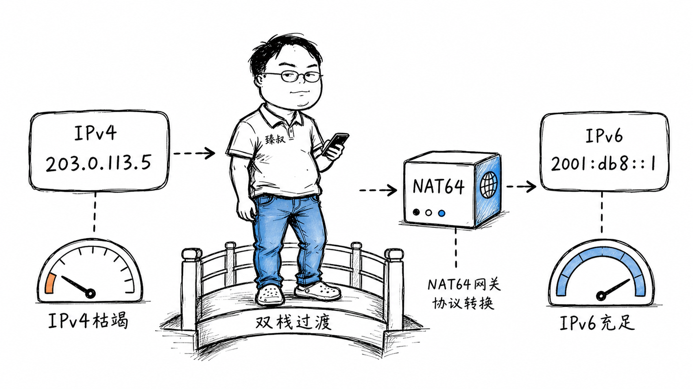

# IPv4地址已经分完了，IPv6天然解决这个问题——为什么二十多年了还没全面切换？



2011年2月3日，IANA（互联网号码分配机构）将最后5个/8的IPv4地址块分配给五大区域互联网注册机构。2019年11月25日，欧洲区域互联网注册机构RIPE NCC宣布IPv4地址池耗尽。从技术上讲，IPv4地址已经"用完了"。

但你的电脑、手机、平板依然在正常上网。你没感觉到任何变化。与此同时，IPv6协议早在1998年就标准化了，地址空间从2³²（约43亿）扩大到2¹²⁸（约3.4×10³⁸），"够给地球上每粒沙子分配一个IP"。

一个二十多年前就准备好的替代方案，为什么至今没有全面切换？答案不是技术问题——是工程成本、经济利益、兼容性博弈的综合困局。

## 核心结论

IPv6推广缓慢的根本原因不是技术不够好，而是**切换的"先有鸡还是先有蛋"困境**：

1. **对终端用户**：IPv4用得好好的，切换IPv6没有直接收益——网页一样能打开，视频一样能看
2. **对内容提供商**：用户都在IPv4上，做IPv6需要额外投入但没有流量增长——投入产出比低
3. **对运营商**：改造网络设备支持IPv6需要大量投资，但不改造也不影响现有业务——没有紧迫感
4. **NAT成了"创可贴"**：NAT让多设备共享一个公网IP，缓解了地址不足的紧迫性——虽然不优雅但管用

结果就是：IPv6的部署率从1998年到2015年只增长到不到10%，直到Google/Cloudflare等大厂强力推动，到2024年才达到约45%。另外55%还在IPv4+NAT上"苟着"。

## 深度拆解

### IPv4为什么不够用

IPv4地址是32位，理论上有2³² = 4,294,967,296个地址（约43亿）。去掉保留地址（组播、实验、私有地址等），实际可分配的公网地址约37亿。

但全球有约50亿互联网用户、200亿+联网设备。37亿地址怎么分给200亿设备？

**NAT是权宜之计**。家庭路由器做NAT，10台设备共享1个公网IP。运营商做CGNAT，几百个用户共享1个公网IP。三层NAT嵌套下，地址"够用"了——但代价是破坏了端到端可达性，P2P、远程访问、实时通信都变难了。

### IPv6解决了什么

IPv6不只是"更大的地址空间"，它对IPv4做了多项改进：

| 特性 | IPv4 | IPv6 |
|------|------|------|
| 地址长度 | 32位（4字节） | 128位（16字节） |
| 地址数量 | ~43亿 | ~3.4×10³⁸ |
| 地址表示 | 192.168.1.1 | 2001:0db8:85a3::8a2e:0370:7334 |
| NAT | 必需（地址不够） | 不需要（地址充足） |
| 配置方式 | 手动或DHCP | SLAAC（无状态自动配置）+ DHCPv6 |
| IPSec | 可选 | 原生支持 |
| 组播 | 支持 | 增强支持 |
| 广播 | 有（ARP等） | 取消（用组播替代） |
| 头部复杂度 | 可变长度选项 | 固定40字节+扩展头 |

**最重要的改变是取消NAT**。每个设备都可以有全球唯一的公网IPv6地址，恢复端到端可达性——P2P不需要打洞了，远程访问不需要内网穿透了，WebRTC不需要STUN/TURN了。

**SLAAC（无状态地址自动配置）**让设备自己生成IPv6地址：

### 为什么切换这么难

**困难一：不向前兼容**

IPv4和IPv6是两个不兼容的协议——IPv4的包不能直接在纯IPv6网络上传输，反之亦然。你不能"升级"IPv4到IPv6，只能"并存"运行。

这意味着所有网络设备（路由器、交换机、防火墙、负载均衡器）、所有操作系统、所有应用程序都需要**同时支持**IPv4和IPv6。这种"双栈"运行增加了配置复杂度和运维成本。

**困难二：过渡方案的工程成本**

有三种主要过渡方案，各有痛点：

**双栈（Dual Stack）**：设备同时运行IPv4和IPv6协议栈。最简单但最浪费——你需要同时维护两套地址、两套路由、两套DNS。

```text
双栈设备：
IPv4地址: 192.168.1.100
IPv6地址: 2001:db8::100
DNS返回: A记录(192.168.1.100) + AAAA记录(2001:db8::100)
客户端优先尝试IPv6，失败则回退IPv4
```

**隧道（Tunneling）**：把IPv6包封装在IPv4包里传输（或反过来）。6to4、6rd、Teredo等。过渡期用，但增加开销和复杂度。

**NAT64 + DNS64**：让纯IPv6网络访问IPv4-only的服务。DNS64把A记录"翻译"成AAAA记录，NAT64在协议层做地址转换。

NAT64的问题是：它重新引入了NAT的所有问题（破坏端到端、状态维护、单点故障）。你为了摆脱IPv4的NAT，又在IPv6上造了一个新的NAT。

**困难三：谁买单的问题**

运营商需要改造网络设备支持IPv6——升级路由器OS、配置IPv6路由协议、监控IPv6网络健康。这些都需要人力和资金投入。

但运营商能从IPv6上赚到什么？用户不会因为"用了IPv6"多交网费。内容提供商不会因为"支持了IPv6"多赚钱。投入是真金白银的，收益是间接的（"地址不会耗尽"——但NAT已经解决了这个问题）。

**困难四：NAT太能打了**

NAT虽然不优雅，但它解决了地址不够的问题。而且它还带来了一个"意外好处"——**安全隔离**。内网设备没有公网地址，外网不能主动发起连接，相当于天然的防火墙。

切到IPv6后，每个设备都有公网地址——如果不配防火墙，所有设备都直接暴露在公网上。这反而增加了安全风险。很多运维人员因此对IPv6持谨慎态度。

**困难五：应用层兼容性**

很多老旧应用硬编码了IPv4地址格式（`192.168.1.1`），不支持IPv6地址格式（`2001:db8::1`）。有些网络库的API只接受`struct sockaddr_in`（IPv4），不支持`struct sockaddr_in6`。这些都需要逐个修改。

```c
// 只支持IPv4的代码
struct sockaddr_in addr;
addr.sin_family = AF_INET;
addr.sin_addr.s_addr = inet_addr("192.168.1.1");  // 只接受IPv4格式

// 兼容IPv6的代码
struct sockaddr_storage addr;
inet_pton(AF_INET6, "2001:db8::1", &((struct sockaddr_in6*)&addr)->sin6_addr);
```

### 实际推进情况

IPv6的部署不是一夜之间的事，而是渐进式推进：

```
2011年：IPv4地址耗尽，IPv6部署率<5%
2012年：World IPv6 Launch（全球IPv6启动日），大厂开始正式部署
2016年：部署率约15%，主要靠移动运营商推动
2020年：部署率约35%，中国运营商大规模推进
2024年：部署率约45%，Google统计约45%的用户使用IPv6访问
```

**中国的IPv6推进尤其激进**。2017年中共中央办公厅、国务院办公厅印发《推进互联网协议第六版（IPv6）规模部署行动计划》，要求到2025年末IPv6活跃用户数达到8亿。三大运营商全面支持IPv6，主要互联网应用（微信、淘宝、抖音）都已支持。

**Cloudflare、AWS、Azure等云厂商**默认分配IPv6地址。新部署的服务天然支持IPv6，老旧服务逐步迁移。

## 实战要点

### 工程落地

**检查你的网络环境**：

```bash
# 查看本机IPv6地址
ifconfig | grep inet6    # macOS/Linux
ipconfig | findstr IPv6  # Windows

# 测试IPv6连通性
ping6 -c 3 ipv6.google.com
curl -6 https://ipv6.google.com

# 检查域名是否有AAAA记录
dig AAAA www.baidu.com

# 在线测试
# https://test-ipv6.com/  （测试你的IPv6连通性）
# https://ipv6-test.com/  （测试网站是否支持IPv6）
```

**应用层支持IPv6**：

- 服务器监听`::`（IPv6通配地址）而非`0.0.0.0`（IPv4通配地址），大多数系统在`::`上同时接受IPv4连接
- 使用`getaddrinfo()`替代`gethostbyname()`——前者支持IPv6，后者只支持IPv4
- 数据库存储地址字段用`VARCHAR(45)`（IPv6最长45字符）而非`VARCHAR(15)`（IPv4最长15字符）
- 日志、监控、防火墙规则都要支持IPv6地址格式

**云服务器配置**：

```bash
# AWS: 启动EC2时分配IPv6
# VPC需要先启用IPv6 CIDR块
# 子网分配IPv6 CIDR
# 安全组规则同时配置IPv4和IPv6

# Nginx监听IPv6
server {
    listen 80;           # IPv4
    listen [::]:80;      # IPv6
    # 或合并写法
    listen [::]:80 ipv6only=off;  # 同时监听IPv4和IPv6
}
```

### 臻叔踩坑笔记

1. **IPv6防火墙空白**：很多服务器在IPv4上有完善的iptables规则，但IPv6的ip6tables是空的——所有IPv6流量默认放行。解法：同步配置ip6tables规则，至少默认拒绝入站连接

2. **IPv6地址变化导致白名单失效**：SLAAC+隐私扩展下，设备的IPv6地址每隔几小时变化。如果你的防火墙/ACL基于IPv6地址做白名单，地址变了就连不上了。解法：用IPv6前缀（/64）而非具体地址做ACL；或用稳定隐私地址（RFC 7217）

3. **DNS只配了A记录没有AAAA记录**：DNS只返回IPv4地址，客户端即使支持IPv6也连不上。解法：DNS同时配置A和AAAA记录，让客户端自己选

4. **Happy Eyeballs导致意外行为**：客户端同时发起IPv4和IPv6连接，谁先连上用谁。如果IPv6 DNS解析快但实际连接慢（如路由不佳），用户反而更慢。解法：监控IPv6连接质量，不好就只返回A记录

5. **CDN不支持IPv6**：你的网站支持IPv6，但CDN节点不支持——用户通过CDN访问时还是IPv4。解法：选择支持IPv6的CDN（Cloudflare、AWS CloudFront、阿里云CDN都支持）

### 一句话总结

> IPv6不是技术问题，是经济问题和工程惯性问题。地址不够？NAT顶着。端到端不可达？STUN/TURN绕着。谁都不想第一个切换——内容商等用户先支持IPv6，运营商等内容商先提供服务，用户等运营商先部署网络。这个"囚徒困境"靠NAT拖了二十年，最终靠政府推动（中国的强制政策）和大厂带动（Cloudflare/Google全面支持）才打破。IPv6不是"更好"才被采纳的，是IPv4实在撑不下去了才被采纳的。
