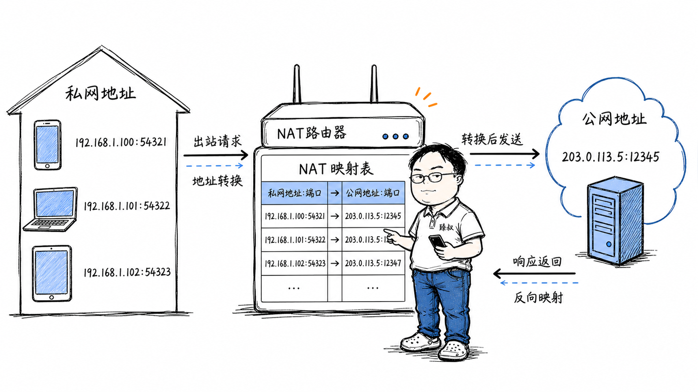

# NAT地址转换：IPv4地址耗尽问题与端口映射穿透原理



---

> 📌 **关注「程序员臻叔」，获取更多硬核技术干货**


---

你家有手机、平板、电脑、智能电视、扫地机器人——十几台设备都连着Wi-Fi，共享一个公网IP上网。它们同时打开网页、看视频、下载文件，数据都从同一个公网IP进出。但路由器收到服务器返回的数据包时，怎么知道这个包是给手机的还是给电脑的？

更诡异的是：你用手机发起微信视频通话，你朋友也在NAT后面，你们俩都没有公网IP——你们是怎么连上的？这就是NAT（网络地址转换）要解决的核心问题，也是P2P打洞技术要克服的最大障碍。

## 核心结论

NAT的核心机制是**地址+端口的映射表**：

1. 内网设备发包出去时，路由器把源地址（内网IP:端口）改成公网IP:新端口，在映射表里记下对应关系
2. 外网回包进来时，路由器查映射表，把目的地址改回内网IP:端口，转发给对应设备
3. 每个TCP/UDP连接在路由器里都有一条映射记录，记录了"公网端口↔内网设备"的对应关系

NAT解决了IPv4地址不够的问题（43亿地址不够全球几十亿设备分），但破坏了互联网"端到端可达"的设计原则——外网无法主动发起连接到内网设备。这就是P2P、远程访问、游戏联机经常遇到困难的根源。

## 深度拆解

### NAT的基本工作流程

假设你家路由器的公网IP是`203.0.113.5`，内网是`192.168.1.0/24`：

关键在于：路由器怎么分配公网端口？它用公网IP的**不同端口**来区分不同内网设备的连接。手机用12345端口，电脑用12346端口，平板用12347端口——一个公网IP有65535个端口可用，足够家庭网络使用。

### 为什么不用"纯地址转换"

早期NAT确实有只改IP不改端口的模式（叫Basic NAT），但它要求每个内网设备分配一个独立公网IP——这不又回到地址不够的问题了吗？

实际使用的是**NAPT（Network Address Port Translation）**，也叫PAT——不仅改IP还改端口。这样多个内网设备可以共享一个公网IP，通过不同端口区分。这才是家用路由器和企业网关实际使用的NAT模式。

### 四种NAT类型——P2P打洞的成败关键

NAT的"严格程度"决定了外网能不能主动连进来。RFC 3489定义了四种NAT类型：

**1. Full Cone NAT（全锥型）——最宽松**

打洞成功率：极高。STUN发现的公网地址可以直接给别人用。

**2. Address-Restricted Cone NAT（地址受限锥型）**

打洞条件：内网设备先向对方发一个包"开洞"，对方才能回连。STUN可以工作。

**3. Port-Restricted Cone NAT（端口受限锥型）**

打洞条件更严格，但STUN仍然可以工作——只要双方都向对方的STUN地址发包开洞。

**4. Symmetric NAT（对称型）——最严格**

这是P2P打洞的噩梦。STUN服务器看到的公网地址是`203.0.113.5:12345`（面向STUN的），但对方真正需要连的是`203.0.113.5:12346`（面向对方的）——STUN发现的地址对对方没用。

对称NAT下的P2P打洞几乎不可能成功，只能退回到TURN中继。

### NAT类型在实际中的分布

根据实际测量，家庭网络的NAT类型分布大致是：

| NAT类型 | 占比 | P2P打洞成功率 |
|---------|------|-------------|
| Full Cone | ~15% | ~100% |
| Address-Restricted | ~30% | ~90% |
| Port-Restricted | ~35% | ~80% |
| Symmetric | ~20% | ~10% |

也就是说，约80%的情况下P2P直连可以成功，约20%需要TURN中继。这就是为什么WebRTC的ICE框架同时包含STUN和TURN——先尝试直连（STUN），不行就中继（TURN）。

### NAT映射的超时问题

NAT设备维护映射表需要内存，不能让映射永久存在。不同协议的超时时间差异很大：

| 协议 | NAT映射超时（典型值） | 说明 |
|------|---------------------|------|
| TCP（ established） | 2-4小时 | 有FIN/RST才清除 |
| TCP（SYN发送后） | 60-120秒 | 半连接超时 |
| UDP | 30-120秒 | 不同设备差异大 |
| ICMP | 10-30秒 | Ping等 |

UDP的超时时间特别短（通常30秒），这对UDP应用影响很大——如果你的应用30秒内没发任何UDP包，NAT映射就过期了，后续包会被丢弃。所以UDP应用必须发心跳包保活。

TCP的NAT超时虽然长（2-4小时），但有些防火墙的"空闲连接"超时更短（15-30分钟）。这就是为什么TCP长连接也需要心跳——目的是防NAT/防火墙清除映射，而非保活TCP连接本身。

### 端口转发 vs UPnP vs DMZ

如果你想从外网主动访问内网设备（比如远程桌面、NAS、监控摄像头），NAT默认不允许——它只处理"内网先发起"的连接。有三种解法：

**端口转发（Port Forwarding）**：手动在路由器上配置"外部端口X → 内网IP:端口Y"。简单可靠，但需要手动配置，IP变了要改。

**UPnP（Universal Plug and Play）**：应用通过UPnP协议自动告诉路由器"帮我开个端口映射"。方便，但有安全风险——恶意软件也可以用UPnP打开端口。

**DMZ（Demilitarized Zone）**：把一台内网设备完全暴露在公网上，所有外部流量都转发给它。最简单但最不安全——相当于这台设备直接在公网上，没有NAT的保护。

### CGNAT——运营商级别的NAT

随着IPv4地址进一步枯竭，很多运营商开始用**CGNAT（Carrier-Grade NAT）**——在运营商层面再做一层NAT。

CGNAT让多个用户共享一个公网IP（类似家庭路由器让多个设备共享一个公网IP）。但这对用户的影响是：**你的设备在两层NAT后面，P2P打洞几乎不可能成功**，端口转发也不行了——你控制不了运营商的CGNAT。

如果你发现家里的公网IP是`100.64.x.x`（CGNAT地址段），说明你在运营商NAT后面，远程访问基本只能靠内网穿透工具（如frp、ngrok）或IPv6。

## 实战要点

### 工程落地

**WebRTC的ICE框架**是处理NAT最成熟的工程方案：

```text
ICE尝试连接的优先级：
1. Host候选地址：同一局域网内直连（延迟最低）
2. Server Reflexive候选地址：通过STUN发现的公网地址（P2P直连）
3. Relay候选地址：通过TURN中继（最后手段，延迟最高但一定能通）
```

**NAT类型检测**（用于诊断）：

```bash
# 使用stun客户端检测NAT类型
apt install stun-client
stun stun.l.google.com:19302

# 输出示例：
# NAT type: Restricted Cone NAT
# External IP: 203.0.113.5
# External Port: 12345
```

**内网穿透工具选型**：

| 工具 | 协议 | 适用场景 | 特点 |
|------|------|---------|------|
| frp | TCP/UDP/HTTP | 远程桌面、内网服务暴露 | 自建服务器，完全可控 |
| ngrok | HTTP/TCP | 开发调试、临时暴露 | 免费版有限制，付费版贵 |
| Tailscale | WireGuard | 组网、设备互联 | 基于WireGuard，零配置 |
| Cloudflare Tunnel | HTTP | Web服务暴露 | 免费但不支持TCP/UDP |

### 臻叔踩坑笔记

1. **UDP NAT保活间隔太长**：应用30秒发一次心跳，但某些NAT设备的UDP超时只有20秒。连接间歇性断开但查不到原因。解法：UDP心跳间隔设置为NAT超时的1/3（通常15-20秒），不要超过30秒

2. **对称NAT导致P2P失败**：用户投诉视频通话经常走中继、延迟高。排查发现用户在运营商CGNAT后面（对称NAT）。解法：引导用户开启IPv6（很多CGNAT场景下IPv6是直连的），或优化TURN服务器位置减少中继延迟

3. **UPnP安全风险**：UPnP自动开放端口方便了用户，但恶意软件也可以利用。P2P下载软件（如迅雷）会通过UPnP开大量端口映射。解法：企业网络禁用UPnP，家用网络如果不需要P2P也可以关闭

4. **NAT端口耗尽**：一台NAT设备有65535个端口，如果内网有大量并发连接（如爬虫服务器），端口可能被耗尽。表现为新建连接失败。解法：增加公网IP数量、优化连接复用、减少短连接

5. **双重NAT问题**：光猫做了一层NAT，路由器又做了一层NAT。端口转发配在路由器上不生效——因为光猫那层NAT没转发。解法：把光猫改为桥接模式，让路由器直接拨号；或者光猫上也配端口转发到路由器

### 一句话总结

> NAT是IPv4地址不够用的"创可贴"——用端口映射让多设备共享一个公网IP，但代价是破坏了端到端可达性。NAT的严格程度（全锥→受限锥→对称）直接决定了P2P能否打洞成功。在IPv6全面普及之前，NAT和围绕它的STUN/TURN/ICE技术栈，是所有实时通信系统必须面对的工程现实。


---

### 🎯 觉得有帮助？关注「程序员臻叔」


---
