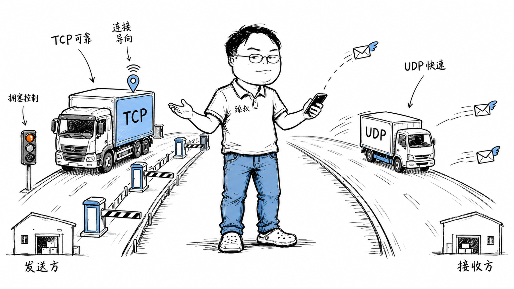

# TCP vs UDP——不是"可靠vs不可靠"那么简单，实时音视频为什么选UDP？



你打微信视频电话，画面流畅，声音清晰。但你知道吗？这个视频流的传输用的是UDP——一个"不可靠"的协议。而同一个App里，你发一条文字消息，走的是TCP——"可靠"的协议。

为什么发消息要可靠，打电话反而不需要可靠？游戏《英雄联盟》用UDP传位置同步，但文件下载却一定用TCP？HTTP/3基于UDP构建，难道不担心丢包吗？

TCP和UDP的选择，远不是"可靠vs不可靠"一句话能概括的。它关乎**延迟容忍度、数据重要性、状态开销**三个维度的权衡。

## 核心结论

TCP和UDP的本质区别不在于"可靠不可靠"，而在于**可靠性由谁负责、在什么层级负责**：

1. **TCP**：内核协议栈负责可靠性——自动重传、自动排序、自动流控。应用层不需要操心，但代价是延迟不可控（丢了就等重传，所有后续数据被阻塞）
2. **UDP**：应用层自己决定要不要可靠——你可以选择不重传（丢了就丢了，实时视频不需要旧帧），也可以自己在应用层实现可靠性（像QUIC那样）

**选择法则**：
- 数据不能丢、延迟可以等 → TCP（文件传输、消息、支付）
- 延迟不能等、数据可以丢 → UDP（实时音视频、游戏同步、DNS查询）
- 需要可靠但又要低延迟 → UDP + 应用层可靠性（QUIC/HTTP3）

## 深度拆解

### TCP和UDP的头部长什么样

先看数据结构，差异一目了然：

TCP头部比UDP多了12-52字节。这些多出来的字段就是可靠性的"账本"：序列号记录发了什么、确认号记录收到了什么、窗口做流控、标志位控制连接状态。UDP啥都不记，发完就完。

### 为什么实时音视频选UDP

视频通话有一个硬约束：**延迟超过200ms，用户体验急剧下降；超过500ms，几乎无法正常对话**。

如果用TCP传实时视频，会发生什么？

假设你正在视频通话，第10帧视频包丢了。TCP会：
1. 检测到丢包（等超时或收到3个重复ACK）
2. 重传第10帧
3. **停止发送第11、12、13帧**，等第10帧重传成功
4. 收到重传的第10帧后，把10、11、12、13帧一起交给应用层

问题在于：等你重传完第10帧，时间已经过了100-200ms。而第10帧是一个100ms前的旧画面——对实时通话来说，旧画面毫无价值。你更希望收到的是当前最新的画面，而不是100ms前的画面。

UDP的做法：第10帧丢了？无所谓。应用层直接用第11帧的数据，或者用第9帧的数据做插值补偿。**丢一帧不影响理解，但延迟200ms影响对话节奏**。

这就是实时音视频的核心权衡：**及时性 > 完整性**。

| 场景 | 延迟敏感度 | 数据丢失容忍度 | 协议选择 |
|------|-----------|--------------|---------|
| 文件下载 | 不敏感 | 零容忍 | TCP |
| 网页加载 | 中等 | 零容忍 | TCP |
| 实时视频通话 | 极高 | 可容忍（丢帧） | UDP |
| 在线游戏位置同步 | 极高 | 可容忍（插值） | UDP |
| 游戏聊天消息 | 低 | 零容忍 | TCP |
| DNS查询 | 中等 | 可重发 | UDP |
| 直播（非互动） | 中等 | 可容忍 | TCP或UDP |

### 游戏里的TCP和UDP混用

《英雄联盟》的网络架构很有意思——它**同时使用TCP和UDP**：

- **TCP**用于：登录认证、匹配、商店购买、聊天消息——这些数据不能丢不能乱，延迟几秒无所谓
- **UDP**用于：位置同步、技能释放、伤害计算——这些数据每秒发几十次，丢几个包用插值补偿，但延迟必须最低

位置同步数据有一个特点：**它有时效性**。你在0.1秒前的位置已经没有意义了——0.1秒后的新位置数据会覆盖它。所以与其花时间重传旧的位置包，不如直接用最新的位置包。TCP会傻乎乎地重传旧包并阻塞新包，UDP则直接丢了就丢了。

但游戏里有些数据必须可靠——比如"你买了装备"。这个包丢了，你的金币扣了但装备没到，那就炸了。所以这类数据走TCP，或者走带可靠性保障的应用层协议（如KCP）。

### QUIC：在UDP上重建可靠性

Google提出的QUIC协议做了一个大胆的选择：**用UDP做底层，在应用层重新实现TCP的所有可靠性机制**。

为什么不在TCP上改，非要另起炉灶用UDP？

原因一：**TCP协议栈在内核里，改不动**。TCP实现在操作系统内核中，想修改一个算法（比如换拥塞控制策略），需要改内核代码、等系统升级。而QUIC在用户态，改起来只需要更新应用版本。

原因二：**TCP的队头阻塞影响HTTP/2**。HTTP/2在一个TCP连接上跑多个流（stream），如果一个流的数据包丢了，TCP层会阻塞所有流，等重传完成。QUIC在每个流上独立做丢包检测和重传——一个流卡了不影响其他流。

```text
HTTP/2 over TCP（队头阻塞）：
Stream A: [1][2][✗丢了][4]  ← 等重传
Stream B: [1][2][3][4]      ← 已经到了，但TCP不交付
Stream C: [1][2][3][4]      ← 同上

HTTP/3 over QUIC（无队头阻塞）：
Stream A: [1][2][✗丢了][4]  ← 只阻塞A
Stream B: [1][2][3][4]      ← 正常交付
Stream C: [1][2][3][4]      ← 正常交付
```

原因三：**连接迁移**。TCP用四元组标识连接，手机切WiFi→4G时IP变了，连接断开。QUIC用连接ID标识，IP变了不影响连接。

原因四：**握手更快**。QUIC把传输层握手和TLS握手合并，首次连接1-RTT，恢复连接0-RTT。而TCP+TLS需要2-3个RTT。

### UDP真的比TCP快吗

一个常见的误解：UDP比TCP快。这话只对了一半。

从**单次发送**来看，UDP确实更快——没有握手、没有确认、没有重传，发出去就完事。DNS查询就是一个经典的UDP应用：客户端发一个请求包，服务器回一个响应包，一来一回就完事，不需要建立连接的开销。

从**持续传输**来看，如果没有丢包，TCP和UDP的吞吐量几乎一样——差异只是TCP头部多12字节。一旦丢包，TCP会降速重传，而UDP直接忽略丢包继续发。所以"UDP更快"的真正含义是"UDP在高丢包率下不降速"——但这不一定是好事，因为不降速意味着可能加剧网络拥塞。

真正的"UDP更快"体现在**首包延迟**：UDP不需要握手，第一个数据包就能携带有效载荷。TCP需要先握手（1个RTT），TLS再握手（1-2个RTT），才能发第一个数据包。

### TCP的"重量级"连接管理

TCP维护一个连接需要不少状态。Linux内核为每个TCP连接分配一个`struct sock`结构体，通常约2KB内存。10万条连接就要200MB。加上发送缓冲区、接收缓冲区（各几KB到几MB），10万条连接可能消耗几个GB的内存。

UDP是无连接的——服务器只需要一个socket就能接收所有客户端的数据包，不需要为每个客户端维护状态。这也是为什么DNS服务器用UDP——一台服务器可以同时服务海量客户端查询。

不过这也有代价：UDP没有流控，如果客户端疯狂发包，服务器可能被淹没。TCP的滑动窗口至少能让接收方告诉发送方"慢一点"。

## 实战要点

### 工程落地

**选型决策树**：

**自定义可靠性层**：如果你需要UDP的低延迟又需要一定的可靠性（比如游戏的关键操作），可以在UDP上实现应用层的ARQ：

- 发送方给每个包编号，接收方回ACK
- 超时未收到ACK就重传
- 但你可以选择"只重传最新的"而非"重传旧的并阻塞新的"

开源方案：KCP协议（快速可靠的ARQ协议，在UDP上实现类似TCP的可靠性，但优化了延迟）、ENet（游戏网络库）。

### 臻叔踩坑笔记

1. **UDP被防火墙拦截**：很多企业防火墙、校园网网关默认只放行TCP，限制或封杀UDP流量。如果你的App依赖UDP（如WebRTC），需要TCP fallback方案。WebRTC的ICE框架就包含了TURN over TCP的回退路径

2. **UDP NAT超时更快**：NAT设备对UDP映射的超时时间通常只有30-120秒（TCP通常是2小时以上）。UDP应用必须发心跳包保活，否则NAT映射过期，后续包被丢弃

3. **UDP无流控导致丢包**：发送方不知道接收方处理不过来，继续猛发，路由器缓冲区溢出丢包。TCP靠滑动窗口自动降速，UDP没有。解法：应用层实现自己的流控（如WebRTC的GCC算法），或限制发送速率

4. **大包分片丢一个全丢**：UDP数据报如果超过MTU（通常1500字节），IP层会分片。任何一个分片丢了，整个数据报都无法重组，全部丢弃。解法：应用层控制包大小在MTU以内（通常1200字节以内安全），或用TCP（它会自己分段）

5. **QUIC的兼容性问题**：部分老旧网络设备不认识QUIC流量（UDP 443端口），可能被丢弃或降级。部署QUIC时需要监测QUIC连接成功率，准备好回退到TCP+TLS的方案

### 一句话总结

> TCP和UDP的选择本质是"谁来负责可靠性"——TCP让内核负责，省心但延迟不可控；UDP让应用层负责，灵活但需要自己干活。没有绝对的好坏，只有场景的匹配：能丢的用UDP，不能丢的用TCP，又不能丢又要快的，就在UDP上自己造可靠性。
