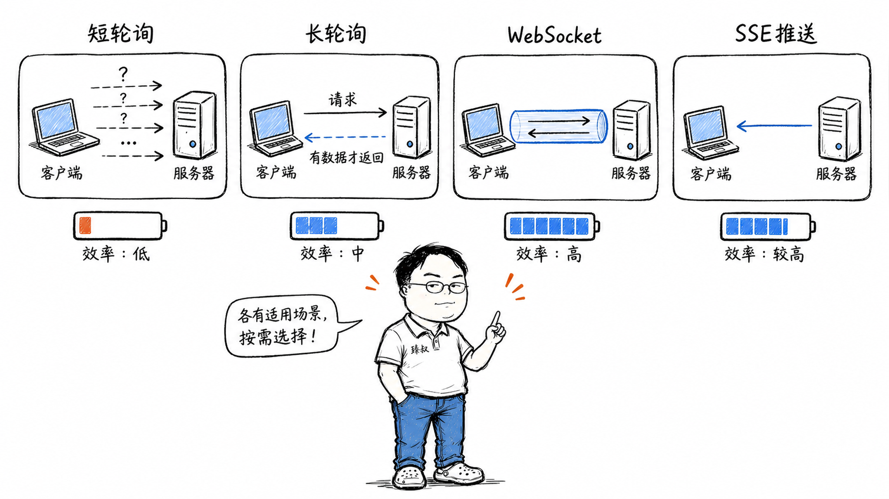

# WebSocket vs HTTP长轮询 vs SSE——实时消息推送，三个方案分别在什么场景是最优解？



你打开股票App，价格每秒跳动。你刷微信，消息秒达。你看直播，弹幕实时飘过。这些场景都需要"服务器主动推送数据到客户端"——但HTTP协议天生是"请求-响应"模式：客户端不问，服务器不能答。

怎么让服务器"主动说话"？工程师们发明了三种方案：HTTP长轮询、SSE、WebSocket。它们各有适用场景，也各有致命短板。选错了方案，轻则性能浪费，重则功能根本跑不起来。

## 核心结论

三种实时推送方案的本质区别在于**通信方向和协议模型**：

1. **HTTP长轮询**——用HTTP模拟双向。客户端发请求，服务器hold住不回，有消息了再回。回完后客户端立刻再发一个。本质是"反复请求"，只是每次请求等很久
2. **SSE（Server-Sent Events）**——基于HTTP的单向推送。服务器在一个HTTP响应里持续发数据，客户端只听不说。适合服务器→客户端的单向推送
3. **WebSocket**——独立的协议（基于TCP），建立后是真正的全双工通信。双方随时互发消息

**选择法则**：
- 只需要服务器推、客户端不需要实时回传 → SSE（最简单）
- 需要双向实时通信 → WebSocket（最强大）
- 不能用WebSocket（环境限制）→ HTTP长轮询（兜底方案）

## 深度拆解

### HTTP长轮询：最古老的"假实时"

短轮询是最原始的方案：客户端每隔2秒发一次HTTP请求问"有新消息吗？"，服务器回答"有"或"没有"。简单粗暴，但问题明显：

- 没有消息时也在频繁发请求，浪费带宽和服务器资源
- 消息有延迟——最坏情况下等一个轮询间隔才能收到

**长轮询（Long Polling）**改进了这一点：

服务器收到请求后，如果有消息就立刻返回；如果没有消息，就**挂起这个请求**（hold住不回），直到有消息或超时（通常30-60秒）才返回。客户端收到响应后立刻再发一个新请求。

长轮询的优点：
- 兼容性好——就是普通的HTTP请求，任何环境都支持
- 实现简单——后端不需要特殊框架，用异步Servlet/异步Controller即可

长轮询的缺点：
- **每次响应后到下次请求之间有空窗期**——消息可能在这个间隙产生，要等下次请求才能收到
- **HTTP头部开销大**——每次请求都带着完整的Cookie、User-Agent等头部（可能1-2KB），实际有效载荷可能只有几十字节
- **服务器连接数压力**——每个客户端始终占着一个HTTP连接在"等"。1万个客户端在线=1万个连接常驻

微信网页版早期就是用长轮询实现的——因为WebSocket在当时的浏览器兼容性还不够好。

### SSE：服务器单向推送的优雅方案

SSE（Server-Sent Events）是HTML5标准的一部分，专门为"服务器→客户端"的单向推送设计。

```text
客户端：
const source = new EventSource('/api/stream');
source.onmessage = (e) => {
    console.log('收到消息:', e.data);
};

服务器响应（一个持续不关闭的HTTP响应）：
Content-Type: text/event-stream

data: {"price": 152.3}

data: {"price": 152.5}

data: {"price": 152.1}
```

SSE的底层就是一个**不关闭的HTTP响应**——服务器持续往响应体里写数据，每条数据用`data: `前缀标记。浏览器原生解析这个流，有新数据就触发`onmessage`回调。

SSE的优势：
- **基于标准HTTP**——不需要特殊协议升级，穿透代理/防火墙无障碍
- **自动重连**——浏览器原生实现，连接断了自动重连，还有`Last-Event-ID`机制让服务器知道断点位置
- **轻量**——没有WebSocket的帧协议开销，就是纯文本流
- **浏览器原生支持**——不需要引入任何库

SSE的局限：
- **单向**——只能服务器→客户端。客户端要发数据得另起一个HTTP请求
- **基于HTTP**——受HTTP连接限制。HTTP/1.1下浏览器对同域名最多6个连接，SSE占一个，其他HTTP请求就少一个
- **文本协议**——不支持二进制数据传输
- **连接数限制**——HTTP/1.1下同一域名最多6个SSE连接（HTTP/2下没有这个限制）

**典型应用场景**：股票行情推送、新闻直播流、服务器日志流、GitLab CI日志输出、ChatGPT的流式回复（用SSE或类似的流式HTTP）。

### WebSocket：真正的全双工通信

WebSocket（2011年标准化为RFC 6455）不是HTTP的扩展，而是一个**独立的协议**——只是它借用HTTP完成初始握手。

**握手过程**：

```http
客户端请求（HTTP Upgrade）：
GET /ws HTTP/1.1
Host: example.com
Upgrade: websocket
Connection: Upgrade
Sec-WebSocket-Key: dGhlIHNhbXBsZSBub25jZQ==
Sec-WebSocket-Version: 13

服务器响应：
HTTP/1.1 101 Switching Protocols
Upgrade: websocket
Connection: Upgrade
Sec-WebSocket-Accept: s3pPLMBiTxaQ9kYGzzhZRbK+xOo=
```

握手完成后，TCP连接从HTTP协议"切换"为WebSocket帧协议。之后的数据传输不再是HTTP请求/响应——而是WebSocket帧：

WebSocket帧头部只有2-14字节，比HTTP请求头小100倍。高频小消息场景下，这个差异非常显著。

**WebSocket的核心优势**：

- **全双工**——双方随时发消息，不需要"请求-响应"模式
- **低开销**——帧头部极小，适合高频小消息
- **支持二进制**——可以传图片、音频、视频流
- **自定义协议**——握手后就是裸TCP，你想在上面跑什么协议都行

**WebSocket的典型应用**：
- 即时通讯（微信、钉钉的Web版）
- 多人协同编辑（Google Docs、Figma）
- 在线游戏（棋牌、回合制）
- 实时数据看板
- WebRTC的信令通道

### 为什么WebSocket在企业网络里经常挂

WebSocket的握手借用了HTTP 101（Switching Protocols），但之后的通信不再是标准HTTP。这导致它经常被企业网络设备拦截：

**问题一：HTTP代理不支持Upgrade**。很多企业HTTP代理只处理标准的HTTP请求/响应，不认识`Upgrade: websocket`头，直接丢弃或返回错误。

**问题二：超时断开**。企业防火墙通常对空闲连接有超时限制（30-120秒）。WebSocket如果长时间不发数据，防火墙会默默关闭连接。解法：客户端定时发心跳（Ping/Pong帧），通常每30秒一次。

**问题三：负载均衡器不友好**。WebSocket连接是持久的，请求不会"结束"。传统的轮询式负载均衡（一个请求分配到一台机器）需要特殊配置——同一个WebSocket连接的所有帧必须路由到同一台后端服务器。Nginx的`proxy_pass`需要配置`proxy_http_version 1.1`和`Upgrade`头转发。

```nginx
location /ws {
    proxy_pass http://backend;
    proxy_http_version 1.1;
    proxy_set_header Upgrade $http_upgrade;
    proxy_set_header Connection "upgrade";
    proxy_read_timeout 3600s;  # WebSocket长连接超时
}
```

### 三种方案对比

| 特性 | HTTP长轮询 | SSE | WebSocket |
|------|-----------|-----|-----------|
| 通信方向 | 双向（模拟） | 单向（服务器→客户端） | 全双工 |
| 底层协议 | HTTP | HTTP | TCP（独立协议） |
| 浏览器兼容 | 全部 | 95%+ | 95%+ |
| 穿透防火墙 | 好 | 好 | 差（经常被拦） |
| 头部开销 | 大（每次请求） | 小（初次连接后） | 极小（2-14字节帧头） |
| 二进制支持 | × | × | ✓ |
| 自动重连 | 需手动实现 | 浏览器原生 | 需手动实现 |
| 连接数限制 | HTTP/1.1下6个 | HTTP/1.1下6个 | 无限制 |
| 服务器实现复杂度 | 低 | 低 | 中 |
| 适合场景 | 兜底方案 | 推送通知、行情流 | 聊天、游戏、协同 |

## 实战要点

### 工程落地

**方案决策树**：

**降级策略**：实时性要求高的Web应用通常实现多级降级：

实际上现代浏览器都支持WebSocket，降级方案更多是为了穿透企业防火墙——先尝试WebSocket，连不上就检测是否被拦截，自动切到SSE或长轮询。

### 臻叔踩坑笔记

1. **WebSocket连接泄漏**：客户端关闭页面时没有正确关闭WebSocket连接，服务器侧的连接变成僵尸。解法：服务器侧设置空闲超时自动断开，客户端在`beforeunload`事件中主动关闭连接

2. **SSE在HTTP/1.1下占连接数**：浏览器对同一域名最多6个HTTP/1.1连接。一个SSE占用一个，剩下5个给其他HTTP请求。如果开了多个标签页，连接数很快就用完了。解法：SSE走独立子域名，或升级到HTTP/2

3. **长轮询的消息丢失窗口**：服务器返回响应后、客户端发下一个请求之前，如果产生了新消息，这个消息要等下一次请求才能收到。解法：服务器在响应里附带"当前最新消息ID"，客户端下次请求带上这个ID，服务器补发缺失的消息

4. **WebSocket心跳间隔不合理**：间隔太长，防火墙已经断开连接了你还不知道；间隔太短，浪费带宽和电量（移动端）。经验值：30秒发一次Ping，60秒没收到Pong就认为连接断了

5. **Nginx WebSocket代理不转发头**：忘了配置`proxy_set_header Upgrade`和`Connection "upgrade"`，导致WebSocket握手失败。Nginx 1.3+才支持WebSocket代理，老版本需要打补丁或用HAProxy替代

### 一句话总结

> 实时推送三方案的本质差异是"通信模型"——长轮询用HTTP模拟双向（最兼容但最低效），SSE用HTTP实现单向推送（最简单），WebSocket用独立协议实现全双工（最强但最复杂）。没有银弹——SSE适合"听"，WebSocket适合"聊"，长轮询是"实在没法了"的兜底。
