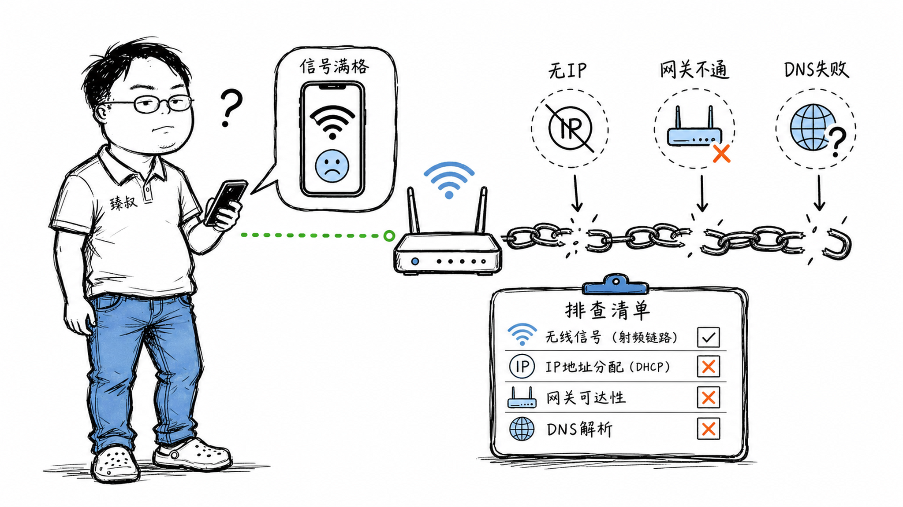

# "Wi-Fi满格却不能上网"——你连上了路由器，但路由器没连上互联网



这大概是每个人都遇到过的最烦人的网络问题——手机上Wi-Fi图标满格，信号强度极好，但就是打不开网页、刷不出消息。你重启手机、忘记网络重新连接、甚至重启路由器，有时候好了，有时候还是不行。

这个现象的本质是什么？你的手机和路由器之间的连接（二层链路）是好的——信号满格说明物理层和数据链路层正常。但路由器到互联网的连接（三层网络）出了问题——可能路由器自己没拿到IP、DNS不工作、或者NAT配置错了。

"连上了Wi-Fi"和"能上网"是两件完全不同的事。理解了这个分层关系，你才能有效排查网络问题。

## 核心结论

网络连接按OSI模型分层，每一层解决不同的问题：

1. **物理层（L1）**：Wi-Fi信号——你的手机和路由器之间有无线电波通信
2. **数据链路层（L2）**：Wi-Fi关联——手机和路由器完成了802.11认证和关联，拿到了MAC层连接
3. **网络层（L3）**：IP连通性——手机拿到了IP地址，路由器有到互联网的路由
4. **传输层（L4）**：DNS和端口连通——DNS能解析，TCP/UDP能到目的地

"Wi-Fi满格"只保证了L1和L2正常。"不能上网"通常是L3或L4出了问题。而DHCP是连接L2和L3的桥梁——它负责给设备分配IP地址，没有IP地址，你的设备就像一个有电话但没有号码的人。

## 深度拆解

### Wi-Fi连接的四个阶段

你以为"连上Wi-Fi"是一瞬间的事，实际上手机和路由器之间完成了四个步骤：

Wi-Fi满格只表示阶段1-3完成了。如果阶段4（DHCP）出了问题——手机没有IP地址，就无法进行任何网络通信。这时候手机通常会显示"已连接但无法访问互联网"。

### DHCP——网络层的"分配工牌"

DHCP（Dynamic Host Configuration Protocol）的工作流程：

DHCP分配的IP地址有**租约（Lease）**——通常24小时。租约到期前，手机会发DHCP Renew续约。如果路由器没响应续约，租约到期后IP被收回，手机断网。

**DHCP常见问题**：

- **DHCP地址池耗尽**：路由器配置的地址池只有50个IP（如192.168.1.100-150），但网络里有60台设备。第51台设备发DHCP Discover没人回应——拿不到IP，无法上网
- **DHCP响应丢失**：Wi-Fi环境干扰导致DHCP Offer或ACK丢包，手机一直卡在Discover阶段。解法：关闭Wi-Fi重连，重新触发DHCP流程
- **多个DHCP服务器冲突**：网络里接了两个路由器（如光猫和路由器都开了DHCP），设备可能从错误的服务器拿到错误的IP配置

### "连上了但不能上网"的五种原因

**原因一：路由器WAN口没拿到IP**

排查：登录路由器管理页面，看WAN口状态。如果WAN口IP是0.0.0.0或169.254.x.x（APIPA自动私有地址），说明路由器没连上互联网。

**原因二：DNS不工作**

这是最常见的"Wi-Fi连了但打不开网页"的原因。手机能连到路由器，路由器能连到互联网，但DNS解析失败了。

排查：`ping 8.8.8.8`能通但`ping www.baidu.com`不通 → DNS问题。解法：手动设置DNS为8.8.8.8或114.114.114.114。

**原因三：IP地址冲突**

排查：`arp -a`看ARP表，如果同一个IP对应两个MAC地址，就是冲突了。解法：找到手动设置IP的设备改成DHCP，或修改冲突的IP。

**原因四：路由器NAT表满了**

排查：路由器管理页面看NAT/连接数统计。解法：限制P2P软件连接数，或换个NAT表更大的路由器。

**原因五：Wi-Fi认证成功但实际通信质量差**

排查：用Speedtest测速。如果信号满格但速率<1Mbps，可能是干扰或路由器性能问题。解法：换5GHz频段（干扰少）、换Wi-Fi信道、升级路由器。

### 为什么有时候重启就好了

"重启路由器"是解决网络问题的万能咒语。它为什么经常有效？

1. **清空NAT映射表**：重启后NAT表清空，堆积的僵尸映射（已断开但未清除的连接）被清理
2. **重新拨号获取IP**：WAN口重新DHCP/PPPoE，可能拿到新的IP和DNS
3. **清空DHCP租约**：所有设备的IP租约重置，重新分配
4. **重置DNS缓存**：路由器的DNS缓存清空，可能解析到新的IP
5. **重置Wi-Fi状态机**：路由器的Wi-Fi芯片重新初始化，可能修复固件bug导致的异常状态

但重启治标不治本——如果根因是地址池太小、NAT表不够、DNS配置错误，重启后问题还会重现。

### 网络排查方法论

遇到"连了Wi-Fi但不能上网"，按以下顺序排查：

每一步把问题范围缩小一层，不需要猜，直接定位。

## 实战要点

### 工程落地

**常用排查命令**：

```bash
# macOS/Linux
ifconfig | grep inet       # 查看IP地址
netstat -rn                # 查看路由表（默认网关）
dig www.baidu.com          # DNS查询
traceroute 8.8.8.8         # 追踪到目标的路径
arp -a                     # 查看ARP表

# 看DHCP租约信息
# macOS
ipconfig getpacket en0     # 查看DHCP分配的完整信息

# Linux
cat /var/lib/dhcp/dhclient.leases  # DHCP租约文件
```

**路由器管理要点**：
- 定期检查DHCP地址池使用率，不要设太小
- 固件保持更新，很多"莫名断网"是固件bug
- 5GHz和2.4GHz分开SSID，减少干扰
- 关闭WMM Power Save（可能导致某些设备断流）

### 臻叔踩坑笔记

1. ** captive portal拦截**：连了公共Wi-Fi（如咖啡店、酒店），信号满格但网页打不开——因为需要先在浏览器里登录认证。解法：打开任意HTTP网站（不是HTTPS），会被重定向到认证页面；或用`curl http://neverssl.com`触发重定向

2. **IPv6配置问题**：路由器广播了IPv6前缀（RA），设备生成了IPv6地址，但路由器的IPv6路由没配好——设备优先用IPv6发请求（Happy Eyeballs），但IPv6路由不通，导致延迟或超时。解法：暂时关闭路由器IPv6，或修复IPv6路由配置

3. **MTU不匹配**：VPN或PPPoE链路的MTU比标准以太网小（1492 vs 1500）。大包被丢弃，小包能通——表现为"能ping通但网页打不开"（TCP握手的小包能过，HTML的大包被丢）。解法：路由器设置MSS Clamping，或调小设备MTU

4. **DHCP租约到期不续**：手机休眠时DHCP租约过期，唤醒后没有自动续约——手机以为自己还有IP，但路由器已经把这个IP分给别人了。解法：手机重启Wi-Fi；路由器缩短DHCP租约时间（如1小时），让设备更频繁续约

5. **Wi-Fi漫游导致断网**：手机从路由器A漫游到路由器B，Wi-Fi关联换了但IP没更新（如果两个路由器在不同子网）。解法：部署同一子网的Wi-Fi Mesh（如802.11r/k/v快速漫游），或让设备禁用自动漫游

### 一句话总结

> "Wi-Fi满格但不能上网"是L1/L2（物理/链路层）正常但L3/L4（网络/传输层）故障的典型表现。Wi-Fi信号好只代表手机和路由器之间的无线电通信正常——但路由器自己有没有联网、DHCP有没有给你分配IP、DNS能不能解析、NAT表有没有满，每一环都可能是断网的原因。按"ping网关→ping公网IP→ping域名"的顺序排查，三步定位问题。
