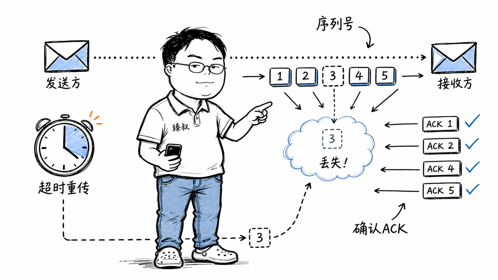

# 可靠传输协议设计：确认重传、滑动窗口与拥塞控制机制



---

> 📌 **关注「程序员臻叔」，获取更多硬核技术干货**


---

你给朋友发了一条微信，显示"已发送"。对方说没收到。你说"不可能啊，手机上明明打了勾"。这个小小的"勾"背后，藏着一个计算机科学里最经典的设计难题——**在不可靠的网络上，怎么实现可靠的传输？**

互联网的物理层是"尽力而为"的：数据包可能丢、可能乱序、可能重复、可能延迟到几秒后才到。TCP协议用了半个世纪，在这片"混沌"之上建起了一座"可靠传输"的大厦。如果你站在TCP发明者的位置上，面对同样的问题，你会怎么设计？

## 核心结论

可靠传输远不止"发出去就万事大吉"，它要解决**三个根本问题**：

1. **丢包恢复**——包丢了怎么办？靠**序列号 + 确认 + 重传**（ARQ机制）
2. **乱序重组**——包到了但顺序错了怎么办？靠**序列号 + 接收缓冲区排序**
3. **流量控制**——发送方太快、接收方来不及处理怎么办？靠**滑动窗口**让接收方告诉发送方"我还能收多少"

TCP在这三个基础上还加了**拥塞控制**，防止中间的网络路由器被压垮。四层防线叠加，才有了你手机上那个可靠的"已发送"勾。

## 深度拆解

### 第一道防线：序列号——给每个字节编号

如果所有数据包都长得一样，你根本没法知道哪个丢了、哪个重复了、哪个乱序了。TCP的解法极其简单粗暴：**给发送的每一个字节都编一个序号**。

注意，TCP的序列号表示的是"第几个字节"，而非"第几个包"。假设第一个字节的序列号是1000（ISN，Initial Sequence Number），你发了三个各100字节的包，那么它们的序列号分别是1000、1100、1200。

为什么用字节编号而不是包编号？因为TCP是一个**面向字节流**的协议——应用层交给TCP的是一串连续的字节流，TCP自己决定怎么切分成包发送。如果用包编号，切分方式一变，序号就对不上了。字节编号则与切分方式无关，不管你怎么切，每个字节的全局位置是固定的。

```text
发送端字节流：
[H][e][l][l][o][ ][W][o][r][l][d]
ISN = 1000

可能的分包方式（TCP自己决定）：
包1: seq=1000, data="Hello"     (1000-1004)
包2: seq=1005, data=" World"    (1005-1010)

换个分法也行：
包1: seq=1000, data="He"        (1000-1001)
包2: seq=1002, data="llo W"     (1002-1006)
包3: seq=1007, data="orld"      (1007-1010)
```

ISN不从0或1开始，它用一个计数器每4微秒加1（约4.5小时绕一圈），这是为了防止旧连接的延迟报文干扰新连接。

### 第二道防线：确认与重传——包丢了就再发

发送方发出一个包后，怎么知道对方收到了？TCP的答案是**确认号（ACK）**。

接收方收到数据后，回一个ACK，里面的确认号 = 收到的最后一个**连续**字节的序列号 + 1。意思是"你发到seq=1099的数据我都收到了，我期待你下一个发seq=1100"。

注意"连续"二字。如果你收到了seq=1000和seq=1200，但中间的seq=1100丢了，你只能ACK 1000（准确说是ACK 1100，表示"期待1100"）。这叫**累积确认**——只确认连续到达的部分。

发送方等一段时间（RTO，Retransmission Timeout），如果还没收到ACK，就认为包丢了，重传。这就是最基础的**ARQ（Automatic Repeat reQuest，自动重传请求）**机制。

但"等多久"是个大学问：

- 等太短：包可能只是延迟了，没丢，你白重传一份，浪费带宽
- 等太长：包真的丢了，但你干等着，延迟增加

TCP的解法是**动态计算RTO**：持续测量RTT（往返时延），RTO = 平滑RTT × 系数（通常2倍）。网络快的时候RTO短，网络慢的时候RTO长。

```
SRTT = (1 - α) × SRTT + α × RTT_sample   // α通常=1/8
RTTVAR = (1 - β) × RTTVAR + β × |SRTT - RTT_sample|  // β通常=1/4
RTO = SRTT + max(G, 4 × RTTVAR)  // G是时钟粒度
```

### 第三道防线：快重传——别等超时了

超时重传有个致命问题：RTO通常几十到几百毫秒，这段时间发送方完全在空等。如果每个丢包都要等超时，延迟会非常糟糕。

TCP加入了**快重传（Fast Retransmit）**机制：如果发送方连续收到**3个重复ACK**，就认为这个包丢了，立刻重传，不等超时。

为什么是3个？因为网络中偶尔出现一两个乱序包是正常的（包走了不同路径，先发的后到）。收到1-2个重复ACK可能是乱序，不一定是丢包。但连续3个重复ACK，丢包的概率就非常高了。

快重传之后还有**快恢复（Fast Recovery）**：不把拥塞窗口砍到1（那是慢启动的事），而是减半，然后进入拥塞避免阶段线性增长。这样恢复更快。

| 丢包检测方式 | 触发条件 | 响应动作 | 窗口调整 |
|---|---|---|---|
| 超时重传 | RTO内未收到ACK | 重传该包 | cwnd=1，进入慢启动 |
| 快重传 | 3个重复ACK | 立即重传该包 | cwnd减半，进入快恢复 |

### 第四道防线：滑动窗口——别一个一个发，一批一批来

如果每发一个包就等ACK回来再发下一个，效率极低——大部分时间在等。这叫**停等协议（Stop-and-Wait）**，利用率约等于 包大小 / (带宽 × RTT)，在高速网络上利用率可能不到1%。

TCP引入了**滑动窗口（Sliding Window）**机制：发送方可以连续发送多个包，不需要等每个ACK。窗口大小决定了"在未收到确认的情况下，最多能发多少数据"。

```
发送窗口（Window = 4）：
[1][2][3][4]  [5][6][7][8]
 ^^^^^^^^^^    ^^^^^^^^^^
 已发送未确认   可发送但未发

收到ACK 2后，窗口滑动：
[1][2][3][4]  [5][6][7][8]  [9][10]
    ^^^^^^^^^^  ^^^^^^^^^^
    已发送未确认   可发送但未发
```

窗口的大小由**接收方**通过TCP头部的Window字段告诉发送方："我的接收缓冲区还能收多少字节"。这就是**流量控制（Flow Control）**——接收方主动告诉发送方"你别发太快，我处理不过来"。

如果接收方Window=0，发送方必须停下来。但接收方处理完数据后，会发一个Window Update通知发送方可以继续发。为了防止这个更新包丢了导致死锁，发送方会定期发**窗口探测（Window Probe）**包。

### 第五道防线：拥塞控制——不是接收方的问题，是网络的问题

流量控制保护的是接收方，但网络中间的路由器也可能被压垮。如果所有TCP连接都按接收窗口大小猛发，路由器缓冲区溢出，丢包率飙升，所有人的速度都掉下来——这叫**拥塞崩溃（Congestion Collapse）**。

1986年10月，互联网经历了第一次有记录的拥塞崩溃：某条链路的吞吐量从32kbps跌到了40bps——降了800倍。Van Jacobson为此发明了TCP拥塞控制，核心思想是**探测网络容量，温和地加速，遇到问题快速退让**。

四个算法阶段：

1. **慢启动**：连接刚开始，cwnd=1（1个MSS），每收到一个ACK，cwnd翻倍。指数增长，快速探测容量
2. **拥塞避免**：cwnd到达ssthresh后，改为每RTT加1（线性增长）。温和地试探上限
3. **快重传**：3个重复ACK，立刻重传丢失的包
4. **快恢复**：ssthresh = cwnd/2，cwnd = ssthresh，进入拥塞避免

BBR算法（Google 2016年提出）更进一步——不靠丢包判断拥塞，而是直接测量瓶颈带宽和最小RTT，把发送速率卡在两者乘积上。在长肥管道（高带宽×高延迟）上效果显著。

## 实战要点

### 工程落地

在实际工程中，TCP的可靠传输机制通常是透明的——你调`socket.send()`，数据就可靠地到了对方。但理解这些机制在以下场景至关重要：

**场景一：长连接心跳设计**。TCP连接空闲时间过长，中间的NAT设备或防火墙会清除映射表，导致连接"假死"。你的心跳间隔必须小于NAT超时时间（一般建议30-60秒）。如果用TCP KeepAlive，默认7200秒太长，需要调到30秒以内。

**场景二：连接迁移**。TCP连接用四元组（源IP、源端口、目的IP、目的端口）标识。手机从WiFi切4G，IP变了，连接断开。如果你的App需要无缝切换，考虑用QUIC（连接ID标识，不依赖IP）。

**场景三：吞吐优化**。高BDP（带宽×延迟）链路上，TCP窗口可能不够大。Linux的`tcp_window_scaling`和`tcp_rmem`/`tcp_wmem`参数需要调优。一条100Mbps、200ms RTT的链路，BDP约2.5MB，窗口至少要这么大才能跑满。

### 臻叔踩坑笔记

1. **TIME_WAIT堆积**：主动关闭连接的一方进入TIME_WAIT状态，持续2MSL（通常60-120秒）。高并发短连接场景下，TIME_WAIT可能耗尽端口。解法：启用`tcp_tw_reuse`（复用TIME_WAIT连接）、改用长连接、或用连接池

2. **Nagle算法与小包延迟**：Nagle算法会把小包攒成大包再发，减少网络开销。但它和延迟ACK配合时可能产生"互相等待"——Nagle等数据攒够，延迟ACK等下一个包来了一起回。结果延迟翻倍。解法：对延迟敏感的场景`TCP_NODELAY`关掉Nagle

3. **SYN Flood攻击**：攻击者发大量SYN但不回ACK，服务器的半连接队列被耗尽。解法：SYN Cookie（不在服务器端保存状态，把状态编码进SYN-ACK的序列号）、或限制半连接队列速率

4. **重传风暴**：在网络抖动时，大量连接同时超时重传，进一步加剧拥塞。解法：在应用层做指数退避重试、限制重试并发数、或用断路器模式

5. **零窗口死锁**：接收方发了Window=0后，窗口更新包丢了，双方互相等待。TCP有窗口探测机制，但探测间隔可能较长。应用层最好加超时主动关闭死连接

### 一句话总结

> 可靠传输的本质是"编号 + 确认 + 重传 + 窗口"四件套——序列号让包可追踪，确认让发送方知道状态，重传恢复丢包，窗口控制节奏。TCP用半个世纪证明了这套方案的有效性。


---

### 🎯 觉得有帮助？关注「程序员臻叔」


---
