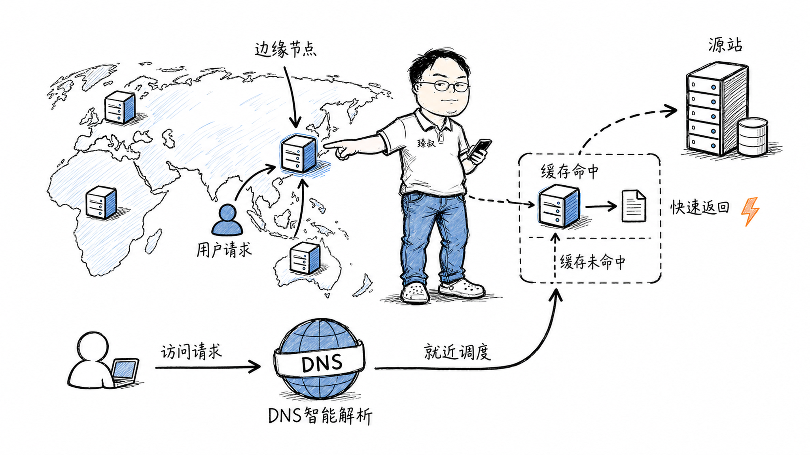

# CDN系统设计：内容缓存的分发策略与调度机制



---

> 📌 **关注「程序员臻叔」，获取更多硬核技术干货**


---

你在北京上传了一个视频到B站。一个纽约的用户打开了这个视频——如果他从北京的服务器下载，光网络传输就要几百毫秒的延迟，加上TCP握手、TLS协商，首帧可能要2-3秒才能出来。但如果视频副本就在纽约的CDN节点上，首帧可能100ms就出来了。

这就是CDN（Content Delivery Network）要解决的核心问题：**把内容复制到离用户最近的地方**。听起来简单——不就是把文件复制到各地服务器上吗？但当你面对全球部署、海量内容、动态热点、缓存一致性、流量调度等问题时，设计一个生产级CDN的复杂度远超想象。

## 核心结论

CDN的设计本质是**缓存层级 + 调度系统 + 回源机制**三位一体：

1. **边缘节点（Edge）**：部署在全球各地，离用户最近，直接响应用户请求。缓存命中率决定性能
2. **调度系统**：通过DNS调度/HTTP 302调度/Anycast，把用户导向最近的、健康的边缘节点
3. **回源机制**：边缘节点缓存未命中时，向上层节点或源站请求内容。回源策略决定缓存效率

一个成熟的CDN通常有三层缓存：**边缘节点 → 区域汇聚节点 → 源站**。边缘未命中就问区域，区域未命中才回源站——层层缓存减少回源压力。

## 深度拆解

### 第一步：边缘节点的缓存设计

边缘节点本质是一个**带大容量磁盘/SSD的缓存服务器**。当用户请求一个文件时：

**缓存淘汰算法选择**：

| 算法 | 原理 | 适合场景 | CDN场景适用性 |
|------|------|---------|-------------|
| LRU（最近最少使用） | 淘汰最久没被访问的 | 通用场景，访问模式均匀 | 大多数CDN默认选择 |
| LFU（最不经常使用） | 淘汰访问次数最少的 | 有明显热点区分 | 热点内容长期缓存 |
| TTL（过期时间） | 到时间就过期 | 需要新鲜度保证 | 配合LRU/LFU使用 |
| Size-aware LRU | 大文件优先淘汰 | 磁盘空间有限 | 视频CDN常用 |

**为什么CDN通常选LRU而不是LFU**？LFU记录每个文件的访问次数，需要维护额外的计数器。对于CDN这种海量文件场景（一个节点可能缓存数百万个文件），LFU的元数据开销太大。LRU只需要一个双向链表+哈希表，实现简单，内存开销小。

但实际上，CDN的缓存策略通常是**LRU + TTL + 分级**的组合：

- 热门文件：TTL长，缓存层级高（边缘节点就有）
- 温门文件：TTL中等，缓存层级中（区域节点才有）
- 冷门文件：TTL短或不缓存，按需回源

### 第二步：内容分发——怎么把内容放到边缘节点

**拉模式（Pull）**：用户请求时，边缘节点没有就去源站拉。这是CDN最基本的工作模式——按需缓存。优点是不浪费存储（没人访问的文件不缓存），缺点是第一个用户会慢（Cache Miss回源）。

**推模式（Push/预热）**：源站主动把内容推到边缘节点。适合有预知的热点内容——比如新电影上线、大型直播开始前、App新版本发布。运营人员提前触发预热，让所有边缘节点都有副本，第一个用户就能命中。

**动态加速（DCDN）**：对于不可缓存的动态内容（API请求、个性化页面），CDN通过优化传输路径来加速——比如让请求走CDN的专用骨干网，绕过拥堵的公共互联网。这不需要缓存，只优化路由。

### 第三步：DNS智能调度——把用户导向最近的节点

CDN的调度是整个系统的大脑。最常用的调度方式是**DNS调度**：

DNS调度的局限：**DNS有缓存**。用户本地DNS服务器会缓存解析结果，TTL通常几十秒到几分钟。如果一个节点挂了，DNS改成另一个节点，但要等TTL过期才全球生效。所以DNS调度不适合做实时故障切换。

**HTTP 302调度**：用户请求先到达一个调度中心，调度中心返回302重定向到最优边缘节点。优点是实时调度（没有DNS缓存问题），缺点是多了一次往返。

**Anycast调度**：同一个IP在多个地理位置广播。路由协议（BGP）自动把用户请求路由到最近的节点。优点是自动故障切换（节点挂了BGP自动收敛），缺点是需要控制BGP广播，只有大型CDN厂商有能力部署。

### 第四步：缓存刷新——内容更新了怎么办

源站的文件更新了，但CDN边缘节点还在返回旧版本——这是CDN最常见的问题。

**缓存刷新（Purge）**：主动通知所有边缘节点删除某个URL的缓存。下次用户请求时边缘节点会回源拉新版本。刷新通常是秒级到分钟级生效。

**缓存预热（Prefetch）**：刷新后立刻把新版本推到边缘节点，不等用户请求触发回源。

**版本化URL**：最优雅的方案。文件名带hash：`app.abc123.js`。内容更新后文件名变成`app.def456.js`。HTML引用新文件名，旧文件可以永久缓存（`Cache-Control: max-age=31536000, immutable`），新文件按需缓存。不需要刷新任何缓存。

### 第五步：缓存命中率优化

CDN的性能直接取决于缓存命中率。命中率90%意味着10%的请求要回源，回源延迟远高于缓存命中。

**影响命中率的关键因素**：

1. **内容热度分布**：互联网内容访问遵循长尾分布——前20%的内容贡献80%的流量。热门内容缓存命中率高，冷门内容命中率低。优化重点在热门内容的预热和缓存时间

2. **缓存容量**：边缘节点磁盘有限。如果缓存满了频繁淘汰，命中率下降。需要监控缓存淘汰率（eviction rate），过高说明容量不够

3. **URL参数**：`/image.jpg?token=abc`和`/image.jpg?token=def`在CDN看来是两个不同的URL——同一个图片因为token不同被缓存多份。解法：CDN配置忽略指定URL参数

4. **Vary头**：如果响应头有`Vary: Accept-Encoding`，CDN会为gzip和br分别缓存一份。合理的Vary可以避免缓存串用，但过多的Vary维度会降低命中率

### CDN架构全景

## 实战要点

### 工程落地

**CDN选型考量**：

- **覆盖范围**：你的用户在哪里？国内用阿里云/腾讯云CDN，全球用Cloudflare/Akamai/CloudFront
- **回源成本**：CDN回源到你的源站，源站带宽可能产生费用。低命中率=高回源成本
- **刷新速度**：内容更新频繁的业务需要快速刷新能力
- **HTTPS支持**：是否支持自带证书、免费证书、HTTP/2、HTTP/3
- **日志和监控**：是否提供实时日志、命中率报表、异常告警

**缓存策略配置模板**：

```
# 静态资源（CSS/JS/图片/字体）
Cache-Control: public, max-age=31536000, immutable
（文件名带hash，永久缓存）

# HTML文档
Cache-Control: public, max-age=60, s-maxage=300
（浏览器60秒，CDN 300秒）

# API响应
Cache-Control: no-cache
（不走CDN缓存，或用短s-maxage）

# 用户上传内容（头像等）
Cache-Control: public, max-age=86400
（缓存一天，更新时刷新）
```

### 臻叔踩坑笔记

1. **CDN缓存了错误内容**：源站返回了500错误页面，CDN把它缓存了，后续用户都看到500。解法：配置CDN不缓存4xx/5xx响应；源站返回错误时设置`Cache-Control: no-cache`

2. **跨域问题**：CDN域名和源站域名不同，CORS没配好导致字体/图片加载失败。解法：CDN配置`Access-Control-Allow-Origin`头透传或固定设置

3. **回源风暴**：大量缓存同时过期，瞬间大量请求回源，源站被压垮。解法：给缓存过期时间加随机抖动（`max-age=3600 + random(0, 600)`）；预热热点内容

4. **CDN节点被劫持**：小运营商的DNS劫持把CDN域名解析到自己的缓存服务器，返回过时内容。解法：启用HTTPS（劫持者无法伪造证书）；用HTTPDNS绕过运营商DNS

5. **直播流CDN的延迟累积**：HLS直播基于分片，每个分片6-10秒，CDN缓存多个分片导致端到端延迟30-60秒。解法：用LL-HLS（低延迟HLS）或WebRTC降低延迟到3-5秒；或用FLV/RTMP推流+HTTP-FLV拉流

### 一句话总结

> CDN的本质是"把内容推到离用户最近的地方"，通过边缘缓存+智能调度+回源机制三层架构，让全球用户都能毫秒级获取内容。设计CDN的核心挑战不在"存副本"（那只是复制文件），而在缓存命中率优化、调度准确性和缓存一致性的平衡：命中率决定性能，调度决定体验，一致性决定正确性。


---

### 🎯 觉得有帮助？关注「程序员臻叔」


---
