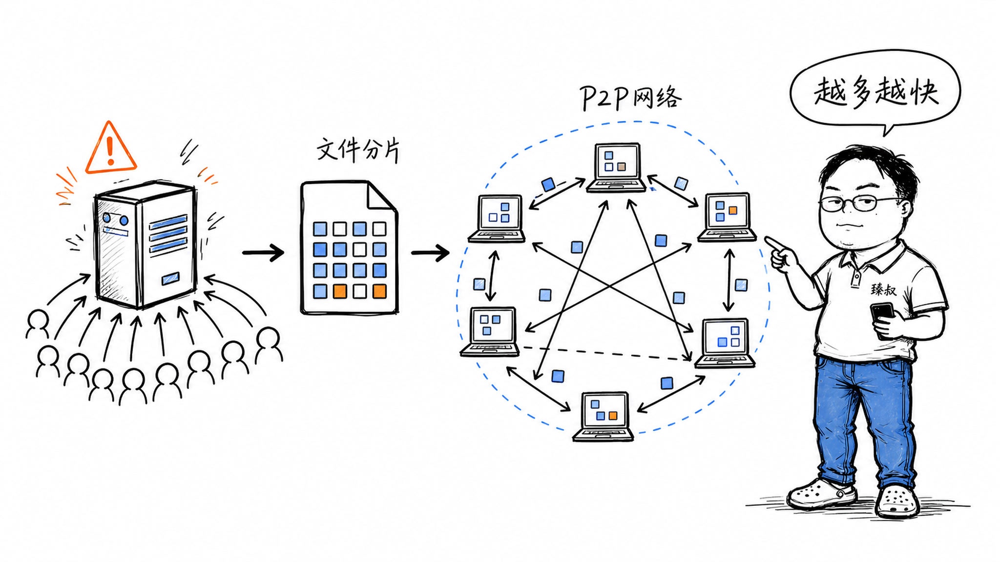

# P2P文件分发系统设计：去中心化传输架构与NAT穿透方案



---

> 📌 **关注「程序员臻叔」，获取更多硬核技术干货**


---

你发布了一个新游戏，安装包50GB。如果所有用户都从你的服务器下载，1万个同时下载的用户需要50GB × 10000 = 500TB的出口流量。你的带宽费用会爆炸，而且用户体验差——服务器带宽有限，下载速度越来越慢。

BitTorrent给出了一个反直觉的答案：**让下载者同时也是上传者**。每个人下载的同时把已下载的部分分享给其他人。下载的人越多，可用的上传源就越多，每个人的下载速度反而越快。这个设计巧妙到运行了20年还在用。

但"下载的人越多越快"背后是一套精巧的分片策略、Peer发现机制、激励机制和稀有片段优先算法的组合。让我们从零设计一个P2P文件分发系统。

## 核心结论

P2P文件分发的核心设计有四个支柱：

1. **分片策略**：把大文件切成小块（如256KB/块），每个块独立下载和校验——允许从不同Peer并行下载不同块
2. **Peer发现**：怎么找到有这个文件的其他下载者？Tracker服务器（中心化）或DHT（分布式哈希表，去中心化）
3. **激励机制（Tit-for-Tat）**：你给我数据，我才给你数据——防止只下载不上传的"吸血鬼"（Leecher）
4. **稀有片段优先**：优先下载全网最稀少的块——防止某个块只存在于一个Peer上，那个Peer下线后文件就不完整了

## 深度拆解

### 第一步：分片与校验

把一个50GB的文件切成固定大小的块：

```text
文件: game_installer.iso (50GB)
块大小: 256KB
块数量: 50GB / 256KB = 200,000个块

每个块独立计算SHA-1哈希:
Block 0: SHA-1 = a1b2c3d4...
Block 1: SHA-1 = e5f6g7h8...
...
Block 199999: SHA-1 = x9y0z1...

所有哈希值组成一个"种子文件"（.torrent）:
  - 文件名、大小、块大小
  - 每个块的SHA-1哈希
  - Tracker服务器地址（或DHT信息）
```

**为什么需要每块的哈希**？因为P2P网络中，数据来自其他Peer——你不知道对方发给你的是不是正确的数据，也可能是损坏的或被篡改的。收到每个块后计算SHA-1，与种子文件中的哈希对比，不匹配就丢弃重传。

```text
下载Block 0:
1. 从Peer A请求Block 0
2. Peer A发送Block 0的数据（256KB）
3. 我计算收到的数据的SHA-1: 得到 a1b2c3d4...
4. 对比种子文件中Block 0的哈希: a1b2c3d4... ✓ 匹配
5. Block 0下载完成，可以开始上传给其他Peer
```

**块大小的选择**：太小（如16KB）→ 块数太多，哈希表太大，请求开销大。太大（如4MB）→ 一个块下载时间长，并行度低，传输失败要重传整个大块。256KB是BitTorrent的经验值——在大多数网络条件下平衡了并行度和开销。

### 第二步：Peer发现——找到其他下载者

**方案A：Tracker服务器（中心化）**

```text
种子文件里包含Tracker地址: udp://tracker.example.com:6969

Peer发现流程：
1. 新 Peer 连接 Tracker: "我在下载xxx.torrent，我的IP是1.2.3.4:6881"
2. Tracker 回复一个Peer列表: "有这些Peer也在下载: [5.6.7.8:6881, 9.10.11.12:6882, ...]"
3. 新 Peer 分别连接这些Peer，建立P2P连接
4. 后续的数据传输在Peer之间直接进行，不经过Tracker

Tracker只负责"介绍认识"，不参与实际数据传输。
```

Tracker的问题：它是中心化的——Tracker挂了，新Peer就找不到其他下载者。BitTorrent的应对方案是多个Tracker（主备+随机选择），以及DHT。

**方案B：DHT（分布式哈希表，去中心化）**

BitTorrent使用的是**Kademlia DHT**算法。每个Peer维护一个路由表（按距离分层），查询时通过"逐步逼近"找到目标节点。平均查询跳数约log(N)——100万节点的网络只需要约20跳。

**方案C：PEX（Peer Exchange）**

已连接的Peer之间互相交换知道的Peer列表：

```text
我连接了Peer A和Peer B
Peer A告诉我: "我还认识Peer C和D"
Peer B告诉我: "我还认识Peer E和F"
我尝试连接C/D/E/F，扩大Peer网络
```

PEX不依赖Tracker或DHT，通过已有的Peer关系链扩展网络。

### 第三步：激励机制——Tit-for-Tat

P2P最大的威胁是"吸血鬼"（Leecher）——只下载不上传的用户。如果人人都只下载不上传，整个系统就崩溃了。

BitTorrent的**Tit-for-Tat（一报还一报）**机制：

```text
每个Peer维护与其他Peer的上传/下载关系：

我主动上传给谁？（Choking算法）
- 同时只给4个Peer上传（unchoked）
- 选择标准：谁给我下载速度最快，我就上传给谁
- 每10秒重新评估一次

特殊机制：Optimistic Unchoke（乐观解除阻塞）
- 每30秒随机选1个新的Peer上传给它
- 目的：给"新来的"Peer一个机会，也探索是否有更快的下载源
- 没有这个机制，新Peer永远没人给它上传（因为它还没给别人上传过）
```

**工作原理**：

这个机制创造了一个**正反馈循环**：上传越多→别人给你传越多→下载越快→你更有动力上传。

### 第四步：稀有片段优先

假设文件有1000个块，你刚开始下载。你应该先下哪些块？

如果随机选择，可能出现一种危险情况：某个块只有1个Peer有。如果那个Peer下线了，这个块就"绝种"了——文件永远下不完。

**稀有片段优先（Rarest First）**算法：

```text
块分布示例（1000个块，连接了50个Peer）：
Block 0:   50人有 ████████████████████ 不急
Block 1:   48人有 ███████████████████  不急
...
Block 42:   3人有 █▏                  优先下载！
Block 777:  1人有 ▏                   最高优先级！
...
```

这确保了每个块在网络上至少有多个副本——降低某个Peer下线导致块丢失的风险。

**例外：第一个块怎么下**。刚加入时你一个块都没有，不能给任何人上传（Tit-for-Tat要求你先给别人东西）。BitTorrent的处理：新Peer的第一个块不遵循Tit-for-Tat，通过Optimistic Unchoke获得。拿到第一个块后就可以开始给别人上传了。

### 第五步：流水线请求

向一个Peer请求块时，不能一个一个串行请求（等一个回来再请求下一个），要**流水线化**：

BitTorrent默认一次请求5-16个块（取决于块大小和延迟），保持流水线满载。

### 完整下载流程

### 为什么"下载的人越多越快"

传统C/S模式：

P2P模式：

这就是P2P的数学魔法：**系统总带宽随着用户数线性增长**（假设每个用户都有上传带宽）。C/S模式的总带宽是固定的（服务器带宽），P2P模式的总带宽是用户数的函数。

## 实战要点

### 工程落地

**P2P文件分发的变体**：

| 方案 | 适用场景 | 代表 |
|------|---------|------|
| 纯P2P | 公开文件分发 | BitTorrent |
| 混合P2P | 商业内容分发 | 迅雷（P2P+CDN） |
| P2P+CDN | 直播/大文件 | 阿里云PCDN |
| WebRTC P2P | 浏览器端P2P | WebTorrent |

**做种策略**：
- 公开种子：设置做种比例≥2.0（上传2倍于下载量），然后停止
- 私有种子（Private Tracker）：做种比例有强制要求，不达标会被ban
- 商业场景：初始用CDN做种（保证文件可获取），等Peer网络形成后CDN逐步退出

**安全考量**：
- 种子文件的哈希用SHA-256替代SHA-1（SHA-1已有碰撞攻击）
- Peer身份验证（私有Tracker需要账号密码）
- 加密传输（BitTorrent协议加密，PE/ MSE）
- 恶意Peer检测：频繁发送错误数据的Peer加入黑名单

### 臻叔踩坑笔记

1. **NAT穿透困难**：BitTorrent默认用TCP，很多Peer在NAT后面无法直连。解法：启用uTP（基于UDP的传输协议，支持STUN打洞）；配置UPnP自动端口映射；或启用IPv6

2. **ISP限速P2P流量**：很多运营商识别BitTorrent流量特征并限速。解法：启用协议加密（PE/MSE），让流量特征不明显；或用uTP over UDP

3. **做种衰减导致文件"死种"**：早期做种的人多，下载快。随着时间推移，做种的人离开，新下载者找不到完整副本——文件"死种"了。解法：引入长期做种服务器（CDN做种）；或用去中心化存储（IPFS）做永久备份

4. **私有Tracker的公平性问题**：Private Tracker要求下载/上传比例达标。但NAT后面的用户上传困难（别人连不进来），比例永远上不去。解法：用uTP/IPv6改善连通性；或从种子box（Seedbox，有公网IP的服务器）下载

5. **大文件分片的内存管理**：50GB文件20万个块，每个块的下载状态、来源Peer列表、请求队列都需要内存管理。不当的实现可能导致内存泄漏或频繁GC。解法：用mmap映射文件到内存，按需读写块数据，不全部加载到内存

### 一句话总结

> P2P文件分发的精妙之处在于它把"用户越多越慢"的C/S困境翻转成了"用户越多越快"的正反馈，通过分片并行下载、Tit-for-Tat激励上传、稀有片段优先保护完整性、DHT去中心化发现Peer四套机制的组合，实现了一个自组织、自激励、自修复的分布式文件分发网络。它的核心思路是"不要信任任何单一节点，通过机制设计让自私的行为恰好服务于集体利益"，这个思路影响了后来所有的去中心化系统设计。


---

### 🎯 觉得有帮助？关注「程序员臻叔」


---
