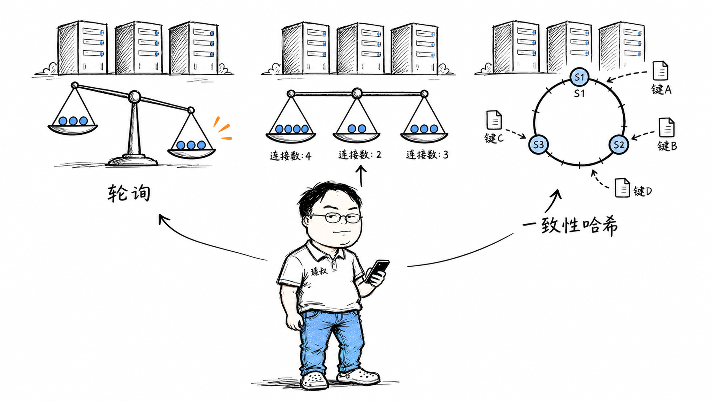

# 负载均衡算法——轮询、最少连接、IP哈希、一致性哈希，什么场景下选哪个？



双11零点，淘宝后端有10万台服务器。你的请求到了，谁决定它去哪台机器？负载均衡器。它用什么算法分配？如果简单轮询——1号机、2号机、3号机……看起来公平，但2号机正在处理一个慢查询，CPU飙到90%，轮询还是会把新请求分给它。如果用最少连接——但长短连接混合的场景下，一个长连接占着不释放，这台机器的"连接数"永远比别人高，新请求永远不分配给它。

负载均衡算法没有银弹。每种算法解决一个特定问题，同时引入新的问题。选错算法，轻则负载不均，重则系统雪崩。

## 核心结论

五种主流负载均衡算法的核心逻辑和适用场景：

1. **轮询（Round Robin）**：依次分配。简单公平，忽略服务器实际负载——适合所有服务器性能相同、请求处理时间相近的场景
2. **加权轮询（Weighted Round Robin）**：按权重分配。性能强的多分——适合服务器异构（有8核也有32核）的场景
3. **最少连接（Least Connections）**：分给当前连接最少的。考虑了实际负载——适合长连接、请求处理时间差异大的场景
4. **IP哈希（IP Hash）**：同一IP固定到同一台。保证会话一致性——适合有状态服务（Session在本地内存）
5. **一致性哈希（Consistent Hashing）**：节点变化时只影响相邻区间的请求。最小化缓存失效——适合缓存集群

## 深度拆解

### 轮询——最简单但最"盲目"

轮询的实现极其简单——维护一个计数器，取模运算决定目标服务器。Nginx默认就是轮询。

**优点**：实现简单，无需维护状态，在请求处理时间相近、服务器性能一致时效果好。

**致命问题**：它完全忽略服务器的实际状态。如果服务器A正在处理一个耗时5秒的请求，B和C空闲——轮询照样把新请求分给A。

**适合场景**：所有服务器配置相同、请求处理时间均匀、无状态的场景。比如一组无状态的API服务器，每个请求都在50ms内返回。

### 加权轮询——承认差异

```text
服务器A: 权重5（32核，性能强）
服务器B: 权重3（16核，中等）
服务器C: 权重1（8核，较弱）

分配序列：A A A A A B B B C A A A A A B B B C ...
（每9个请求中，A得5个，B得3个，C得1个）
```

加权轮询比普通轮询进步了一点——它承认服务器之间有性能差异。但这只是"静态配置的差异感知"，不反映实时负载。

**适合场景**：服务器配置不同但你清楚各自的性能比例。比如混部了新旧两代服务器，老服务器性能是新的1/3，就给老服务器设权重1、新服务器设权重3。

**不适合场景**：服务器性能动态变化。比如某台机器上跑了别的服务突然占用CPU，它的实际处理能力下降了，但权重没变，它还是被分配同样多的请求。

### 最少连接——考虑实时负载

最少连接算法维护每个后端服务器的活跃连接计数，新请求分配给连接数最少的那个。

**为什么比轮询好**：如果服务器A正在处理慢请求（占用时间长），它的活跃连接数会上升，新请求自然避开它。服务器B处理快，连接释放快，活跃连接数低，新请求自然倾向它。这是一种**隐式的负载感知**。

**陷阱一：长短连接混合**。假设服务器A处理的全是长连接（每个连接持续30秒），B处理的全是短连接（每个连接50ms）。A的连接数永远比B高——因为A的连接释放得慢。新请求会全部分给B，即使A其实还有空闲容量。

**陷阱二：连接数≠负载**。一个简单的API请求和一个复杂的数据库查询都算"1个连接"，但前者消耗0.1% CPU，后者消耗50% CPU。连接数不能反映真实的资源消耗。

**适合场景**：请求处理时间有差异但差异不大、连接持续时间相对均匀的场景。比如一组API服务器，大部分请求在50-200ms内完成。

### IP哈希——为了会话保持

IP哈希解决了**会话保持（Session Sticky）**问题——如果用户登录状态存在服务器A的内存里，后续请求必须也到A，否则用户要重新登录。

**问题一：负载不均**。如果大量用户来自同一个NAT出口（同一个公司、同一个校园），它们的IP相同，全部hash到同一台服务器，其他服务器空闲。

**问题二：服务器增减时大量重映射**。从3台服务器变成4台，hash取模从`hash(ip) % 3`变成`hash(ip) % 4`，大约75%的用户会被重新映射到不同的服务器——他们的Session全丢了。

**问题三：IP变化**。手机从WiFi切到4G，IP变了，hash结果变了，Session丢失。用户在地铁里频繁切换网络，每次切换都要重新登录。

**适合场景**：必须做会话保持、用户IP分布均匀、服务器列表稳定的场景。更好的做法是**把Session从本地内存移到Redis等共享存储**，任何服务器都能处理任何请求，彻底摆脱IP哈希的束缚。

### 一致性哈希——节点变化时的最小影响

一致性哈希解决了"服务器增减时大量重映射"的问题。

**普通哈希的问题**：

**一致性哈希的思路**：

把0到2³²-1想象成一个环。每个服务器和每个key都hash到这个环上的某个点。一个key顺时针找到的第一个服务器就是它的归属。

**增加服务器C（hash=1200）时**：

**减少服务器B时**：

```text
原本到B的key，顺时针找到下一个服务器（A）
只有B负责的那段区间受影响
```

一致性哈希的核心优势：**节点变化时只影响相邻区间的key，而不是全局重映射**。

**虚拟节点解决倾斜问题**：

如果只有3台服务器，它们在环上的位置可能很不均匀——A和B挤在一起，C孤零零在另一边。这导致A和B承担过多请求，C很闲。

解法是给每台物理服务器分配**多个虚拟节点**（通常150-200个）。3台服务器×200个虚拟节点=600个节点分布在环上，分布非常均匀。

**适合场景**：缓存集群（Redis Cluster、Memcached）、CDN节点调度、数据库分片路由。任何"节点可能动态增减"且"增减影响要最小化"的场景。

### 算法对比总结

| 算法 | 状态感知 | 会话保持 | 节点变化影响 | 适合场景 |
|------|---------|---------|------------|---------|
| 轮询 | × | × | 全局重映射 | 同构服务器、均匀请求 |
| 加权轮询 | ×（静态） | × | 全局重映射 | 异构服务器、均匀请求 |
| 最少连接 | ✓（连接数） | × | 全局重映射 | 请求时间有差异 |
| IP哈希 | × | ✓ | 全局重映射 | 有状态服务 |
| 一致性哈希 | × | ✓（近似） | 最小化影响 | 缓存集群、动态节点 |

## 实战要点

### 工程落地

**Nginx负载均衡配置**：

```nginx
upstream backend {
    # 轮询（默认）
    # server 10.0.0.1:8080;
    # server 10.0.0.2:8080;
    
    # 加权轮询
    # server 10.0.0.1:8080 weight=5;
    # server 10.0.0.2:8080 weight=3;
    
    # 最少连接
    least_conn;
    server 10.0.0.1:8080;
    server 10.0.0.2:8080;
    
    # IP哈希
    # ip_hash;
    # server 10.0.0.1:8080;
    # server 10.0.0.2:8080;
    
    # 一致性哈希（需要ngx_http_upstream_consistent_hash模块）
    # consistent_hash $request_uri;
    # server 10.0.0.1:8080;
    # server 10.0.0.2:8080;
    
    # 健康检查
    server 10.0.0.3:8080 max_fails=3 fail_timeout=30s;
}
```

**四层 vs 七层负载均衡**：

- **四层（L4）**：基于IP+端口转发，不解析应用层协议。速度快，适合TCP/UDP流量。典型：LVS、AWS NLB
- **七层（L7）**：基于HTTP URL/Header/Cookie转发。灵活，可按URL路由。典型：Nginx、HAProxy、AWS ALB

实际架构通常是L4+L7两层：LVS做四层负载（扛流量），Nginx做七层负载（做路由）。

### 臻叔踩坑笔记

1. **健康检查配置不当**：`max_fails=0`（不检查）→ 故障服务器继续接收请求。`fail_timeout=5s max_fails=1`→ 太敏感，网络抖一下就摘掉。经验值：`max_fails=3, fail_timeout=30s`，给3次重试机会

2. **会话保持导致负载不均**：IP哈希下，大公司所有员工走同一个出口IP，全hash到一台服务器。解法：放弃IP哈希，把Session存Redis；或用Cookie-based sticky session（按Cookie值而非IP做哈希）

3. **慢启动缺失**：新加的服务器立刻接收满载流量，但它还没有JIT预热、缓存未填充，可能直接被压垮。解法：配置慢启动（`slow_start=30s`），新服务器在30秒内逐渐接收流量

4. **长连接耗尽连接数**：HTTP keep-alive下，一个客户端跟后端服务器保持长连接。如果负载均衡器不限制连接复用次数，某些后端可能被长连接占满。解法：配置`keepalive_requests`限制单个连接的最大请求数

5. **灰度发布与负载均衡冲突**：你想让5%的流量打到新版本服务器，但轮询算法会均匀分配。解法：用加权轮询把新版本服务器设很低权重；或用七层负载均衡按Cookie/Header路由（如`X-Version: v2`的请求路由到新版本）

### 一句话总结

> 负载均衡算法的核心矛盾是"公平性 vs 状态感知 vs 稳定性"——轮询最公平但不感知状态，最少连接感知状态但对长短连接不公平，IP哈希保会话但不均匀，一致性哈希最稳定但实现复杂。选型的关键不是"哪个算法最好"，而是"你的场景最不能容忍什么问题"。
