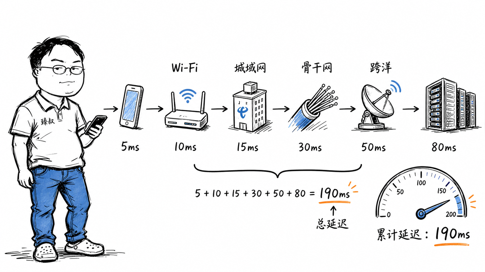

# 一条微信消息从北京发到纽约——光速是30万公里/秒，为什么端到端延迟100-200毫秒？



你在北京用微信给纽约的朋友发了一条消息，对方2秒后回复"收到"。你觉得很正常。但如果有人问你：北京到纽约的直线距离约11000公里，光纤里光速约20万公里/秒（光纤折射率1.5，光在光纤里比真空中慢），光飞行时间只有约55毫秒。你的消息单程55ms就能到，为什么实际延迟是100-200ms？多出来的时间花在哪了？

这个问题看似简单，实际上涉及网络延迟的完整分解——从你的手机到对方手机，数据要经过Wi-Fi、路由器、运营商骨干网、海底光缆、对方运营商、对方Wi-Fi，每一步都有开销。理解这个延迟分解，你才知道优化网络延迟该从哪里下手。

## 核心结论

网络端到端延迟由四个部分组成，记住这个公式：

> **延迟 = 传播延迟 + 传输延迟 + 排队延迟 + 处理延迟**

1. **传播延迟（Propagation）**：光/电信号在物理介质中飞行的时间。北京到纽约单程约55ms，这是物理极限，无法优化
2. **传输延迟（Transmission）**：把数据包"塞进"链路的时间。取决于包大小÷带宽。现代高带宽链路上通常<1ms
3. **排队延迟（Queuing）**：数据包在路由器/交换机缓冲区里等转发的时间。这是最不可控的部分，取决于网络拥塞程度
4. **处理延迟（Processing）**：路由器/防火墙/NAT设备检查和转发数据包的时间。通常每跳<1ms

从北京到纽约，单程100-200ms的延迟大致分解：传播55ms（来回110ms）+ 排队/处理30-60ms + 首跳/末跳20-40ms。光飞行时间只占一半，另一半花在了网络设备的处理和排队上。

## 深度拆解

### 第一段：手机到路由器（Wi-Fi/蜂窝，5-30ms）

你的消息从手机发出，第一跳是Wi-Fi或蜂窝网络。

**Wi-Fi延迟**：Wi-Fi是共享介质的无线协议——同一频道下的设备通过CSMA/CA竞争发送权。如果你的Wi-Fi频道上有多个设备同时发送，需要退避等待。典型延迟5-15ms，拥挤时可能30ms+。

**蜂窝网络延迟**：4G LTE典型延迟20-50ms，5G低至1-10ms。4G的延迟主要来自无线调度的固定时间片（TTI=1ms）和核心网的处理。

### 第二段：路由器到运营商入口（5-20ms）

数据包从你的路由器到运营商的接入服务器，通常经过1-3跳：

### 第三段：运营商骨干网（10-40ms）

数据包进入运营商骨干网，从北京传输到出海节点（通常在上海、青岛、广州）：

### 第四段：海底光缆（55-80ms）

这是延迟的大头。从中国到美国的海底光缆主要有：

海底光缆的延迟基本由物理距离决定——你没法让光跑得更快。唯一能优化的是选择更短的海缆路由，但海缆铺设受地理条件限制。

### 第五段：美国骨干网（10-30ms）

数据包到达美国西海岸（俄勒冈/加州）后，通过美国骨干网传输到纽约：

### 第六段：运营商到对方路由器（5-15ms）

从美国运营商骨干网到对方家庭路由器，与第二段对称。

### 第七段：对方路由器到手机（5-15ms）

最后一跳Wi-Fi，与第一段对称。

### 完整延迟汇总

### 为什么实际延迟比物理极限高

**原因一：路由不是直线**。BGP协议选路径不一定选最短的——它选的是"策略最优"（成本、运营商互联关系、稳定性）。你的数据包可能从北京到洛杉矶再到纽约，而不是直接走最短路径。

**原因二：排队延迟不可控**。骨干网路由器在高峰期可能排队10-50ms。这不是物理限制，是容量不足。升级带宽不能降低传播延迟，但能降低排队延迟。

**原因三：协议开销**。TCP握手1个RTT，TLS握手1-2个RTT。如果连接没有复用，光建连就要2-3个RTT。微信用长连接复用避免了这个问题。

**原因四：应用层处理**。微信消息不是直接TCP传输——它要经过：你的手机加密→腾讯服务器→消息存储→推送到对方→对方手机解密。每步都有处理延迟。

### 如何优化跨地域延迟

**网络层优化**：

1. **专线/SD-WAN**：不走公共互联网，走专线。专线的路由更优化、排队更少。阿里云CEN、AWS Direct Connect等。可以减少30-50ms的排队和处理延迟

2. **Anycast**：同一个IP在多个地理位置广播，用户请求被路由到最近的节点。Cloudflare的DNS解析全球延迟<20ms就是靠Anycast

3. **就近接入**：全球部署服务器，用户连最近的数据中心。跨国消息通过骨干网传输而不是公共互联网

**应用层优化**：

1. **长连接复用**：避免每次请求都TCP+TLS握手。省2-3个RTT

2. **边缘计算**：把计算逻辑推到离用户最近的边缘节点。Cloudflare Workers、AWS Lambda@Edge

3. **预加载/预取**：预测用户行为，提前拉取数据。用户感知的延迟从200ms降到0ms

4. **异步化**：不等待远端响应就给用户反馈。微信发消息时立刻显示"已发送"，实际发送在后台异步完成

## 实战要点

### 工程落地

**延迟测量工具**：

```bash
# traceroute看每一跳的延迟
traceroute -T -p 443 www.example.com

# mtr更强大的持续追踪
mtr -T -p 443 www.example.com

# 从全球多地测延迟
# https://check-host.net/check-ping
# https://ping.pe（全球节点ping测试）
```

**延迟优化优先级**：

### 臻叔踩坑笔记

1. **跨境合规延迟**：数据跨境需要经过安全审查/合规处理。某些国家的数据出境需要加密+审计，增加50-200ms处理延迟。解法：在用户所在地区部署完整服务，避免跨境数据传输

2. **DNS解析跨地域**：DNS解析到远端服务器，每一步都慢。解法：用GeoDNS或HTTPDNS做就近解析；CDN静态资源走边缘节点

3. **TCP窗口大小限制跨国吞吐**：高BDP链路（高带宽×高延迟）上TCP窗口不够大，吞吐上不去。北京到纽约RTT=200ms，100Mbps带宽需要窗口2.5MB。Linux默认窗口可能不够。解法：启用`tcp_window_scaling`，调大`tcp_rmem`/`tcp_wmem`

4. **运营商互联瓶颈**：不同运营商之间的互联带宽有限，高峰期排队严重。电信用户访问联通服务器可能绕路到第三方互联点。解法：BGP多线/多运营商接入，或用CDN/中间件做跨网加速

5. **时钟漂移导致延迟测量不准**：两台服务器的时钟如果不同步，测出来的延迟可能是负数或偏大。解法：用NTP同步时钟（精度毫秒级），或用PTP（精度微秒级）

### 一句话总结

> 跨国网络延迟的物理极限由光速和距离决定（北京到纽约单程55ms），但实际延迟100-200ms中有一半花在了网络设备的处理、排队和协议开销上。优化延迟的第一步是测量——用traceroute/mtr拆解每一跳的延迟，找到瓶颈在哪一跳，然后针对性地优化连接复用、就近部署或专线加速。
