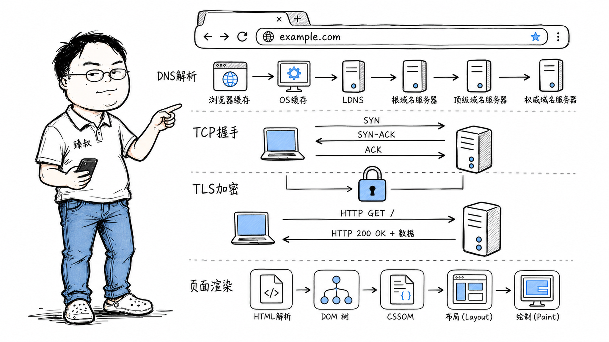

# URL到页面渲染全链路：DNS解析到DOM渲染的完整流程



---

> 📌 **关注「程序员臻叔」，获取更多硬核技术干货**


---

这是前端面试、后端面试、运维面试——几乎所有技术岗都爱问的经典问题。它之所以经典，是因为这一个动作串联了计算机网络的全链路：DNS解析、TCP握手、TLS协商、HTTP请求、CDN调度、服务端处理、响应传输、浏览器渲染。每一步都有延迟，每一步都可能出问题。

你在公司负责一个网站，用户投诉"打开慢"。老板问你慢在哪——你总不能说"网络问题"吧？把这个链路拆开看，才知道是DNS慢、是握手慢、是服务器慢、还是渲染慢。

## 核心结论

从输入URL到看到页面，网络层面经过**七个阶段**，每个阶段都有典型延迟范围：

1. **DNS解析**（1-200ms）——把域名翻译成IP地址
2. **TCP三次握手**（1×RTT，通常10-200ms）——建立可靠连接
3. **TLS握手**（1-2×RTT）——建立加密通道
4. **HTTP请求发送**（<1ms）——发出HTTP请求报文
5. **服务器处理**（10ms-数秒）——后端逻辑+数据库+缓存
6. **响应传输**（取决于数据大小和带宽）——把HTML传回来
7. **浏览器渲染**（100ms-数秒）——解析HTML、加载CSS/JS、布局、绘制

总延迟 = DNS + TCP + TLS + 请求 + 服务端 + 传输 + 渲染。优化任何一个环节都能提速，但你要先知道瓶颈在哪。

## 深度拆解

### 第一步：DNS解析——找路（1-200ms）

浏览器先问"baidu.com的IP地址是多少"。查询顺序：

1. **浏览器DNS缓存**——Chrome内部维护的缓存，TTL通常60秒。如果最近访问过，直接命中，0ms
2. **操作系统DNS缓存**——`/etc/hosts`文件 + OS级缓存（Linux的nscd，Windows的DNS Client服务）
3. **本地DNS服务器（LDNS）**——通常是运营商或企业内网的DNS。如果它有缓存，返回；没有就继续往下查
4. **递归查询**——LDNS依次问根DNS服务器（`.`）、顶级域DNS服务器（`.com`）、权威DNS服务器（`baidu.com`），最终拿到A记录的IP地址

典型延迟：命中缓存<1ms，完全递归查询50-200ms。如果页面引用了30个不同域名的资源（图片CDN、字体服务、广告SDK、埋点），DNS查询可能贡献数百毫秒的首屏延迟。

**优化手段**：`<link rel="dns-prefetch" href="//cdn.example.com">`提前做DNS解析；减少域名数量；用HTTP/2多路复用减少连接数。

### 第二步：TCP三次握手——建立连接（1×RTT）

拿到IP后，浏览器向服务器发起TCP连接：

三次握手耗时1个RTT。如果客户端在北京、服务器在广州，RTT约30ms；如果服务器在美国，RTT约150-200ms。

这就是为什么HTTP/1.1默认开启keep-alive——复用连接省掉重复握手。HTTP/2更是把一个TCP连接上的多路复用发挥到极致，一个域名只需要一个连接。

### 第三步：TLS握手——加密通道（1-2×RTT）

TCP连接建立后，如果URL是`https://`（现在几乎都是），还要做TLS握手：

**TLS 1.2**需要2个RTT：

**TLS 1.3**简化到1个RTT（甚至0-RTT恢复会话）：

加上TCP的1个RTT，建立HTTPS连接总共需要2-3个RTT。如果RTT=200ms（跨国），光连接建立就花了400-600ms——还没发一个字节的业务数据。

### 第四步：HTTP请求发送（<1ms）

连接建立后，浏览器构造HTTP请求报文发送：

```http
GET / HTTP/1.1
Host: www.baidu.com
User-Agent: Mozilla/5.0 (Macintosh; Intel Mac OS X 10_15_7)
Accept: text/html,application/xhtml+xml
Accept-Encoding: gzip, deflate, br
Accept-Language: zh-CN,zh;q=0.9
Cookie: BAIDUID=xxx; BIDUPSID=xxx
```

请求头通常几百字节到2KB。如果是POST请求，还有请求体。这一步耗时极短，可以忽略。

### 第五步：服务器处理（10ms-数秒）

请求到达服务器后，后端的处理链路：

1. **负载均衡器**（LVS/Nginx）——根据算法把请求转发到某台后端服务器（<1ms）
2. **API网关**——鉴权、限流、路由（1-5ms）
3. **应用服务器**——执行业务逻辑，可能涉及：
   - 查Redis缓存（0.1-1ms）
   - 查MySQL数据库（1-50ms，看SQL复杂度和索引情况）
   - 调下游RPC服务（5-50ms）
   - 计算逻辑（1-20ms）

一个简单的页面可能10-50ms返回，复杂的动态页面可能100-500ms。如果服务器负载高、数据库慢查询、或依赖服务超时，这一步可能变成秒级。

**CDN拦截**：如果请求的是静态资源（图片、CSS、JS），CDN的DNS调度会把你导向最近的边缘节点。边缘节点命中缓存就直接返回，不经过源站。这一步可能只有5-20ms。

### 第六步：响应传输（取决于数据量和带宽）

服务器返回HTTP响应：

```http
HTTP/1.1 200 OK
Content-Type: text/html; charset=utf-8
Content-Encoding: gzip
Content-Length: 38421
Cache-Control: max-age=3600

<html>...</html>
```

一个百度首页的HTML大约30-40KB（gzip后）。在10Mbps带宽下传输约30ms。如果走HTTP/2，头部还会用HPACK算法压缩，进一步减少传输量。

### 第七步：浏览器渲染——最容易被忽视的延迟（100ms-数秒）

HTML回来后，浏览器的工作才刚开始：

1. **解析HTML**——构建DOM树（Document Object Model）
2. **解析CSS**——构建CSSOM树（CSS Object Model）
3. **合成渲染树**——DOM + CSSOM → Render Tree
4. **布局**——计算每个元素的位置和大小
5. **绘制**——把渲染树转成像素，画到屏幕上

但这还没完——HTML里引用了CSS文件、JS文件、图片、字体。每个资源又是完整的DNS→TCP→TLS→HTTP循环（虽然连接可以复用）。

**关键渲染路径优化**：

- CSS放在`<head>`里——尽快下载，避免渲染阻塞
- JS放在`<body>`底部——不阻塞HTML解析
- 用`async`/`defer`属性——异步加载脚本
- 关键CSS内联——减少一次请求
- 图片懒加载——可视区域外的图片先不加载

### 完整链路延迟分解

| 阶段 | 典型延迟 | 优化手段 |
|------|---------|---------|
| DNS解析 | 1-200ms | DNS预解析、减少域名、DNS缓存 |
| TCP握手 | 10-200ms | 连接复用（keep-alive）、HTTP/2 |
| TLS握手 | 10-400ms | TLS 1.3、Session Resumption、0-RTT |
| 请求发送 | <1ms | HTTP/2头部压缩 |
| 服务器处理 | 10ms-数秒 | 缓存、索引优化、异步化 |
| 响应传输 | 5-100ms | Gzip/Brotli压缩、HTTP/2 |
| 浏览器渲染 | 100ms-数秒 | 关键路径优化、懒加载、SSR |

## 实战要点

### 工程落地

**性能分析工具链**：

- **Chrome DevTools → Network面板**：看每个资源的瀑布图，DNS/连接/等待/传输各花了多少
- **Chrome DevTools → Performance面板**：看渲染阶段的时间线，布局和绘制耗时
- **`curl -w`**：命令行测量各阶段耗时

```bash
curl -o /dev/null -s -w "\
DNS:        %{time_namelookup}s\n\
TCP:        %{time_connect}s\n\
TLS:        %{time_appconnect}s\n\
TTFB:       %{time_starttransfer}s\n\
Total:      %{time_total}s\n" \
https://www.baidu.com
```

- **WebPageTest**：从全球多个地点测试，看真实用户在不同地理位置的体验
- **Lighthouse**：综合评分，给出具体的优化建议

**CDN策略**：静态资源上CDN，动态请求走源站。用`Cache-Control: immutable`让浏览器放心缓存带hash的文件名。预热热门内容到CDN边缘节点。

### 臻叔踩坑笔记

1. **跨域预检请求（OPTIONS）**：CORS预检请求会多一个RTT。如果API没有正确响应OPTIONS，或配置了不必要的预检（如非简单请求头），每个跨域API调用都会多一次往返。解法：服务端配置`Access-Control-Max-Age`让浏览器缓存预检结果

2. **重定向链**：HTTP→HTTPS重定向、www→非www重定向、旧URL→新URL重定向，每次301/302都是一个完整的新请求。解法：HSTS头部让浏览器直接用HTTPS，减少一次重定向；配置时避免多重定向链

3. **第三方脚本阻塞**：页面引用了统计SDK、广告SDK、客服组件——它们可能同步加载，阻塞渲染。解法：所有第三方脚本用`async`/`defer`，或用Tag Manager延迟加载

4. **HTTPS证书过期**：证书过期后浏览器直接拦截，用户看到"不安全"警告。运维如果没有证书到期监控，这就是一个定时炸弹。解法：用ACME自动续期（Let's Encrypt），或设置证书到期告警

5. **DNS劫持导致加载异常**：在某些网络环境下DNS可能被劫持，解析到错误IP。如果目标是HTTPS，TLS证书验证会失败——用户看到证书错误。如果是HTTP，用户被导向钓鱼网站。解法：全面HTTPS + HSTS + DNSSEC

### 一句话总结

> 从输入URL到看到页面是一个七棒接力赛：DNS找路、TCP建桥、TLS加密、HTTP传话、服务器干活、网络回传、浏览器画图。任何一棒慢了，用户就感觉"卡"。性能优化的第一步永远是测量——先用工具拆解延迟分布，再决定优化哪一环。


---

### 🎯 觉得有帮助？关注「程序员臻叔」


---
