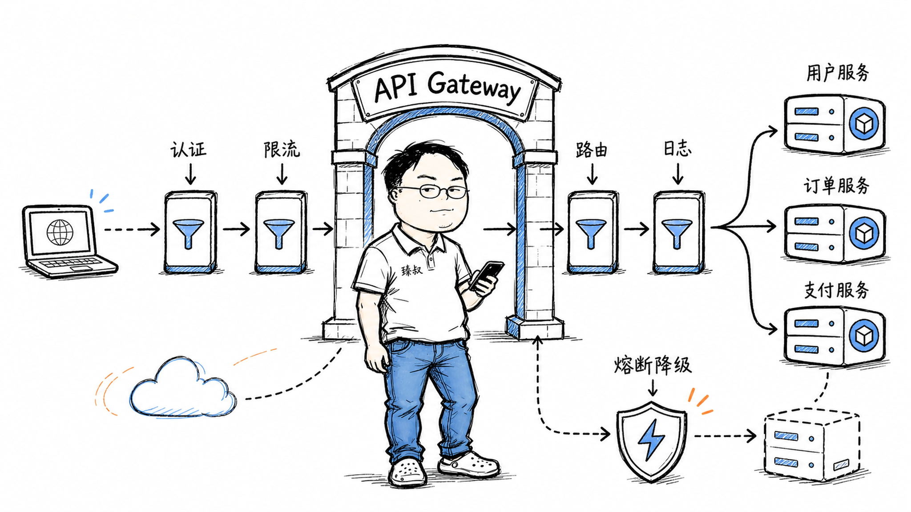

# API网关——微服务的大门，为什么不能太重




我们组在2021年做了一次微服务改造，一开始没有API网关。前端直接调了三个服务：用户服务（端口8081）、商品服务（端口8082）、订单服务（端口8083）。前端的配置文件里记着三套地址和三套认证Token——跨域问题、Token管理混乱、前端的网络请求逻辑越来越臃肿。

后来加了一个Nginx做反向代理，统一了入口。但又发现了新问题：Nginx不知道"这个用户有没有权限访问这个订单"（需要在请求到达订单服务前做鉴权）、不知道"这个API现在QPS是多少"（限流要针对单个API）、不知道怎么把外部的REST请求转成内部的gRPC调用。

于是引入了Kong作为API网关。效果是好的，但两个月后出了一个问题：Kong的某个插件（我们自己写的认证插件）在高并发下有内存泄漏，导致Kong节点周期性OOM重启——所有流量中断。这是我们第一次意识到：**网关是所有流量的入口，它挂了等于整个系统挂了。网关不能太重。**

## 核心结论

1. **API网关的本质**是将微服务架构中的"横切关注点"（认证、限流、路由、协议转换、日志）从每个服务中抽取出来，统一在入口层处理——避免重复实现、降低服务复杂度。
2. **网关和反向代理的核心区别**：反向代理（Nginx）做的是"TCP/HTTP层面的转发"，网关在应用层增加了"认证、路由规则、限流、协议转换"等能力。
3. **网关必须"薄"**——只做通用横切逻辑，不处理业务逻辑。业务逻辑下沉到微服务。网关一旦变厚（承载了业务规则），就成了新的"单体"。
4. **网关的高可用是生死问题**：必须无状态（方便水平扩展）、多实例部署、前置负载均衡。任何一个节点的故障都不能影响整体服务。
5. **网关不是微服务的"唯一入口"**——内部服务间通信通常不走网关（走服务发现+直连或Service Mesh），网关主要面向外部客户端和第三方系统。

## 深度拆解

### 一、网关的核心职责

**1. 认证鉴权**

```yaml
# Kong配置示例
routes:
  - name: orders-api
    paths: ["/api/orders"]
    plugins:
      - name: jwt
        config:
          claims_to_verify: ["exp", "sub"]
      - name: acl
        config:
          allow: ["order-read", "order-write"]
```

请求到达网关 → 解析JWT → 验证签名和过期时间 → 提取用户ID和角色 → 检查ACL权限 → 放行或拒绝。后端服务不再需要处理认证逻辑。

**2. 限流**

**3. 路由**

```yaml
routes:
  - path: /api/users/*
    upstream: user-service:8080
  - path: /api/orders/*
    upstream: order-service:8080
  - path: /api/products/*
    upstream: product-service:8080
```

网关根据URL/Header/Query参数决定请求发往哪个服务。Kong/APISIX支持动态路由（路由规则的变更不重启网关）。

**4. 协议转换**

**5. 统一日志和监控**

每个经过网关的请求都打一条日志（请求路径、响应时间、状态码、用户ID），汇聚到ES/ClickHouse做统计分析和告警。

### 二、网关的选型对比

| | Kong | APISIX | Spring Cloud Gateway | Envoy |
|---|---|---|---|---|
| 语言 | OpenResty(Lua) | OpenResty(Lua) | Java | C++ |
| 性能 | 高 | 极高（比Kong快2-3倍） | 中（受JVM限制） | 极高 |
| 插件生态 | 丰富 | 快速增长 | 丰富（Spring生态） | 需要自行开发 |
| 配置方式 | Admin API + 声明式 | Admin API + 声明式 | YAML + Java Bean | xDS协议（动态配置） |
| 动态路由 | 支持 | 支持 | 支持（需搭配配置中心） | 原生支持 |
| 适合场景 | 中大型微服务架构 | 高性能/云原生 | Spring生态项目 | Service Mesh的数据面 |

**Kong的工作原理：**

**APISIX为什么比Kong快：**

- 路由匹配使用了基数树（Radix Tree），比Kong的正则遍历快
- 插件是纯Lua代码，没有Kong的插件沙箱开销
- 内置了etcd做分布式配置存储（去中心化），Kong依赖PostgreSQL

### 三、网关的正确和错误姿势

**正确：网关做这些事**

- 校验JWT/OAuth Token
- IP/用户级别的频率限制
- URL路由和负载均衡
- HTTP→gRPC协议桥接
- 请求/响应日志
- CORS处理
- 基于Header的简单灰度（`X-Canary: v2`）

**错误：网关别做这些事**

- 复杂的数据聚合（应该走BFF——Backend for Frontend）
- 业务规则校验（"这个订单能不能取消"由订单服务判断）
- 大文件上传（应该在网关前放专门的Upload Service或走CDN直接上传）
- 存储会话状态（网关应该是无状态的）

**BFF模式——网关的合理"增重"：**

当不同客户端（Web、iOS、Android）需要的API响应结构不同时，可以在网关后加一层BFF：

BFF和网关的分工：
- 网关：通用的横切逻辑（认证、限流、路由）
- BFF：客户端特定的数据聚合和适配
- 后端微服务：核心业务逻辑

### 四、网关的高可用设计

**无状态 + 水平扩展：**

```
                    Load Balancer (Nginx/HAProxy/K8s Ingress)
                    /              |              \
            网关实例A           网关实例B          网关实例C
            (Kong/APISIX)     (Kong/APISIX)      (Kong/APISIX)
            /      |               |                  \
       user-svc order-svc    product-svc          payment-svc
```

每个网关实例独立处理请求，不共享状态。新增实例只需加入负载均衡。

**网关自身的防护：**

1. **连接数限制**：防止恶意客户端占用所有连接。`limit_conn_zone`、`keepalive_requests`。
2. **请求体大小限制**：`client_max_body_size 10m`，防止大请求体撑爆网关内存。
3. **超时控制**：`proxy_read_timeout 30s`，防止后端慢服务拖垮网关连接池。
4. **优雅关闭**：收到SIGTERM后，停止接收新连接，等待当前请求处理完再退出。（K8s的`terminationGracePeriodSeconds`配合使用）

## 实战要点

**臻叔踩坑笔记：**

1. **网关不能缓存"用户登录态"**。网关是无状态的，用户的Session/JWT验证应该每次请求独立完成。如果把用户信息存在网关本地缓存中——下一个请求可能被另一个网关实例处理，缓存不在该实例上 → 误判为未登录。

2. **日志级别要区分**。网关每天可能产生几亿条日志。不要每条请求都打INFO级别——健康检查、静态资源、管理端点用DEBUG或不打日志。正常业务请求用INFO，错误用ERROR。否则日志存储成本爆炸，排查问题也被噪音淹没。

3. **路由规则不要依赖客户端提供的Header**。`X-Route-To: payment-service`这种Header如果被客户端篡改——请求可能被路由到不该访问的服务。路由规则永远应该由网关基于URL/域名推断，不要信任客户端的路由提示。

4. **插件不能阻塞主流程**。我们踩过的坑：认证插件里调了一个远程RPC服务做二次验证，这个RPC偶尔超时1秒——导致网关的请求处理延迟飙升。所有网关插件都应该是"本地计算"（查本地缓存、验证JWT签名），避免远程调用。如果必须远程调用——加超时和降级（失败时放行或拒绝，不要等待）。

5. **不要创建一个"万能网关"**。见过一个团队把网关改成了全功能的API管理平台：带数据聚合、业务编排、脚本执行——网关变成了最难维护的单体。网关的定位是："我帮你挡掉不需要你关心的通用问题，关心业务逻辑是你的责任。"

**一句话总结：**

> API网关的价值在于"不做业务"，一旦开始做业务就堕落成了新单体。它的正确姿态是"入口薄、服务厚"——在入口层用最小开销完成认证、限流、路由、日志，然后快速把请求交给真正干活的微服务。网关的好设计，是让你感知不到它的存在。

---
