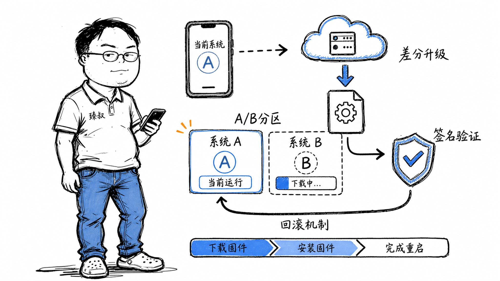

# OTA升级——让千万台设备"换引擎"而不变砖

2021年，一家智能硬件厂商遭遇了一个棘手的事故：一次固件OTA推送后，约3%的设备直接变砖——屏幕黑屏，无法启动，用户只能寄回维修。追查原因：升级包写入过程中电压波动，导致系统分区的几个关键扇区损坏，bootloader启动时验证失败就卡死了。

这次事故暴露了整个OTA链路的薄弱点：下载校验、分区设计、失败回滚、安全签名——这四个环节，哪一个出问题都可能导致灾难性的"变砖"。

后来该团队全面改造了OTA架构，从单分区升级切换到A/B分区 + 增量更新的方案。部署后两年的升级失败率从3%降到了0.01%以下。这篇文章就把OTA升级中的关键决策和踩坑经验拆解出来。

## 核心结论

1. **单分区升级的本质风险**是"系统在线替换自己"——写入中途断电或出错，系统分区损坏，bootloader无法启动，设备变砖。
2. **A/B分区的核心思想**是"不碰正在运行的系统"——新系统写到备用分区，重启时切换，失败自动回退。代价是双倍存储空间，但可靠性有质的飞跃。
3. **差分包的关键不是"怎么生成差异"，而是"怎么保证设备当前版本和差分包基准版本精确匹配"——多版本管理复杂度是指数级的。
4. **安全链条从bootloader开始**——如果bootloader本身被篡改，后面的签名验证全部失效。这就是"可信启动链"（Verified Boot）要解决的问题。
5. **回滚策略不是"失败就回"那么简单**——要定义启动成功的判定标准（多少次成功启动才算成功），以及回滚的原子性（切回旧分区不能是半截子操作）。

## 深度拆解

### 一、单分区升级为什么危险

传统做法：

风险在Step 3：设备正在擦写自己运行的系统分区。如果此时断电，分区文件系统损坏，下次bootloader找不到可启动的系统——设备就砖了。

即使不断电，写Flash的过程本身有"坏块"风险（尤其是NAND Flash），如果关键数据写入坏块，系统启动时校验失败也会变砖。

### 二、A/B分区：两套系统，轮流切换

A/B分区（Seamless Updates，无缝升级）的核心设计：

升级流程：

**关键设计点：**

- **启动标记（Boot Control）**：bootloader中维护一个状态机，记录"当前活动槽位"、"下一个要启动的槽位"、"尝试次数"、"是否成功标记"。这个数据存在独立于分区的区域（如GPT属性或MISC分区）。

- **重试机制**：system_b启动后，系统不会立刻标记为"成功"。通常在用户空间启动完成后，由`update_engine`或init进程确认启动成功。如果启动过程中崩溃，bootloader的计数器会让它回退。

- **代价**：存储空间翻倍。对于16GB的嵌入式设备，A/B分区会吃掉大约4-6GB（系统分区大小）。

### 三、差分包：bsdiff的原理和适用边界

完整包1.5GB，差分包可能只有50MB。生成差分包的核心算法是bsdiff（Binary Software Difference）。

**bsdiff的工作原理（简化）：**

**差分包的核心挑战：**

| 挑战 | 说明 | 常见解法 |
|------|------|----------|
| 多版本管理 | 用户设备版本五花八门（1.0、1.1、1.2...），每个组合需要一个差分包 | 只维护当前版本 → 最新版本的差分包；老版本先下载完整包升级到中间版本 |
| 版本匹配 | 差分包和当前固件必须精确匹配，一个字节不一样都会失败 | 下载前服务端校验设备上报的固件SHA256 |
| 文件系统级别 | bsdiff对单个文件有效，但固件是分区镜像 | 先解包分区镜像、对内部文件逐文件diff、再重新打包 |

**实战中通常不用纯bsdiff**，而是自己定制——例如针对Android OTA的`imgdiff`（针对压缩文件）和`block-based OTA`（直接在块设备层面做diff，不关心文件系统）。

### 四、安全签名：从bootloader到system的信任链

OTA安全的核心不是"下载用HTTPS就行了"，而是**即使升级包被篡改、替换，设备也能识别并拒绝**。

**可信启动链（Verified Boot / Secure Boot）：**

每一步都验证下一步的签名，形成一条信任链。如果任何一步验证失败，启动中止。

**OTA升级包的签名验证：**

1. 升级包附带一个签名文件（如`update.zip.sig`）
2. 签名内容是：`RSA_SIGN(SHA256(update.zip), vendor_private_key)`
3. 设备端用内置的公钥验证签名：`RSA_VERIFY(signature, SHA256(update.zip), vendor_public_key)`
4. 签名不匹配 → 拒绝安装

**关键安全事项：**

- **私钥管理**：签发OTA包的私钥是系统安全的根基。必须离线存储（HSM硬件安全模块或气隙机器），绝不能放在CI/CD服务器上。
- **回滚防护（Rollback Protection）**：攻击者拿到旧版本固件和有效签名，试图回滚到有已知漏洞的旧版本。设备要维护一个"最小允许版本号"，低于此版本的固件拒绝安装。
- **Android的dm-verity**：System分区挂载时，内核用dm-verity逐块验证哈希树。如果任何一块被篡改，返回I/O错误而不是读取篡改数据。

### 五、滚蛋的细节：什么时候算"启动成功"？

判断"启动成功"比你想象中复杂。不是"进了桌面就算成功"——如果系统UI进程崩溃后不断重启（Boot Loop），从bootloader角度看每次都算"启动"了。

**工程上的判定策略：**

1. **多次成功标记**：系统启动后，由一个独立的`update_verifier`进程在后台运行。它会：
   - 等待系统完全启动（关键服务全部Ready）
   - 在独立分区写入"启动成功"标记
   - 下一次启动时bootloader检查这个标记。连续N次（如2次）都标记成功 → 确认该槽位有效

2. **看门狗配合**：如果系统在启动过程卡死，硬件看门狗（Watchdog）会超时复位。bootloader检测到异常启动 → 切换槽位或进入Recovery。

## 实战要点

**千万台设备的OTA基础设施：**

- **CDN分发**：升级包放在CDN上，按地区就近下载。单个升级包500MB × 1000万台 = 5PB流量——全走源站会打挂。
- **灰度推送**：1% → 5% → 25% → 100%。每个阶段监控变砖率、成功率、用户投诉，异常时暂停推送。
- **P2P加速（可选）**：类似快牙/迅雷的P2P分发，设备之间共享升级包片段。在IoT场景（同城域网内设备多）效果显著。

**臻叔踩坑笔记：**

1. **不要把差分包基准版本写死**。你以为用户都在用v2.0，实际上还有5%在v1.8。服务端必须校验设备上报的实际版本号，不匹配就推送完整包而不是差分包——否则差分包合并失败导致变砖。

2. **写入B分区前先校验存储空间**。嵌入式设备的Flash经常有坏块或剩余空间不足（用户数据膨胀）。发现空间不足先清理、再写入，不要在写入过程中发现空间不够。

3. **升级过程中不要依赖正在升级的系统服务**。下载、校验、写入全部由独立的`update_engine`进程完成，不依赖Android/Linux的用户空间服务。如果这个进程依赖`libc`——确保`libc`的版本不会被升级过程替换。

4. **重启不是"关机再开"——要区分"冷启动"和"热重启"**。某些设备的热重启（`reboot`命令）不会经过完整的硬件初始化和bootloader验证，可能跳过槽位切换逻辑。必须确保升级后的重启是完整的硬件复位。

5. **用户数据的兼容性比系统升级更头疼**。系统升级后，旧版本的用户数据（数据库schema、SharedPreferences格式、文件路径）可能和新系统不兼容。升级方案里必须包含数据迁移逻辑——且这个逻辑要在A/B分区切换后、用户看到桌面之前执行完毕。

**一句话总结：**

> OTA升级的本质不是"下载+安装"，而是"在不可靠的硬件和网络环境上，用冗余分区的策略实现原子性的系统替换"——双倍存储空间换来的不是性能而是可靠性，任何不能回滚的升级都是定时炸弹。

---
