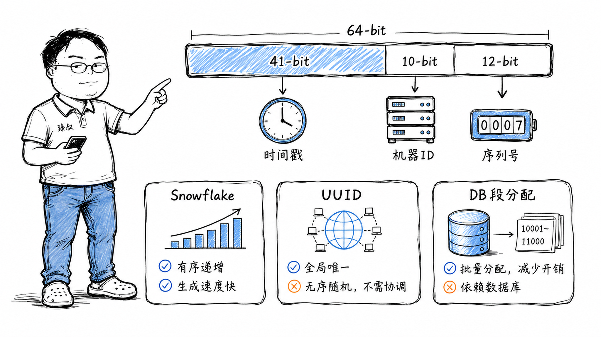

# 分布式ID生成器——自增ID在几百台机器上为什么不灵了




分库分表做完后，第一个炸出来的问题是：订单ID重复了。分库1的自增到了1000，分库2的自增也到了1000——两个分库各自生成了ID=1001、1002、1003...全部撞车。

试过UUID——太长了（36字符），数据库索引效率差，而且完全无序导致页分裂，插入性能从每秒2万暴跌到3000。试过Redis的INCR——单点瓶颈，而且Redis宕机后恢复麻烦（AOF里记了大量的INCR操作）。

最后选了Snowflake算法，但部署到生产后发现：有一批机器因为NTP时钟同步，时间往回调了2秒——这2秒内生成了几十个重复ID。查代码才发现，我们的Snowflake实现完全没有处理时钟回拨。

这篇文章就是把分布式ID生成从"选型"到"踩坑"到"美团Leaf方案的改进思路"完整走一遍。

## 核心结论

1. **分布式ID的核心矛盾**：唯一性（绝对不重复）、递增性（趋势递增，利于数据库索引）、高性能（百万QPS生成）、去中心化（不依赖单点）——这四个需求互相制约，没有任何方案能完美满足全部。
2. **Snowflake是工程上最好的60分方案**——64位结构简洁、高性能、趋势递增，但把最难的问题留给了实践者：时钟回拨怎么处理。
3. **号段分配（Leaf Segment）**是数据库友好型的最优解——ID严格递增，对数据库索引最友好，但依赖数据库作为号段分配中心。
4. **时钟回拨是Snowflake的阿喀琉斯之踵**——不是"会不会发生"的问题，而是"发生了怎么处理"。方案从简单（等待时钟追上）到复杂（备用机器ID、Leaf的ZooKeeper方案）各有取舍。
5. **UUID不是主键的好选择，但是好辅助**——数据库主键用Snowflake/号段，业务追踪ID用UUID或短码。不要用一个ID承担所有职责。

## 深度拆解

### 一、自增ID为什么不灵了

单机MySQL的自增ID是最简单的方案：

```sql
CREATE TABLE orders (
    id BIGINT AUTO_INCREMENT PRIMARY KEY,
    ...
);
```

但在分库分表环境下：

即使不撞车，单库自增也有性能天花板——自增锁在高并发下是写入瓶颈。

### 二、Snowflake：64位的精巧设计

**各字段的作用：**

- **41位时间戳**：从自定义起始时间（如2020-01-01）开始的毫秒数。41位可以用`2^41 / (365*24*3600*1000) ≈ 69年`。
- **10位机器ID**：区分1024个生成节点。每个节点有唯一ID，防止不同节点生成相同ID。
- **12位序列号**：同一毫秒内从0到4095。当同一毫秒内超过4096个ID时，等待下一毫秒。

**Snowflake的性能：**

```
单节点每毫秒 4096 个 ID
= 每秒 4,096,000 个 ID
= 409万 QPS / 节点

1024个节点理论极限 = 1024 × 409万 = 41.9亿/秒
```

对于绝大多数业务来说，这个量级完全够用。

**趋势递增特性：**

Snowflake的ID按时间戳递增——新生成的ID大于旧ID。对MySQL的B+树索引来说，趋势递增非常重要——新数据总是追加到B+树的最右叶子节点，避免页分裂。

### 三、时钟回拨：Snowflake的终极难题

**时钟回拨是如何发生的：**

1. **NTP同步**：服务器时间慢了，NTP客户端校正→时间往前跳了几秒。
2. **人工调整**：运维登录服务器手动改时间（`date -s`）。
3. **虚拟机迁移**：VM从一台物理机迁移到另一台，时钟不同步。
4. **闰秒**：UTC增加或减少1秒，操作系统处理方式不同。

**时钟回拨为什么致命：**

**处理方案（从简单到复杂）：**

| 方案 | 做法 | 优势 | 代价 |
|------|------|------|------|
| 等待追上 | 发现回拨后sleep直到时间追上 | 实现简单，不产生重复 | 阻塞生成（回拨2秒=阻塞2秒） |
| 自增序列号 | 回拨时记录"上次最大序列号"，在该毫秒内继续递增 | 不阻塞 | 序列号可能提前耗尽（4096不够用） |
| 备用机器ID | 回拨时切换到一个未使用的备用机器ID | 不阻塞，不重复 | 需要额外管理机器ID生命周期 |
| Leaf方案 | 用ZooKeeper持久化时间戳+机器ID，强依赖外部系统 | 从根本上解决回拨 | 依赖ZK，引入新的故障点 |

**美团Leaf的时钟回拨处理：**

Leaf-Snowflake方案的关键改进：
1. workId由ZooKeeper分配，保证全局唯一。
2. 每个节点定时（每3秒）向ZK上报当前时间戳。
3. 启动时检查：如果本节点上报的时间戳大于当前系统时间 → 说明发生了时钟回拨 → 启动失败等待人工介入。
4. 运行时检测到时钟回拨 → 如果回拨小于5ms，等待追上；如果回拨大于5ms → 认为异常，拒绝生成直到时钟恢复。

```java
// Leaf简化逻辑
if (timestamp < lastTimestamp) {
    long offset = lastTimestamp - timestamp;
    if (offset <= 5) {
        // 回拨小于5ms，等待追上
        Thread.sleep(offset << 1); // 等待2倍时间
        timestamp = currentTimeMillis();
        if (timestamp < lastTimestamp) {
            throw new ClockBackwardsException();
        }
    } else {
        throw new ClockBackwardsException();
    }
}
```

### 四、号段分配：数据库友好型方案

**核心思想：**

不是每次生成ID都查数据库，而是一次从数据库领取一个号段（如1000个ID），放在内存里慢慢用。

**优势：**
- ID严格递增（比Snowflake的趋势递增更严格），数据库索引最友好
- 应用本地分配，生成速度极快（内存级别）
- 不依赖时钟

**劣势：**
- 依赖数据库（虽然有双Buffer缓解）
- ID长度不固定（随业务增长），不像Snowflake始终64位
- 号段内ID使用率不均衡（部分业务ID消耗快，部分慢）

### 五、方案选型速查

| 场景 | 推荐方案 | 原因 |
|------|----------|------|
| 分布式订单系统 | Snowflake / Leaf-Snowflake | 高性能、趋势递增、不依赖数据库 |
| 金融交易流水 | 号段分配 | 严格递增、数据库友好、审计合规 |
| 消息队列消息ID | Snowflake | 简单、高性能 |
| IoT设备ID | 预编码方案 | 设备信息编码进ID（如产品型号+地区+序列号） |
| 短链接短码 | 自增ID + Base62 | 短码可读性、唯一性 |
| 临时标识/追踪ID | UUID v7（时间排序型） | 无需中心化、长度固定 |

## 实战要点

**臻叔踩坑笔记：**

1. **Snowflake的epoch不能设得太早**。epoch之后只用41位时间戳。如果epoch设2010年，到2079年就用完了——但你可能2070年还在用这个系统。epoch应该设成系统上线前一年。

2. **机器ID的管理是一个容易被忽略的运维问题**。1024个节点听起来很多，但如果用K8s部署，每个Pod重启都可能拿到新IP——你需要在Pod生命周期内保持机器ID不变。方案：把机器ID写到ConfigMap或环境变量，或者用ZooKeeper/etcd动态分配。

3. **号段分配的step大小要权衡**。step太小小（100）→ 频繁查数据库申请号段；step太大（100000）→ 服务重启会浪费大量未使用的ID。一般设成"单节点高峰期5-10分钟能消耗的量"。

4. **不要用ID的单调性来做"排他"业务逻辑**。如"ID最大的就是最新的订单"——Snowflake的趋势递增不是严格递增（两台机器生成的ID可能交错），某些场景下后生成的ID可能比先生成的ID数值上小一点点。业务逻辑应该依赖时间戳字段而不是ID大小。

5. **生成ID失败时，不要让业务直接报错**。Snowflake时钟回拨、号段分配DB宕机——这些都会导致ID生成失败。需要兜底：限流（降低生成速率）、降级（切换到备用生成方案）、告警（人工介入）。"ID生成失败"不应该成为服务的单点故障。

**一句话总结：**

> 分布式ID不是"找一个不重复的数字"那么简单，而是要在"唯一性、递增性、性能、去中心化"四个维度之间画一个工程上能接受的多边形——Snowflake在这个多边形上画了最大面积，但时钟回拨这个角上留了一个缺口，需要每个实践者自己补上。

---
