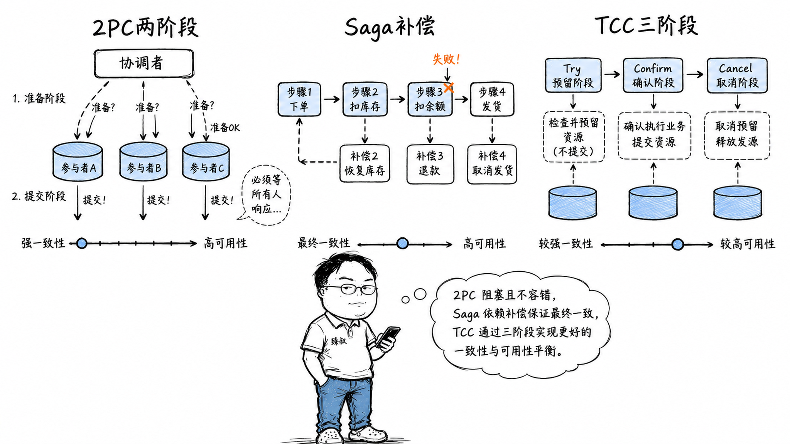

# 分布式事务方案选型：2PC、TCC、Saga与本地消息表对比



---

> 📌 **关注「程序员臻叔」，获取更多硬核技术干货**


---

2018年，我们的支付系统有一次惊险的线上故障：用户A向用户B转账100元。流程是：先调A银行接口扣款→成功，再调B银行接口入账→超时。B银行是"超时了但实际已入账"还是"超时了没入账"——我们无法确定。

运维手动查了B银行的流水，发现确实入账了。但如果是"没入账"——A被扣了钱，B没收到——这100元就不翼而飞了。这就是分布式事务最核心的问题：**两个独立的系统，一个操作成功，另一个操作状态未知——如何让两者最终一致？**

这个问题没有完美解。CAP定理告诉我们：网络分区发生时，一致性和可用性只能二选一。在这个约束下，各种分布式事务方案（2PC、TCC、Saga、消息表、最大努力通知）都是在"一致性强度"和"系统可用性"之间画一条自己能接受的线。

## 核心结论

1. **2PC（两阶段提交）**追求强一致性——要么全部成功、要么全部回滚。代价是同步阻塞和协调者单点故障风险。适合对一致性要求极高的场景（如跨行转账的核心确认），但不适合互联网高并发。
2. **TCC（Try-Confirm-Cancel）**是"业务层的2PC"——把每个操作拆成预留（Try）、确认（Confirm）、取消（Cancel）三阶段。性能好于2PC，但业务代码侵入性极强，每个操作要写三套逻辑。
3. **Saga**是"长事务的拆解"——把一个长事务拆成多个独立的小事务，每个有对应的补偿操作。链路上任何一步失败，反向执行补偿。适合业务流程长的场景（如机票酒店预订），复杂度在补偿逻辑的设计。
4. **本地消息表 + 最大努力通知**追求最终一致性——不要求立刻一致，只要求在"足够短的时间内"（秒/分钟级）最终一致。适合绝大多数互联网业务（积分、通知、状态同步）。
5. **分布式事务不是只有"用2PC"和"不管一致性"两个极端**。工程中大量场景可以用"最终一致性 + 对账补偿"覆盖，只有极少数核心场景（金融核心）才需要强一致性方案。

## 深度拆解

### 一、2PC：理想主义的"要么全做、要么全不做"

2PC是最经典的分布式事务协议：

**2PC的致命缺陷：**

1. **协调者单点故障**：Coordinator挂了，参与者在"已Prepare但不知道Commit还是Rollback"的状态卡住——资源（余额冻结）一直被锁着。
2. **同步阻塞**：Prepare阶段锁定资源，直到收到最终指令。如果网络抖动，参与者可能长时间阻塞。
3. **部分失败问题**：Coordinator发出Commit后自己挂了，有些参与者收到Commit、有些没收到——数据不一致。

**适用场景：** 严格受限的场景，如XA协议（数据库层面支持的分布式事务，JTA/JTS实现）、跨数据库的强一致性需求。在互联网场景中几乎不用。

### 二、TCC：把"锁数据库"改成"应用层预留资源"

TCC的核心思想：不让数据库锁资源，而是在业务层面模拟"预留→确认→取消"。

```
转账100元（TCC模式）：

Try阶段（预留资源）：
  服务A: 冻结A的100元（可用余额 -100，冻结余额 +100）
  服务B: 不需要Try（入账不需要预留）

Confirm阶段（确认）：
  服务A: 扣减冻结余额（冻结余额 -100）
  服务B: 可用余额 +100

Cancel阶段（取消）：
  服务A: 解冻100元（冻结余额 -100，可用余额 +100）
  服务B: 不需要Cancel
```

**TCC vs 2PC：**

| | 2PC | TCC |
|---|---|---|
| 锁的对象 | 数据库行锁 | 业务字段（冻结余额） |
| 锁的时长 | 整个事务期间 | 从Try到Confirm/Cancel（通常很短） |
| 业务侵入性 | 低（数据库层解决） | 极高（每个操作要写Try/Confirm/Cancel三套代码） |
| 性能 | 差（数据库锁竞争） | 较好 |
| 一致性 | 强（ACID事务） | 最终一致性（Confirm/Cancel可能失败） |

**为什么支付宝选择了TCC：**

支付宝的转账操作一秒可能有几十万笔。如果用2PC，每笔转账都要锁住两边的数据库行——锁竞争会让整个系统不可用。TCC只在Try阶段占用业务资源（冻结余额），且冻结时间极短（毫秒级确认），所以能支持高并发。

但TCC的代价是：每个业务操作都要写三套逻辑。支付宝内部封装了TCC框架，开发只需要关注业务逻辑，框架自动处理Confirm/Cancel的重试、幂等、状态机。

### 三、Saga：把长事务变成补偿链

适合"流程长、步骤多、但每步都可以有对应的逆操作"的场景。

**Saga的两种实现：**

| | 编排式（Orchestration） | 协同式（Choreography） |
|---|---|---|
| 控制方式 | 中心化的编排器控制流程 | 每个服务监听事件，自主决策 |
| 复杂度 | 编排器知道全局流程 | 每个服务只知道自己的步骤 |
| 适合场景 | 复杂流程、需要精细控制 | 简单流程、松耦合 |
| 例子 | 订单服务作为编排器，协调库存、支付、物流 | 各服务通过消息队列事件驱动 |

### 四、本地消息表 + 最大努力通知：最简单的最终一致性

适合"不需要第一时间强制一致，但最终必须一致"的场景。

**关键保证：**
- 消息和业务数据写入同一个本地事务 → 消息不会丢（要么都成功，要么都失败）
- 消息发送失败会重试 → 最终一定能送达
- 消费端做幂等 → 重复消费不影响结果

## 实战要点

**臻叔踩坑笔记：**

1. **TCC的Confirm和Cancel必须幂等**。Confirm可能因为网络超时被重试——如果Cancel被重试了两次，第一次解冻了100元，第二次又解冻100元 → 用户凭空多了100元。每个Confirm/Cancel操作第一步必须是幂等检查："这个TCC事务我处理过吗？"

2. **Saga的补偿是"执行逆操作"，而非简单的"撤销"**。订机票如果已出票，补偿操作不是"删除这条记录"（数据库回滚），而是"调用退票接口"（可能需要扣除退票手续费）。补偿逻辑和正向逻辑一样复杂，不要低估。

3. **本地消息表方案的消息发送和业务处理有"顺序保证"问题**。如果消息表里先发了一条"创建订单"消息、后发了一条"更新订单"消息，但MQ把"更新订单"先投递了、"创建订单"后投递——消费者可能处理失败。需要在消费端做状态机判断（"如果订单还不存在，等一会再处理"）。

4. **不要在用"最终一致性"的同时给用户展示"实时一致性"**。用户支付成功 → 页面显示"支付成功" → 但积分要30秒后才到账。如果用户立刻刷新积分页面发现积分没变 → 困惑。要么用Loading/Skeleton占位，要么在前端做乐观更新（先显示积分+10，后台异步确认）。

5. **分布式事务的监控比单机事务复杂一个数量级**。你需要监控：每个事务步骤的执行耗时、补偿是否被触发、消息积压量、对账差异数。每个分布式事务都应该有一个全局的TraceId，方便在日志/链路追踪中串联整个流程。

**一句话总结：**

> 分布式事务从2PC到Saga到消息最终一致性，本质上是在"一致性强度"和"系统可用性"之间做梯度滑坡——离2PC越远，一致性越弱但系统越可用；离消息最终一致性越近，一致性越弱但系统越有弹性。工程上不是选"最好的"，而是选"你的业务用户能接受的、最低的一致性保证"。

---

---

### 🎯 觉得有帮助？关注「程序员臻叔」


---
