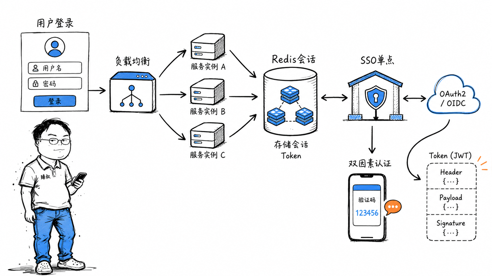

# 千万级登录系统设计：Session管理与Token认证方案



---

> 📌 **关注「程序员臻叔」，获取更多硬核技术干货**


---

2019年，某团队接手了一个老项目的登录模块。代码里同时存在三套鉴权逻辑：一套用Session存Redis、一套用JWT自签发、还有一套从SSO网关透传的Token。每次排查"用户莫名其妙被登出"的Bug，光梳理Token流转路径就要翻四个服务、三种存储介质。

更头疼的是压测——当模拟200万在线用户时，Redis的Session key达到了内存告警阈值，JWT的签名验证CPU飙升到80%，而SSO的回调超时率飙到了12%。

在这个项目里，Session、JWT、SSO这三种方案第一次被放在同一个尺度下审视。它们之间不是"哪个更好"的竞争关系，而是**在不同约束下如何组合**的问题。

## 核心结论

1. **Session方案**的核心优势是服务端可控（随时踢人、强登出），代价是集中存储的扩展成本和跨服务Session同步——适合需要强管控的内部后台系统。
2. **JWT方案**的核心优势是无状态、跨服务自包含，代价是"签发即不可撤销"和不小的传输开销——适合高性能微服务间鉴权和移动端API。
3. **SSO（单点登录）**解决的是"多系统、一个身份"的跨域信任问题，OAuth 2.0 / OIDC是事实标准——但它在登录系统之上多了一层协议开销。
4. **千万级用户的登录取舍**：Session靠Redis水平扩展、JWT靠短有效期+Refresh Token分层、SSO靠认证中心独立部署——三种方案几乎所有大厂都是混用，没有人只用一种。

## 深度拆解

### 一、Session：服务端有权力的代价

用户提交用户名密码 → 服务端验证 → 创建Session对象（用户ID、角色、过期时间）→ 生成Session ID → 通过`Set-Cookie`返回。

浏览器之后每次请求自动带上Cookie，服务端根据Session ID去Redis/内存查Session对象，确认身份。

**Session的核心优势：强管控**

服务端随时可以：
- 单个Session失效：`del session:{sid}`
- 按用户踢出所有设备：`del user_sessions:{uid}:*`
- 管理员批量踢人：遍历并删除特定条件下的Session

这对风控场景是刚需——发现被盗号，能立刻让所有该用户的Session失效。

**Session的代价：无状态服务的悖论**

当有几十台服务实例时，Session不能存应用内存里——同一个用户下次请求可能落到另一台机器，本地内存里的Session不存在，用户就被登出了。

解法是集中存储，通常是Redis：

但这引入了新问题：Redis挂了，所有用户全部登出。所以线上通常加Sentinel/Cluster做高可用，并做Session持久化到MySQL的兜底。

**关键问题：Cookie的SameSite和跨域**

Session ID通过Cookie传递，但Cookie被同源策略限制。如果你的前端在`app.example.com`，API在`api.example.com`，Cookie需要设置`domain=.example.com`。现代Chrome默认`SameSite=Lax`——跨站POST不会带Cookie，可能影响某些场景。

**千万级用户的Session存储估算：**

| 项目 | 数值 |
|------|------|
| 每个Session大小 | ~1KB |
| 1000万在线用户 | ~10GB |
| Redis集群（3主3从） | 每节点~5GB，完全OK |
| 过期策略 | 30分钟滑动过期，减少无效Session |

### 二、JWT：去中心化的代价

JWT把用户信息编码成三段式Token：`Header.Payload.Signature`。

```
Header:  {"alg": "RS256", "typ": "JWT"}
Payload: {"sub": "10086", "name": "张三", "role": "user", "exp": 1716000000}
Signature: RSA_SIGN(base64(Header) + "." + base64(Payload), private_key)
```

服务端用私钥签发，客户端每次请求带上Token，服务端用公钥验签即可——不需要查任何存储，完全无状态。

**JWT的优势：扩展性和性能**

- 微服务A签发Token → 微服务B、C、D都能验证，不需要共享Redis
- 不查存储，延迟取决于签名验证的CPU时间（RSA 2048约0.5ms）
- 适合API网关透传身份给后端服务

**JWT的致命缺陷：签发即不可撤销**

一旦JWT签发出去，在过期时间`exp`之前，服务端无法让它失效。如果用户被盗号，攻击者在Token过期前可以一直使用。

工程上的缓解方案：

1. **短有效期Access Token（15分钟）+ 长有效期Refresh Token（7天）**：大部分请求用Access Token，被泄露影响范围小；Refresh Token用于换新的Access Token，其撤销机制更严格（通常存Redis或数据库）。

2. **Token黑名单**：把被撤销的Token ID（jti）存入Redis，校验时先查黑名单。但这部分又把JWT拖回了有状态模式。

3. **版本号机制**：Payload中带`token_version`，用户改密码/登出时，Redis/DB中更新该用户的最新version，校验时比对。

**千万级用户的JWT流量估算：**

| 项目 | 数值 |
|------|------|
| 每个JWT大小 | ~500字节（含签名） |
| 1000万用户每分钟1次API调用 | 每分钟1000万次验签 |
| RSA 256验签QPS | 单核约2万次/秒 |
| 需要签名验证核数 | 约8-10核（完全可接受） |

### 三、SSO：跨域信任的桥梁

当你登录了`taobao.com`，打开`tmall.com`，发现已经登录了——这就是SSO。

核心流程（OAuth 2.0授权码模式 + OIDC）：

**SSO代价：多一跳的复杂性和依赖**

每次新登录一个系统都要经过SSO重定向，比Session/Cookie方案多1-2次网络往返。而且SSO中心成了所有系统的依赖——SSO挂了，所有系统都无法登录（虽然已登录用户不受影响）。

重要的是区分**认证**和**授权**：

|  | 认证（Authentication） | 授权（Authorization） |
|---|---|---|
| 解决的问题 | 你是谁 | 你能做什么 |
| SSO对应 | OIDC（基于OAuth 2.0的身份层） | OAuth 2.0 |
| 产出 | ID Token（身份信息） | Access Token（访问权限） |

### 四、三种方案实战混用

真实的大厂登录系统几乎没有只用一种方案的：

**为什么是混用而不是选一种？**

因为不同场景对"安全性"、"性能"、"用户体验"的权重不同：
- 内部管理后台：Session为主，管理员能立刻踢人
- 移动端API：JWT为主，减少网络往返
- 跨系统跳转：SSO/OIDC为主，一次登录全平台通
- 敏感操作：叠加Session状态检查，即使JWT有效也要确认Session在线

## 实战要点

**防撞库和防暴力破解：**

1. **IP级别限流**：同一IP每分钟超过10次失败登录 → 拉黑5分钟
2. **账号级别锁定**：同一账号连续5次失败 → 锁定15分钟（但防止被恶意撞库锁别人账号——加验证码兜底）
3. **验证码递进**：前3次无验证码 → 第4次数数验证码 → 第6次滑块验证码 → 第8次锁定
4. **异地/新设备检测**：记录用户常用IP段和设备指纹，新设备登录触发二次验证（短信/邮件）

**臻叔踩坑笔记：**

1. **不要把用户敏感信息放JWT Payload里**。JWT没有加密（只是Base64），任何人都能解码Payload。敏感信息存服务端，JWT只放user_id就够了。

2. **不要用JWT的`none`算法**。把`alg: "none"`改成`alg: "HS256"`还要一起改签名——而`none`可以绕过一切验证。生产环境必须固定允许的算法白名单。

3. **Cookie的HttpOnly和Secure属性必须设**。`HttpOnly`防止JS读取Cookie（防XSS偷Session ID），`Secure`确保只在HTTPS下传输。这两个漏一个都算安全缺陷。

4. **Refresh Token和Access Token分开存**。Access Token可以存localStorage（方便JS读取加Header），Refresh Token必须存httpOnly Cookie，这样即使XSS拿到了Access Token也只有15分钟窗口。

5. **SSO的回调URL必须做白名单校验**。OAuth 2.0的redirect_uri如果可以被篡改，攻击者能拿到授权码完成劫持。服务端必须校验redirect_uri与注册时一致。

**一句话总结：**

> 登录系统不是选 Session 还是 JWT，而是把"服务端强管控"和"去中心化性能"按场景分层。常规API用JWT保性能，敏感操作用Session保安全，跨系统跳转用SSO保体验，三者互为兜底而非互斥。

---

---

### 🎯 觉得有帮助？关注「程序员臻叔」


---
