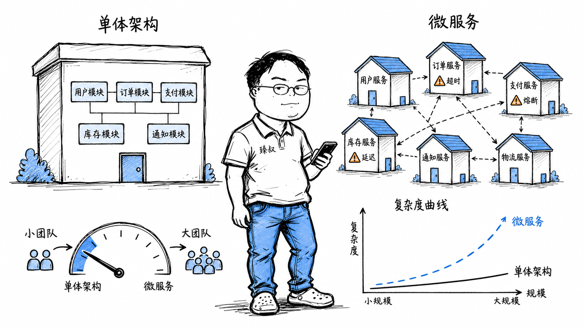

# 微服务与单体架构选择：服务拆分时机与演进策略

---

> 📌 **关注「程序员臻叔」，获取更多硬核技术干货**

---

一个典型的反面案例：10人团队维护了20个微服务。听起来很"现代化"，实际体验是一场灾难。

需求："商品详情页加个'最近浏览'模块"。这个需求要改4个服务：商品服务（加接口）、用户行为服务（记录浏览）、推荐服务（关联推荐）、前端BFF（聚合数据）。每个服务改完后要联调——4个服务的改动依赖关系是：BFF依赖所有三个服务，推荐服务依赖行为服务。联调时推荐服务的开发在休假，等了三天。

更崩溃的是CI/CD——每次改一行代码，要等20个服务的集成测试跑完（40分钟）。需求上线周期反而比当年的单体应用还慢。

这个问题值得所有人重新审视：**微服务到底是解决什么问题？你的团队规模、业务复杂度、运维能力，是否真的需要它？**

## 核心结论

1. **微服务不是"架构更先进"，它的本质是"匹配组织复杂度的工具"**。康威定律说系统设计会反映组织结构——大公司的多团队结构自然催生微服务，小团队用微服务是自找麻烦。
2. **微服务把"代码的复杂度"转移成了"网络的复杂度"**——你不再需要梳理几万行耦合代码，但你需要处理网络延迟、超时、重试、熔断、分布式事务、数据一致性。复杂没有消失，只是换了一种形式。
3. **拆分的时机不是"数据量大了"或"QPS高了"**。那些可以用缓存、读写分离、分库分表解决。真正需要拆分的信号是：团队膨胀到不同模块由不同小组负责，且各组的迭代节奏严重冲突。
4. **两披萨原则是拆分粒度的实用参考**——一个服务应该能由"不超过两个披萨能吃饱的团队"（约6-8人）独立维护。太小的服务意味着太多跨服务协调。
5. **大部分"微服务改造失败"的原因是：在拆服务的同时没有建立对应的基础设施**。服务发现、API网关、配置中心、链路追踪、监控告警、CI/CD流水线，缺一不可。

## 深度拆解

### 一、微服务真正的价值

很多人以为微服务的价值是"高性能"或"可扩展"，但真相是：

**微服务解决的是组织问题，不是技术问题。**

| | 单体架构 | 微服务架构 |
|---|---|---|
| 团队20人，一个代码仓 | 代码冲突频繁，发布排队 | 各服务独立仓，独立发布 |
| 团队200人，10个组 | 全局代码耦合严重，改不动 | 每组负责2-3个服务，自治迭代 |
| 需要"订单模块独立扩容" | 整个应用扩容，浪费资源 | 只扩容订单服务 |
| 需要用不同技术栈 | 强制统一语言/框架 | 各服务选最适合的 |
| 需要快速试错 | 发布周期长（全量回归） | 单服务发布，快 |

**真正的价值排序：**

1. **团队自治**（最重要）：不同团队掌握自己的发布节奏、技术栈、数据库。
2. **独立扩展**：只扩容压力大的服务，省资源。
3. **故障隔离**：推荐服务挂了，商品详情页还能看（只少一个推荐模块）。
4. **技术栈灵活**（次要）：这不是核心价值，大多数公司用一个技术栈反而更高效。

### 二、微服务的真实代价

每个微服务架构下，都有张看不见的"代价清单"：

**1. 网络延迟叠加**

**2. 分布式事务**

**3. 运维爆炸**

| 运维维度 | 单体 | 微服务（20个服务） |
|----------|------|------------------|
| 部署次数 | 1次 | 20次 |
| 监控指标 | ~50个 | ~500个 |
| 日志排查 | 一个文件/ES索引 | 20个索引，需要TraceId串联 |
| 配置管理 | 1个配置文件 | 20个（需要配置中心） |
| 故障定位 | 1个调用栈 | 跨服务的链路追踪 |
| 本地开发 | 1个应用启动 | 20个服务，可能还要docker-compose |

**4. 接口契约陷阱**

服务A的API改了响应字段名 → 服务B调用A的代码没更新 → 生产环境报错。在单体里，改名是IDE重构一键完成的。在微服务里，接口变更需要版本管理和兼容性策略。

### 三、什么时候不该拆

**不该拆的场景：**

1. **团队不到20人**：沟通成本还没超过代码耦合成本。
2. **业务模型还不稳定**：还在频繁试错、快速迭代，拆分后接口频繁变更，协调成本爆炸。
3. **没有基础设施**：没有CI/CD流水线、没有服务发现、没有链路追踪。先建基础设施，再考虑拆分。
4. **数据强一致的业务核心**：支付核心、账户核心——微服务的最终一致性模型不适合，分布式事务的复杂度超过收益。

**应该怎么演进：**

**模块化单体的好处：**
- 代码组织清晰了（DDD的上下文边界）
- 但部署和运维成本没变（还是一个应用）
- 拆分时只需把模块的网络边界打开，内部不需要重构

### 四、如果必须拆，怎么拆

**拆分原则：**

1. **按业务领域拆分（DDD界限上下文）**。不是"按技术层拆分"（不是controller层一个服务、service层一个服务）。

2. **每个服务有自己的数据库**。这是微服务最核心的约束——如果两个微服务共享数据库，它们的耦合没有真正解除。一个服务改了表结构，另一个服务可能被影响。

3. **服务间通信：同步用REST/gRPC + 异步用消息队列**。优先考虑异步（解耦更彻底），但简单查询用同步更直接。

4. **先拆"最独立、改动最频繁、压力最大"的服务**。按优先级逐个拆，而非一下子全拆。

**拆分时的数据迁移模式：**

## 实战要点

**臻叔踩坑笔记：**

1. **不要为了微服务而微服务**。我见过一个20人团队从单体迁到微服务后，开发效率下降了30%——因为80%的需求都跨2-3个服务，每次都要联调。如果需求通常不跨模块边界，"微服务让需求更快"才成立；否则微服务只是加了网络开销。

2. **分布式事务不要追求强一致性**。几乎所有微服务最佳实践都说"用最终一致性"——Saga、消息表、TCC。只有极少数场景（如资金转账的核心链路）才值得分布式事务的复杂度。

3. **服务发现不能手动管理**。20个服务如果靠配IP列表——每次扩容改配置，每次缩容改配置，哪个节点挂了不知道。必须上服务发现（Consul/Nacos/Eureka）和客户端负载均衡。

4. **没有链路追踪就不要拆微服务**。一个请求穿过4个服务后报错——没有TraceId你无法知道是哪一层出了问题。Zipkin/Jaeger/SkyWalking至少要有一套。

5. **API版本管理不要依赖URL版本号**。`/api/v1/users`、`/api/v2/users`看似简单，但版本多了后每个版本都要维护一套代码。更好的做法是用请求头的Content-Type做版本协商：`Accept: application/vnd.company.user-v2+json`——但这也只是过渡方案，最终还是要追求向前兼容。

**一句话总结：**

> 微服务不是进化的终点，而是组织膨胀到单体管不住时的止痛药。药有副作用（网络复杂度、运维成本、分布式一致性），没到那个阶段硬吃就是受罪。判断标准不是"技术潮流"，而是"你的团队规模和业务复杂度是否已经让单体的维护成本超过了微服务的新增成本"。

---

---

### 🎯 觉得有帮助？关注「程序员臻叔」

---
