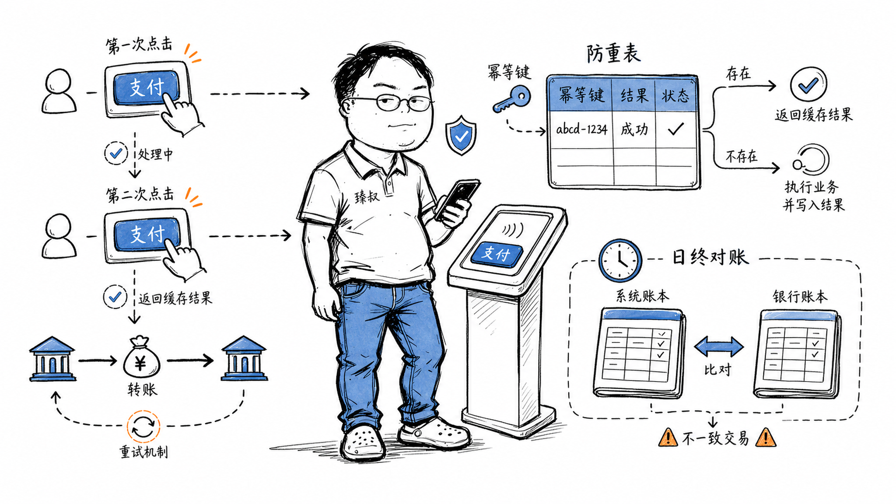

# 支付系统——为什么用户点了两次支付不能扣两次钱




2019年双11过后的第二天，我们的客服团队收到了27条投诉——都说被重复扣款了。追查发现，那天凌晨支付网关和支付宝之间的网络出现间歇性抖动，超时的请求被客户端重试了。但我们的支付接口没有做幂等——同样的扣款请求，重试了两次，就扣了两次。

修复这个问题只花了半天：加了一个幂等键映射表。但后续的连锁问题持续了好几周：银行流水和商户系统对不上、退款逻辑需要额外的"多扣退款"流程、客服口径要统一——一个设计缺陷，运维成本翻了三倍。

支付系统是分布式系统中最不该"差不多"的模块。这篇文章把支付链路从头到尾的幂等设计、回调处理、对账机制拆清楚。

## 核心结论

1. **支付幂等的核心**不是"让按钮只能点一次"（前端），而是"同一个支付请求无论重试多少次，只扣一次钱"（后端）。这需要一个全局唯一的幂等键贯穿整个支付链路。
2. **幂等键的生命周期**：前端生成 → 贯穿支付请求 → 存储到幂等表 → 在银行侧也建立映射 → 过期清理。任何一个环节的缺失都可能造成重复扣款。
3. **支付回调不能替代主动查询**——回调可能丢失（网络抖动、商户服务器重启）、可能延迟（十几秒到几分钟）、可能重复。必须"主动查询 + 回调确认"双通道。
4. **日终对账是最后的防线**——即使幂等机制失效，对账能发现银行流水和系统状态的差异，触发人工或自动补偿。
5. **退款、冲正、撤销**是支付系统的"逆向链路"——同样需要幂等设计，且它的状态机更复杂（部分退款、多次退款、退款超时、退款失败重试）。

## 深度拆解

### 一、幂等键：整条支付链路的一把锁

**幂等键从哪里来：**

**幂等表设计：**

```sql
CREATE TABLE idempotent_records (
    idempotent_key VARCHAR(128) PRIMARY KEY,
    status ENUM('PROCESSING', 'SUCCESS', 'FAILED', 'REFUNDED'),
    result_data JSON,        -- 存储扣款结果（金额、银行流水号等）
    created_at TIMESTAMP DEFAULT CURRENT_TIMESTAMP,
    updated_at TIMESTAMP DEFAULT CURRENT_TIMESTAMP ON UPDATE CURRENT_TIMESTAMP,
    expired_at TIMESTAMP,    -- 清理用的过期时间（通常24小时）
    INDEX idx_expired_at (expired_at)
);
```

**为什么expire：**
- 幂等键不能永远保留——存储空间无限增长。
- 一般设24小时过期。因为在24小时后，用户基本不会再来重试"昨天的支付"。
- 过期后如果真有人拿着旧key重试 → 返回key已过期，请生成新key重新支付。

### 二、回调延迟和丢失：你为什么不能只等回调

**支付回调（异步通知）的不可靠性：**

**为什么不能只等回调：**

| 问题 | 场景 | 后果 |
|------|------|------|
| 回调丢失 | 回调发送的瞬间商户服务器重启 | 这笔订单永远显示"待支付" |
| 回调延迟 | 支付宝重试间隔是15秒/1分钟 | 用户等了30秒没看到支付成功，以为支付失败 |
| 回调重复 | 支付宝发了回调，商户处理后返回SUCCESS，但网络波动导致支付宝没收到SUCCESS → 重试 | 同一笔支付收到两次回调 |

**双通道确认方案：**

### 三、对账：最后一道防线

即使幂等和回调都做好了，仍然可能出现银行扣了钱但商户系统没记录（或者反过来）。原因包括：网络分区、银行系统异常、人为操作错误、协议解析Bug。

**日终对账流程：**

**对账系统的设计要点：**

- **独立于支付主链路**：对账系统不能影响支付性能。
- **文件交换**：银行流水通过SFTP/HTTPS下载，不要直接连银行数据库。
- **差异分级**：小额差异（<1元）自动勾销，大额差异人工处理。

### 四、逆向链路：退款和冲正

支付正向链路已经很复杂了，逆向链路更复杂。

**退款的状态机：**

**部分退款：**

用户支付100元，退了30元——原支付单变成了"部分退款"状态。再退30元——检查"已退金额 < 支付金额"才能继续退。

**退款超时处理：**

退款也是个接口调用，同样可能超时。处理逻辑和支付一样：记录"退款中"状态 → 定时查询银行退款结果 → 确认后更新。

## 实战要点

**臻叔踩坑笔记：**

1. **幂等键不能只用订单号**。一个订单可能因为支付失败被用户多次发起支付（换卡支付、换支付方式）。每次发起支付都要生成一个新的幂等键。正确做法是：幂等键 = 订单号 + 支付序列号 + 时间戳。

2. **回调验签不能省**。回调请求的POST Body里可能带有签名——必须用商户密钥验签。如果不验签，攻击者可以伪造"支付成功"的回调，直接篡改订单状态。验签失败 → 丢弃回调。

3. **支付结果不要从回调的URL参数里拿**。支付宝的同步跳转（return_url）中携带了支付结果参数，但这些参数是明文在URL中的，可以被用户篡改。必须以异步回调（notify_url）或主动查询接口的结果为准。

4. **退款时检查余额**。调用银行退款接口前，先检查商户账户余额是否足够退款。余额不足时退款接口可能返回成功但实际上没退——银行会在T+1日才通知你余额不足。这是线上退款的常见坑。

5. **不要把所有支付逻辑写在一个巨大的Service里**。支付链路涉及：幂等检查、风控校验、银行接口调用、回调处理、对账、退款——每个都是独立的子领域。拆分成独立的模块：PaymentValidator（校验）、PaymentExecutor（执行扣款）、CallbackHandler（回调处理）、ReconciliationService（对账）——否则业务迭代时改一处可能影响全局。

**一句话总结：**

> 支付系统不是在"转账成功"和"转账失败"之间二选一，而是在数不清的"不确定"状态中（超时但可能成功、回调丢失、对账不一致），用幂等键、双通道确认、日终对账三级机制，把不确定性收敛成确定性——最终保证：钱不多扣、不少扣、不丢、不错。

---
