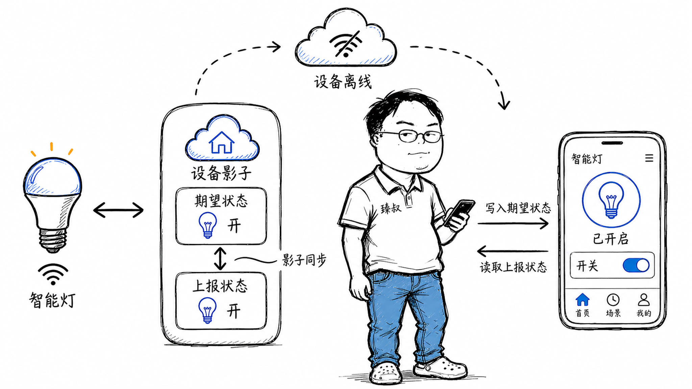

# 设备影子模型——当1000万设备不可能同时在线




去年我在家装了一套智能家居系统——灯光、空调、窗帘、门锁，总共16个设备。有天晚上我想用手机关卧室灯，点了三次没反应。检查发现灯自己掉线了（WiFi模块进入了省电休眠），App上却显示"已关闭"——灯其实还亮着。

这就是物联网系统最核心的矛盾：**应用端需要随时操作设备、看到状态，但设备不可能一直在线**。电池供电的设备要省电、WiFi信号覆盖盲区、固件Bug导致偶发断连——设备离线是常态，不是异常。

我后来调研了AWS IoT、阿里云IoT、小米IoT平台的设备影子实现，发现它们都在解决同一个问题：如何在设备离线时，让应用仍然能"操作"它。答案是一套精巧的**双向状态缓冲模型**。

## 核心结论

1. **设备影子（Device Shadow）的本质**是云端为每个设备维护的"最后已知状态 + 待执行指令"副本——它把"应用"和"设备"解耦，双方按各自节奏读写影子，影子负责最终同步。
2. **双向同步模型**：设备上报真实状态（reported）→ 应用端读取；应用端下发期望状态（desired）→ 设备上线后同步执行。reported和desired的diff就是"待同步的操作"。
3. **MQTT的QoS分级**是这个系统的基础设施——QoS 0（至多一次）省电但可能丢消息、QoS 1（至少一次）保证送达但可能重复，选错了档次要么丢指令要么功耗超标。
4. **影子不是缓存**——缓存过期了可以重建，影子过期了（设备离线太久）意味着reported状态不再可信，需要特殊处理。
5. **影子模型的核心理念可迁移**——任何弱网、离线、异步通信系统都可以用"云端状态副本 + 双向同步"的模式设计。

## 深度拆解

### 一、设备永远不在线的本质原因

| 原因 | 场景 | 解决方案依赖影子 |
|------|------|----------|
| 省电休眠 | 电池供电的温度传感器，每小时唤醒1次上传数据后立即休眠 | 大部分时间reported状态是"旧"的，但比没有好 |
| 网络不可靠 | WiFi信号弱的角落，设备周期性断连 | 断连期间desired指令堆积在影子里 |
| 固件升级 | 设备OTA升级期间不可用 | 升级完成后一次性同步全部堆积的desired |
| 主动离线 | 用户手动关闭设备电源 | 影子记录设备"主动离线"，应用端显示为灰色 |
| 信号干扰 | 2.4GHz信道拥堵（微波炉、蓝牙同时工作） | 短暂离线不影响用户体验 |

### 二、设备影子的三元组结构

每个设备在云端维护一个JSON文档，通常包含三个顶层字段：

```json
{
  "state": {
    "reported": {
      "power": "on",
      "brightness": 80,
      "color": "warm_white",
      "online": true,
      "timestamp": 1716000000
    },
    "desired": {
      "power": "off",
      "brightness": 50
    }
  },
  "metadata": {
    "reported": {
      "power": {"timestamp": 1716000000},
      "brightness": {"timestamp": 1716000000}
    },
    "desired": {
      "power": {"timestamp": 1716000100},
      "brightness": {"timestamp": 1716000100}
    }
  },
  "version": 42
}
```

**reported（上报状态）**：设备最近一次主动上报的自身状态。这是**事实——"设备认为自己是什么状态"**。可能是过时的（设备离线了），但这是云端唯一知道的信息。

**desired（期望状态）**：应用端希望设备达到的目标状态。这是**意图——"应用希望设备变成什么状态"**。当`desired`和`reported`不一致时，意味着有指令待执行。

**version（版本号）**：每次影子更新时递增。用于解决并发更新的冲突——类似乐观锁。

**核心逻辑：delta**

### 三、MQTT的分级投递：QoS的三档怎么选

MQTT（Message Queuing Telemetry Transport）是物联网的事实标准协议。它定义了三个QoS级别：

| QoS | 语义 | 投递保证 | 适用场景 |
|-----|------|----------|----------|
| 0 | 至多一次 | 发出去就不管了，可能丢 | 高频传感器数据（温度每秒上报一次，丢一条不影响） |
| 1 | 至少一次 | 接收方必须ACK，否则重发。但可能重复 | 重要指令（关灯、开锁）。重复需要幂等处理 |
| 2 | 恰好一次 | 四次握手保证不丢不重 | 罕见。协议开销大，实际场景几乎不用 |

**实战中的选择策略：**

- **设备上报传感器数据**：QoS 0。数据高频、偶尔丢一条不影响统计。
- **云端下发控制指令**：QoS 1。指令不能丢，但重复下发可以被设备幂等处理。
- **固件升级包传输**：不在MQTT里传。升级包走HTTPS或CoAP大块传输，MQTT只发"有新固件可用"的通知。

**MQTT的保活（Keep-Alive）和遗嘱（Last Will）：**

遗嘱消息是MQTT的一个巧妙设计：它让"设备掉线"能被Broker自动感知并通知订阅者，不需要设备主动说"我要下线了"——因为很多时候设备是突然掉线的。

### 四、影子的并发和一致性

当App设置了desired、同时设备上报了reported，影子怎么合并？

**影子以version为乐观锁：**

这意味着影子的更新是原子操作——同一个时刻只有一个写入者能成功。

**设备端如何处理影子：**

### 五、影子不是缓存——离线太久的特殊处理

当设备离线超过某个阈值（如24小时），reported状态已经不可信。例如温度传感器离线了一天，reported的"25°C"是昨天的温度，今天可能是30°C。

**处理策略：**

1. **标记"状态过期"**：应用端显示温度时标注"24小时前"或直接显示为"--"。
2. **设备上线后全量同步**：不是只同步delta，而是全量拉取影子中的desired。
3. **影子过期清理**：如果desired中积压了大量"已无意义"的指令（如"空调开到26°C"已经过了一整天），设备可以选择忽略过时的desired，直接上报最新reported。

## 实战要点

**MQTT Broker选型：**

- **EMQX**：国产高性能MQTT Broker，单节点100万连接。5.x版本原生支持MQTT over QUIC，弱网环境更好。
- **VerneMQ**：Erlang实现，集群友好，适合需要高可用和水平扩展的场景。
- **AWS IoT Core**：托管服务，内置设备影子、规则引擎、证书管理。适合不想自己运维的场景。

**臻叔踩坑笔记：**

1. **不要用QoS 2**。MQTT的QoS 2实现有已知的Bug（某些Broker在极端情况下会死锁），而且四次握手的延迟在弱网环境是灾难。QoS 1 + 业务幂等是更可靠的组合。

2. **影子的JSON不要太大**。AWS IoT对影子有8KB限制。不要把设备的历史日志、大段配置塞进影子里。影子只存核心状态（开关、亮度、模式），大量数据走独立的Topic或存储。

3. **MQTT的Topic设计要分层**。不要把所有设备消息都往一个Topic里扔。推荐的分层结构：`{product}/{device_id}/{message_type}`，如`smart_home/light_001/status`、`smart_home/light_001/command`。这样订阅时可以有选择地过滤。

4. **遗嘱消息不能替代心跳检测**。遗嘱消息依赖TCP连接断开才能触发，但某些情况下（如NAT超时）TCP连接在中间路由器上已断开，但Broker和客户端都不知道。必须加应用层心跳，否则设备离线了Broker还认为在线。

5. **电池设备的影子更新频率要精打细算**。每次上报reported都是一次射频发射（耗电大户）。平衡策略：状态变化 > 阈值 → 立即上报；无变化 → 定时上报（间隔递增：1分钟 → 5分钟 → 15分钟 → 1小时）。最终在"实时性"和"续航"之间找到工程上可接受的平衡点。

**一句话总结：**

> 设备影子模型把物联网的"弱网+离线+功耗约束"三重困境，转嫁为一个"云端写缓冲+双向同步"的分布式一致性问题——它的核心思想是"不要求两端同时在线"，这个模式可以迁移到任何异步通信系统。

---
