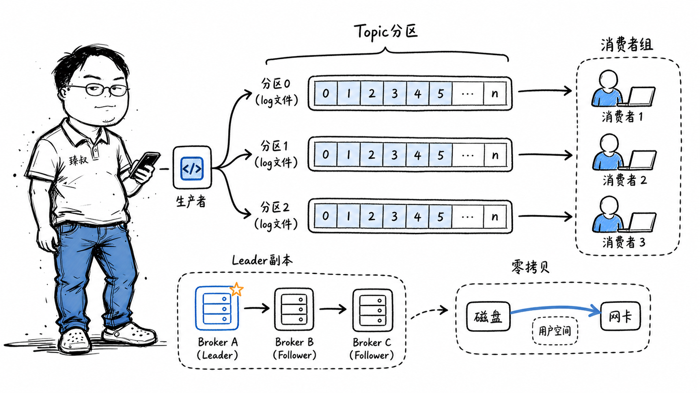

# Kafka原理剖析：分区、副本、消费组与高吞吐存储设计



---

> 📌 **关注「程序员臻叔」，获取更多硬核技术干货**


---

2019年我们做日志中台时，日增日志量从100GB涨到了2TB。原来的方案是Logstash直接写Elasticsearch——高峰期ES的bulk写入延迟从200ms飙升到15秒，CPU打到95%，索引速度跟不上写入速度。

调研后决定加一层Kafka做缓冲。架构变成：应用日志 → Kafka → Logstash消费 → ES。上线后效果立竿见影——高峰期不再丢日志了，ES的写入曲线也变得平滑。但随之而来的是新的问题：Kafka的Partition怎么设计？Consumer Group的offset谁管？消息重复了怎么办？

这篇文章就是把当时深入学习Kafka设计原理的笔记整理出来——从"Kafka为什么快"这个核心问题出发，把底层机制彻底拆一遍。

## 核心结论

1. **Kafka快的核心不是"用内存"**，而是把消息队列抽象成"只追加的日志（append-only log）"——顺序写磁盘、批量读写、零拷贝、分区并行四项技术叠加，把吞吐推到极致。
2. **Partition是Kafka横向扩展的唯一手段**——一个Topic分多个Partition，Producer并发写入、Consumer并发读取。没有Partition就没有并行。
3. **Offset是消费者和Broker之间的"合同"**——Broker不帮你管理offset（不像RabbitMQ自动ACK），消费者自己记录读到哪了。这种设计把"消费进度管理"推给了消费者，换来了Broker的极简和极高的吞吐。
4. **ISR（In-Sync Replica）机制**是Kafka在"可靠性"和"性能"之间的平衡术。它不要求所有副本都同步才返回成功，只要"足够多的副本同步了"就返回，用"可容忍的数据丢失"换取低延迟。
5. **Kafka不是银弹**——它牺牲了低延迟（毫秒级→秒级）和灵活路由（不支持AMQP那样的复杂路由），换来了极高的吞吐和持久化能力。选型前先确认你更关心吞吐还是延迟。

## 深度拆解

### 一、Topic、Partition、Segment：三层存储模型

**为什么要有Partition？**

单台机器的磁盘I/O有上限（机械盘约150MB/s顺序写）。如果一个Topic每秒写入300MB，单Partition扛不住。分成3个Partition分布在3台机器上，每台只承担100MB/s——水平扩展。

**Partition内部顺序保证：**

一个Partition内的消息严格有序（按写入先后），但不同Partition之间无序。如果业务要求全局有序（极少见），只能用一个Partition——但那样就失去了并行能力。

**Segment的设计：**

一个Partition不存成一个巨大的文件（否则查找和清理都很慢）。而是切分成长度相近的Segment文件（默认1GB）。Kafka根据offset找到对应的Segment，再根据稀疏索引找到消息在文件中的近似位置，然后顺序扫描找到精确位置。

### 二、写入路径：为什么顺序写这么快

**关键优化点：**

1. **顺序追加（Append-Only）**：不是随机写。无论是机械盘还是SSD，顺序写速度远高于随机写。机械盘顺序写可达150MB/s，而随机写可能只有几MB/s。而且顺序追加没有磁盘寻道延迟。

2. **Page Cache**：Linux内核自带的磁盘缓存。Kafka读写先经过Page Cache，读命中时零磁盘I/O，写操作也是在Page Cache中追加后立即返回——应用层看到的是内存写速度。

3. **批量发送（Producer Batching）**：Producer不是一条条发消息，而是攒一批（`batch.size`默认16KB）一起发。`linger.ms`（默认0ms，设为5-10ms）允许等待额外几毫秒以攒够一批——用几毫秒的延迟换几倍的吞吐。

4. **零拷贝（Zero-Copy）**：消费者读取消息时，传统方式是：磁盘 → 内核缓冲区 → 用户态缓冲区 → Socket缓冲区 → 网卡。Kafka用`sendfile()`系统调用，数据直接从Page Cache传输到Socket → 网卡，不经过用户态——减少了2次CPU拷贝。

### 三、Consumer Group：消费模型的设计哲学

**为什么Kafka不帮你管理Offset？**

RabbitMQ的模型是：Broker记录每条消息是否被消费，消费者ACK后Broker删除消息。这种模型Broker负担重，不适合海量消息。

Kafka的模型是：消息不会因为被消费而删除（按时间或大小统一过期）。每个Consumer Group自己记录在每个Partition上的消费位置（offset），Broker不关心谁消费了、消费到哪了。

```
Consumer可以：
- 从最早的消息开始消费（--from-beginning）
- 从最新的消息开始消费（--latest）
- 从某个特定offset开始消费
- 回溯重新消费过去7天内的消息
```

这种设计让Kafka不仅能做消息队列，还能做**数据管道和事件溯源**——新上的数据分析服务可以从头开始消费历史数据，不影响其他消费者。

### 四、可靠性：副本和ISR机制

**ISR是什么？**

不是所有副本都时刻同步。ISR是"跟Leader差距不太大的Follower集合"。如果Follower落后太多（`replica.lag.time.max.ms`，默认30秒内没跟上），就从ISR中移除。

**ACK机制的精妙设计：**

Producer发送消息时可以设置`acks`：

| acks | 含义 | 可靠性 | 延迟 |
|------|------|--------|------|
| 0 | 不等任何确认 | 最低（消息可能丢） | 最低 |
| 1 | Leader写入Page Cache就返回 | 中（Leader挂了可能丢） | 低 |
| all / -1 | 所有ISR副本都写入才返回 | 最高 | 高 |

`acks=all`时，如果ISR只有一个Leader（所有Follower都落后被移除了），那就等于`acks=1`。这是有意设计的——宁可降低可靠性也不能让系统不可写。

**min.insync.replicas**是保障——当ISR大小小于这个值时，Producer的写入被拒绝。典型配置：Replication Factor = 3，min.insync.replicas = 2，acks = all。含义：至少有2个副本确认才认为写入成功。

### 五、Kafka vs RabbitMQ vs RocketMQ

| 维度 | Kafka | RabbitMQ | RocketMQ |
|------|-------|----------|----------|
| 核心模型 | 持久化日志流 | 传统消息队列（Exchange→Queue） | 类似Kafka日志 + RabbitMQ灵活路由 |
| 吞吐量 | 极高（百万条/秒） | 中等（万条/秒） | 高（十万条/秒级） |
| 延迟 | 毫秒到秒级（默认批量） | 微秒到毫秒级 | 毫秒级 |
| 路由灵活性 | 简单（Topic→Partition） | 丰富（Direct/Topic/Fanout/Headers） | 中等（Tag + SQL表达式） |
| 消息优先级 | 不支持 | 支持 | 不支持 |
| 消息回溯 | 支持（保留期内任意回放） | 不支持（消费即删除） | 支持 |
| 适合场景 | 日志采集、事件流、数据管道 | 任务队列、RPC异步、复杂路由 | 在线业务消息、金融级事务消息 |

## 实战要点

**臻叔踩坑笔记：**

1. **Partition数量不能随便改**。Partition数量只能增加不能减少（Kafka不支持减小Partition）。新增Partition后，已有的有key的消息路由会变化——原本在Partition 0的消息可能被重新路由到Partition 5，打破了"同一个key的消息在同一Partition"的顺序保证。Partition数要在Topic创建时慎重设定。

2. **Consumer Group的Rebalance是性能杀手**。当Consumer加入/离开Group时，Kafka会触发Rebalance——暂停所有Consumer，重新分配Partition。Rebalance期间整个Group停止消费。避免频繁Rebalance的策略：`session.timeout.ms`（默认45秒）不要设太短，`max.poll.interval.ms`（默认5分钟）要大于消息处理时间。

3. **不要依赖Kafka的"精确一次语义"**。Kafka 0.11引入了幂等Producer和事务，但这些机制有严格的性能代价和前提条件。绝大多数场景用"至少一次（At-Least-Once） + 消费者幂等处理"更实际。记住：Kafka保证的是"消息不丢"（通过副本和ACK），不保证"消息不重复"。

4. **消费者处理完消息后再提交Offset**。如果先提交offset再处理消息，处理过程中消费者挂了，这部分消息就丢了。正确做法：处理完业务逻辑 → 再`commitSync()`。代价是可能重复消费（处理完了但commit前挂了 → 重启后从旧offset重新消费）——用幂等来解决重复。

5. **磁盘容量监控是第一要务**。Kafka消息不会因为被消费而删除，而是按`retention.ms`（默认7天）或`retention.bytes`（分区大小上限）自动清理。但不合理的Partition数量+高写入量=磁盘可能在几小时内写满。监控每个Broker的磁盘使用率，设置80%告警。

**一句话总结：**

> Kafka不是"更快的RabbitMQ"，而是换了一个赛道：用"持久化日志流"重新定义消息队列，把系统复杂度从"Broker管理消费状态"转移到"消费者自己管理进度"，换来了极致的吞吐和回溯能力。理解了这个设计思路，才能理解它的一切取舍。

---

---

### 🎯 觉得有帮助？关注「程序员臻叔」


---
