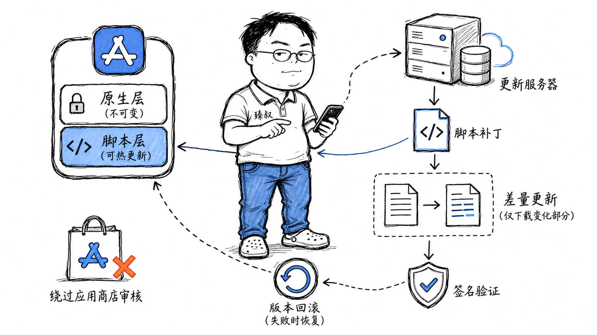

# 热更新——为什么游戏不重新下载就能更新内容




手游行业有一个经典场景：某个关卡有个严重Bug——Boss打死不掉宝箱。按照传统发版流程：修复代码 → 打包 → 提交App Store审核（3-7天）→ 用户更新 → 玩到那关的已经是几天后了。用户早就在TapTap上打了差评。

但使用热更新方案后——修复了一个Lua脚本文件（只有3KB），直接上传到CDN，所有玩家重新进入游戏时自动下载并加载修复后的脚本。从发现Bug到全量修复，整个过程不到30分钟。

这就是热更新的魔力——不用重新安装App，不用等审核，秒级修复线上Bug。但它也是一把双刃剑：如果更新包被篡改，攻击者可以直接在用户手机上运行恶意代码。这篇文章把热更新的技术方案和安全边界拆清楚。

## 核心结论

1. **热更新更新的不是"原生二进制"，而是"资源文件和脚本"**——图片、配置、UI布局、Lua/JS脚本。真正涉及底层引擎、系统框架的改动，仍然要走应用商店发版。
2. **热更新的核心流程**：版本检查 → 资源清单对比 → 增量下载 → 本地替换/并行加载 → 生效。差分包（bsdiff）是减少下载量的关键。
3. **iOS对热更新有铁律**：苹果禁止App下载可执行代码并执行。解释型脚本（Lua/JS）处于灰色地带——苹果曾大规模警告过热更新SDK，现在主流做法是只热更新资源文件。
4. **安全是不可妥协的**：更新包必须签名（防篡改）、传输加密（HTTPS）、增量更新前后做哈希校验。如果热更新被劫持，相当于攻击者可以在你的App里运行任意代码。
5. **不同技术栈的热更新方案完全不同**：Unity用AssetBundle、React Native用JS Bundle、微信小程序由平台托管——没有一套方案能跨技术栈通用。

## 深度拆解

### 一、热更新的技术边界：什么能改、什么不能改

**热更新的能力边界：**

| 可以热更新 | 必须发版 |
|-----------|---------|
| 修Bug（Lua/JS脚本层面） | 升级引擎版本（Unity 2022→2023） |
| 调数值（攻击力、血量、掉落率） | 新增原生功能（接入新SDK、实现Metal渲染） |
| 改UI布局 | 修改App权限（如新增相机权限） |
| 替换图片/音效/模型 | 修改App Icon/Splash Screen |
| 活动配置（双11、春节活动） | 修改Info.plist/AndroidManifest |
| 本地化文本 | 升级最低系统版本要求 |

### 二、热更新流程：从版本检查到生效

**增量更新（差分包）：**

完整包可能有500MB，每次都全量下载太慢。差分包只包含变化的部分：

### 三、安全：热更新最大的风险

热更新最危险的场景：用户在咖啡馆连了假WiFi，攻击者劫持了更新请求，返回一个"修改过"的更新包——里面包含恶意代码（比如上传通讯录）。如果App没有验签，直接加载了这个更新包，所有用户数据面临泄露。

**安全防线：**

**iOS的特殊限制：**

苹果的App Store审核指南明确禁止App"下载并执行代码"。这个规定的解读经历了变化：

- **2017年**：苹果开始大规模打击JSPatch、Rollout等热更新SDK——它们可以在运行时替换任意ObjC方法的实现，能力等同于"下载可执行代码"。
- **现在**：主流做法是只热更新资源文件（图片、配置、UI布局），脚本更新视为灰区（Lua/JS只在严格受限的环境中执行）。
- **微信小程序**：苹果认可小程序的沙箱机制——小程序运行在微信的JS引擎中，不能访问原生API，不能动态下载执行代码。

### 四、不同技术栈的热更新

**Unity游戏的热更新：**

```
AssetBundle方案：
1. 把可更新的资源（Prefab、Texture、AudioClip、ScriptableObject）打成AssetBundle
2. AssetBundle存CDN，按需下载
3. 脚本逻辑写在Lua中（通过XLua/ToLua/sLua桥接）
4. Lua脚本打成AssetBundle一起更新

限制：
- C#的MonoBehaviour不能热更新（编译在Assembly-CSharp.dll里）
- 原生插件（.a/.so/.framework）不能热更新
```

**React Native的热更新：**

**微信小程序的热更新：**

小程序天然支持热更新——开发者上传新版本后，微信后台自动下发更新。但这套机制完全由微信平台控制，开发者不需要自己实现。

## 实战要点

**臻叔踩坑笔记：**

1. **不要热更新"安全相关的代码"**。登录验证、支付确认、密码校验——这些逻辑如果可以被热更新替换，等于把App的安全性交给了更新服务器。攻击者劫持更新包后可以直接绕过登录。安全相关代码必须写死在原生层，热更新只改资源和展示逻辑。

2. **差分包基准版本不匹配导致"变异"**。用户设备上的版本是v1.0.1，你生产的差分包基准是v1.0.0——差分包合并后某些文件二进制错位，导致UI花屏、数据错乱。必须严格校验设备的实际资源版本(SHA256)，不匹配就推送完整包。

3. **加载新资源时不要造成引用悬空**。旧资源正被某个GameObject引用，你直接销毁了旧资源然后加载新资源——引用悬空导致crash。正确做法：先加载新资源到内存，切换引用，然后释放旧资源。或用引用计数+延迟释放。

4. **更新失败的回滚不能省略**。如果新资源下载校验失败、合并失败、加载崩溃——必须有机制切回旧资源。"更新到一半失败"的状态必须在下次启动时自动恢复，而不是永久卡住。

5. **App Store审核对热更新仍然敏感**。即使苹果现在的态度有所软化，但热更新方案仍有被拒审的风险。最佳实践：App提交审核时使用不含脚本热更新的版本（只有资源配置更新），审核通过后再推脚本热更新——但这种"开关"操作也有风险，慎重评估。

**一句话总结：**

> 热更新是把"发布决策权"从应用商店提前到"开发者自己的服务器"——它让修复一个Bug从3-7天缩短到30分钟，但同时把应用商店的安全审核这条防线移除了。如果热更新的安全校验（签名、加密、完整性）有任何一个环节薄弱，你不是在修Bug，你是在给攻击者开后门。

---
