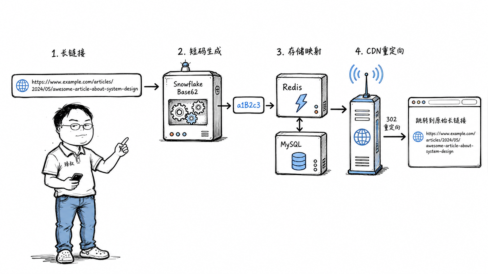

# 设计一个短链接系统——从 Demo 到千万级访问量，要做哪些关键决策？

你有没有注意过一个细节：在微博发一条带链接的消息，那条长长的 URL 会瞬间变成 `t.cn/abc123X` 这样短短几个字符。你点一下，"嗖"地一下就跳到了原文。

看起来就像一个简单的"缩写"功能——把长字符串映射成短字符串，一个哈希函数就能搞定。

但如果你真的去搭一个短链接服务，上线第一天就可能踩三个坑：短码撞了，两个不同的长链接生成了同一个短码；重定向慢得像拨号上网，用户点了链接等了两秒才跳转；还有人写脚本遍历你的短码，把别人未公开的链接全扒出来了。

"把长变短"是 Demo 级别的事。"在每天百万级写入、毫秒级重定向、全局唯一不可遍历的约束下，把这个服务跑稳"——才是系统设计。

## 核心结论

短链接系统的本质，是一个**高并发、高可靠性、有安全防线的小型分布式键值服务**——它刚好披了一件"压缩 URL"的外衣。

拆到底，它要解决四个层层递进的问题，而每个问题的答案都不是"唯一正确"，而是"在约束下做取舍"：

第一，**短码怎么生成**——核心决策。哈希会碰撞，自增 ID 可遍历，最终走向分布式 ID + 扰动编码。

第二，**映射关系怎么存**——双向需求。顺着查（短码→长链接）要极快，逆着查（长链接→短码）用于去重可以稍慢。

第三，**重定向怎么做到 10ms 以内**——CDN 边缘缓存 + Redis 热数据 + 布隆过滤器拦截无效请求。

第四，**怎么防滥用**——频率限制、恶意链接检测、不可遍历的短码设计，三层防线。

## 深度拆解

### 短码生成：整个系统的地基

这是第一个决策，也是最容易被"秒杀"的决策。三秒钟就能看出一个人有没有真正想过这个问题。

**方案 A：哈希取前 N 位。**

最直觉的方案——对长 URL 做 MD5，取前 7 位。同一个长 URL 永远生成同一个短码，天然去重，看起来很完美。

但你算一下数学。7 位 Base62 字符（0-9、a-z、A-Z）能表示 62^7 ≈ 3.5 万亿种组合。听起来天文数字？但 MD5 的 128 位被截断到 7 个字符（约 41 位信息量），**碰撞不遵循"总量够不够"，而遵循生日悖论**——当你生成大约 2^20.5 ≈ 150 万条时，碰撞概率就超过 50%。每天生成 100 万条，撞是必然的。

撞了怎么办？加一位变 8 位？那昨天生成的 7 位链接全废了。重新哈希加盐？那同一个长 URL 会生成不同短码——去重能力没了。

**方案 B：自增 ID + Base62 编码。**

用一个自增 ID（数据库自增主键或 Redis INCR），把数字转成 62 进制字符串。1 → "1"，10 → "a"，62 → "10"，100000000 → 一个 5-6 位的短码。

这个方案完全没有碰撞——自增 ID 天然唯一。但它带来了两个新问题：

第一，**可遍历**。如果你生成了短码 id=1000，把 62 进制反转一下就能算出 id=999 对应的短码——所有短链接都被你"枚举"出来了。如果某条短链接指向一个未公开的内部文档，攻击者只要遍历就能找到。

第二，**单点依赖**。自增 ID 依赖数据库或 Redis，ID 生成器挂了，整个系统停摆。

**方案 C：分布式 ID + 扰动编码。**

这是生产环境真正用的方案，综合了前两者的优点：

用 **Snowflake（雪花算法）** 生成全局唯一 ID——64 位中 41 位是毫秒级时间戳，10 位是机器 ID，12 位是序列号。每台机器独立生成，每秒能产上百万个唯一 ID，不依赖任何单点。

然后把 64 位数字转成 Base62，得到一个 11 位的短码。11 位比 7 位长一点，但 62^11 ≈ 5 × 10^19，碰撞概率可以忽略不计。

最后解决"可遍历"——短码不是原始 ID 直接编码，而是**对一个随机密钥做 XOR 后再编码**。外人看到的短码是"随机"的，无法从一条短码推导出其他短码。内部保留密钥，可以反向解出真实 ID 用于调试。

还有一个工程优化叫**预生成短码池**：系统提前生成一批唯一短码放在 Redis 里，写入时直接取一个可用的，用完再批量生成下一批。这样即使 ID 生成器短暂不可用，系统也能撑一阵子。

| 方案 | 碰撞 | 可遍历 | 单点依赖 | 适用场景 |
|------|------|--------|----------|----------|
| 哈希取前N位 | 会碰撞 | 不可遍历 | 无 | 量级小、不要求数字唯一 |
| 自增ID+Base62 | 不碰撞 | 可遍历 | 依赖DB/Redis | 内部系统、不关心安全 |
| Snowflake+XOR | 不碰撞 | 不可遍历 | 无单点 | 生产环境 |

### 存储设计：双向映射的两条路径

注意，短链接系统是一个**双向映射**——你需要两个方向的查询：

**顺着查：短码 → 长链接。** 这是重定向的核心路径，每个点击都要走这条路，必须极快。用 Redis 做 KV 存储，短码是 Key，长 URL 是 Value，O(1) 的 GET 在 0.1ms 内完成。但 Redis 贵且不是绝对可靠——MySQL 做持久层兜底，Redis 没命中再查 MySQL，查到后回写 Redis。

**逆着查：长链接 → 短码。** 这是去重路径——同一个长 URL 不应该生成两个不同短码。可以稍慢，但不能没有。在 MySQL 里对长 URL 的哈希值建索引（`long_url_hash CHAR(32)`），用 MD5 存摘要——比直接给一个可能几 KB 的 URL 建索引高效得多。

如果系统每天有上亿条短链生成，MySQL 单表扛不住。这时需要**分库分表**：按短码首字符或哈希取模分片。比如 64 个分片，短码首字符的 ASCII 值对 64 取模，路由到对应分片。读取时按同样的规则路由。

### 重定向：10 毫秒是一场接力赛

用户点击 `t.cn/abc123X`，到浏览器开始加载目标页面，中间发生了什么？

第一步，**DNS 解析**把 `t.cn` 解析到最近的 CDN 边缘节点 IP。如果你的 CDN 覆盖够好，这一步 5-10ms。

第二步，CDN 边缘节点检查缓存——**热门短链接的映射关系缓存在边缘节点**，直接返回 302 重定向，不回源。这一步 1-2ms。冷门链接回源查你的服务器。

第三步，回源时先过**布隆过滤器**。布隆过滤器用极小的内存（几百 MB 存几亿条记录）判断"这个短码一定不存在"还是"可能存在"。如果"一定不存在"，直接返回 404，连 Redis 都不用查——用极低的成本挡住大量恶意探测请求。

第四步，查 Redis。命中就返回 302。没命中查 MySQL，然后回填 Redis。

最后一步，返回 **302 临时重定向**。为什么是 302 而不是 301？因为 301 是"永久移动"——浏览器会**缓存这个映射**，下次用户访问同一个短链接时，浏览器直接跳转，根本不经过你的服务器。听起来很好？但你永远不知道这个链接被访问了多少次——**统计数据全丢了**。302 是"临时跳转"，浏览器每次都先找你确认，你在跳转前记录一次点击。

整条链路：CDN 边缘缓存 → 布隆过滤器 → Redis → MySQL → 302 跳转。理想情况下，大部分请求在 CDN 边缘就解决了，回源率可以压到 5% 以下。

### 防滥用：三层防线

如果任何人都能用你的 API 无限制地生成短链接，三件事会发生：存储被垃圾链接撑爆、有人把恶意链接藏在短链接里传播、有人遍历你的短码扒出未公开链接。

**第一层：频率限制（网关层）。** 同一 IP 每分钟最多生成 N 条。用 Redis 的滑动窗口计数器实现——对每个 IP 维护一个按时间排序的请求列表，清理过期请求后判断是否超限。超了返回 429。这一层在 API 网关做，不消耗后端资源。

**第二层：恶意链接检测（异步）。** 生成短链接时，对长 URL 做安全检查——调 Google Safe Browsing API 或自建黑名单。这一步会加几十毫秒延迟，但不能放在用户请求的同步路径里。正确做法是：**先生成短链接返回给用户，后台异步检查**。如果发现恶意，直接禁掉这个短码，后续访问返回警告页。

**第三层：不可遍历（编码层）。** 上面说的 XOR 扰动——即使攻击者知道你用了 Base62 编码，也无法从一条短码推导出其他短码。这是从根上解决"枚举攻击"的方案。

## 实战要点

### 工程落地

1. **短码生成首选 Snowflake + Base62 + XOR 扰动。** 如果团队没有分布式 ID 基础设施，退而求其次用数据库号段模式——批量从 DB 取 ID 缓存在内存里，比每次 INCR 性能高一个数量级。

2. **存储走 Redis + MySQL 双层。** Redis 存全量热数据（最近 N 天生成的短链），MySQL 做持久化兜底。不要在 Redis 里存全量历史数据——太贵，而且冷数据查询频率极低。

3. **重定向上 CDN。** 这是把延迟从 50ms 压到 5ms 的关键。CDN 边缘节点缓存热门短链映射，回源率控制在 5% 以下。冷门链接回源走布隆过滤器 → Redis → MySQL 链路。

### 臻叔踩坑笔记

1. **MD5 取前 7 位碰撞**：生成到 150 万条时碰撞概率超 50%。表现是两个不同的长 URL 生成了同一个短码，重定向到错误的页面。规避方法：不用截断哈希，改用 Snowflake 或号段模式生成唯一 ID。

2. **301 重定向导致统计丢失**：用了 301 后浏览器缓存了映射，后续点击不再经过服务器。表现是短链点击量数据越来越少，最终趋近于零。规避方法：用 302 临时重定向，确保每次点击都经过服务器记录。

3. **短码可遍历导致数据泄露**：自增 ID 直接 Base62 编码，攻击者遍历短码发现未公开链接。表现是日志里出现大量顺序短码的探测请求。规避方法：用 XOR 扰动编码，让短码在外部看起来是随机的。

4. **布隆过滤器误判导致缓存穿透**：布隆过滤器说"可能存在"但实际不存在，请求穿透到 Redis 再穿透到 MySQL。表现是大量不存在的短码请求打穿缓存层。规避方法：对布隆过滤器判定"可能存在"但 Redis/MySQL 都没查到的短码，缓存一个空值（短 TTL，如 60 秒），防止同一个不存在的短码反复穿透。

5. **Redis 故障导致全站不可用**：Redis 挂了，所有重定向请求都回源到 MySQL，MySQL 瞬间被打满。表现是 Redis 故障后 30 秒内 MySQL 也跟着挂了。规避方法：Redis 做主从 + 哨兵自动故障转移；MySQL 前加限流，回源 QPS 超过阈值时直接返回降级页。

### 一句话总结

> 短链接系统的本质不是"把长变短"，而是"在唯一性、性能、安全三个约束的交叉点上做架构取舍"——每一个看起来简单的选择背后，都藏着一道数学题或工程题。
