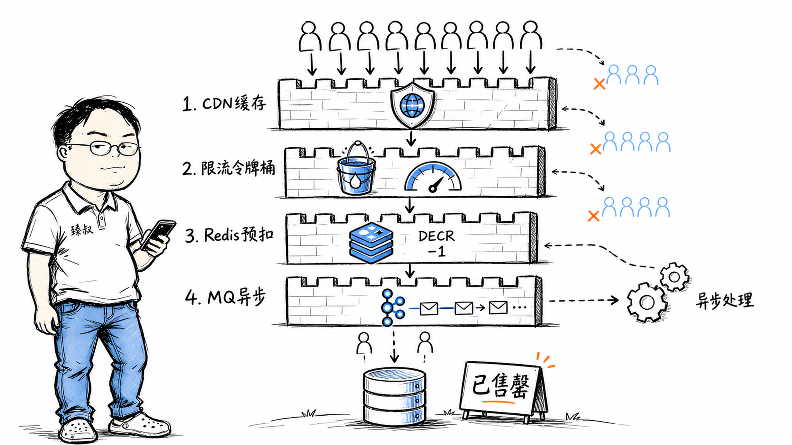

# 秒杀系统——100万人抢1000张票，防线布在哪几层




2018年双11，某电商平台的支付网关接了一个秒杀业务——限量球鞋，1000双，开售瞬间QPS从平时的200飙到38000。虽然提前做了压测和扩容，但开售3秒后还是出现了一个严重问题：库存显示卖了1200双——超卖了20%。

复盘时发现罪魁祸首是一行代码：Redis预扣库存后，下游消息队列消费超时，异步创建订单失败回滚时没有把Redis库存加回去。更隐蔽的是，有一个黄牛用脚本模拟了3000个请求，其中200个绕过了前端验证码直接打到了Redis。

这次事故暴露了秒杀链路的典型缺陷。后来业界总结出一套四层防线模型，在多轮大促中反复验证，核心思想就是一句话：**不要让无效请求穿透到数据层**。

## 核心结论

1. **秒杀的本质不是"让谁抢到"，而是"让绝大多数请求在入口层就快速失败"**——只有真正有机会成功的请求才能进入核心业务链路。
2. **四层防线模型**：前端（浏览器层拦截）→ 网关（IP/用户维度限流）→ 服务（Redis预扣库存+消息队列异步）→ 数据（乐观锁+幂等防超卖）。越往里层，单次请求的代价越大，所以要在外层尽可能拦截。
3. **Redis预扣不是"最终扣减"**——它只解决"快速判定是否有库存"的问题，真正的订单创建和支付确认走异步链路。预扣成功≠抢购成功。
4. **黄牛对抗是秒杀系统的第二战场**——限流只能挡"量大的"，挡不了"精心伪装的"。需要设备指纹、行为分析、验证码渐进式升级配合。
5. **库存分桶是终极优化**：把1000个库存拆成20个桶，每桶50个——并发竞争从100万打一个key变成100万打20个key，Redis单key压力降低20倍。

## 深度拆解

### 第一层：前端防线——把脚本挡在浏览器外面

很多人低估前端防线，觉得"JS防不了技术人员"。但工程上，前端防线不是为了100%防御，而是为了**提高攻击成本**。

| 手段 | 原理 | 作用 |
|------|------|------|
| 按钮置灰 | 点击后立即`disabled=true` | 防止用户手抖多次点击 |
| 滑块/验证码 | 分析鼠标轨迹（真人会抖动、加速曲线自然），脚本难以精确模拟 | 过滤90%的初级脚本 |
| URL动态化 | 下单URL不是在HTML中写死，而是活动开始前通过接口获取，附带一次性token | 防止脚本提前准备请求 |
| 前端排队 | 到点后不是直接发请求，而是先进入一个前端队列，按顺序释放请求 | 削峰——把瞬间的100万请求分散到5-10秒 |
| 静态资源CDN | 活动页面的HTML/JS/CSS全量走CDN | 不因页面加载打挂源站 |

**前端防线的设计哲学**：不要试图在浏览器里做"安全决策"。前端任何校验都可能被绕过，它的作用是**减少打到服务器的请求量**，真正的安全决策必须在服务端做。

### 第二层：网关防线——限流、黑名单、去重

网关是所有请求的入口，这一层做三件事：

**1. 限流（Rate Limiting）**

限流维度：
- **按IP**：单一IP每秒100次 → 限流（但攻击者可以换IP池）
- **按用户ID**：同一用户每秒5次 → 限流（但需要在网关层能解析出用户ID）
- **按接口**：总接口QPS 50000 → 超过就排队或拒绝

**2. 黑名单**

来自风控系统的实时黑名单IP/用户/设备指纹，网关直接拒绝。

**3. 请求去重**

同一个用户+同一个秒杀商品+同一个幂等key，短时间内重复请求只处理第一次。

### 第三层：服务防线——Redis预扣 + 消息队列异步

这一层是秒杀系统的核心：

**为什么用Redis DECR？**

DECR是Redis单线程中的原子操作。在秒杀这个场景下，`DECR stock_key` 一行命令，天然线程安全——不用分布式锁，不用CAS循环，性能极高。

**消息队列异步下单：**

这样做的好处：
- 服务端接口的响应时间就是"Redis DECR + 发Kafka"的时间（1-2ms），不会因为写数据库而阻塞。
- 下游系统（订单、库存、支付）可以按自己的处理能力消费，不会被流量冲垮。
- 即使下游暂时挂了，消息堆积在Kafka里，等恢复了继续处理。

**但异步带来的新问题：**

1. 用户看到"排队中"——什么时候能知道结果？解决方案：轮询或者WebSocket推送。
2. Redis扣成功了但Kafka挂了——消息丢失怎么办？解决方案：Redis扣减时同时写一条"预扣记录"到Redis，异步任务定时扫描没有对应订单的预扣记录做补偿。

### 第四层：数据防线——防止超售的最终防线

即使做了Redis预扣，数据库层面仍然必须做防超卖——这是最后一道防线。

**乐观锁（推荐）：**

```sql
UPDATE stock 
SET count = count - 1, version = version + 1 
WHERE product_id = 123 
  AND count > 0 
  AND version = ?
```

如果`affected_rows = 0`，说明版本号已变（被其他事务修改了）或者库存为0——此时回滚或重试。

**悲观锁（不推荐在秒杀中用）：**

```sql
SELECT count FROM stock WHERE product_id = 123 FOR UPDATE;
-- 然后判断 count > 0
-- 然后 UPDATE stock SET count = count - 1
```

`FOR UPDATE`在秒杀高并发下会导致大量连接等待行锁，数据库连接池很快耗尽。

**幂等防重：**

即使乐观锁也挡不住"同一个扣减请求被处理了两次"（比如消息队列at-least-once投递）。需要一个幂等表：

```sql
CREATE TABLE idempotent_records (
    idempotent_key VARCHAR(64) PRIMARY KEY,
    order_id BIGINT,
    created_at TIMESTAMP
);
```

创建订单前先`INSERT INTO idempotent_records (idempotent_key)`——如果key冲突（已存在），说明这个请求处理过了，跳过。

### 五、终极优化：库存分桶

100万人抢1000个库存，Redis里100万人对1个key做DECR——单key的热点压力巨大。

**分桶思路：**

效果：
- Redis单key的并发压力降到原来的1/20
- 每个桶独立扣减，互不影响

**代价**：某个桶可能先卖完，而其他桶还有库存。从全局看，"部分桶已空但整体还有库存"——用户被路由到空桶会拿到"售罄"但实际还有。解决办法：空桶时让用户重试其他桶，或者用一致性哈希减少桶已满的概率。

## 实战要点

**臻叔踩坑笔记：**

1. **Redis DECR之后不要立刻告诉用户"抢到了"**。DECR成功只代表"你获得了进入下单队列的资格"。最终订单能否成立还要看后续（风控校验、用户资格、支付确认）。DECR成功 → 返回"排队中，请稍后查看结果"；只有订单创建完成 → 才显示"抢购成功"。

2. **消息队列消费失败要把Redis库存加回去**。这是第一年事故的原因。消费端处理失败（如风控拒绝、数据库写入失败）时，必须把之前扣掉的Redis库存加回去（`INCR`）。加上去的库存可以被后续用户抢到。不要忘了这个回滚——否则库存越扣越少。

3. **不要用Redis做最终的库存权威数据源**。Redis可能宕机、数据可能丢失（即使开AOF）。数据库中的库存数据才是最终权威。秒杀结束后要做Redis库存和数据库库存的对账。

4. **验证码不要永远是同一种**。滑块验证码开始时有效，但黄牛会针对性地训练滑块轨迹模型。应该做渐进式升级：第1次无验证码 → 第3次数数验证码 → 第5次滑块 → 第8次旋转拼图 → 第10次锁定账号。提高攻击者的对抗成本。

5. **CDN缓存不要缓存"库存数字"**。活动页面的静态HTML/CDN可以缓存，但"剩余库存"这个数字必须走动态接口，由Redis实时返回。否则用户看到的库存是CDN缓存里的旧数字，以为还有库存但实际已经售罄。

**一句话总结：**

> 秒杀系统不是"让服务更快地处理100万请求"，而是"在100万请求里快速挑出那1000个有机会成功的"——第一层拦99%，第二层拦剩下的90%，第三层预扣后只剩1%，第四层保证不超卖。每一层都在做"概率过滤"，而不是"业务处理"。

---
