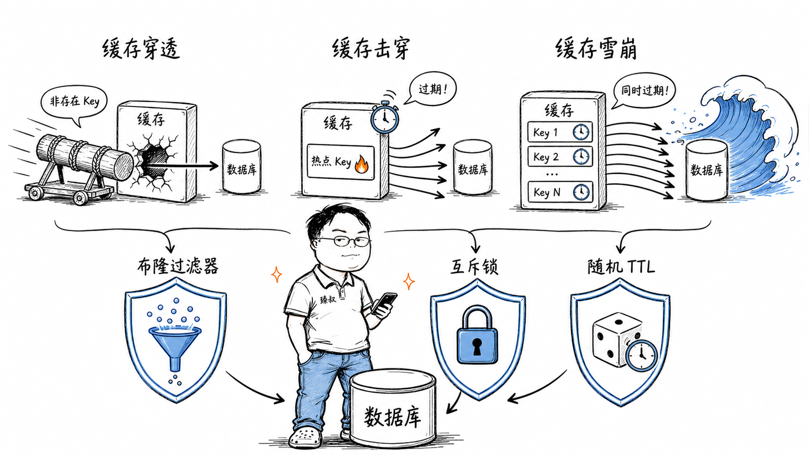

# 缓存穿透、击穿、雪崩——同样都是"数据库被打"，三件事完全不同




我在一家电商公司做架构评审时，看过一份故障报告：凌晨2点，Redis集群的几百个key同时过期，缓存全部miss，瞬间所有请求打到MySQL。主库CPU 100%，读写全部阻塞，整个App白屏。

这次故障后团队加上了"过期时间随机化"，但一个月后又出事了——这次不是大量过期，而是一个热门商品的缓存恰好到期，数千个并发请求同时去查数据库重建缓存。虽然没整体雪崩，但数据库CPU飙到85%。

第三次事故更有意思——有人故意构造了不存在的商品ID（id=-1, id=99999999），每次查询都穿透缓存打到数据库。虽然单次查询不重，但50万个-1的查询堆积起来，数据库照样扛不住。

三件事看起来都是"缓存出问题→数据库被打"，但成因完全不同、防御手段也完全不同。理解了它们的本质区别，才知道布隆过滤器为什么能解决穿透而解决不了击穿。

## 核心结论

1. **缓存穿透**：查的数据"不存在"——缓存和数据库都没有。攻击者故意构造不存在的key。防线：参数校验 → 布隆过滤器 → 空值缓存。
2. **缓存击穿**：查的数据"存在但缓存刚好过期"——热点key过期瞬间，大量请求同时查DB。防线：互斥锁（只让一个线程重建缓存）→ 逻辑过期（value里带过期时间，发现过期先返回旧值，异步重建）→ 热点永不主动过期。
3. **缓存雪崩**：查的数据"大量key同时过期"——Redis中大量key设置了相同的过期时间，同时失效。防线：过期时间加随机偏移 → 多级缓存 → 限流降级兜底。
4. **三者本质区别**：穿透是"key从不存在"（源头上没有的东西），击穿是"少数key的过期并发问题"，雪崩是"大量key的过期同步问题"。防线不可混用。
5. **布隆过滤器的适用边界**：只能回答"可能/绝不"两种答案——适合"判断key是否可能存在"，不适合"判断key是否已过期"。

## 深度拆解

### 一、缓存穿透：不应该打在数据库上的查询

**防线1：参数校验（最简单，也最容易被忽略）**

```java
// 在网关或服务入口就校验
if (productId <= 0 || productId > MAX_PRODUCT_ID) {
    return Result.error("非法商品ID");
}
```

这能过滤掉id=-1、id=99999999这种明显非法的请求。但对于"合法的格式、但数据库里确实不存在"的ID（如id=888是合法格式但没这个商品），参数校验无能为力。

**防线2：布隆过滤器**

**防线3：空值缓存**

```java
// 发现key不存在后，缓存一个"空值标记"
if (dbResult == null) {
    redis.setex("product:" + id, 60, "NULL"); // 60秒过期
    return null;
}
```

请求同一个不存在的key，60秒内直接从Redis返回空——不会再去查DB。

**注意事项**：空值缓存要设短过期时间（1-5分钟），否则正常新增的数据可能在TTL内无法被查询到。

### 二、缓存击穿：一个key的"过期风暴"

**防线1：互斥锁（最简单有效）**

关键点：
- `setnx`设置过期时间（防死锁）
- 抢到锁后**再次检查缓存**（防止重复查DB）
- 没抢到锁的线程**等一小会重试**而不是直接查DB

**防线2：逻辑过期（不设物理TTL）**

```json
// Redis中存的不是纯数据，而是带逻辑过期时间的结构
{
    "data": {"id": 1, "name": "iPhone", "price": 6999},
    "expireAt": 1716100000  // 逻辑过期时间戳
}
```

这个方案的核心思想：**缓存永不物理过期，用户始终能拿到数据（哪怕是旧的），后台异步更新**。

**防线3：热点key永不过期（物理不设TTL）**

对于确定是热点的key（如首页的top10商品），直接不设TTL。更新时机是业务写入时主动更新缓存（Cache Aside模式的写删缓存），而不是依赖过期被动重建。

### 三、缓存雪崩：大量key同时过期的连锁反应

**防线1：过期时间加随机偏移**

```java
// 不要这样
redis.setex("product:" + id, 600, product); // 固定600秒

// 改成这样
int baseTtl = 600; // 基础10分钟
int randomOffset = ThreadLocalRandom.current().nextInt(0, 120); // 0-120秒随机
redis.setex("product:" + id, baseTtl + randomOffset, product);
```

效果：100个key的过期时间分散在10-12分钟区间内，不会同时过期。

**防线2：多级缓存**

即使Redis挂了，本地缓存还能撑一段时间。但本地缓存有容量限制，且多实例间不一致。

**防线3：限流降级**

当检测到MySQL负载过高时，直接返回降级响应：

```java
// Sentinel或Hystrix熔断
@HystrixCommand(fallbackMethod = "getProductFallback")
public Product getProduct(Long id) {
    // 正常逻辑
}

public Product getProductFallback(Long id) {
    return new Product(id, "商品", 0); // 降级：返回兜底数据或空
}
```

**防线4：缓存预热**

系统启动或Redis重启后，不要把流量直接打进来让缓存自然预热——那会导致大量miss。而是启动后先异步加载一批热点数据进Redis，再开始接收流量。

### 四、三者本质对比

| | 缓存穿透 | 缓存击穿 | 缓存雪崩 |
|---|---|---|---|
| 根本原因 | 数据源不存在该数据 | 热点key缓存过期 | 大量key同时过期 |
| 请求特征 | 查不存在的key | 大量请求查同一个key | 大量请求查不同的key |
| 是否合法查询 | 大多数是恶意/非法 | 合法 | 合法 |
| 是否可以通过参数校验防御 | 部分可以 | 不可以 | 不可以 |
| 布隆过滤器是否有用 | **有效**（直接挡掉不存在的key） | **无效**（key存在，只是过期了） | **无效** |
| 互斥锁是否有用 | 无效（锁住的是不存在的key） | **有效**（让一个线程重建） | 部分有效（key太多锁不过来） |
| 随机TTL是否有用 | 无效（本来就没有缓存） | 无效（单个key的过期时间不关键） | **有效**（分散过期时间） |

## 实战要点

**臻叔踩坑笔记：**

1. **布隆过滤器不能删除元素**。标准的布隆过滤器只支持"添加"和"查询"，不支持"删除"。如果商品下架了，它还会说"可能存在"。解决方案：计数布隆过滤器（Counting Bloom Filter）或定时重建布隆过滤器。

2. **互斥锁的过期时间要超过DB查询时间**。如果锁10秒过期但DB查询需要15秒，第二个线程在10秒后会拿到锁再去查DB——击穿加剧。锁的过期时间应该是"DB最差查询时间 × 2"。

3. **空值缓存的key和正常缓存的key要分开命名**。`product:null:888`和`product:888`——如果混在一起，下次商品真的被创建了，空值缓存会覆盖掉正常数据（或反之）。

4. **本地缓存和Redis一起用时要考虑一致性**。本地缓存（Caffeine/Guava）的更新不会自动同步到其他服务器实例。消息或配置变更时，要通过MQ或配置中心通知所有实例刷新本地缓存。

5. **不要在所有缓存操作都加上互斥锁**。互斥锁只适用于热点key击穿场景。如果每个缓存miss都加锁，锁竞争反而成为瓶颈——Redis的SETNX本身也是网络开销。一般只在检测到"同一key短时间内大量miss"时才启用互斥逻辑。

**一句话总结：**

> 防穿透用"布隆+空值"堵住不存在的key，防击穿用"互斥锁+逻辑过期"保护热点key的过期窗口，防雪崩用"随机TTL+多级缓存"分散过期风暴——三件事的防线各自独立，但在实际系统中必须同时布防，因为它们可能同时发生。

---
