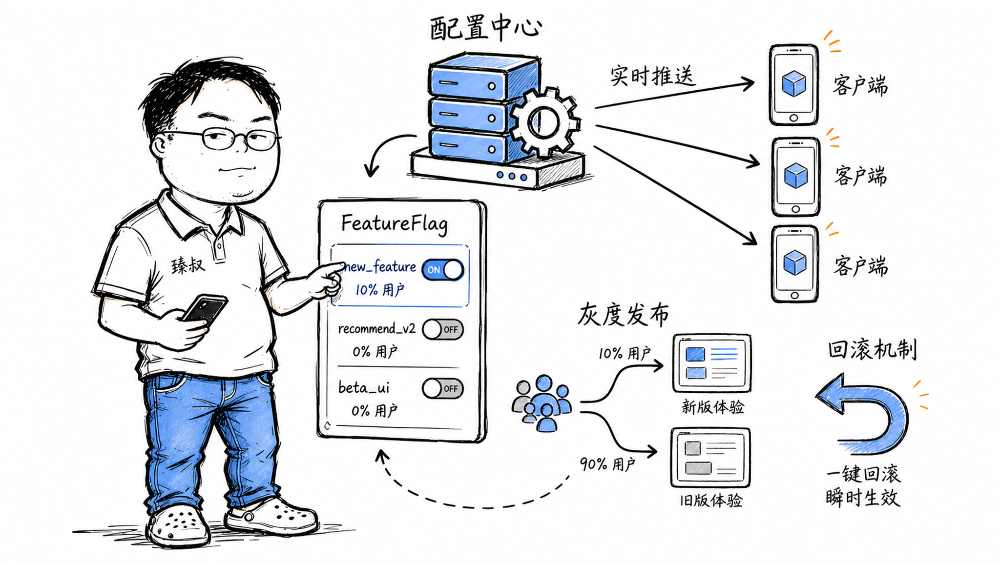

# 配置中心——改一个参数为什么要重新发版




2020年一个周五下午5点，运营同事在群里说："活动页要换成双11的促销皮肤，加急！"

如果这个"皮肤配置"是写死在代码里的，意味着：改代码 → code review → merge → 打包 → 测试环境验证 → 生产发布（灰度→全量）——整个过程最快2小时。但如果配了配置中心，只需要登录Apollo控制台 → 找到`promo.skin=v11` → 改成`promo.skin=double11` → 发布 → 几百台机器10秒内全部生效。

这就是配置中心的价值：**把"发布"和"配置变更"解耦**。但它远不止"改个开关"那么简单——灰度推送怎么做？配置回滚怎么保证一致性？敏感配置（密码/密钥）怎么加密？这篇文章就是把这些"不只是改个配置"的细节拆开。

## 核心结论

1. **配置中心的核心价值**不是"不用改代码"，而是"变更速度从小时级降到秒级"。它让运营/产品可以自助变更部分配置，不需要研发参与。
2. **配置推送有三种模式**：定时轮询（简单但有时延）、长连接推送（实时但占连接）、混合模式（长连接+兜底轮询，Apollo采用的方案）。
3. **配置灰度和回滚是配置中心的安全底线**——不是"所有机器同时生效新配置"，而是"1%→10%→50%→100%"，任何阶段异常立即回滚到上一版本。
4. **Feature Flag（特性开关）**是配置中心的进阶玩法——不只是"开关"，而是"按用户分组、按地区、按比例"控制功能的可见性。它让持续交付成为可能。
5. **敏感配置的安全管控**：密钥/密码不能明文存在配置中心的数据库里。需要加密存储（如AES）+ 客户端解密，且解密密钥不放在配置中心里。

## 深度拆解

### 一、配置中心的三个核心能力

**1. 集中管理**

```
之前：每个服务的配置文件散落在代码仓库、运维脚本、环境变量里
之后：所有配置在一个控制台管理，按应用+环境+集群分组
```

**2. 动态推送**

不需要重启应用。但不是所有配置都能热更新——数据库连接池大小、JVM参数这类配置一般需要重启。

**3. 版本控制 + 回滚**

### 二、配置推送机制：到底是怎么"实时"的

**方案A：定时轮询（最原始）**

简单可靠，但延迟是N秒（N通常设30-60秒），且大量客户端一起轮询时Server压力大。

**方案B：长连接推送（实时）**

实时（<1秒），但需要维护大量长连接，Server的资源消耗更高。

**方案C：混合模式（Apollo的做法）**

```
默认走长连接推送（实时）
+ 定时轮询兜底（每5分钟一次，防止长连接断开没感知）
+ 客户端本地文件缓存（Server宕机时使用上次同步的配置）
```

**配置更新的原子性保证：**

配置不是一行一行更新的。要么全部生效，要么全部不生效：

```
1. 客户端收到"有变更"通知
2. 从Server拉取完整的配置快照（v5版本）
3. 写入本地文件（原子替换：先写临时文件，再rename覆盖）
4. 触发应用程序的配置刷新回调
```

### 三、灰度发布和回滚

不是所有配置变更都应该"全量生效"。

**灰度发布流程：**

**回滚不是"改回去"，而是"发布上一个版本"：**

- 配置中心保留完整的历史版本链
- 回滚 = 把指定的历史版本重新推送
- 推送方式保持一致（也是灰度或全量）

### 四、Feature Flag（特性开关）

配置中心的进阶玩法——不只是简单的key-value，而是"有条件的开关"。

**基础规则：**

```
flag: new-search-algorithm
  - 灰度比例: 10%（随机10%用户看到新搜索）
  - 白名单用户: [10086, 10087, 10088]（内部员工先体验）
  - 黑名单地区: ["新疆", "西藏"]（带宽低的地区不推送）
  - 时间窗口: 2024-01-15 ~ 2024-01-30
```

**代码中使用：**

```java
if (featureFlag.isEnabled("new-search-algorithm", userId)) {
    return newSearchService.search(keyword);
} else {
    return oldSearchService.search(keyword);
}
```

**Feature Flag在CI/CD中的角色：**

### 五、敏感配置的处理

数据库密码、API密钥、加密密钥——这些绝对不能明文存在配置中心的数据库里。

**处理方案：**

## 实战要点

**常见配置中心对比：**

| | Apollo（携程） | Nacos（阿里） | Spring Cloud Config |
|---|---|---|---|
| 配置管理 | 专注，功能完善 | 配置+服务发现 | 基础，需配合Git |
| 灰度发布 | 支持 | 支持 | 不支持 |
| 权限管理 | 完善（部门/应用级） | 有 | 弱 |
| 多环境 | 天然支持 | 支持 | 通过Git分支 |
| 适合场景 | 中大型组织 | 云原生/微服务 | 简单项目 |

**臻叔踩坑笔记：**

1. **不能把所有参数都做成配置**。如果一个参数"改了就得出事"（如数据库schema），就不要放进配置中心。配置中心的"方便"可能导致误操作。区分：静态配置（放代码）、动态配置（放配置中心）、运行时配置（放Redis）。

2. **Feature Flag是有"债务"的**。每次加Flag = 代码里多了if-else分支。flag稳定后如果不及时清理，代码会变成"if的地狱"——新加的功能和旧flag之间的组合逻辑会越来越难测试。每个Flag创建时就应该标注"预计下线时间"，到期强制清理。

3. **配置推送不是"推了就完事"**。有些配置需要应用程序主动处理——改了数据库连接池大小，需要重建连接池；改了缓存TTL，需要在缓存层感知变化。这些"配置变更的回调逻辑"是应用层要写的，配置中心只负责推送数据。

4. **灰度配置的一致性：一个请求在A收到新配置、B收到旧配置**。如果BFF层收到了"新推荐算法"的配置但推荐服务还是旧的——请求可能失败或结果异常。灰度配置要确保：一个请求的调用链上所有服务要么都用新配置、要么都用旧配置。可以用请求头的TraceContext传递配置版本号。

5. **配置中心的可用性直接决定服务能否启动**。如果配置中心挂了，新的服务实例启动时拉不到配置——启动失败。必须做：本地文件缓存（启动时先读缓存，再尝试连配置中心）、离线兜底（连不上配置中心也能用缓存配置启动）。

**一句话总结：**

> 配置中心的价值不是"少改一次代码"，而是把"变更决策权"从研发手里下放到最适合做决策的人（运营、产品、SRE）手里——但权力下放的同时，必须配套灰度、回滚、审计、敏感加密，否则"方便"会变成"事故的方便"。

---
