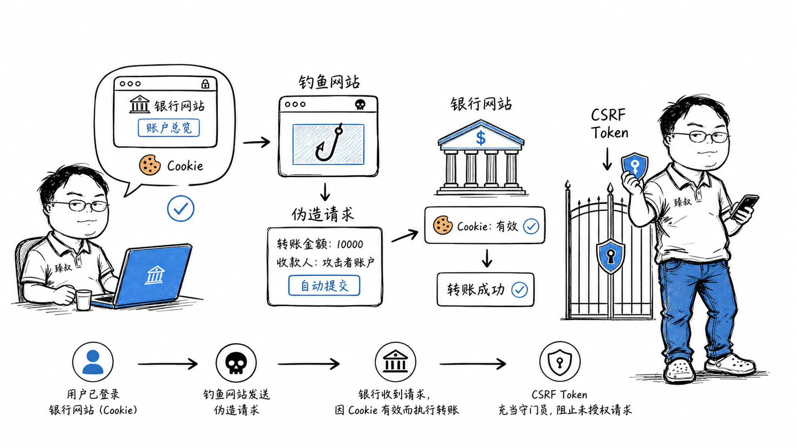

# CSRF跨站请求伪造：攻击原理与Token防御方案



---

> 📌 **关注「程序员臻叔」，获取更多硬核技术干货**


---

你登录了网银，Cookie还在浏览器里。然后你在一个论坛上看到一个帖子"超可爱的小猫图片"，点开看了看，什么也没发生。

但几分钟后你收到短信：您的账户向账户xxxx转账10000元。你没转账啊？

真相是：那个"萌猫图片"的帖子里藏了一个隐形的表单。你打开帖子的瞬间，浏览器自动带着你的网银Cookie，向网银的转账接口发了一个POST请求。网银看到请求带着你合法的Cookie，以为是你本人的操作，就执行了转账。

这就是CSRF（Cross-Site Request Forgery）——跨站请求伪造。

## 核心结论

1. **CSRF的本质**：攻击者"借用"你的登录状态（Cookie），让你的浏览器代替你发起非自愿请求
2. **CSRF不是偷Cookie**，攻击者看不到你的Cookie，但浏览器会自动带上它
3. **SameSite Cookie是最优雅的防御**：浏览器原生机制，一行配置解决大部分CSRF
4. **CSRF Token是经典方案**：服务器发随机Token，请求必须带上，攻击者拿不到
5. **CSRF和XSS是互补的威胁**——XSS偷Cookie/Token（能读），CSRF借用Cookie（不用读）

## 深度拆解

### CSRF的攻击原理

浏览器有一个特性：**向某个域名发请求时，会自动带上该域名已有的Cookie**。这个特性是CSRF的根源。

```html
<!-- 恶意网站上的代码 -->
<!-- 你以为在看图片，实际上浏览器在向银行发转账请求 -->

<!-- 方式1: 隐藏表单自动提交 -->
<form action="https://bank.com/transfer" method="POST" id="f">
  <input type="hidden" name="to" value="attacker_account">
  <input type="hidden" name="amount" value="10000">
</form>
<script>document.getElementById('f').submit();</script>

<!-- 方式2: 图片标签（GET请求） -->


<!-- 方式3: fetch API -->
<script>
fetch('https://bank.com/transfer', {
  method: 'POST',
  credentials: 'include',  // 带上Cookie
  body: JSON.stringify({to: 'attacker', amount: 10000})
});
</script>
```

CSRF成立需要三个条件：
1. 你已登录目标网站，Cookie有效
2. 目标网站的请求只依赖Cookie验证身份，没有额外校验
3. 攻击者知道请求的URL和参数（转账接口的路径和参数通常是公开的或可猜测的）

### SameSite Cookie：浏览器原生的CSRF防御

Chrome从2020年开始默认`SameSite=Lax`，这是最简单有效的防御：

```nginx
# 三个值的区别
Set-Cookie: session=abc; SameSite=Strict;   # 最严格
Set-Cookie: session=abc; SameSite=Lax;      # 默认推荐
Set-Cookie: session=abc; SameSite=None;     # 最宽松（需配合Secure）
```

| SameSite值 | 跨站GET请求 | 跨站POST请求 | 跨站AJAX | 场景 |
|------------|------------|-------------|---------|------|
| Strict | ❌ 不带Cookie | ❌ 不带Cookie | ❌ 不带Cookie | 银行、支付等高安全 |
| Lax | ✅ 顶层导航带Cookie | ❌ 不带Cookie | ❌ 不带Cookie | 大多数网站（默认） |
| None | ✅ 带Cookie | ✅ 带Cookie | ✅ 带Cookie | 第三方Cookie、SSO回调 |

**Lax为什么是默认值**：它允许从外部链接点进网站时带Cookie（用户体验好——从Google搜索结果点进你的网站，不需要重新登录），但阻止跨站POST请求（CSRF主要靠POST）。这是一个安全和体验的平衡点。

**Strict的代价**：用户从邮件链接点进网站时，Cookie不带，需要重新登录。对银行来说是可接受的代价。

### CSRF Token：服务器端的防御

SameSite是浏览器层的防御，CSRF Token是应用层的防御——两者互补。

```
工作流程:
  1. 用户打开表单页面时，服务器生成随机Token，存入Session
  2. Token作为隐藏字段放在表单里: <input type="hidden" name="csrf_token" value="随机字符串">
  3. 用户提交表单时，Token跟着一起提交
  4. 服务器验证: Session里的Token == 表单里的Token ?
  5. 验证通过 → 处理请求；验证失败 → 拒绝
```

攻击者在恶意网站上构造的表单，无法获取目标网站的Token——因为受同源策略限制，恶意网站的JavaScript读不到目标网站的DOM和Session。

**双重提交Cookie模式**（无需Session存储）：
```
1. 服务器在Cookie里放一个随机值: csrf_token=xyz
2. 前端JavaScript读Cookie，把值放到请求Header里: X-CSRF-Token: xyz
3. 服务器验证: Cookie里的值 == Header里的值 ?
```

攻击者可以构造带Cookie的请求（CSRF原理），但无法读取Cookie的值（同源策略），所以无法在Header里放正确的值。

### CSRF vs XSS：互补的威胁

| 维度 | CSRF | XSS |
|------|------|-----|
| 攻击者能读Cookie吗 | 不能 | 能（如果没有HttpOnly） |
| 攻击者能读页面DOM吗 | 不能 | 能 |
| 防御核心 | SameSite + CSRF Token | 输出编码 + CSP |
| CSRF Token能防XSS吗 | 不能 | — |
| XSS能绕过CSRF Token吗 | **能**（XSS可以读页面上的Token） | — |

这就是为什么需要同时防御两者：XSS是"读"攻击（偷数据），CSRF是"借"攻击（借身份）。XSS一旦成功，可以读走CSRF Token，让CSRF防御失效。

### 关键操作的二次验证

对于高敏感操作（转账、改密码、删除账号），即使有CSRF防御也应该加二次验证：

```
转账流程:
  1. 正常CSRF防御（SameSite + Token）
  2. 大额转账需要短信验证码
  3. 或需要支付密码（不同于登录密码）
  4. 或需要人脸识别/指纹确认
```

这样即使CSRF防御被绕过，攻击者也无法通过二次验证。

## 实战要点

### 工程落地

**Spring Security的CSRF防护**：默认开启，每个POST/PUT/DELETE请求都需要CSRF Token。

```java
// 自动在表单中插入Token（Thymeleaf）
<form action="/transfer" method="post">
  <input type="hidden" th:name="${_csrf.parameterName}" th:value="${_csrf.token}" />
  <!-- 表单内容 -->
</form>

// AJAX请求带Token
<meta name="_csrf" content="${_csrf.token}" />
<meta name="_csrf_header" content="${_csrf.headerName}" />

$.ajaxSetup({
  beforeSend: function(xhr) {
    xhr.setRequestHeader('${_csrf.headerName}', '${_csrf.token}');
  }
});
```

**无状态API（JWT）不需要CSRF Token**——如果认证用Bearer Token而不是Cookie，浏览器不会自动带Token，CSRF不成立。

### 臻叔踩坑笔记

1. **GET请求执行写操作**：`GET /transfer?to=x&amount=100`，一个``标签就能触发CSRF。写操作必须用POST/PUT/DELETE，GET必须是只读的
2. **SameSite=None没配Secure**——Chrome要求`SameSite=None`必须配合`Secure`，否则Cookie被拒绝。本地开发HTTP环境下会失效
3. **CSRF Token放在URL里**：`POST /transfer?csrf_token=xyz`，Token出现在URL里会被Referer泄露、被日志记录。Token应放在请求体或Header中
4. **只防了表单没防AJAX**。现代SPA大量用fetch/axios发请求，这些请求也需要带CSRF Token。统一在axios拦截器里加
5. **SSO回调忽略了CSRF**：OAuth回调URL容易被CSRF攻击，攻击者可以把回调URL换成自己的授权码，劫持用户账号。回调必须验证state参数

### 一句话总结

CSRF的本质是攻击者"借用"你的Cookie让浏览器替你发请求：SameSite Cookie是浏览器层最优雅的防御，CSRF Token是应用层的经典方案，高敏感操作还要加二次验证。

---

### 🎯 觉得有帮助？关注「程序员臻叔」


---
