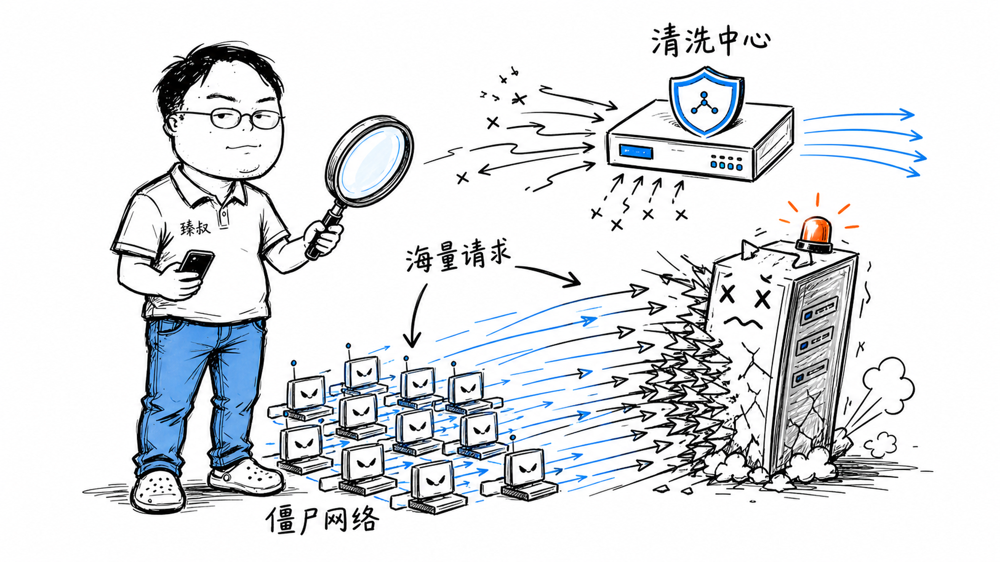

# DDoS攻击为什么"防不住"——一场100:1的不对称战争




2024年某次重大DDoS攻击中，攻击者用约100元/小时的成本租用了一个僵尸网络+反射放大服务，打出了3.8Tbps的流量。防御方为了扛住这次攻击，付出了约100万元的云清洗费用。

100元 vs 100万元。这就是DDoS的本质——一场攻击成本和防御成本极度不对称的战争。

攻击者只需要找到你的一个入口，用海量流量把它堵死。而你要做的，是在海量流量中区分出正常用户请求和攻击流量，把干净的流量放进来。这就像在洪水里过滤出饮用水——洪水越大，过滤越难。

## 核心结论

1. **DDoS的本质是资源消耗战**——不是漏洞利用，是纯粹的资源碾压
2. **三种攻击类型**：流量型（堵带宽）、协议型（耗连接）、应用层（烧CPU）
3. **反射放大是核心技巧**——用1MB请求触发100MB响应，攻击成本再降100倍
4. **防御是分层缓解**：CDN分散 → 流量清洗 → 限流 → 应用层优化
5. **Tbps级攻击谁也扛不住**——唯一出路是上游运营商黑洞路由+多CDN分散

## 深度拆解

### 三种DDoS类型

**1. 流量型攻击（Volumetric）**

目标：占满目标带宽。用海量数据包把管道塞满，正常请求挤不进来。

```
UDP Flood: 大量UDP包打向目标随机端口 → 服务器逐个检查端口 → ICMP回复"端口不可达" → CPU和带宽耗尽
ICMP Flood: Ping洪水
放大攻击: 用小请求触发大响应
```

**反射放大攻击**——DDoS的"杠杆"：

```
DNS反射放大:
  攻击者 → 伪造源IP(目标的IP) → 向DNS服务器发查询请求
  请求: "给我example.com的所有记录" (60字节)
  响应: DNS服务器把结果发给目标IP (4000字节)
  放大倍数: ~70倍

Memcached反射放大 (2018年GitHub遭袭):
  请求: "stats" 命令 (15字节)
  响应: Memcached把缓存内容全发过去 (最高1MB)
  放大倍数: ~51000倍
  
  结果: GitHub遭受到1.35Tbps攻击，史上最大记录之一
```

攻击者只需控制一个能发伪造源IP包的僵尸网络，就能利用互联网上开放的DNS、NTP、Memcached等服务，把攻击流量放大几十到几万倍。

**2. 协议型攻击（Protocol）**

目标：耗尽服务器连接资源，不需要很大带宽。

```
SYN Flood:
  攻击者 → 发大量SYN包 → 服务器分配资源等待ACK → 永远等不到 → 连接表爆满 → 正常用户连不上

  服务器TCP连接表大小: ~65535
  攻击者每秒发10万SYN包 → 0.6秒填满连接表 → 正常用户全部拒绝服务
```

**3. 应用层攻击（Application Layer / Layer 7）**

目标：烧服务器CPU/数据库/内存。请求看起来完全正常，但每个请求消耗大量后端资源。

```
慢速攻击 (Slowloris):
  攻击者 → 建立HTTP连接 → 发请求头但慢慢发（每分钟发一个字节）→ 服务器保持连接等待 → 连接池耗尽

CC攻击:
  攻击者 → 大量请求搜索接口（CPU密集）→ 数据库满载 → 正常请求超时

  搜索接口: 消耗500ms CPU
  正常接口: 消耗5ms CPU
  攻击者把搜索接口打满 → 服务器CPU 100% → 所有接口都慢
```

应用层攻击最难识别——因为请求本身是合法的，和正常用户行为几乎一样。

### 防御体系：四层纵深

```
第一层: CDN + Anycast分散
  → 把流量分散到全球数百个边缘节点
  → 单个节点被打不影响整体
  → CDN天然吸收流量型攻击

第二层: 流量清洗（Scrubbing Center）
  → BGP路由把流量引到清洗中心
  → 清洗中心用模式识别过滤恶意流量
  → 干净流量回注到源站
  → 容量: 通常Tbps级（云厂商如Cloudflare、AWS Shield）

第三层: 协议层防御
  → SYN Cookie: 不预分配连接资源，防止SYN Flood
  → 连接数限制: 单IP最大连接数
  → 慢连接超时: 5秒内未完成HTTP请求的连接断开

第四层: 应用层防御
  → WAF: 识别异常请求模式
  → 限流: 单IP/单用户请求频率限制
  → 降级: 攻击时关闭高消耗接口（搜索、推荐）
  → 静态化: 高峰期返回缓存数据不走后端
```

### 为什么Tbps级攻击扛不住

```
防御能力对比:
  单台服务器: ~10Gbps
  企业级防火墙: ~40Gbps
  云厂商基础防护: ~100Gbps
  云厂商高防IP: ~1-2Tbps
  Cloudflare最高: ~200Tbps（但价格不菲）

攻击能力对比:
  租用僵尸网络: ~1Tbps, 成本~$100/小时
  反射放大: ~3-5Tbps, 成本~$50/小时
  最高记录: 3.8Tbps (2024年)
```

当攻击流量超过你的清洗能力时，唯一选择是**上游黑洞路由**——运营商直接把发往你IP的所有流量丢弃。攻击者打不到你了，但正常用户也访问不了。这是"宁可全站不可用，也不让攻击流量影响同一机房其他客户"的保底手段。

### 成本不对称的本质

```
攻击成本:
  僵尸网络租赁: $50-$500/小时
  反射放大: 几乎免费（利用互联网开放服务）
  技术门槛: 低（DDoS即服务，黑产产业链成熟）

防御成本:
  云高防IP: ¥10万-¥100万/月（按防护带宽计费）
  硬件清洗设备: ¥100万-¥500万（一次性）
  专业安全团队: 5-10人，年薪总计¥500万+
  攻击期间的弹性扩容: 按量计费，可能¥10万/小时
```

这种100:1的成本比意味着：只要攻击者愿意，他可以持续消耗你的防御预算。这不是技术问题，是经济问题。

## 实战要点

### 工程落地

**架构设计要考虑DDoS**：
- 前面挂CDN，源站IP不暴露
- DNS解析使用云厂商DNS（自带DNS DDoS防护）
- 关键服务多地域部署 + DNS容灾切换
- 设计降级开关：攻击时一键关闭高消耗功能

**SYN Cookie配置**（Linux内核）：
```bash
# 开启SYN Cookie
echo 1 > /proc/sys/net/ipv4/tcp_syncookies
# 减小SYN队列长度
echo 1024 > /proc/sys/net/ipv4/tcp_max_syn_backlog
# 减小SYN+ACK重试次数
echo 2 > /proc/sys/net/ipv4/tcp_synack_retries
```

**应用层限流**：
```nginx
# Nginx限流: 单IP每秒最多10个请求
limit_req_zone $binary_remote_addr zone=api:10m rate=10r/s;
location /api/ {
  limit_req zone=api burst=20 nodelay;
  proxy_pass http://backend;
}
```

### 臻叔踩坑笔记

1. **源站IP暴露**——CDN配置了但源站IP没隐藏，攻击者直接打源站IP绕过CDN防护。确保DNS只解析到CDN，源站IP不出现在任何公开记录中
2. **只防了流量型没防应用层**——买了高防IP扛住了流量攻击，但CC攻击每个请求都是合法HTTP请求，清洗设备识别不了。应用层必须单独做WAF+限流
3. **DNS成为攻击面**——DNS服务器被打挂了，用户连你的IP都解析不出来。DNS必须用云厂商DNS服务（如Route53、Cloudflare DNS），自带DDoS防护
4. **没有降级预案**——攻击时手忙脚乱找配置，不知道该关哪些接口。提前准备好降级开关和攻击应对SOP，一键执行
5. **低估了攻击规模**——按平时流量买防护带宽，结果攻击一来是平时的100倍。防护方案要按"被攻击时的规模"设计，不是按"平时流量"设计

### 一句话总结

DDoS是一场攻击成本100元、防御成本100万的不对称战争——防御不是"防住"而是"缓解"，CDN分散+流量清洗+限流+降级是四层纵深，Tbps级攻击的终极手段是上游黑洞路由。
