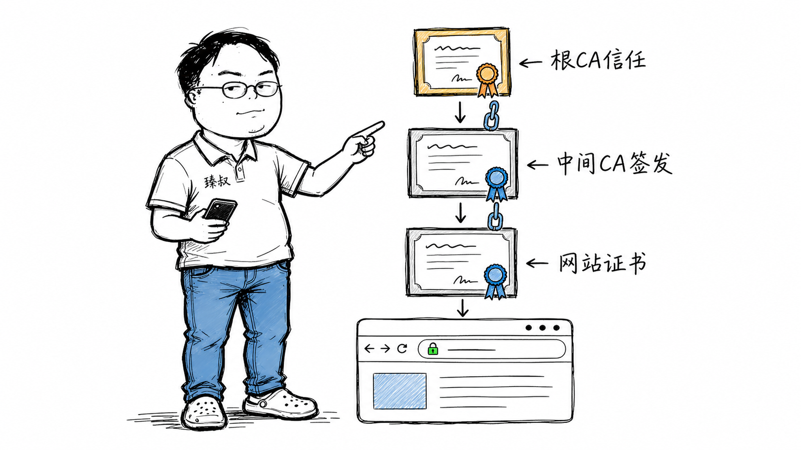

# HTTPS证书链——浏览器怎么知道你真的是你




2011年7月，荷兰CA机构DigiNotar被黑客攻破。攻击者伪造了包括`*.google.com`在内的500多个网站的SSL证书。随后几个月里，伊朗约30万Gmail用户的通信被中间人监听。

DigiNotar不是小作坊——它是荷兰政府的CA，负责签发政府网站的HTTPS证书。被攻破后，微软、Mozilla、Google在同一天把DigiNotar从信任列表里彻底删除。一家运营了十几年的CA，一夜之间信用清零，公司随后破产。

这件事揭示了一个问题：HTTPS的安全性不在于加密本身，而在于"你信任谁"。证书链就是这个信任的传递机制。

## 核心结论

1. **HTTPS证书 = 身份证 + 公钥**——CA用签名证明"这个公钥确实属于这个域名"
2. **信任是逐级传递的**：根CA（预装在系统里）→ 中间CA → 网站证书，每一级用私钥给下一级签名
3. **根CA是信任的终极锚点**——你的操作系统/浏览器内置了约200个根CA，你无条件信任它们
4. **中间CA是安全隔离层**——根CA私钥不轻易使用，日常签发交给中间CA，泄露了可以撤销中间CA而不动根CA
5. **DigiNotar事件的教训**：CA被攻破=整个信任链断裂，浏览器厂商必须能在数小时内全球吊销CA信任

## 深度拆解

### 证书链的完整结构

一张HTTPS证书包含三张证书，形成信任链：


**网站证书**（最下层，发给域名所有者）：包含域名、公钥、有效期、签发者信息，由中间CA私钥签名。
**中间CA证书**（中间层）：由根CA私钥签名，负责日常签发网站证书。
**根CA证书**（最顶层，预装在系统里）：自签名，是整个信任链的起点。

### 浏览器验证证书的完整流程


浏览器收到证书链后，按以下顺序验证：先验签（中间CA验网站证书，根CA验中间CA），再查信任（根CA是否在本地列表），最后做额外检查（域名匹配、有效期、吊销状态、用途授权）。任何一步失败就显示警告页面。

### 为什么需要中间CA？

根CA的私钥是整个信任体系的最高机密。如果直接用它签发网站证书：

- 每天签发成千上万张证书，私钥使用频率高，泄露风险大
- 一旦泄露，所有用它签发的证书都不可信，影响面巨大

中间CA的设计是**安全隔离**：
- 根CA私钥锁在离线HSM（硬件安全模块）里，只签发中间CA证书（极低频率）
- 中间CA负责日常签发网站证书
- 中间CA被攻破了？撤销中间CA，用根CA签一个新的，影响范围可控


### 证书吊销：CRL vs OCSP

证书在有效期内也可能需要吊销（私钥泄露、域名转移、CA被攻破）。两种吊销检查机制：

**CRL (Certificate Revocation List)**：
- CA定期发布一个被吊销证书的列表
- 浏览器下载列表，本地检查
- 问题：列表越来越大，更新不及时

**OCSP (Online Certificate Status Protocol)**：
- 浏览器实时向CA查询证书状态
- 问题：每次HTTPS连接多一次网络请求，拖慢页面加载；且暴露用户访问了哪些网站

**OCSP Stapling**（现代方案）：
- 服务器在TLS握手时主动带上OCSP响应（自己定期从CA获取）
- 浏览器不需要额外请求，也不暴露隐私

### 证书透明度 (Certificate Transparency)

DigiNotar事件后，Google推出了CT日志——所有CA签发的证书必须提交到公开的、只追加的日志中。

```
CT日志的作用:
  - 任何人可以查到某个域名被签发了哪些证书
  - 域名所有者能发现"我没申请过但有证书被签发了"
  - CA的签发行为可审计，滥用会被发现

查询方式:
  访问 https://crt.sh/?q=example.com
  → 可以看到所有为 example.com 签发的证书记录
```

Chrome要求所有EV证书和2018年后的证书必须包含CT日志记录，否则不信任。

### Let's Encrypt：免费证书如何改变生态

2015年Let's Encrypt出现之前，HTTPS证书每年要花几百到几千元，很多小站不加密。Let's Encrypt提供了：
- 免费证书（90天有效期，自动续期）
- ACME协议自动化签发（无需人工操作）
- 门槛极低——一条命令就能获取证书

结果：HTTPS普及率从2015年的不到30%飙升到现在的90%+。

## 实战要点

### 工程落地

**证书申请自动化**：用certbot或acme.sh，配合cron定时续期。

```bash
# certbot 自动申请 + 配置Nginx
certbot --nginx -d example.com -d www.example.com

# 自动续期（cron: 每天检查）
certbot renew --quiet
```

**证书监控**：监控证书过期时间，提前7天告警。很多线上事故是因为证书过期没人管。

**HSTS**：通过HTTP头告诉浏览器"以后只走HTTPS"，防止首次访问被中间人降级。

```nginx
add_header Strict-Transport-Security "max-age=31536000; includeSubDomains" always;
```

### 臻叔踩坑笔记

1. **中间CA证书没配全**——服务器只发了网站证书没发中间CA证书，浏览器找不到完整链，报ERR_CERT_AUTHORITY_INVALID。Nginx要用`ssl_certificate`指向fullchain（包含网站+中间CA），不是只指cert
2. **证书过期没监控**——运维忘了续期，某天早上全站HTTPS报错。必须设过期前7天告警，最好用自动续期
3. **私钥泄露不吊销**——证书私钥泄露了但没向CA申请吊销，攻击者可以继续用泄露的证书做中间人。必须立即通过CA吊销证书并签发新证书
4. **信任了自签名证书**——测试环境用自签名证书，不小心带到了生产，用户看到恐怖的红色警告页面。测试环境也要用正式CA或内部CA
5. **混用HTTP和HTTPS**——HTTPS页面里加载HTTP资源（图片、JS），浏览器报Mixed Content警告并阻止加载。全站资源必须走HTTPS

### 一句话总结

HTTPS证书链是信任的逐级传递——根CA预装在你系统里，中间CA代理签发，浏览器逐级验签——任何一个环节被攻破，整个链条就必须切断重建。
