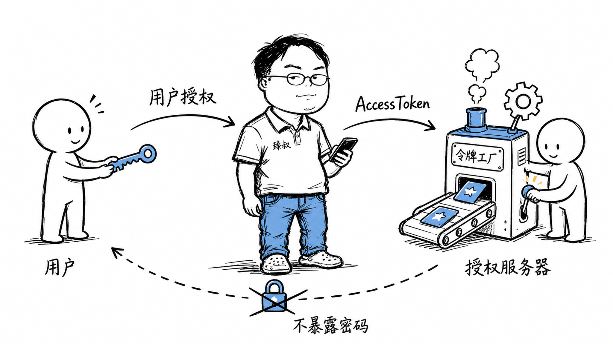

# OAuth2.0的四种授权模式——为什么"用微信登录"是安全的




你打开一个新App，选择"用微信登录"。微信弹出授权页："XX应用想获取你的头像和昵称"。你点"同意"，App就登录成功了。

整个过程中，这个App没有拿到你的微信密码。它怎么知道你是谁的？

这就是OAuth2.0——一个授权框架，让你在不泄露密码的情况下，把你在A平台的部分权限委托给B应用。听起来简单，但它背后涉及四种授权模式、多种Token、重定向流程，以及一个叫PKCE的安全扩展。

## 核心结论

1. **OAuth2.0解决的核心问题**：不共享密码，安全委托权限
2. **四种授权模式**：授权码（最安全）、隐式（已淘汰）、密码（信任度极高才用）、客户端凭证（机器对机器）
3. **授权码模式是事实标准**——其他三种要么被淘汰要么场景极窄
4. **PKCE是移动端/SPA的必备扩展**——防止授权码被截获
5. **OAuth2.0是授权不是认证**——要确认身份需要叠加OIDC

## 深度拆解

### 授权码模式（Authorization Code Grant）

最经典、最安全、最常用的模式：

```
步骤流程:
  1. 用户 → 第三方App: "我要用微信登录"
  2. App → 浏览器重定向: https://open.weixin.qq.com/connect/oauth2/authorize
     ?response_type=code
     &client_id=APP_ID
     &redirect_uri=https://app.com/callback
     &scope=snsapi_userinfo
     &state=RANDOM_STRING
  3. 用户在微信授权页: 登录 + 点"同意"
  4. 微信 → 浏览器重定向: https://app.com/callback
     ?code=AUTHORIZATION_CODE
     &state=RANDOM_STRING  (验证state防CSRF)
  5. App后端 → 微信API:
     POST /oauth2/access_token
     code=AUTHORIZATION_CODE
     client_id=APP_ID
     client_secret=APP_SECRET  (后端持有, 不暴露给浏览器)
  6. 微信 → App后端: access_token + refresh_token
  7. App后端 → 微信API: GET /user/info?access_token=xxx
  8. 微信 → App后端: 用户头像、昵称等信息
```

**为什么用授权码（Code）而不直接返回Token？**

步骤4的重定向经过浏览器，URL可能被截获（浏览器历史、Referer头、中间人）。授权码本身没有访问权限——必须配合`client_secret`才能换Token。`client_secret`只存在App后端，不暴露给浏览器。所以即使授权码被截获，攻击者没有`client_secret`也换不到Token。

### 隐式模式（Implicit Grant）——为什么被淘汰

```
隐式模式简化了流程:
  1. 重定向到授权服务器
  2. 用户授权
  3. 授权服务器直接在URL fragment里返回access_token
     https://app.com/callback#access_token=xxx
  4. 前端JavaScript从URL fragment取出token
```

**设计初衷**：给纯前端SPA（没有后端）用，不需要client_secret。

**为什么被淘汰**：
- Token直接暴露在浏览器URL中（虽然fragment不发给服务器，但能被JS读取）
- 没有refresh_token，token过期了要重新走流程
- 容易被恶意JS窃取（XSS）
- OAuth2.1已移除隐式模式

**替代方案**：SPA用授权码模式 + PKCE。

### 密码模式（Resource Owner Password Credentials Grant）

```
用户 → App: 直接输入微信账号密码
App → 微信: POST /token grant_type=password &username=xxx &password=xxx
微信 → App: access_token
```

**适用场景**：App和授权服务器是同一家公司（如自家App登录自家账号系统），或者用户对App有极高信任度。

**问题**：App拿到了用户的明文密码。如果App是恶意的，密码直接泄露。OAuth2.1也移除了这种模式。

### 客户端凭证模式（Client Credentials Grant）

```
服务A → 授权服务器: POST /token
  grant_type=client_credentials
  &client_id=SERVICE_A_ID
  &client_secret=SERVICE_A_SECRET
授权服务器 → 服务A: access_token

服务A → 服务B: GET /api/data Authorization: Bearer xxx
```

**适用场景**：机器对机器通信（M2M），没有用户参与。比如微服务之间互相调用API。

不需要用户授权，因为服务自己就是资源所有者。Token代表的是"服务A"而不是"某个用户"。

### PKCE：移动端和SPA的安全扩展

**问题**：移动App和SPA没有后端，无法安全存储`client_secret`。如果用授权码模式但不带`client_secret`，授权码被截获后就能换Token。

**PKCE (Proof Key for Code Exchange) 的解决方案**：

```
1. 客户端生成随机code_verifier: "abcdef123456"
2. 计算code_challenge: SHA256(code_verifier) = "xyz789"
3. 授权请求时带上code_challenge:
   /authorize?code_challenge=xyz789&code_challenge_method=S256
4. 授权服务器记住code_challenge
5. 换Token时带上code_verifier:
   POST /token code=xxx &code_verifier=abcdef123456
6. 授权服务器验证: SHA256(code_verifier) == code_challenge?
```

攻击者截获了授权码，但不知道`code_verifier`（存在客户端内存中，不在URL里传输），无法换Token。

**PKCE已成为推荐做法**——所有使用授权码模式的客户端（包括有后端的Web应用）都建议加上PKCE。OAuth2.1将PKCE从可选变成必选。

### 四种模式对比

| 模式 | 适合场景 | 安全性 | 状态 |
|------|---------|--------|------|
| 授权码 | Web应用、移动App、SPA | ⭐⭐⭐⭐⭐ | ✅ 推荐 |
| 授权码+PKCE | 移动App、SPA | ⭐⭐⭐⭐⭐ | ✅ 最佳实践 |
| 隐式 | 纯前端SPA | ⭐⭐ | ❌ 已淘汰 |
| 密码 | 自家App | ⭐⭐ | ❌ 已淘汰 |
| 客户端凭证 | 机器对机器 | ⭐⭐⭐⭐ | ✅ 适合M2M |

### OAuth2.0 vs OIDC：授权和认证的区别

OAuth2.0是**授权框架**——回答"这个App能访问你的什么数据"。
OIDC (OpenID Connect) 是**认证协议**——回答"你是谁"。

OAuth2.0不返回用户身份信息——它只给App一个access_token去调API。如果App需要知道"这个用户是谁"（登录），需要叠加OIDC：

```
OIDC在OAuth2.0基础上增加:
  - scope=openid (在授权请求中声明)
  - 返回id_token (JWT格式, 包含用户身份信息)
  
id_token内容:
  {
    "iss": "https://auth.example.com",
    "sub": "user_123",
    "aud": "app_client_id",
    "exp": 1234567890,
    "iat": 1234567000,
    "name": "张三",
    "email": "zhangsan@example.com"
  }
```

App验证id_token的签名后，可以直接用里面的用户信息做登录——不需要再调一次API。这就是"用微信登录"的完整实现。

## 实战要点

### 工程落地

**state参数防CSRF**：授权请求时生成随机state，回调时验证。不验证state的OAuth实现存在CSRF漏洞——攻击者可以把自己的授权码注入到受害者的会话中。

```python
import secrets

# 生成state
state = secrets.token_urlsafe(32)
session['oauth_state'] = state

# 回调验证
if request.args.get('state') != session['oauth_state']:
    abort(400, 'Invalid state')
```

**Token存储**：
- access_token：短期有效（1小时），存在内存中
- refresh_token：长期有效（30天），存在httpOnly Cookie中
- 不要把token存在localStorage（XSS可读）

### 臻叔踩坑笔记

1. **redirect_uri没做精确匹配**——`redirect_uri=https://app.com/callback`可以被匹配成`https://app.com/callback/../../attacker`。必须精确匹配预注册的URI，不允许通配符
2. **state参数没验证**——不验证state导致CSRF，攻击者可以把自己的授权码绑到受害者账号上。state是必须的，不是可选的
3. **access_token存在localStorage**——XSS可以直接读取localStorage窃取token。应该存在httpOnly Cookie中，或者用BFF（Backend For Frontend）模式
4. **用了隐式模式没升级**——隐式模式已淘汰，SPA应该迁移到授权码+PKCE。不升级会有安全风险，且新浏览器策略可能不支持
5. **把OAuth2.0当认证用**——OAuth2.0是授权不是认证，只给access_token不证明用户身份。需要认证就叠加OIDC拿id_token

### 一句话总结

OAuth2.0的核心是"不共享密码、安全委托权限"——授权码模式是事实标准，PKCE是移动端必选扩展，四种模式中隐式和密码已被淘汰，需要身份认证就叠加OIDC。
