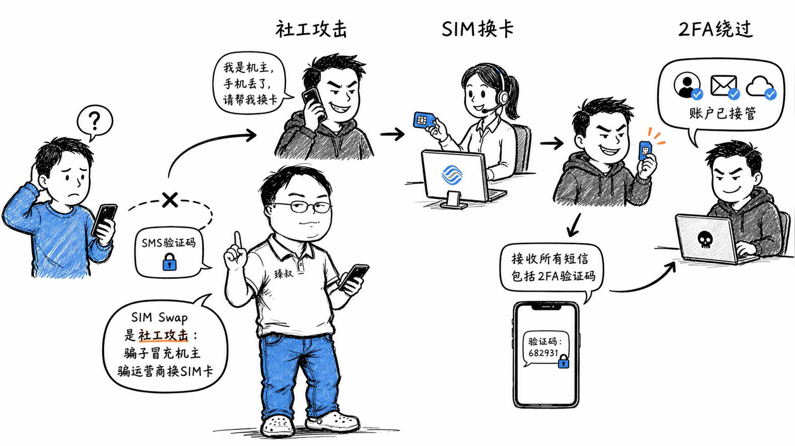

# SIM卡交换攻击：攻击链路分析与防护措施



---

> 📌 **关注「程序员臻叔」，获取更多硬核技术干货**


---

2022年，某用户一觉醒来发现手机没信号了。他以为是运营商故障，没在意。两小时后打开电脑，发现邮箱被改了密码，交易所账户里的50万USDT被全部转走。

整个过程：凌晨2点，攻击者打电话给运营商客服，声称"我手机丢了，请把号码转到新SIM卡上"。客服验证了身份证号和姓名（这些信息在暗网只需几块钱就能买到），完成了SIM卡更换。攻击者的手机收到了所有短信验证码，重置了邮箱密码、交易所密码，完成了转账。

攻击者从头到尾没有碰过你的手机。他攻击的不是技术系统，而是运营商的客服流程。

## 核心结论

1. **SIM Swap是社工攻击**：不攻破技术系统，攻击运营商的客服验证流程
2. **短信验证码不是强认证**，它依赖运营商，运营商流程可能被社工绕过
3. **攻击链路**：收集个人信息 → 骗过运营商 → 接收验证码 → 重置密码 → 转账
4. **核心防御是MFA多样化**：不要只依赖短信，用TOTP或硬件密钥
5. **SIM卡PIN是第一道防线**——设置后即使物理SIM卡被复制也需要PIN码

## 深度拆解

### 攻击的完整链路

```
阶段1: 信息收集 (暗网/社工库)
  目标: 姓名、身份证号、手机号、生日、住址
  来源: 
    - 历年数据泄露 (各种"脱裤"事件的合集)
    - 社交媒体 (朋友圈/微博/LinkedIn透露的信息)
    - 钓鱼邮件/短信 (伪装官方收集信息)
  成本: 几十元到几百元

阶段2: SIM卡替换 (攻击运营商)
  方式1: 电话社工
    → 拨打运营商客服
    → "我手机丢了/坏了, 需要补办SIM卡"
    → 客服验证: 身份证号 + 姓名 + 最近充值金额 (或服务密码)
    → 信息正确 → 远程将号码绑定到新SIM卡
    → 受害者手机失去信号
  
  方式2: 线下门店
    → 用伪造身份证去运营商实体店
    → 营业员肉眼核验 → 补办SIM卡
  
  方式3: 内鬼
    → 贿赂运营商内部员工直接操作
    → 成功率最高, 成本也最高

阶段3: 账户接管 (利用短信验证码)
  → 目标手机号已控制
  → "忘记密码" → "手机验证" → 接收验证码 → 重置密码
  → 登录邮箱 → 查找所有关联账号
  → 登录交易所/银行 → 转账
  → 关闭安全提醒邮件 (延迟发现)

整个过程: 信息收集(1-7天) + SIM替换(10分钟) + 账户接管(30分钟) = 成功率极高
```

### 为什么短信验证码不是强认证

短信验证码（SMS OTP）的安全假设链：

```
假设1: 手机在用户手里 → 攻击者通过SIM Swap打破
假设2: 运营商验证严格 → 攻击者通过社工打破
假设3: 短信传输安全 → SS7协议漏洞可以拦截短信
假设4: 验证码是临时的一次性 → 但在有效期内谁能收到谁就能用
```

**SS7协议漏洞**：SS7（Signaling System 7）是电信运营商之间的信令协议。攻击者如果有SS7网络访问权限（可以通过地下市场租用），可以在不替换SIM卡的情况下直接拦截短信。这比SIM Swap更隐蔽——用户手机有信号，但验证码被静默拦截。

NIST在2016年就已经将SMS OTP从推荐认证方式中降级，明确表示短信不适合作为高安全场景的唯一第二因素。

### TOTP：比短信更安全的替代

TOTP（Time-based One-Time Password）不依赖运营商网络，基于时间+共享密钥生成验证码：

```
原理:
  shared_secret = base32_decode("JBSWY3DPEHPK3PXP")  # 注册时生成的密钥
  counter = floor(current_time / 30)  # 每30秒变化一次
  otp = HMAC-SHA1(shared_secret, counter)  # 截取6位数字

优势:
  - 不依赖手机号/运营商 → SIM Swap无效
  - 不需要网络 → 离线生成
  - 密钥存在本地 → 攻击者无法远程获取

使用方式:
  用户注册时: 
    → 生成shared_secret
    → 显示二维码 (二维码内容: otpauth://totp/Example:user@example.com?secret=JBSWY3DPEHPK3PXP&issuer=Example)
    → 用户用Google Authenticator/Authy扫码
    → shared_secret存在App中
  
  登录时:
    → 用户输入6位TOTP码
    → 服务器用同样的shared_secret计算当前TOTP
    → 对比是否一致
```

**TOTP的风险**：
- shared_secret存在手机里，手机丢了就没了（需要备份码）
- 如果shared_secret在传输过程中被截获 → 攻击者也能生成TOTP
- 钓鱼攻击可以骗用户输入TOTP码 → 攻击者在30秒内使用

### 硬件安全密钥：最强认证

```
FIDO2/WebAuthn标准:
  → 用户插入YubiKey或使用TouchID/Windows Hello
  → 设备生成非对称密钥对, 私钥永不出设备
  → 注册时: 公钥发给服务器
  → 登录时: 服务器发challenge → 设备用私钥签名 → 服务器用公钥验签

优势:
  - 私钥永不出设备 → 钓鱼无法窃取
  - 绑定域名 → 假冒网站无法获取签名
  - SIM Swap/网络拦截完全无效
  
劣势:
  - 需要额外硬件
  - 丢失需要备用方案
  - 用户体验门槛
```

### 多因素认证（MFA）的组合策略

```
认证因素:
  Something you know: 密码/PIN
  Something you have: 手机/硬件密钥/TOTP
  Something you are: 指纹/FaceID/虹膜

安全等级递增:
  Level 1: 密码 + 短信验证码 (最弱, SIM Swap可破)
  Level 2: 密码 + TOTP (中等, 钓鱼可破)
  Level 3: 密码 + TOTP + 异常检测 (较强)
  Level 4: 密码 + 硬件密钥 (最强, 钓鱼也难破)
  Level 5: 密码 + 硬件密钥 + 生物识别 (银行级)
```

## 实战要点

### 工程落地

**高安全场景的MFA设计**：
```
登录流程:
  1. 输入账号密码
  2. 检测设备指纹:
     - 已知设备 → TOTP验证 → 登录
     - 未知设备 → TOTP + 短信验证 + 邮件通知
  3. 敏感操作 (转账/改密码):
     - 独立的支付密码
     - 或生物识别 (FaceID/指纹)
     - 或硬件密钥

异常检测:
  - SIM卡变更后24小时内的敏感操作 → 需要额外验证
  - 登录地点突变 → 需要额外验证  
  - 短信验证码突然全部失败 (SIM可能被换) → 自动锁定
```

**用户教育**：
```
告诉用户:
  1. 不要用短信作为唯一的二次验证 → 换成TOTP
  2. 给SIM卡设PIN码 → 运营商补卡也需要PIN
  3. 手机突然没信号 → 立即联系运营商确认
  4. 重要账号用独立密码 + 硬件密钥
```

### 臻叔踩坑笔记

1. **短信作为唯一MFA**——SIM Swap直接绕过。至少提供TOTP选项，高安全场景强制TOTP
2. **改密码只验短信**：攻击者SIM Swap后，"忘记密码"流程只验短信就重置了。改密码应该要求TOTP或邮件确认
3. **SIM卡没设PIN**：运营商补卡后直接就能用。设置SIM PIN后即使物理拿到SIM卡也需要PIN
4. **没监控SIM变更**。用户SIM被换了系统不知道。可以检测"短信发送突然失败率升高"或"设备指纹突变"来推断
5. **恢复方式只有短信**：TOTP密钥丢了，恢复方式只有短信验证 → SIM Swap后恢复流程也被攻破。恢复方式应该多渠道（邮件+客服人工验证）

### 一句话总结

SIM Swap攻击不碰技术系统，攻击运营商客服流程：短信验证码不是强认证，核心防御是MFA多样化（TOTP替代短信、硬件密钥做最强认证），SIM卡设PIN是第一道物理防线。

---

### 🎯 觉得有帮助？关注「程序员臻叔」


---
