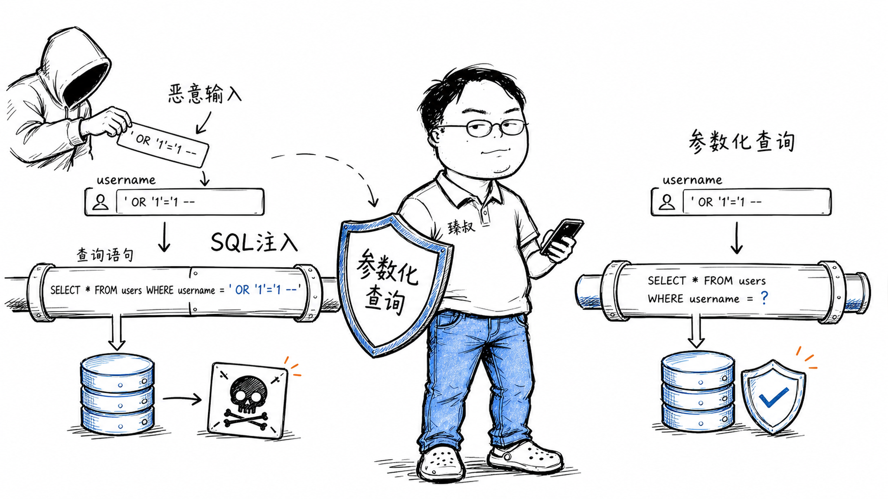

# SQL注入攻防：注入原理、攻击手法与参数化查询防御



---

> 📌 **关注「程序员臻叔」，获取更多硬核技术干货**


---

2008年，某大型招聘网站被SQL注入攻击。攻击者不是什么顶级黑客，而是一个高中生在论坛上看到SQL注入教程后试了一下。一个简单的`' OR '1'='1`，让这个网站的200万用户简历（含姓名、身份证号、手机号、工作经历）全部泄露。

更离谱的是，这个网站的登录接口用的是字符串拼接SQL，而且在首页搜索框、公司页面、职位详情等20多个接口都存在同样的漏洞。攻击者只需改一个参数名，就能换一个入口继续拖库。

SQL注入从1998年被提出到现在，20多年过去了，仍然是OWASP Top 10的常客。原因不在于它有多高深，而在于字符串拼接这个习惯太顽固。

## 核心结论

1. **SQL注入的本质**：用户输入被当作SQL代码执行，攻击者改变了SQL的语义
2. **参数化查询是唯一正确解法**：它不是"一种防御手段"，而是"唯一正确的写法"
3. **ORM不是万能护身符**——ORM的raw query、字符串拼接条件、动态表名照样能注入
4. **最小权限原则**：应用连数据库的账号不应该有DROP、ALTER、GRANT等权限
5. **WAF是最后一道防线不是第一道**：WAF可以被绕过，代码层安全才是根本

## 深度拆解

### 注入是怎么发生的

一段"看起来没问题"的代码：

```java
// 危险写法：字符串拼接
String sql = "SELECT * FROM users WHERE username = '" + username + "' AND password = '" + password + "'";
Statement stmt = conn.createStatement();
ResultSet rs = stmt.executeQuery(sql);
```

正常输入 `username=admin, password=123456`：
```sql
SELECT * FROM users WHERE username = 'admin' AND password = '123456'
```

攻击者输入 `username=admin' --, password=anything`：
```sql
SELECT * FROM users WHERE username = 'admin' --' AND password = 'anything'
```

`--`是SQL注释，后面的`AND password = 'anything'`被注释掉了。密码校验直接消失，攻击者以admin身份登录。

### 注入的危害远不止绕过登录

**拖库（数据泄露）**：
```sql
-- 输入: ' UNION SELECT username, password, email FROM users --
SELECT * FROM products WHERE name = '' UNION SELECT username, password, email FROM users --'
-- 把用户表的全部数据拼到商品查询结果里返回
```

**写文件/执行命令**（MySQL的INTO OUTFILE）：
```sql
-- 输入: ' INTO OUTFILE '/var/www/html/shell.php' --
SELECT * FROM products WHERE name = '' INTO OUTFILE '/var/www/html/shell.php' --
-- 直接往Web目录写一个webshell
```

**删除数据**：
```sql
-- 输入: '; DROP TABLE users; --
SELECT * FROM products WHERE name = ''; DROP TABLE users; --'
```

### 参数化查询为什么有效

参数化查询把"SQL结构"和"数据"完全分离：

```java
// 正确写法：参数化查询
String sql = "SELECT * FROM users WHERE username = ? AND password = ?";
PreparedStatement stmt = conn.prepareStatement(sql);
stmt.setString(1, username);  // 数据
stmt.setString(2, password);  // 数据
ResultSet rs = stmt.executeQuery();
```

数据库的处理流程：
1. 先解析SQL结构（`SELECT * FROM users WHERE username = ? AND password = ?`）
2. 把`?`的位置标记为"参数位"
3. 把`username`和`password`的值作为纯数据填入参数位

攻击者输入`admin' --`时，数据库不会把它解析为SQL代码——它只是`username`参数的值，一个普通字符串。SQL语义不变。

```
拼接方式:  SQL结构 + 用户输入 → 一起解析 → 语义被改变
参数化:    SQL结构先解析 → 用户输入作为数据填入 → 语义不变
```

### ORM的注入盲区

ORM框架（如MyBatis、Hibernate、SQLAlchemy）默认使用参数化，但有几个例外：

**MyBatis的`${}` vs `#{}`**：
```xml
<!-- 安全: #{} 会参数化 -->
<select id="findUser">
  SELECT * FROM users WHERE username = #{username}
</select>

<!-- 危险: ${} 是字符串拼接 -->
<select id="findByTable">
  SELECT * FROM ${tableName} WHERE username = '${username}'
</select>
```

`${}`是直接拼接，常用于动态表名、排序列名等场景。如果这些值来自用户输入，就是注入漏洞。

**ORM的raw query**：
```python
# Django: raw() 不会参数化
User.objects.raw(f"SELECT * FROM users WHERE name = '{name}'")  # 危险

# 正确写法
User.objects.raw("SELECT * FROM users WHERE name = %s", [name])  # 安全
```

**动态排序**：
```python
# 危险: order_by参数来自用户输入
query = f"SELECT * FROM products ORDER BY {user_input}"
# 攻击者输入: name; DROP TABLE products --

# 正确: 白名单校验
allowed_fields = {'name', 'price', 'created_at'}
order_field = user_input if user_input in allowed_fields else 'name'
query = f"SELECT * FROM products ORDER BY {order_field}"
```

### 多层防御体系

```
第一层: 参数化查询（必须做到）
  → 消除99%的注入风险

第二层: 输入校验（白名单）
  → 用户名只允许字母数字下划线
  → 排序字段只允许预定义字段名
  → 数字参数必须是数字类型

第三层: 最小权限
  → 应用数据库账号: 只有SELECT/INSERT/UPDATE权限
  → 没有DROP/ALTER/GRANT/FILE权限
  → 即使注入成功，也无法删表或写文件

第四层: WAF（Web应用防火墙）
  → 识别常见注入模式（UNION SELECT, OR 1=1等）
  → 但WAF可被绕过（编码、注释、变形）
  → 是补充不是替代
```

## 实战要点

### 工程落地

**代码审查清单**：全局搜索SQL拼接——`execute(`、`query(`、`raw(`、`${`、`f"SELECT`，每一个都要确认是否参数化。

**数据库权限分离**：
```sql
-- 应用运行时账号（最小权限）
GRANT SELECT, INSERT, UPDATE ON app_db.* TO 'app_user'@'%';

-- 管理账号（仅限DBA使用，不在应用配置里）
GRANT ALL PRIVILEGES ON app_db.* TO 'admin'@'localhost';
```

**错误信息脱敏**：SQL报错信息不能直接返回给用户——攻击者通过报错信息了解表结构、列名，辅助构造注入payload。

### 臻叔踩坑笔记

1. **以为用了ORM就安全**：MyBatis的`${}`、Django的`raw()`、SQLAlchemy的`text()`如果不参数化，照样注入。ORM默认安全，但提供了"逃生舱"
2. **排序/分页参数直接拼接**——`ORDER BY ${sort}`是高频漏洞，用户传`name; DROP TABLE`就完蛋。排序字段必须白名单
3. **报错信息暴露表结构**：SQL异常堆栈直接返回前端，攻击者看到`Unknown column 'password_hash'`就知道列名不存在，换个列名继续试
4. **WAF当唯一防线**。WAF可以被编码绕过（URL编码、双重编码、Unicode编码），代码层不修复等于裸奔
5. **数据库账号权限过大**：应用用root连数据库，注入成功后攻击者可以直接`DROP DATABASE`。应用账号永远不应该有DDL权限

### 一句话总结

SQL注入的本质是用户输入被当作代码执行：参数化查询把结构和数据分离，是唯一正确的写法，ORM不是万能的，最小权限是最后的保底。

---

### 🎯 觉得有帮助？关注「程序员臻叔」


---
