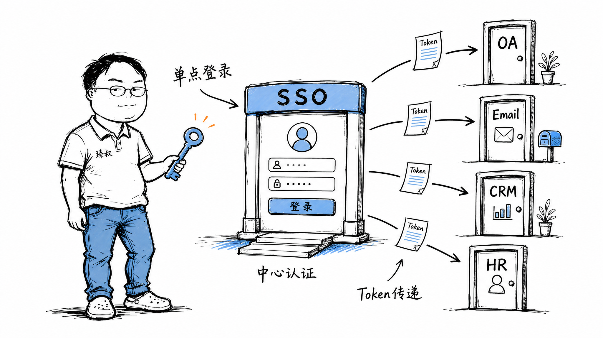

# 设计一个SSO单点登录——登录一次，通行全网




你打开淘宝，需要登录。输完密码后，顺手打开天猫——已经登录了。再打开闲鱼——也登录了。三个不同域名（taobao.com、tmall.com、xianyu.com），Cookie不能跨域共享，它们怎么知道你已经登录了？

这就是SSO（Single Sign-On，单点登录）。它解决的问题是：在多个互不信任的系统中，用户只需要认证一次，就能访问所有系统。但"互不信任"和"一次登录"本身是矛盾的——SSO的设计就是在两者之间架一座桥。

## 核心结论

1. **SSO的核心是集中认证 + 票据中转**——认证中心统一登录，各应用用票据验证
2. **Cookie不能跨域**——`taobao.com`的Cookie不会被`tmall.com`的请求带上，必须通过认证中心中转
3. **CAS协议**：经典SSO方案，流程清晰，适合企业内部
4. **OIDC（基于OAuth2.0）**：现代SSO方案，返回JWT格式的ID Token，适合互联网和跨域场景
5. **SSO是"单点登录"也是"单点失效"**——认证中心被攻破=所有系统沦陷，必须重点保护

## 深度拆解

### CAS协议：最经典的SSO流程

CAS（Central Authentication Service）的核心是**Ticket（票据）**：

```
第一次登录（应用A）:
  1. 用户 → 应用A: 访问 https://a.example.com/dashboard
  2. 应用A: 未登录，重定向到CAS认证中心
     → https://cas.example.com/login?service=https://a.example.com/callback
  3. 用户在CAS认证中心: 输入账号密码
  4. CAS验证通过，生成Service Ticket (ST)
  5. CAS重定向回应用A: https://a.example.com/callback?ticket=ST-abc123
  6. 应用A后端 → CAS: 验证ticket
     POST https://cas.example.com/serviceValidate?ticket=ST-abc123&service=https://a.example.com/callback
  7. CAS → 应用A: 有效，用户信息是zhangsan
  8. 应用A: 创建本地Session，返回页面
  9. CAS: 给浏览器设置全局Cookie (TGC, Ticket Granting Cookie)

第二次访问（应用B，已登录过CAS）:
  1. 用户 → 应用B: 访问 https://b.example.com/work
  2. 应用B: 未登录，重定向到CAS
     → https://cas.example.com/login?service=https://b.example.com/callback
  3. CAS: 检查TGC Cookie → 已登录！不需要再输密码
  4. CAS: 生成新的Service Ticket，重定向回应用B
     → https://b.example.com/callback?ticket=ST-def456
  5. 应用B后端 → CAS: 验证ticket
  6. CAS → 应用B: 有效，用户信息是zhangsan
  7. 应用B: 创建本地Session，返回页面
  
  全程无密码输入！
```

**关键设计点**：
- Ticket是一次性的，用完即废（防止被截获重放）
- Ticket有有效期（通常10秒），超时自动失效
- 应用验证ticket是后端对后端通信（不经过浏览器），防止中间人篡改
- TGC Cookie是CAS域名的，只有访问CAS时才带上

### 跨域Cookie的问题

`taobao.com`和`tmall.com`是不同域名。浏览器安全模型规定：请求`tmall.com`时不会带上`taobao.com`的Cookie。所以不能靠Cookie直接共享登录态。

**CAS的解决方案**：通过重定向中转。用户从天猫跳到CAS时，带上CAS域名的TGC Cookie（这个Cookie是CAS在用户第一次登录时设置的），CAS验证TGC后直接发Ticket给天猫，不需要重新登录。

```
天猫请求流程:
  天mall.com → 重定向到 cas.taobao.com → 带上CAS域Cookie(TGC) → CAS验证 → 发Ticket → 天猫验证Ticket → 登录成功
```

### OIDC：现代SSO方案

OIDC基于OAuth2.0，增加了身份认证层。相比CAS，OIDC更适合互联网场景：

```
OIDC登录流程:
  1. 用户 → 应用A: 访问需要登录的页面
  2. 应用A → 认证服务器: 重定向到授权端点
     https://auth.example.com/authorize?
       response_type=code
       &client_id=APP_A_ID
       &redirect_uri=https://a.example.com/callback
       &scope=openid profile email
       &state=RANDOM
  3. 用户在认证服务器: 登录 + 授权
  4. 认证服务器 → 应用A: 回调，带授权码
  5. 应用A → 认证服务器: 用授权码换Token
  6. 认证服务器 → 应用A:
     - access_token (API调用用)
     - id_token (JWT, 包含用户身份)  ← OIDC的核心
     - refresh_token (刷新用)
  7. 应用A: 验证id_token签名 → 提取用户信息 → 创建本地Session
```

**OIDC相比CAS的优势**：

| 维度 | CAS | OIDC |
|------|-----|------|
| 协议格式 | XML | JSON/JWT |
| Token格式 | 不透明字符串 | JWT（自包含） |
| 验证方式 | 后端调CAS验证 | 本地验证JWT签名 |
| 适合场景 | 企业内部 | 互联网、跨域 |
| 移动端支持 | 弱 | 好 |
| 标准化程度 | CAS专属 | 基于OAuth2.0标准 |
| API网关友好 | 差 | 好（JWT可直接在Header传递） |

**JWT的优势**：id_token是JWT格式，包含用户信息和签名。应用收到后本地验签即可，不需要再调认证服务器验证——减少了一次网络请求。

### 单点登出（Single Logout）

登录一次通行全网，登出也要一次登出全网。这比登录更复杂：

```
CAS单点登出流程:
  1. 用户 → 应用A: 点击登出
  2. 应用A → CAS: 通知CAS用户要登出
  3. CAS: 销毁全局TGC Cookie
  4. CAS → 所有已登录应用: 通知销毁本地Session
     (通过HTTP回调，应用收到后销毁自己的Session)
  5. CAS → 浏览器: 重定向到登录页
```

**问题**：步骤4的回调可能失败（网络问题、应用重启），导致部分应用的Session没销毁。用户以为登出了，但某个应用还能访问。

**OIDC的方案**：用back-channel logout（后端通知）或front-channel logout（前端iframe通知），但同样存在可靠性问题。

### SSO的安全风险

**认证中心是最高价值目标**：
- 攻破认证中心 = 拿到所有系统的访问权
- 认证中心必须有MFA、异常登录检测、安全审计
- 认证中心的私钥必须存在HSM中

**Ticket劫持**：
- Ticket在重定向URL中传输，可能被截获（浏览器历史、Referer）
- Ticket必须一次性使用 + 短有效期（<10秒）
- 敏感操作仍然需要二次验证（如支付要单独验证支付密码）

**Session Fixation攻击**：
- 攻击者诱导用户使用攻击者的Session ID登录
- 登录后攻击者用同一个Session ID访问系统
- 防御：登录成功后必须生成新的Session ID

## 实战要点

### 工程落地

**微服务架构下的SSO**：
```
架构:
  用户 → API网关 → 微服务A/B/C
  
  API网关: 验证JWT签名，提取用户信息
  微服务: 信任网关传来的用户信息（内部网络）
  
  登录流程:
    用户 → 认证中心: 登录，获取JWT
    用户 → API网关: 请求带 Authorization: Bearer <JWT>
    API网关: 验证JWT → 放行到微服务
```

**Token刷新策略**：
- access_token: 短期（15分钟-1小时），存在内存中
- refresh_token: 长期（7-30天），存在httpOnly Cookie中
- 前端检测access_token过期 → 用refresh_token静默刷新
- refresh_token也过期 → 跳转登录页

### 臻叔踩坑笔记

1. **Ticket没有一次性使用**——Ticket可以重放，攻击者截获后能在有效期内反复使用。Ticket必须用完即废
2. **登出通知不可靠**——CAS单点登出依赖HTTP回调，网络抖动导致部分应用Session没销毁。重要系统应该有独立的Session超时机制，不依赖登出通知
3. **认证中心没开MFA**——认证中心被攻破=全网沦陷。认证中心必须强制MFA，异常登录检测，登录限流
4. **JWT签名密钥泄露**——JWT的签名密钥如果泄露，攻击者可以伪造任意用户的身份Token。密钥必须定期轮转，存在安全存储中
5. **跨域重定向没校验**——重定向URL可以被篡改成恶意网站（开放重定向漏洞）。redirect_uri必须精确匹配白名单，不允许通配符

### 一句话总结

SSO的核心是"集中认证+票据中转"——CAS是经典方案（后端验证Ticket），OIDC是现代方案（JWT自包含验证），认证中心是最高价值目标必须重点保护，单点登录也是单点失效。
