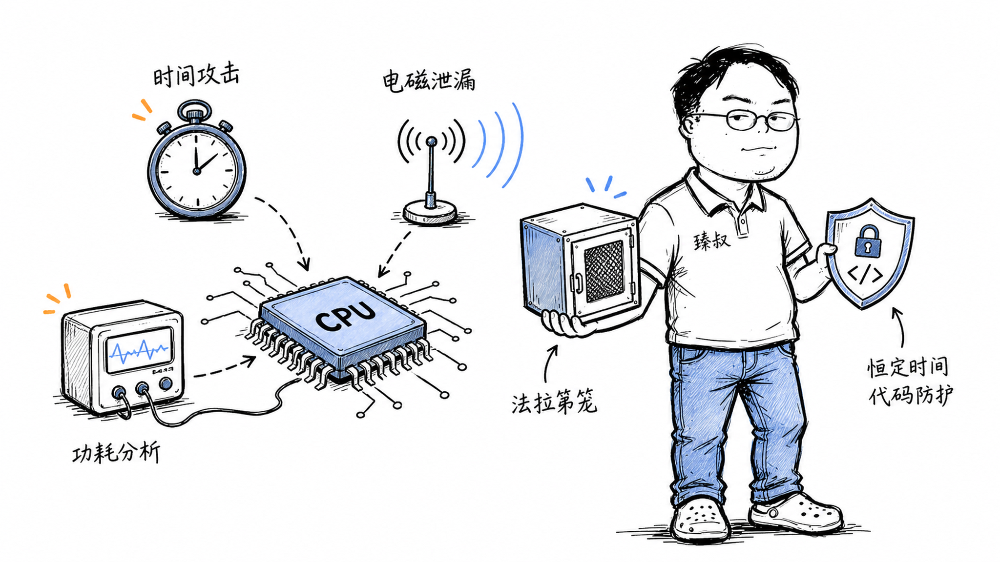

# 侧信道攻击：时序、功耗与声学等旁路攻击原理



---

> 📌 **关注「程序员臻叔」，获取更多硬核技术干货**


---

你设计了一套加密系统，算法用的是AES-256，数学上无懈可击。密钥256位，暴力破解需要10^67年——宇宙年龄的10^57倍。

但攻击者不打算破解你的算法。他观察你加密时CPU的功耗波形、执行时间的微小差异、甚至散热风扇的声音，就能逐bit还原出你的256位密钥。

这不是科幻。2008年，安全研究员Daniel Bernstein通过测量AES加密的缓存访问时间，用不到65毫秒的测量数据还原了AES密钥。2018年，Spectre和Meltdown利用CPU推测执行泄露内核内存数据，动摇了整个计算机安全的根基。

## 核心结论

1. **侧信道攻击不攻击算法本身**：攻击算法在物理实现上泄露的信息
2. **四大侧信道**：时序（执行时间差异）、功耗（电流波动）、电磁（辐射信号）、缓存（访问模式）
3. **Spectre/Meltdown是缓存侧信道的巅峰**——利用CPU推测执行在缓存中留下的痕迹，读取内核内存
4. **核心防御是恒定时间算法**：让操作时间与输入数据无关
5. **数学安全≠实现安全**：算法在纸面上安全不代表代码实现安全

## 深度拆解

### 时序攻击（Timing Attack）

**原理**：某些操作的执行时间取决于输入数据。攻击者测量成千上万次操作的耗时，统计推断出密钥。

**RSA的时序漏洞**：

```python
# RSA平方-乘模幂运算（简化版）
def rsa_decrypt(ciphertext, d, n):
    result = 1
    for bit in bin(d):  # 遍历私钥的每个bit
        result = (result * result) % n  # 平方: 总是执行
        if bit == '1':
            result = (result * ciphertext) % n  # 乘法: 只在bit=1时执行
            # ↑ 乘法比平方多耗时 ~0.3ms
    return result
```

攻击者发送大量不同的ciphertext，测量每次解密的总耗时。如果第k个bit是1，总时间会多出一个乘法操作的时间。统计大量样本后，可以逐bit还原私钥d。

```python
# 攻击示意
measurements = []
for c in test_ciphertexts:
    start = high_precision_timer()
    rsa_decrypt(c, unknown_private_key, n)
    elapsed = high_precision_timer() - start
    measurements.append((c, elapsed))

# 统计: 如果某bit=1的ciphertext组平均耗时 > bit=0组
# → 推断该bit=1
```

**防御：恒定时间算法**——无论输入是什么，执行的操作序列和时间完全相同：

```python
def rsa_decrypt_constant_time(ciphertext, d, n):
    result = 1
    for bit in bin(d):
        result = (result * result) % n
        # 无论bit是0还是1，都执行乘法，但只在bit=1时使用结果
        dummy = (result * ciphertext) % n
        if bit == '1':
            result = dummy
        # ↑ 两种情况执行时间完全一样
    return result
```

### 功耗分析（Power Analysis）

**原理**：芯片执行不同指令时功耗不同。位为1时功耗高于位为0。用高精度仪器测量功耗曲线，推断密钥。

**简单功耗分析（SPA）**：
```
测量: 示波器连接芯片电源引脚 → 记录加密过程功耗曲线
分析: 
  - 功耗高的区间 → 执行了乘法 → 私钥该bit=1
  - 功耗低的区间 → 只执行平方 → 私钥该bit=0
```

**差分功耗分析（DPA）**——更强大，不需要了解算法实现细节：
```
1. 用不同明文运行加密1万次，每次记录功耗曲线
2. 猜测密钥的1个bit（0或1）
3. 根据猜测把1万次测量分成两组
4. 计算两组功耗曲线的平均值差
5. 如果猜测正确 → 差值曲线有明显尖峰
6. 如果猜测错误 → 差值曲线是噪声
7. 逐bit猜测+验证 → 还原完整密钥
```

**防御**：
- 功耗平衡：无论数据是0还是1，消耗相同能量
- 随机延迟插入：在操作间插入随机延时，打乱功耗曲线
- 噪声注入：主动产生噪声掩盖真实功耗信号
- 硬件屏蔽：物理隔离芯片，限制电磁辐射

### 缓存侧信道（Cache Side-Channel）

**原理**：CPU缓存访问速度远快于主存。攻击者通过测量内存访问延迟，推断出密钥相关的缓存命中/未命中模式。

**Flush+Reload攻击**：
```
1. 攻击者清空缓存: clflush(共享地址X)
2. 受害者执行加密操作（可能访问地址X，取决于密钥值）
3. 攻击者访问地址X，测量耗时:
   - 快 (<50ns) → 缓存命中 → 受害者访问过X → 密钥相关bit=1
   - 慢 (>200ns) → 缓存未命中 → 受害者没访问X → 密钥相关bit=0
```

AES的T-table实现中，加密过程会根据密钥+明文访问不同的查找表条目。攻击者通过缓存侧信道知道哪些条目被访问了，结合明文推断密钥。

### Spectre / Meltdown：缓存侧信道的核弹

**Meltdown（熔毁）**：
```
漏洞: CPU的推测执行违反了内存隔离
  1. 用户态代码尝试读取内核内存地址K
  2. CPU权限检查: 拒绝访问（会触发异常）
  3. 但CPU的推测执行在权限检查完成前，已经把K的数据读到了缓存
  4. 异常处理: 回滚寄存器变化，但缓存不会回滚！
  5. 攻击者用Flush+Reload探测缓存 → 推断出K地址存储的数据
  
影响: 任何用户态程序可以读取内核内存 → 绕过所有内存隔离
```

```c
// Meltdown攻击伪代码
char *kernel_addr = 0xFFFF_8000_0000_0000;  // 内核地址
char value;

// 1. 推测执行读取内核内存（会被异常处理回滚，但缓存留下了痕迹）
value = *kernel_addr;  // ← CPU会执行这行，然后异常

// 2. 利用缓存侧信道提取value
// 如果value=65('A')，访问probe_array[65*4096]会命中缓存
for (int i = 0; i < 256; i++) {
    uint64_t start = rdtsc();
    volatile char tmp = probe_array[i * 4096];
    uint64_t elapsed = rdtsc() - start;
    if (elapsed < 50) {
        // i 就是内核地址存储的字节值
        printf("Kernel byte = 0x%02x\n", i);
    }
}
```

**Spectre（幽灵）**：
```
比Meltdown更难修: 不是CPU bug，而是推测执行的设计本质
  1. 攻击者训练CPU分支预测器（让某个条件分支被认为是"true"）
  2. 然后给一个让分支为"false"的输入
  3. CPU推测执行仍然走了"true"分支（因为训练过）
  4. 推测执行的代码读取了不该访问的数据并存入缓存
  5. 虽然结果被回滚，但缓存痕迹留下
  6. 攻击者用缓存侧信道提取数据
  
影响: 跨进程、跨虚拟机读取数据 → 云计算多租户隔离被打破
```

**防御（无法完美修复）**：
- 微码更新：CPU厂商发布补丁，限制推测执行
- 内核页表隔离（KPTI）：用户态和内核态用不同的页表，彻底分开
- 浏览器站点隔离：不同网站的进程隔离
- 禁用高精度计时器：降低缓存测量的精度（`performance.now()`精度降低）

## 实战要点

### 工程落地

**密码学库的选择**：用经过侧信道分析的库（如OpenSSL、libsodium），不要自己实现加密算法。这些库已经用了恒定时间实现。

**高安全场景的防护**：
- 智能卡/硬件安全模块（HSM）：物理封装防功耗分析
- 同态加密/盲化：在输入上加随机数，让功耗与密钥无关
- 多线程噪声：运行无关计算产生噪声

**Web应用的计时攻击防护**：
```python
# 危险: 字符串比较可能提前返回
if user_token == stored_token:
    # 攻击者测量响应时间, 逐字符猜测token
    pass

# 安全: 恒定时间比较
import hmac
if hmac.compare_digest(user_token, stored_token):
    pass
```

### 臻叔踩坑笔记

1. **自己实现加密算法**：即使算法正确，实现中的分支、循环、内存访问模式都可能泄露密钥。永远用经过审计的密码学库
2. **字符串比较用==**——`==`遇到第一个不匹配的字符就返回，响应时间泄露正确字符数。密码/Token比较必须用`hmac.compare_digest`
3. **缓存共享导致跨VM泄露**：云上同一物理机的不同VM共享CPU缓存，Spectre可以跨VM读取数据。高安全场景用独占物理机
4. **高精度计时器没限制**。`performance.now()`或`rdtsc`精度太高，攻击者用它做缓存侧信道测量。浏览器已降低精度到微秒级，但仍有风险
5. **只关注算法不关注实现**：AES-256在数学上安全，但T-table实现有缓存侧信道。用AES-NI硬件指令替代软件T-table

### 一句话总结

侧信道攻击不破算法破实现：CPU功耗、执行时间、缓存模式都是信息泄露渠道，Spectre/Meltdown证明数学安全不等于实现安全，核心防御是恒定时间算法和物理隔离。

---

### 🎯 觉得有帮助？关注「程序员臻叔」


---
