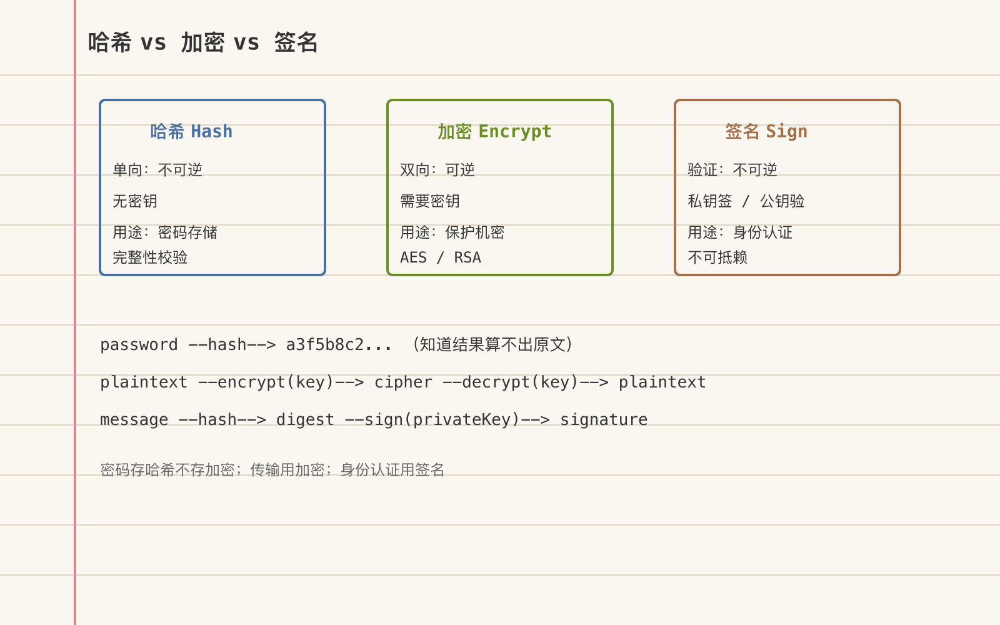

# 哈希、加密与签名：三个概念的本质区别与适用场景



---

> 📌 **关注「程序员臻叔」，获取更多硬核技术干货**


---

某次安全审计，审计团队问后端开发："用户密码是怎么存的？"开发自信回答："AES加密存储。"审计当场判定不合规。开发不服气——"加密了还不安全？"

问题在于：加密是可逆的。只要有密钥，就能还原明文密码。而密钥通常存在应用配置里，一旦服务器被攻破，密钥和数据库一起泄露，等于没加密。

另一个场景：产品经理说"接口签名一下防篡改"，开发直接用了MD5。结果被安全团队打回——MD5是哈希不是签名，没有私钥参与，任何人都能伪造。

哈希、加密、签名，这三个概念字面相似、底层完全不同，但新人混用是常态。

## 核心结论

1. **哈希是单向指纹**：输入变固定长度输出，不可逆，用于完整性校验和密码存储
2. **加密是可逆变换**：用密钥把明文变密文、密文变明文，用于保护机密性
3. **签名是身份证明**：用私钥对哈希加密，公钥验证，用于防篡改和不可抵赖
4. **三者解决的问题不同**：哈希解决"有没有被改"，加密解决"能不能看懂"，签名解决"是不是你发的"
5. **混用是安全漏洞的常见根源**——用加密存密码、用哈希做签名、用签名做加密，每一种都是真实事故

## 深度拆解

### 哈希：把任意输入变成固定长度指纹

哈希函数的核心特性：

- **单向性**：知道 `hash(x)` 算不出 `x`
- **确定性**：同样的输入永远得到同样的输出
- **抗碰撞性**：很难找到两个不同的输入产生相同输出
- **雪崩效应**：输入变一个bit，输出变一大片

```python
import hashlib

# 同一输入永远得到同一输出
print(hashlib.sha256(b"hello").hexdigest())
# 输出: 2cf24dba5fb0a30e26e83b2ac5b9e29e1b161e5c1fa7425e73043362938b9824

# 改一个字符，输出完全不同
print(hashlib.sha256(b"Hello").hexdigest())
# 输出: 185f8db32271fe25f561a6fc938b2e264306ec304eda518007d1764826381969
```

常见哈希算法对比：

| 算法 | 输出长度 | 安全性 | 典型用途 |
|------|---------|--------|---------|
| MD5 | 128bit | ❌ 已被破解 | 文件校验（非安全场景） |
| SHA-1 | 160bit | ❌ 已被破解 | 遗留系统 |
| SHA-256 | 256bit | ✅ 安全 | 通用哈希、区块链 |
| bcrypt | 184bit | ✅ 慢哈希 | 密码存储 |
| Argon2 | 可变 | ✅ 最新推荐 | 密码存储（抗GPU） |

**关键区分**：MD5和SHA-256是"快哈希"，设计目标是快——这对校验文件是优点，对密码存储是灾难（攻击者GPU每秒能算几十亿次）。bcrypt/Argon2是"慢哈希"，故意设计得慢且耗内存，让暴力破解成本高到不划算。

### 加密：用密钥在明文和密文之间切换

加密的核心是**可逆性**——有密钥就能还原。分为两大类：

**对称加密**（一把钥匙开锁）：
```
加密: ciphertext = AES_encrypt(plaintext, key)
解密: plaintext = AES_decrypt(ciphertext, key)
```
速度快（AES硬件加速后可达Gbps级），适合加密大量数据。问题在于密钥分发——双方怎么安全地把钥匙传给对方？

**非对称加密**（两把钥匙，公钥锁私钥开）：
```
加密: ciphertext = RSA_encrypt(plaintext, public_key)
解密: plaintext = RSA_decrypt(ciphertext, private_key)
```
公钥可以公开，解决了密钥分发问题。但速度比对称加密慢100-1000倍，不适合加密大数据。

| 维度 | 对称加密 | 非对称加密 |
|------|---------|-----------|
| 密钥数量 | 1个（共享） | 2个（公钥+私钥） |
| 速度 | 极快（Gbps） | 慢（Mbps级） |
| 密钥分发 | 困难 | 公钥可公开 |
| 典型算法 | AES、ChaCha20 | RSA、ECC |
| 典型用途 | 数据加密 | 密钥交换、签名 |

TLS的聪明之处：用非对称加密安全交换一个对称密钥，之后用对称加密传数据。两种加密各取所长。

### 签名：用私钥证明"这确实是我发的"

签名流程：
```
发送方:
  1. 对消息做哈希: digest = SHA256(message)
  2. 用私钥加密哈希: signature = RSA_encrypt(digest, private_key)
  3. 发送: message + signature

接收方:
  1. 用公钥解密签名: digest_a = RSA_decrypt(signature, public_key)
  2. 自己对消息做哈希: digest_b = SHA256(message)
  3. 比对: digest_a == digest_b ?
```

签名不保护消息机密性——消息本身是明文发送的。签名解决的是两个问题：
- **防篡改**：消息被改了一个字，哈希就不一样，签名验证失败
- **不可抵赖**：只有私钥持有者能产生有效签名，发方不能说"这不是我发的"

**签名vs加密的混淆点**：签名用的是非对称加密的"反向"操作——私钥加密（签名）、公钥解密（验证）。而加密是公钥加密、私钥解密。很多新人把这两个方向搞反。

### 三者解决的不同安全属性

安全领域有三个经典属性（CIA三要素中的两个）：

| 安全属性 | 含义 | 用什么 |
|---------|------|--------|
| 机密性 (Confidentiality) | 数据不被未授权者读取 | 加密 |
| 完整性 (Integrity) | 数据不被篡改 | 哈希 + 签名 |
| 身份认证 (Authentication) | 确认发送方身份 | 签名 |

一个完整的安全通信协议（如TLS）需要三者配合：
1. 用非对称加密协商对称密钥（机密性 + 密钥分发）
2. 用签名验证对方身份（身份认证）
3. 用哈希校验消息完整性（完整性）
4. 用对称加密传输数据（机密性 + 性能）

## 实战要点

### 工程落地

**密码存储**：用Argon2id，不要自己拼哈希逻辑。Argon2自动处理salt、迭代次数、内存参数，你只需调一个库函数。

```python
# 正确做法
from argon2 import PasswordHasher
ph = PasswordHasher()
hash = ph.hash("user_password")  # 自动生成salt
ph.verify(hash, "user_password")  # 验证
```

**接口签名**：用HMAC（Hash-based Message Authentication Code），不是裸哈希。HMAC需要一个共享密钥，攻击者没有密钥就无法伪造签名。

```python
import hmac, hashlib

# 正确做法：HMAC-SHA256
signature = hmac.new(secret_key, message.encode(), hashlib.sha256).hexdigest()
```

**文件完整性校验**：用SHA-256，不要用MD5。MD5已经被证明可以在普通电脑上几秒内产生碰撞。

### 臻叔踩坑笔记

1. **用MD5存密码**：MD5是快哈希，GPU每秒可算100亿次，6位密码0.001秒破完。密码存储必须用bcrypt/Argon2等慢哈希
2. **把"加密存储"说成"安全存储"**——加密可逆，密钥泄露=明文泄露。密码存储应该用哈希（不可逆），不是加密
3. **签名用裸MD5**：MD5已被破解，攻击者可以构造碰撞。签名必须用SHA-256以上算法 + 非对称密钥（或HMAC）
4. **哈希不加密**。有些开发把用户身份证号"哈希存储"，但哈希是不可逆的，需要用的时候取不出来。需要还原的数据必须加密存储
5. **对称加密当签名用**：对称加密双方用同一密钥，接收方也能"伪造"发送方的签名，不满足不可抵赖。签名必须用非对称密钥

### 一句话总结

哈希是单向指纹防篡改，加密是可逆变换防偷看，签名是私钥盖章防伪造。搞混任何一个，你的安全设计就是纸糊的。

---

### 🎯 觉得有帮助？关注「程序员臻叔」


---
