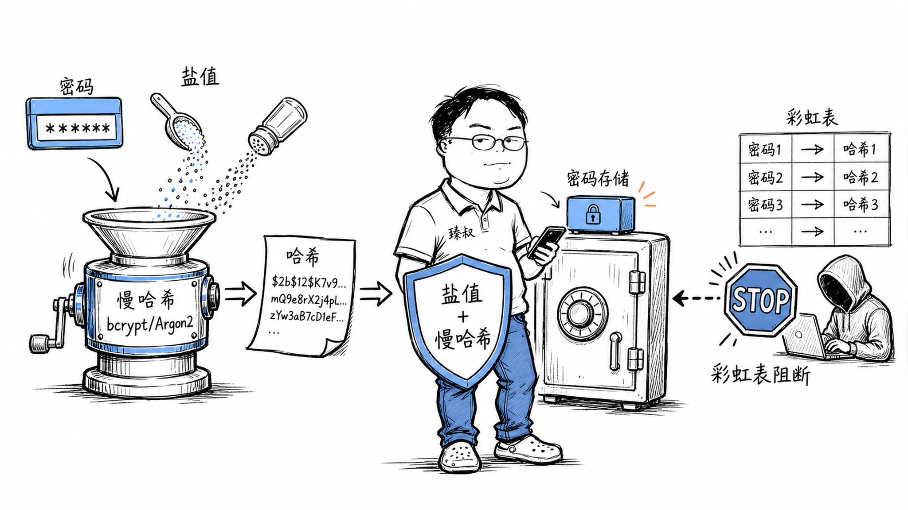

# 设计一个密码存储系统——数据库被拖走了，黑客也推不出明文




2011年，某知名论坛数据库泄露。安全研究员拿到数据一看——600万用户的密码全部是明文存储。不是MD5，不是SHA，是赤裸裸的明文。一夜之间，这600万组邮箱+密码在暗网公开流传，引发的撞库攻击波及了国内几乎所有主流网站。

更讽刺的是，这个论坛的技术团队并非不知道密码应该加密。他们的理由是："MD5太慢了，影响注册性能。"

这不是个例。直到今天，仍有系统用MD5甚至明文存密码。问题是：就算你知道要哈希，你真的存对了吗？

## 核心结论

1. **密码存储的唯一正确答案：慢哈希 + 随机盐**——bcrypt、scrypt、Argon2任选其一
2. **MD5/SHA-256存密码等于没存**——快哈希算法GPU每秒可算百亿次，暴力破解只需秒级
3. **盐必须每用户唯一**——全局固定盐等于没加盐，彩虹表只需重建一次
4. **计算成本因子是核心防线**——Argon2的内存参数让GPU暴力破解成本提高1000倍
5. **密码永不明文还原**——验证时对比哈希，不需要（也不应该）知道原始密码

## 深度拆解

### 为什么不能用MD5？

MD5的问题不是"算法有bug"，而是"太快了"。

```
MD5设计目标：文件校验，需要快
GPU暴力破解速度：~100亿次/秒

6位数字密码：10^6 = 100万种 → 0.0001秒
8位小写字母：26^8 ≈ 2080亿种 → 20秒
8位混合字符：95^8 ≈ 6.6万亿种 → 11分钟
```

现代GPU集群（如8卡RTX 4090）暴力破解8位混合密码只要几分钟。MD5快这个特性，在文件校验场景是优点，在密码存储场景是致命缺陷。

**彩虹表攻击**：攻击者预先计算好"常用密码→MD5哈希"的对照表。如果两个用户都用了`123456`，他们的MD5哈希值一样。攻击者查表瞬间破解全部用户。

```
彩虹表大小示例：
  8位字母数字组合 → 约500GB（可放进移动硬盘）
  10位字母数字组合 → 约50TB（需服务器集群）
```

### 加盐：让每个用户的哈希都不同

盐（Salt）是每个用户独有的随机字符串，与密码拼接后再哈希：

```python
# 错误：全局固定盐
SALT = "my_app_salt_2024"
hash = md5(password + SALT)  # 所有用户用同一个盐

# 正确：每用户随机盐
import os
salt = os.urandom(16)  # 16字节随机盐
hash = bcrypt(password, salt)  # 每个用户盐不同
```

加盐后，即使两个用户密码相同，哈希值也完全不同。彩虹表失效——攻击者必须为每个用户单独建表，成本从"一次预计算"变成"每个用户单独暴力破解"。

**盐不需要保密**。盐和哈希存在数据库同一行即可。盐的作用不是"增加保密性"，而是"让每个用户的哈希独立"。

### bcrypt/scrypt/Argon2：为什么叫"慢哈希"

这三个算法专门为密码存储设计，核心思想是**故意让计算变慢且消耗大量内存**：

| 算法 | 核心机制 | 内存消耗 | GPU抗性 | 推荐度 |
|------|---------|---------|---------|--------|
| bcrypt | 迭代哈希（可调成本因子） | 低（~4KB） | 中等 | ⭐⭐⭐ |
| scrypt | 内存困难（大内存计算） | 高（~1MB+） | 高 | ⭐⭐⭐⭐ |
| Argon2id | 内存困难 + 迭代 + 并行抵抗 | 可调（默认~64MB） | 最高 | ⭐⭐⭐⭐⭐ |

**bcrypt示例**：
```python
import bcrypt

# 注册
password = b"user_password"
salt = bcrypt.gensalt(rounds=12)  # 成本因子=12，约250ms/次
hashed = bcrypt.hashpw(password, salt)
# 存储格式: $2b$12$...（包含算法版本、成本因子、盐、哈希值）

# 登录验证
bcrypt.checkpw(b"user_password", hashed)  # True
```

**成本因子的含义**：`rounds=12`表示迭代2^12=4096次。每次翻倍rounds，计算时间翻倍。

```
rounds=10: ~100ms/次  → GPU破解速度: ~1000万次/秒
rounds=12: ~250ms/次  → GPU破解速度: ~400万次/秒  
rounds=14: ~1s/次     → GPU破解速度: ~100万次/秒
```

成本因子应该随硬件升级而增大。bcrypt的设计允许你升级已有密码的哈希——用户下次登录时，用旧哈希验证通过后，用新成本因子重新哈希存储。

### Argon2id：当前最佳选择

Argon2是2015年密码哈希竞赛的冠军。Argon2id是推荐变体，兼顾抗GPU和抗时序攻击：

```python
from argon2 import PasswordHasher

# Argon2id 默认参数
ph = PasswordHasher(
    time_cost=3,       # 迭代次数
    memory_cost=65536, # 64MB内存
    parallelism=4,     # 并行线程数
    hash_len=32,       # 输出长度
    salt_len=16        # 盐长度
)

# 注册
hash = ph.hash("user_password")

# 登录
try:
    ph.verify(hash, "user_password")  # 验证通过
except:
    print("密码错误")

# 检查是否需要升级参数
if ph.check_needs_rehash(hash):
    hash = ph.hash("user_password")  # 用新参数重新哈希
```

**为什么内存参数关键**：GPU有大量计算核心但显存有限（~24GB）。Argon2id要求每次计算消耗64MB内存，GPU同时跑的并行数被显存限制，暴力破解速度大幅下降。

### 完整的密码存储系统设计

```
用户注册流程:
  1. 密码强度校验（最少12位，含大小写+数字+符号）
  2. 生成随机盐（16字节）
  3. Argon2id哈希（memory=64MB, time=3）
  4. 存储: user_id, salt, hash, algorithm, params

用户登录流程:
  1. 取出该用户的salt和hash
  2. Argon2id验证(input_password, salt, hash)
  3. 验证通过 → 检查是否需要rehash（参数升级）
  4. 颁发session token

改密码流程:
  1. 验证旧密码（同登录流程）
  2. 新密码强度校验
  3. 生成新随机盐 + 新哈希
  4. 更新存储
  5. 吊销所有现有session（强制其他设备重新登录）
```

## 实战要点

### 工程落地

**密码强度策略**：推荐NIST SP 800-63B指南——最少8位（建议12位+），不强制复杂度规则（太复杂的密码用户会写在便签上），检查是否在已知泄露密码库中（Have I Been Pwned API）。

**防止时序攻击**：密码验证时，即使哈希不匹配也要执行完整的验证流程（包括假的Argon2计算），避免攻击者通过响应时间差异判断用户是否存在。

**密码迁移**：从MD5升级到Argon2时，不要一次性强制所有用户改密码。在用户下次登录时，用旧算法验证通过后，用新算法重新哈希存储。

### 臻叔踩坑笔记

1. **全局固定盐**——所有用户用同一个盐，彩虹表只需重建一次就破解全库。盐必须每用户独立随机生成
2. **MD5+盐就安全了**——盐解决了彩虹表，但MD5太快的问题没解决。GPU仍然可以每用户单独暴力破解，加盐MD5几小时就能破完全库
3. **成本因子设太低**——bcrypt rounds=4（默认值太老），计算时间<1ms，和MD5差不多了。现代硬件至少rounds=12起
4. **明文密码出现在日志里**——注册/登录接口的请求body、异常堆栈、APM链路追踪都可能记录明文密码。必须在入口层脱敏
5. **改密码不吊销session**——用户改了密码，但旧session token仍然有效。如果token泄露了，改密码也没用。改密码必须吊销所有现有token

### 一句话总结

密码存储的正确姿势只有一种：Argon2id + 每用户随机盐 + 可调计算成本——让GPU暴力破解的成本高到不划算，数据库拖走了也推不出明文。
